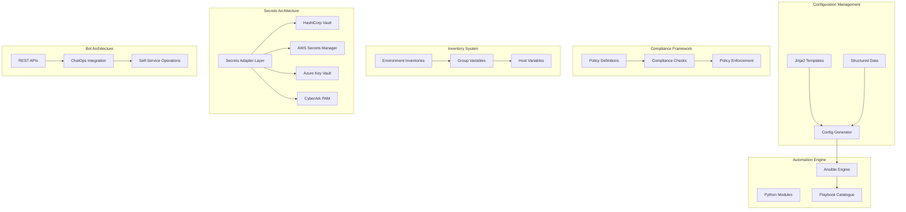
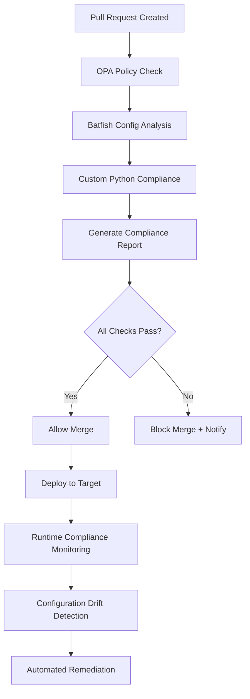
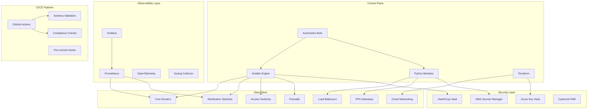
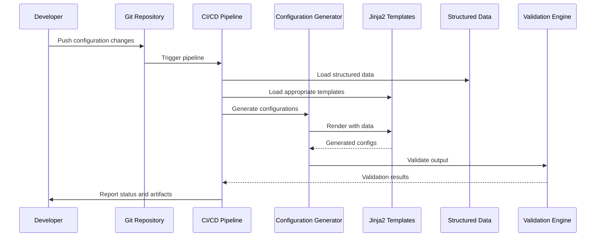
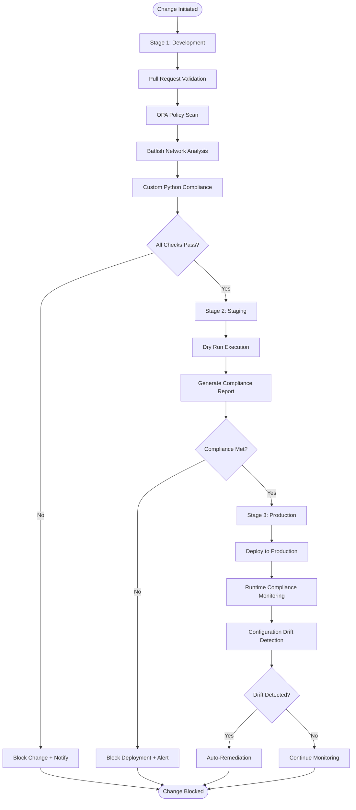
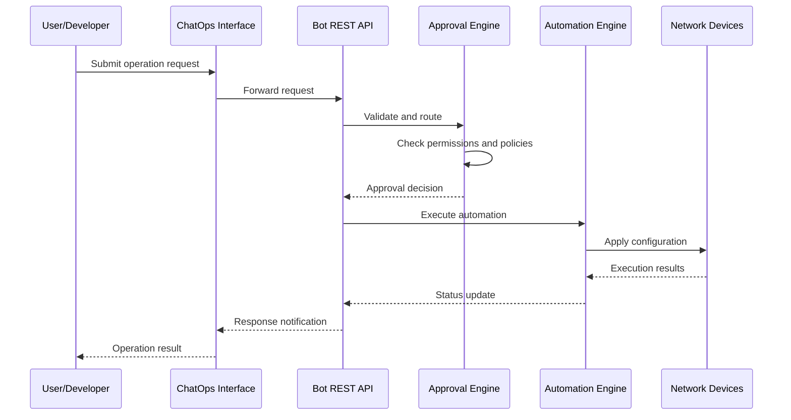

# Core Components

<cite>
**Referenced Files in This Document**
- [README.md](file://README.md)
</cite>

## Table of Contents
1. [Introduction](#introduction)
2. [Project Structure](#project-structure)
3. [Core Components](#core-components)
4. [Architecture Overview](#architecture-overview)
5. [Detailed Component Analysis](#detailed-component-analysis)
6. [Dependency Analysis](#dependency-analysis)
7. [Performance Considerations](#performance-considerations)
8. [Troubleshooting Guide](#troubleshooting-guide)
9. [Conclusion](#conclusion)

## Introduction

The Enterprise Network Automation Platform is a production-grade, vendor-agnostic network automation platform designed to manage thousands of network devices across multi-vendor, multi-region environments. It demonstrates Infrastructure as Code, GitOps, CI/CD, compliance enforcement, observability, and security — built for enterprise scale. The platform simulates how Fortune 100 organizations automate the full lifecycle of routers, switches, firewalls, load balancers, VPN gateways, and cloud networking components.

## Project Structure

The platform follows a modular, Git-driven architecture with clear separation of concerns:

**Diagram sources**
- [README.md:103-180](file://README.md#L103-L180)

**Section sources**
- [README.md:103-180](file://README.md#L103-L180)

## Core Components

### Configuration Management System

The configuration management system implements a robust Jinja2 template engine with structured data separation, ensuring maintainable and scalable network configuration generation.

#### Key Features:
- **Jinja2 Template Engine**: Vendor-specific templates for Cisco IOS, NX-OS, Juniper SRX/MX, Arista EOS, Palo Alto, Fortinet, Check Point, F5, pfSense, and OPNsense
- **Structured Data Separation**: YAML-based configuration data separate from template logic
- **Multi-Vendor Support**: Unified abstraction layer supporting diverse network equipment
- **Template Organization**: Hierarchical structure by vendor and platform type

#### Implementation Details:
- Templates organized under `templates/<vendor_platform>/` directory structure
- Structured data maintained in `group_vars/` and `host_vars/` directories
- Template rendering validated through automated testing pipeline
- Configuration generation supports both dry-run and apply modes

**Section sources**
- [README.md:116-128](file://README.md#L116-L128)
- [README.md:130-141](file://README.md#L130-L141)

### Automation Engine with Ansible Integration

The automation engine leverages Ansible as the primary orchestration layer with extensive Python module support for advanced operations.

#### Core Architecture:
- **Ansible Engine**: Primary automation orchestrator managing device connectivity and configuration deployment
- **Python Module Architecture**: Custom modules for specialized operations including NETCONF, RESTCONF, SSH, SNMP, and telemetry
- **Playbook Catalogue**: Comprehensive set of reusable playbooks for device lifecycle management
- **Role-Based Organization**: Modular roles for common configuration patterns

#### Supported Operations:
- Device provisioning and initial configuration
- Network services (VLANs, trunks, LACP, QoS, ACLs, NAT, VPN)
- Routing protocols (OSPF, BGP, IS-IS, static routes)
- High availability configurations (VRRP, HSRP)
- Operational tasks (backup, restore, upgrades, compliance scanning)

#### Python Module Structure:
- `inventory/`: Inventory parsing and CMDB integration
- `netconf/`: NETCONF client with capability negotiation
- `restconf/`: RESTCONF client with YANG model support
- `ssh/`: SSH abstraction over Netmiko/Paramiko with retry logic
- `snmp/`: SNMPv3 polling and trap handling
- `telemetry/`: Model-driven telemetry receiver and parser
- `config_gen/`: Jinja2-based configuration generation
- `validation/`: Pre-deployment configuration validation
- `backup/`: Backup management with versioning and encryption
- `compliance/`: Compliance engine with pluggable rule sets

**Section sources**
- [README.md:188-199](file://README.md#L188-L199)
- [README.md:371-435](file://README.md#L371-L435)
- [README.md:438-456](file://README.md#L438-L456)

### Compliance Framework with Policy Enforcement

The compliance framework provides comprehensive policy enforcement mechanisms throughout the entire development and deployment lifecycle.

#### Policy Categories:
- **Security Policies**: SSH-only access, approved ciphers, password policies
- **Operational Policies**: NTP configuration, AAA setup, logging requirements
- **Network Standards**: ACL standards, firewall rules, routing protocols
- **Firmware Compliance**: Approved firmware versions and upgrade schedules

#### Enforcement Mechanisms:
- **Pre-Deployment Checks**: OPA policy checks during pull request validation
- **Configuration Analysis**: Batfish-based network simulation and analysis
- **Custom Python Checks**: Domain-specific compliance validation
- **Runtime Monitoring**: Continuous compliance monitoring and drift detection

#### Compliance Workflow:

**Diagram sources**
- [README.md:570-579](file://README.md#L570-L579)

**Section sources**
- [README.md:548-581](file://README.md#L548-L581)

### Inventory Design with Hierarchical Organization

The inventory system implements a sophisticated hierarchical organization model supporting environment, role, region, and vendor-based device classification.

#### Hierarchical Structure:
- **Environment Level**: Production, Staging, Lab, Disaster Recovery
- **Role Classification**: Core Routers, Distribution Switches, Access Switches, Firewalls, WAN Edge, Internet Edge, VPN Gateways, Load Balancers, Wireless Controllers
- **Regional Organization**: US-East, US-West, EU-West, APAC regions
- **Vendor-Specific Attributes**: Platform-specific configuration parameters

#### Inventory Entry Structure:
Each device entry includes comprehensive metadata:
- Network connectivity information (ansible_host)
- Vendor and platform identification
- Role and regional classification
- Site and location details
- Environment-specific variables

#### Multi-Environment Support:
- Separate inventories per environment (`inventories/production/`, `inventories/staging/`, etc.)
- Shared group variables for common configurations
- Environment-specific overrides and customizations
- Cross-environment dependency management

**Section sources**
- [README.md:284-336](file://README.md#L284-L336)

### Secrets Architecture with Multiple Backend Support

The secrets architecture provides a unified abstraction layer supporting multiple backend systems while maintaining security best practices.

#### Supported Backends:
- **HashiCorp Vault**: Primary secrets management with OIDC federation
- **AWS Secrets Manager**: Cloud-native secrets storage
- **Azure Key Vault**: Microsoft Azure secrets management
- **CyberArk PAM**: Privileged Access Management integration
- **Ansible Vault**: Encrypted variable storage
- **Environment Variables**: Runtime secret injection

#### Security Features:
- **No Static Secrets in Git**: All secrets managed externally
- **OIDC Federation**: Secure authentication without long-lived credentials
- **Secret Rotation**: Automated rotation policies per secret type
- **Access Control**: Granular permissions and audit logging

#### Secret Rotation Policies:
- Device passwords: 90-day rotation with automated push
- API tokens: 30-day rotation via Lambda/Functions
- SSH keys: 90-day rotation with short-lived certificates
- TLS certificates: Annual rotation with auto-renewal at 60 days
- CI/CD tokens: Ephemeral tokens via OIDC federation

**Section sources**
- [README.md:339-368](file://README.md#L339-L368)

### Bot Architecture for REST APIs and ChatOps

The bot architecture provides self-service network operations through REST APIs and ChatOps integrations, enabling developers and operators to perform routine tasks without direct infrastructure access.

#### Bot Categories and Capabilities:

| Bot Type | API Endpoints | ChatOps Integration | Primary Purpose |
|----------|---------------|-------------------|-----------------|
| Firewall Bot | `/api/v1/firewall/rules` | Slack/Teams | Request, validate, deploy firewall rules |
| VLAN Bot | `/api/v1/vlan` | Slack | Provision VLANs with approval workflow |
| Port Bot | `/api/v1/port` | Slack | Enable/disable/configure switch ports |
| Backup Bot | `/api/v1/backup` | GitHub | Trigger and schedule device backups |
| Health Bot | `/api/v1/health` | Slack/Teams | On-demand health checks across all devices |
| Compliance Bot | `/api/v1/compliance` | GitHub | Run compliance scans and report violations |
| Upgrade Bot | `/api/v1/upgrade` | Slack | Orchestrate firmware upgrades with rollback |
| Rollback Bot | `/api/v1/rollback` | Slack/Teams | One-click rollback to last known good config |
| ChatOps Bot | `/api/v1/chatops` | Slack/Teams | Unified command router for all bot operations |
| Approval Bot | `/api/v1/approvals` | Slack/Teams | Manage approval workflows for change requests |

#### Self-Service Operations:
- **Request-Approval-Deploy Workflow**: Automated approval processes for sensitive operations
- **Audit Trail**: Complete logging of all bot interactions and actions taken
- **Rate Limiting**: Protection against abuse and resource exhaustion
- **Error Handling**: Comprehensive error reporting and recovery mechanisms

#### Integration Patterns:
- RESTful API design with consistent response formats
- Webhook support for external system integration
- Event-driven architecture for real-time notifications
- Plugin-based extensibility for custom bot implementations

**Section sources**
- [README.md:460-476](file://README.md#L460-L476)

## Architecture Overview

The platform follows a layered architecture pattern with clear separation between control plane, data plane, observability, and security layers.

**Diagram sources**
- [README.md:54-99](file://README.md#L54-L99)

## Detailed Component Analysis

### Configuration Generation Pipeline

The configuration generation pipeline transforms structured data into vendor-specific device configurations using Jinja2 templates.

**Diagram sources**
- [README.md:438-456](file://README.md#L438-L456)

### Compliance Enforcement Flow

The compliance enforcement system operates at multiple stages to ensure continuous compliance throughout the application lifecycle.

**Diagram sources**
- [README.md:570-579](file://README.md#L570-L579)

### Bot Operation Workflow

The bot architecture enables self-service operations through a standardized request-response pattern with approval workflows.

**Diagram sources**
- [README.md:460-476](file://README.md#L460-L476)

## Dependency Analysis

The platform exhibits well-defined component dependencies with clear separation of concerns and minimal coupling between subsystems.

```mermaid
graph TB
subgraph "Core Dependencies"
Ansible[Ansible Core]
Python[Python 3.11+]
Jinja2[Jinja2 Templates]
Git[Version Control]
end
subgraph "Network Libraries"
Netmiko[Netmiko]
NAPALM[NAPALM]
Nornir[Nornir]
Paramiko[Paramiko]
end
subgraph "Cloud Integrations"
AWSSDK[AWS SDK]
AzureSDK[Azure SDK]
HashiCorpSDK[HashiCorp SDK]
end
subgraph "Testing & Validation"
PyTest[pytest]
Molecule[Molecule]
Batfish[Batfish]
pyATS[pyATS]
end
subgraph "Monitoring & Observability"
PrometheusClient[Prometheus Client]
OpenTelemetry[OpenTelemetry]
Loggers[Logging Framework]
end
Ansible --> Netmiko
Ansible --> NAPALM
Python --> Jinja2
Python --> Paramiko
Python --> AWSSDK
Python --> AzureSDK
Python --> HashiCorpSDK
Testing --> PyTest
Testing --> Molecule
Testing --> Batfish
Testing --> pyATS
Monitoring --> PrometheusClient
Monitoring --> OpenTelemetry
Monitoring --> Loggers
```

**Diagram sources**
- [README.md:184-199](file://README.md#L184-L199)

**Section sources**
- [README.md:184-199](file://README.md#L184-L199)

## Performance Considerations

The platform is designed for enterprise-scale operations with performance optimization at every layer:

### Scalability Features:
- **Parallel Execution**: Ansible parallelism for concurrent device operations
- **Connection Pooling**: Efficient connection management for high-throughput scenarios
- **Caching Strategies**: Intelligent caching of device facts and template renders
- **Resource Optimization**: Memory-efficient processing for large configuration sets

### Monitoring and Metrics:
- **Execution Metrics**: Job success/failure rates, execution time tracking
- **Resource Utilization**: CPU, memory, and network usage monitoring
- **Performance Baselines**: Historical performance data for trend analysis
- **Alerting**: Proactive alerts for performance degradation

### Optimization Techniques:
- **Lazy Loading**: Deferred loading of heavy dependencies
- **Batch Processing**: Efficient batch operations for bulk configuration updates
- **Incremental Updates**: Delta-based configuration changes to minimize impact
- **Timeout Management**: Configurable timeouts for different operation types

## Troubleshooting Guide

Common issues and their resolutions across the platform components:

### Connection and Connectivity Issues:
- **Ansible Connection Timeout**: Verify SSH reachability using `ansible all -m ping -i inventories/lab/hosts.yml`
- **Authentication Failures**: Check credential rotation and backend connectivity
- **Network Timeouts**: Adjust timeout settings and verify network path stability

### Configuration Generation Problems:
- **Template Rendering Errors**: Use debug mode with `python -m python.config_gen --debug --device <name>`
- **Variable Resolution Issues**: Validate structured data format and variable precedence
- **Vendor Compatibility**: Ensure correct vendor/platform specification in inventory

### Compliance and Validation Failures:
- **Policy Violations**: Review compliance reports and affected device configurations
- **Schema Validation Errors**: Check YAML/JSON schema compliance for input data
- **Integration Test Failures**: Verify test environment connectivity and prerequisites

### Bot and API Issues:
- **API Authentication**: Validate token expiration and permission scopes
- **ChatOps Integration**: Check webhook configurations and message formatting
- **Approval Workflow**: Verify approval chain configuration and user permissions

**Section sources**
- [README.md:674-685](file://README.md#L674-L685)

## Conclusion

The Enterprise Network Automation Platform provides a comprehensive, enterprise-grade solution for network automation at scale. Its modular architecture, comprehensive compliance framework, and extensible bot system enable organizations to achieve operational excellence while maintaining security and governance standards.

The platform's strength lies in its ability to handle complex, multi-vendor environments while providing consistent automation patterns, robust compliance enforcement, and self-service capabilities. The separation of configuration data from template logic, combined with the hierarchical inventory system, ensures maintainability and scalability for large-scale deployments.

Key benefits include reduced operational risk through automated compliance, improved efficiency through self-service operations, enhanced visibility through comprehensive monitoring, and increased agility through GitOps workflows. The platform's extensibility points allow organizations to customize and extend functionality to meet specific organizational requirements while maintaining consistency and governance.