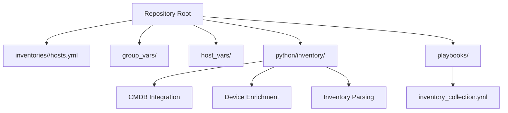
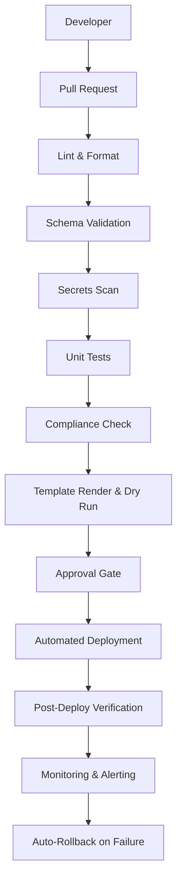
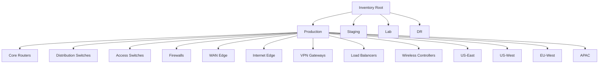
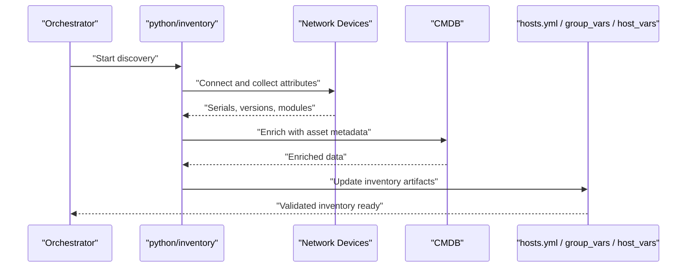
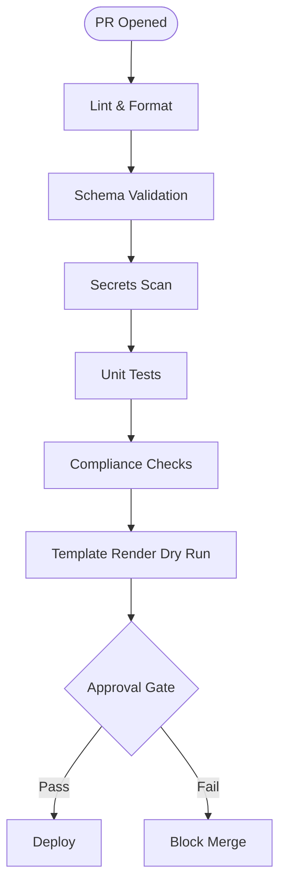
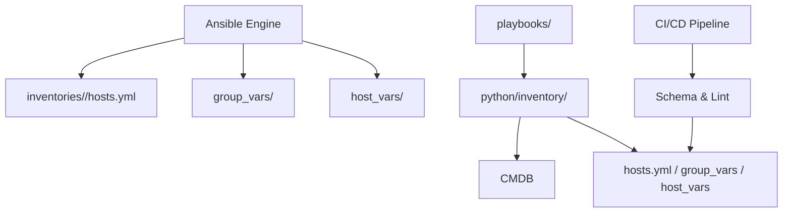

# Inventory System

<cite>
**Referenced Files in This Document**
- [README.md](file://README.md)
</cite>

## Table of Contents
1. [Introduction](#introduction)
2. [Project Structure](#project-structure)
3. [Core Components](#core-components)
4. [Architecture Overview](#architecture-overview)
5. [Detailed Component Analysis](#detailed-component-analysis)
6. [Dependency Analysis](#dependency-analysis)
7. [Performance Considerations](#performance-considerations)
8. [Troubleshooting Guide](#troubleshooting-guide)
9. [Conclusion](#conclusion)
10. [Appendices](#appendices)

## Introduction
This document describes the inventory system component of the Enterprise Network Automation Platform. It explains how devices are organized by environment, role, region, and vendor; how hosts.yml files define device attributes and group relationships; how CMDB integration enriches and synchronizes inventory data; and how discovery, dynamic generation, and validation processes ensure accuracy at scale. It also provides concrete examples of inventory structure and best practices for performance and troubleshooting.

## Project Structure
The platform organizes inventories per environment with shared variables and per-device variables:
- inventories/<environment>/hosts.yml defines groups and host entries
- group_vars/ holds shared variables by device group
- host_vars/ holds per-device variables
- Python modules under python/inventory provide parsing, enrichment, and CMDB integration
- Playbooks such as inventory_collection.yml support discovery and synchronization

**Diagram sources**
- [README.md:103-180](file://README.md#L103-L180)
- [README.md:438-456](file://README.md#L438-L456)
- [README.md:418-435](file://README.md#L418-L435)

**Section sources**
- [README.md:103-180](file://README.md#L103-L180)
- [README.md:438-456](file://README.md#L438-L456)
- [README.md:418-435](file://README.md#L418-L435)

## Core Components
- Hierarchical organization: environments (production, staging, lab, DR), roles (core routers, distribution switches, access switches, firewalls), regions (US-East, US-West, EU-West, APAC), and vendor platforms
- hosts.yml structure: top-level all > children > hosts with device attributes (ansible_host, vendor, platform, role, region, site)
- Shared and per-device variables via group_vars/ and host_vars/
- Python inventory module: parsing, enrichment, and CMDB integration
- Discovery and collection playbook: inventory_collection.yml to collect serials, versions, modules
- Validation: schema validation across inventories, group_vars, and host_vars

Key responsibilities:
- Define canonical device classification and grouping
- Provide a single source of truth for automation targets
- Support enrichment from external systems (CMDB)
- Enable discovery-driven updates and validation

**Section sources**
- [README.md:284-335](file://README.md#L284-L335)
- [README.md:103-180](file://README.md#L103-L180)
- [README.md:438-456](file://README.md#L438-L456)
- [README.md:418-435](file://README.md#L418-L435)
- [README.md:517-530](file://README.md#L517-L530)

## Architecture Overview
The inventory architecture combines static YAML definitions with dynamic enrichment and validation:

**Diagram sources**
- [README.md:36-50](file://README.md#L36-L50)

## Detailed Component Analysis

### Inventory Hierarchy and Classification
Devices are classified by:
- Environment: production, staging, lab, dr
- Role: core_routers, distribution_switches, access_switches, firewalls, plus additional roles like WAN edge, internet edge, VPN gateways, load balancers, wireless controllers
- Region: us-east, us-west, eu-west, apac
- Vendor/platform: cisco/ios-xe, paloalto/panos, etc.

Grouping is expressed through Ansible-style hierarchy where each environment directory contains a hosts.yml file defining groups and host attributes.

**Diagram sources**
- [README.md:288-309](file://README.md#L288-L309)

**Section sources**
- [README.md:284-335](file://README.md#L284-L335)

### hosts.yml Structure and Device Attributes
Each hosts.yml entry defines:
- Top-level all > children > hosts
- Host attributes include ansible_host, vendor, platform, role, region, site
- Example shows core router and firewall entries with consistent attribute naming

Best practices:
- Use consistent role names aligned with group_vars/
- Keep region values lowercase and standardized
- Include site identifiers for multi-site deployments
- Avoid embedding secrets in hosts.yml; use group_vars/host_vars or secrets backends

Example reference path:
- [README.md:313-335](file://README.md#L313-L335)

**Section sources**
- [README.md:313-335](file://README.md#L313-L335)

### Shared and Per-Device Variables
- group_vars/: shared variables by device group (e.g., common NTP servers, SNMP settings)
- host_vars/: per-device overrides (e.g., unique IPs, licenses, interfaces)

Integration points:
- Playbooks consume these variables to generate configurations
- Schema validation ensures required fields exist

Reference paths:
- [README.md:111-113](file://README.md#L111-L113)
- [README.md:517-530](file://README.md#L517-L530)

**Section sources**
- [README.md:111-113](file://README.md#L111-L113)
- [README.md:517-530](file://README.md#L517-L530)

### CMDB Integration and Device Enrichment
The python/inventory module supports:
- Inventory parsing
- Device enrichment
- CMDB integration

Enrichment workflow:
- Parse hosts.yml and group_vars/host_vars
- Query CMDB for additional attributes (serial numbers, firmware versions, asset metadata)
- Merge enriched data into runtime inventory for playbooks and templates
- Persist updated state if needed (e.g., for reporting or drift detection)

Operational references:
- [README.md:438-456](file://README.md#L438-L456)

**Section sources**
- [README.md:438-456](file://README.md#L438-L456)

### Device Discovery and Dynamic Inventory Generation
Discovery mechanisms:
- inventory_collection.yml collects device inventory (serials, versions, modules)
- neighbor_discovery.yml discovers CDP/LLDP neighbors
- These can feed dynamic inventory generation pipelines that update hosts.yml or drive runtime-only inventories

Sequence overview:
- Trigger discovery (manual or scheduled)
- Connect to devices using supported protocols (SSH, NETCONF, RESTCONF)
- Collect attributes and topology information
- Enrich and validate against schemas
- Update inventory artifacts or runtime structures

References:
- [README.md:418-435](file://README.md#L418-L435)
- [README.md:438-456](file://README.md#L438-L456)

**Diagram sources**
- [README.md:418-435](file://README.md#L418-L435)
- [README.md:438-456](file://README.md#L438-L456)

**Section sources**
- [README.md:418-435](file://README.md#L418-L435)
- [README.md:438-456](file://README.md#L438-L456)

### Inventory Validation Processes
Validation layers:
- Schema validation for inventories, group_vars, host_vars
- Linting and formatting checks
- Unit tests and compliance checks
- Template rendering dry runs to catch errors early

Validation flow:
- Pull request triggers lint, format, and schema validation
- Security scanning and unit tests run
- Compliance policy checks and template rendering dry runs
- Manual approval gate before deployment

References:
- [README.md:517-530](file://README.md#L517-L530)
- [README.md:479-501](file://README.md#L479-L501)

**Diagram sources**
- [README.md:479-501](file://README.md#L479-L501)
- [README.md:517-530](file://README.md#L517-L530)

**Section sources**
- [README.md:517-530](file://README.md#L517-L530)
- [README.md:479-501](file://README.md#L479-L501)

### Concrete Examples of Inventory Files
- Reference example showing core router and firewall entries with attributes:
  - [README.md:313-335](file://README.md#L313-L335)
- Usage of hosts.yml in commands:
  - [README.md:268-280](file://README.md#L268-L280)

These examples demonstrate proper device classification, attribute definitions, and group relationships.

**Section sources**
- [README.md:313-335](file://README.md#L313-L335)
- [README.md:268-280](file://README.md#L268-L280)

## Dependency Analysis
Inventory dependencies span multiple components:
- Ansible consumes inventories and variables
- Python inventory module parses and enriches data
- Playbooks orchestrate discovery and collection
- CI/CD pipeline enforces validation and quality gates

**Diagram sources**
- [README.md:103-180](file://README.md#L103-L180)
- [README.md:438-456](file://README.md#L438-L456)
- [README.md:479-501](file://README.md#L479-L501)

**Section sources**
- [README.md:103-180](file://README.md#L103-L180)
- [README.md:438-456](file://README.md#L438-L456)
- [README.md:479-501](file://README.md#L479-L501)

## Performance Considerations
- Minimize redundant lookups by caching CMDB responses during enrichment
- Use targeted inventory subsets (-l <device>) for focused operations
- Parallelize discovery and collection where supported by tools
- Validate early in CI to avoid expensive downstream failures
- Keep hosts.yml concise; move large datasets to group_vars/host_vars or external sources

[No sources needed since this section provides general guidance]

## Troubleshooting Guide
Common issues and resolutions:
- Ansible connection timeout: verify SSH reachability using ping against the specified hosts.yml
- Template rendering error: debug configuration generation with appropriate flags
- Compliance check failure: review policies and running config diffs
- CI pipeline failure: inspect GitHub Actions logs for actionable messages
- Vault authentication failure: verify OIDC token or AppRole credentials and policies
- Molecule test failure: ensure Docker/Podman is running and check molecule configuration
- Batfish analysis error: validate snapshots in the tests/batfish/snapshots directory

References:
- [README.md:674-685](file://README.md#L674-L685)

**Section sources**
- [README.md:674-685](file://README.md#L674-L685)

## Conclusion
The inventory system provides a robust, hierarchical foundation for network automation. By organizing devices by environment, role, region, and vendor, and by integrating CMDB enrichment and strict validation, it ensures reliable, scalable operations. Discovery and dynamic generation keep inventories current, while CI/CD gates maintain quality and security.

[No sources needed since this section summarizes without analyzing specific files]

## Appendices

### Quick Commands and References
- Running a compliance scan against lab devices:
  - [README.md:268-280](file://README.md#L268-L280)
- Using hosts.yml with playbooks:
  - [README.md:376-386](file://README.md#L376-L386)

**Section sources**
- [README.md:268-280](file://README.md#L268-L280)
- [README.md:376-386](file://README.md#L376-L386)