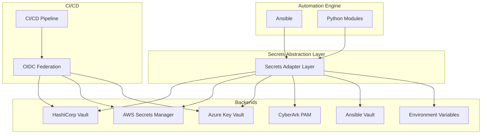
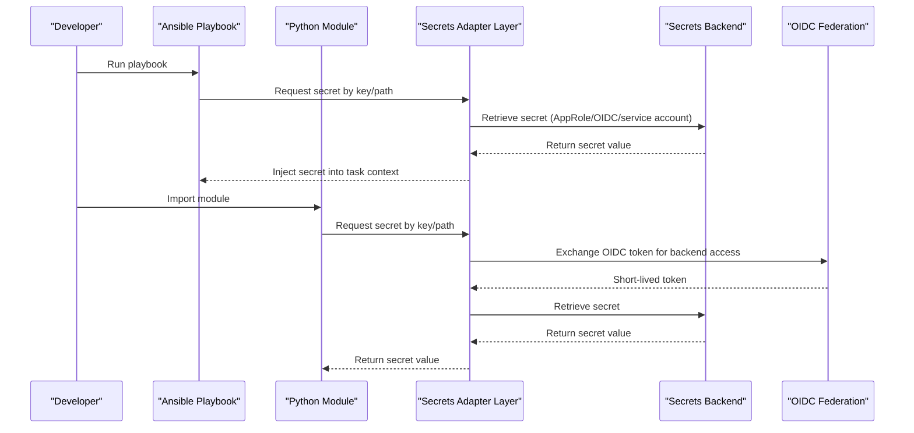
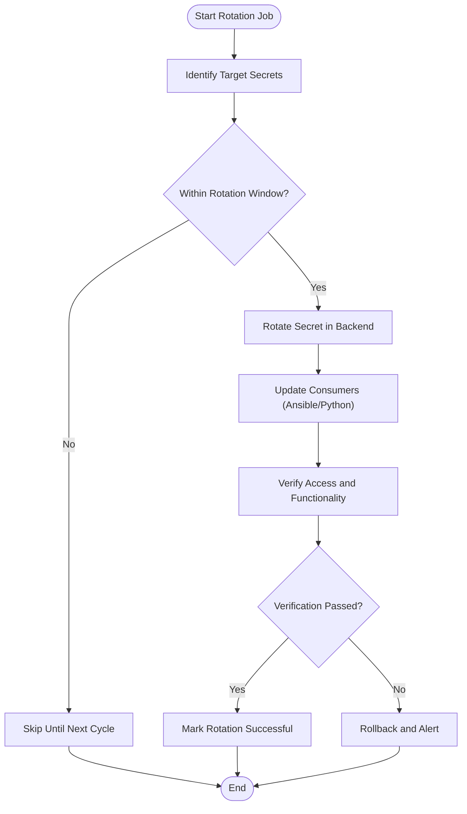
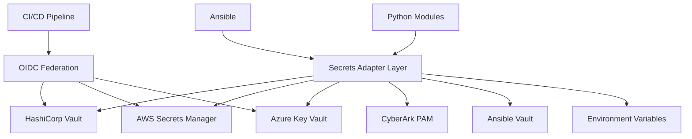

# Secrets Management

<cite>
**Referenced Files in This Document**
- [README.md](file://README.md)
</cite>

## Table of Contents
1. [Introduction](#introduction)
2. [Project Structure](#project-structure)
3. [Core Components](#core-components)
4. [Architecture Overview](#architecture-overview)
5. [Detailed Component Analysis](#detailed-component-analysis)
6. [Dependency Analysis](#dependency-analysis)
7. [Performance Considerations](#performance-considerations)
8. [Troubleshooting Guide](#troubleshooting-guide)
9. [Conclusion](#conclusion)
10. [Appendices](#appendices)

## Introduction
This document describes the secrets management component of the Enterprise Network Automation Platform. It explains how the platform centralizes secret storage and retrieval through a unified abstraction layer that supports multiple backends, including HashiCorp Vault, AWS Secrets Manager, Azure Key Vault, CyberArk PAM, and Ansible Vault. It also documents rotation policies for device passwords, API tokens, SSH keys, TLS certificates, and CI/CD tokens; authentication methods such as AppRole, OIDC federation, and service account integration; and operational practices for scanning, auditing, and disaster recovery.

## Project Structure
The repository is organized around automation assets (playbooks, roles, templates), Python modules, CI/CD workflows, compliance, monitoring, and IaC. The secrets management design is described at the top level and integrated across the automation engine, CI/CD pipelines, and runtime components.

**Diagram sources**
- [README.md:339-357](file://README.md#L339-L357)

**Section sources**
- [README.md:103-180](file://README.md#L103-L180)
- [README.md:339-357](file://README.md#L339-L357)

## Core Components
- Unified Secrets Adapter Layer: A single interface used by Ansible and Python to retrieve secrets without coupling to any specific backend.
- Supported Backends: HashiCorp Vault, AWS Secrets Manager, Azure Key Vault, CyberArk PAM, Ansible Vault, and environment variables.
- Rotation Policies: Defined intervals and mechanisms per secret type.
- Authentication Methods: AppRole, OIDC federation, and service accounts for secure access.
- Scanning and Compliance: Secrets scanning enforced in CI/CD and pre-commit hooks.

Key responsibilities:
- Provide consistent secret resolution regardless of backend.
- Enforce rotation schedules and lifecycle management.
- Support ephemeral credentials for CI/CD via OIDC.
- Integrate with observability and audit logging where applicable.

**Section sources**
- [README.md:339-368](file://README.md#L339-L368)

## Architecture Overview
The secrets architecture centers on an adapter layer that abstracts backend-specific details from consumers (Ansible and Python). Consumers request secrets by logical names or paths, and the adapter resolves them against the configured backend. CI/CD pipelines authenticate using OIDC federation to obtain short-lived tokens for backends like Vault and AWS.

**Diagram sources**
- [README.md:339-357](file://README.md#L339-L357)
- [README.md:359-368](file://README.md#L359-L368)

## Detailed Component Analysis

### Secrets Adapter Layer
Purpose:
- Provide a uniform API for retrieving secrets across multiple backends.
- Abstract authentication and transport differences behind a single interface.
- Enable seamless switching between backends without changing consumer code.

Behavior:
- Consumers call a common method with a secret identifier.
- The adapter selects the appropriate backend based on configuration.
- The adapter authenticates using the configured method (AppRole, OIDC, or service account).
- The adapter returns the resolved secret value to the caller.

Operational notes:
- No secrets are committed to Git; all values are fetched at runtime.
- Environment variables can be used as a fallback or for local development.

**Section sources**
- [README.md:339-357](file://README.md#L339-L357)

### Supported Backends
- HashiCorp Vault: Supports AppRole and OIDC-based authentication; integrates with PKI and SSH CA for certificate and short-lived credential issuance.
- AWS Secrets Manager: Used for API tokens and other cloud-native secrets; accessed via service accounts or OIDC federation.
- Azure Key Vault: Used for secrets and keys; accessed via service principals or federated identities.
- CyberArk PAM: Centralized privileged access management for device credentials and session control.
- Ansible Vault: For encrypting sensitive variables within Ansible artifacts when needed.
- Environment Variables: For local development and transient values.

Integration points:
- Ansible playbooks and Python modules use the adapter layer to fetch secrets consistently.
- CI/CD pipelines leverage OIDC federation to avoid long-lived static credentials.

**Section sources**
- [README.md:339-357](file://README.md#L339-L357)

### Secret Rotation Policies
Rotation policy definitions ensure secrets remain fresh and reduce exposure windows.

| Secret Type | Rotation Interval | Method |
|---|---|---|
| Device passwords | 90 days | Vault auto-rotation + Ansible push |
| API tokens | 30 days | Secrets Manager + Lambda/Function |
| SSH keys | 90 days | Vault SSH CA with short-lived certs |
| TLS certificates | 1 year (auto-renew at 60 days) | ACME / Vault PKI |
| CI/CD tokens | Ephemeral | OIDC federation (no static secrets) |

Operational implications:
- Automated rotation reduces manual intervention and risk.
- Short-lived credentials minimize blast radius during incidents.
- Auto-renewal for TLS ensures continuous availability.

**Section sources**
- [README.md:359-368](file://README.md#L359-L368)

### Authentication Methods
- AppRole: Static role-based credentials suitable for non-interactive workloads.
- OIDC Federation: Enables short-lived tokens for CI/CD and services without storing long-lived secrets.
- Service Accounts: Cloud-native identities for accessing managed secrets backends securely.

Usage patterns:
- CI/CD pipelines authenticate via OIDC to Vault and AWS/Azure backends.
- Runtime automation uses AppRole or service accounts depending on environment.

**Section sources**
- [README.md:339-357](file://README.md#L339-L357)
- [README.md:359-368](file://README.md#L359-L368)

### Secrets Retrieval Examples

#### Ansible Playbooks
- Use the secrets adapter layer to resolve secrets by key or path.
- Inject retrieved values into tasks without hardcoding sensitive data.
- Ensure no secrets are committed to version control.

Best practices:
- Reference secrets by stable identifiers.
- Avoid echoing secrets in logs.
- Leverage environment variables for local testing only.

**Section sources**
- [README.md:339-357](file://README.md#L339-L357)

#### Python Modules
- Import the secrets adapter and request secrets programmatically.
- Handle errors gracefully and log minimal information.
- Prefer ephemeral tokens where supported.

Best practices:
- Cache secrets only in memory for the duration of execution.
- Validate responses and handle backend failures with retries.

**Section sources**
- [README.md:339-357](file://README.md#L339-L357)

### Rotation Automation Workflows
- Device passwords: Triggered by Vault auto-rotation; Ansible pushes updated credentials to devices on schedule.
- API tokens: Managed by Secrets Manager with automated refresh via serverless functions.
- SSH keys: Issued via Vault SSH CA with short lifetimes; renewed automatically.
- TLS certificates: Renewed before expiry using ACME or Vault PKI.
- CI/CD tokens: Obtained on-demand via OIDC; never persisted.

[No sources needed since this diagram shows conceptual workflow, not actual code structure]

### Security Best Practices
- Never commit secrets to Git; enforce scanning in CI/CD and pre-commit hooks.
- Use least privilege for service accounts and AppRoles.
- Prefer ephemeral credentials (OIDC) for CI/CD and automation.
- Limit secret scope and lifetime; rotate frequently.
- Encrypt secrets at rest and in transit; enable audit logging.
- Separate environments and isolate secrets per tenant or region.

**Section sources**
- [README.md:339-357](file://README.md#L339-L357)
- [README.md:486-501](file://README.md#L486-L501)

### Secrets Scanning
- CI pipeline includes a secrets scan step to detect accidental leakage.
- Pre-commit hooks prevent committing secrets locally.
- Failures block merges until issues are remediated.

**Section sources**
- [README.md:486-501](file://README.md#L486-L501)

### Audit Logging
- Enable backend-level audit logging for access and rotation events.
- Correlate automation logs with backend audit trails for traceability.
- Retain audit logs according to compliance requirements.

[No sources needed since this section provides general guidance]

### Disaster Recovery Procedures
- Maintain encrypted backups of critical configurations and secrets metadata.
- Define runbooks for restoring secrets from backups or re-provisioning backends.
- Test recovery procedures regularly and validate access post-recovery.

[No sources needed since this section provides general guidance]

## Dependency Analysis
The secrets management component depends on:
- Automation engines (Ansible, Python) consuming the adapter layer.
- Multiple secrets backends providing storage and lifecycle management.
- CI/CD pipelines integrating OIDC federation for secure access.

**Diagram sources**
- [README.md:339-357](file://README.md#L339-L357)

**Section sources**
- [README.md:339-357](file://README.md#L339-L357)

## Performance Considerations
- Minimize secret lookups by caching in-memory where safe.
- Use short-lived tokens to reduce overhead while maintaining security.
- Batch operations where possible to reduce backend calls.
- Monitor latency and error rates; implement retries with backoff.

[No sources needed since this section provides general guidance]

## Troubleshooting Guide
Common issues and resolutions:
- Vault authentication failure: Verify OIDC token or AppRole credentials; check Vault policies.
- Connection timeouts: Confirm network reachability and backend endpoints.
- Rotation failures: Inspect backend logs and automation job outputs; roll back if verification fails.
- Secrets scan failures: Remove or redact leaked secrets; update pre-commit hooks.

**Section sources**
- [README.md:674-685](file://README.md#L674-L685)

## Conclusion
The secrets management component provides a robust, vendor-agnostic foundation for securing sensitive data across the platform. Through a unified adapter layer, strong rotation policies, and secure authentication methods, it enables safe, scalable automation while enforcing best practices for scanning, auditing, and disaster recovery.

## Appendices

### Quick Reference: Rotation Policy Summary
- Device passwords: 90 days
- API tokens: 30 days
- SSH keys: 90 days
- TLS certificates: 1 year (auto-renew at 60 days)
- CI/CD tokens: Ephemeral via OIDC

**Section sources**
- [README.md:359-368](file://README.md#L359-L368)