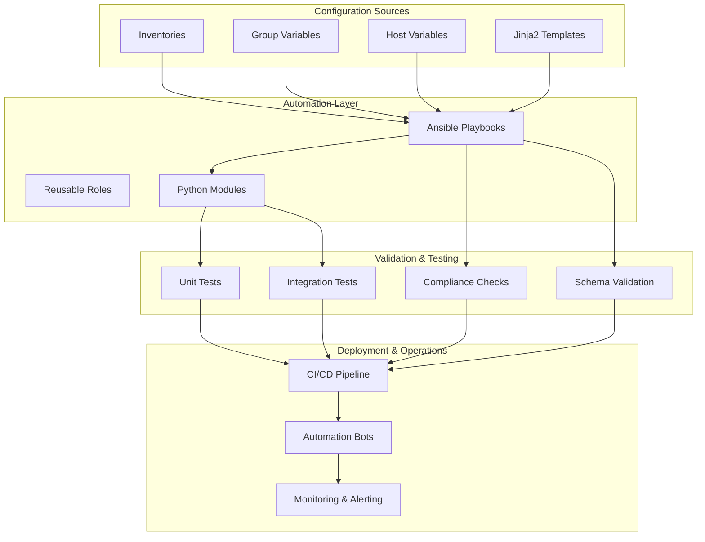
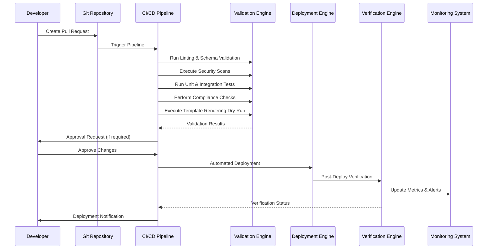
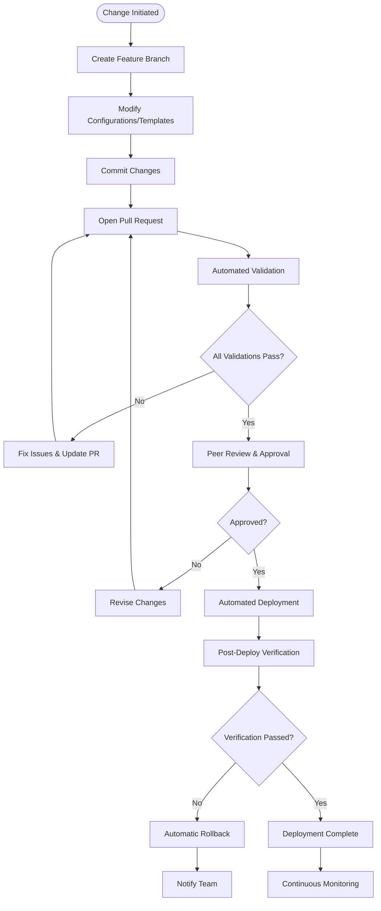
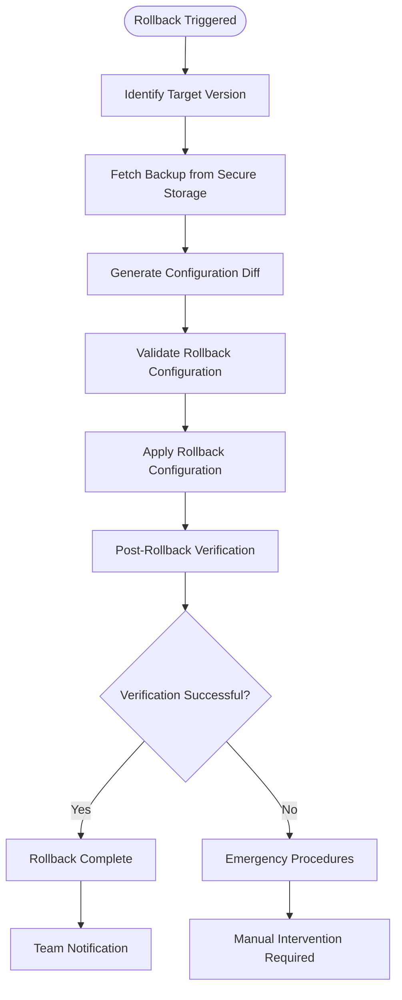
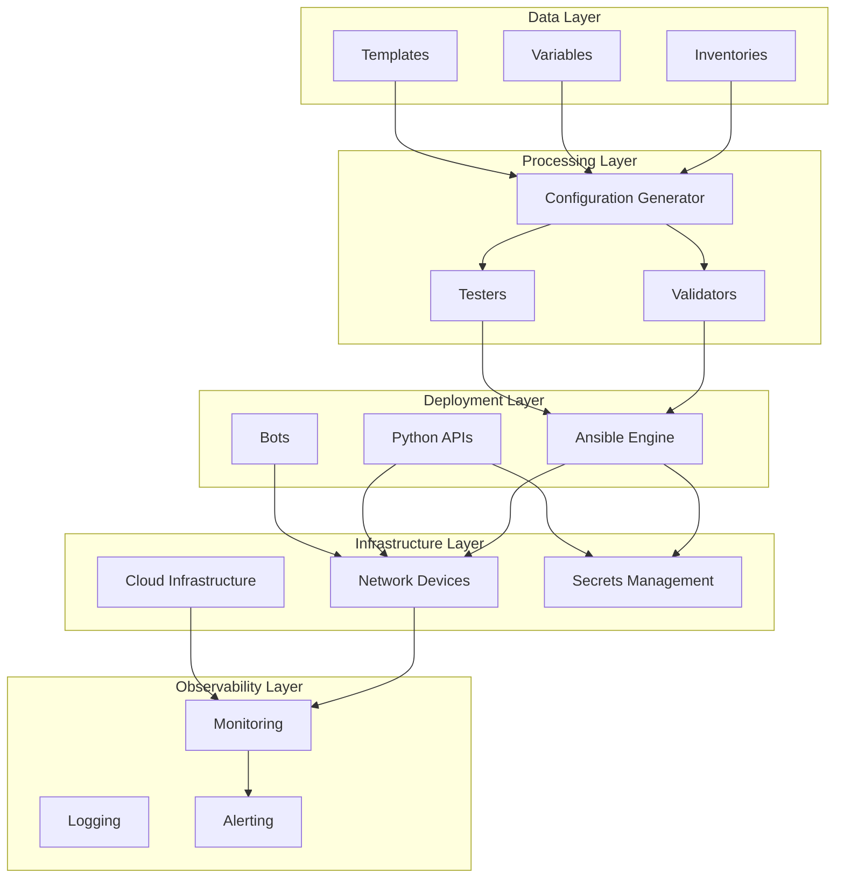

# Configuration Management & Updates

<cite>
**Referenced Files in This Document**
- [README.md](file://README.md)
</cite>

## Table of Contents
1. [Introduction](#introduction)
2. [Project Structure](#project-structure)
3. [Core Components](#core-components)
4. [Architecture Overview](#architecture-overview)
5. [Detailed Component Analysis](#detailed-component-analysis)
6. [Dependency Analysis](#dependency-analysis)
7. [Performance Considerations](#performance-considerations)
8. [Troubleshooting Guide](#troubleshooting-guide)
9. [Conclusion](#conclusion)

## Introduction

This document provides comprehensive guidance for ongoing configuration management and update procedures within the Enterprise Network Automation Platform. The platform implements a production-grade, vendor-agnostic approach to managing thousands of network devices across multi-vendor, multi-region environments using Infrastructure as Code, GitOps, CI/CD, compliance enforcement, observability, and security practices.

The system follows core principles including Network as Code (all configurations generated from Jinja2 templates + structured data), Infrastructure as Code (Terraform for cloud networking, Ansible for device automation), GitOps workflows, DevSecOps practices, Compliance as Code, Monitoring as Code, Testing as Code, and Documentation as Code.

## Project Structure

The platform follows a modular, Git-driven architecture with clear separation of concerns:

**Diagram sources**
- [README.md:103-180](file://README.md#L103-L180)

**Section sources**
- [README.md:103-180](file://README.md#L103-L180)

## Core Components

### Template-Driven Configuration Generation

The platform uses Jinja2 templates combined with structured data inputs from inventories and variables to generate vendor-specific configurations. This approach enables multi-vendor template abstraction where a single logical configuration can be rendered into multiple vendor formats.

#### Key Components:

1. **Jinja2 Templates**: Organized by vendor/platform under `templates/` directory
   - Cisco IOS, IOS-XE, NX-OS
   - Juniper SRX, MX
   - Arista EOS
   - Palo Alto PAN-OS
   - Fortinet FortiOS
   - Check Point Gaia
   - F5 BIG-IP
   - pfSense/OPNsense

2. **Structured Data Inputs**: YAML-based inventory and variable files
   - Environment-specific inventories (production, staging, lab, DR)
   - Device grouping by role, region, and vendor
   - Per-device and group-level variables

3. **Configuration Generation Engine**: Python modules for template rendering and validation

**Section sources**
- [README.md:116-128](file://README.md#L116-L128)
- [README.md:284-335](file://README.md#L284-L335)
- [README.md:450](file://README.md#L450)

### Inventory Design and Variable Management

Devices are organized hierarchically by environment, role, region, and vendor. Each inventory entry defines comprehensive device metadata including connectivity information, platform details, and operational parameters.

#### Inventory Structure:
- **Environment-based organization**: Production, Staging, Lab, Disaster Recovery
- **Role-based grouping**: Core routers, distribution/access switches, firewalls, WAN edge
- **Regional deployment**: US-East, US-West, EU-West, APAC
- **Vendor-specific attributes**: Platform type, supported protocols, feature sets

**Section sources**
- [README.md:284-335](file://README.md#L284-L335)

## Architecture Overview

The platform implements a comprehensive GitOps workflow with automated validation, compliance checking, and deployment automation:

**Diagram sources**
- [README.md:36-50](file://README.md#L36-L50)
- [README.md:483-501](file://README.md#L483-L501)

**Section sources**
- [README.md:36-50](file://README.md#L36-L50)
- [README.md:479-514](file://README.md#L479-L514)

## Detailed Component Analysis

### GitOps Workflow Implementation

The GitOps workflow ensures all configuration changes follow a standardized process with comprehensive validation and approval gates:

#### Workflow Stages:

1. **Change Creation**: Developer creates feature branch and modifies configuration, templates, or playbooks
2. **Pull Request**: Open PR targeting staging or main branches
3. **Automated Validation**: 
   - Linting and format checks (ansible-lint, yamllint, flake8, black)
   - Schema validation for inventories and variables
   - Security scanning for secrets and vulnerabilities
   - Unit and integration tests execution
   - Compliance policy checks
   - Template rendering dry runs
4. **Approval Gate**: Peer review and optional CAB approval for production
5. **Automated Deployment**: GitHub Actions triggers deployment on merge
6. **Post-Deploy Verification**: Health checks and configuration validation
7. **Rollback**: Automatic rollback if verification fails

**Diagram sources**
- [README.md:619-638](file://README.md#L619-L638)

**Section sources**
- [README.md:619-638](file://README.md#L619-L638)

### Configuration Version Control Strategies

The platform implements comprehensive version control strategies ensuring full auditability and traceability of all configuration changes:

#### Version Control Best Practices:

1. **Branch Strategy**: Feature branches from main/staging with clear naming conventions
2. **Commit Conventions**: Structured commit messages following conventional commits format
3. **Change Tracking**: Every configuration change tracked with author, timestamp, and rationale
4. **Tagging Strategy**: Release tags for stable configuration baselines
5. **Backup Integration**: Automated backup creation before deployments
6. **Audit Trail**: Complete history of who changed what and when

#### Backup Procedures:

- **Automated Backups**: Daily scheduled backups at 02:00 UTC
- **Versioned Storage**: All backups stored with timestamps and metadata
- **Encryption**: Encrypted backup storage with secure key management
- **Retention Policy**: Configurable retention periods based on compliance requirements
- **Disaster Recovery**: Cross-region backup replication for disaster recovery scenarios

**Section sources**
- [README.md:701-730](file://README.md#L701-L730)
- [README.md:512](file://README.md#L512)

### Rollback Mechanisms

The platform implements robust rollback mechanisms for both configuration and firmware changes:

#### Configuration Rollback Process:

**Diagram sources**
- [README.md:660-670](file://README.md#L660-L670)

#### Firmware Rollback Process:

- **Pre-upgrade Health Check**: Comprehensive device health assessment before upgrade
- **Backup Creation**: Running configuration backup before firmware installation
- **Checksum Verification**: Firmware integrity validation before installation
- **Staged Rollout**: Gradual deployment with monitoring between stages
- **Automatic Rollback**: Immediate rollback if post-upgrade validation fails

**Section sources**
- [README.md:642-670](file://README.md#L642-L670)

### Golden Configuration Concept

The golden configuration represents the approved baseline configuration for each device type and role. It serves as the source of truth for compliant device configurations.

#### Golden Configuration Management:

1. **Baseline Definition**: Approved configurations stored in version control
2. **Template Abstraction**: Common patterns abstracted into reusable templates
3. **Vendor-Specific Rendering**: Golden configurations rendered for each vendor platform
4. **Compliance Enforcement**: Automated checks ensure adherence to golden standards
5. **Drift Detection**: Continuous monitoring for deviations from golden baseline

#### Drift Detection Procedures:

- **Scheduled Scans**: Regular automated drift detection across all devices
- **Real-time Monitoring**: Event-driven drift detection for critical changes
- **Alerting**: Immediate notifications for unauthorized configuration changes
- **Reporting**: Comprehensive drift reports with severity classification
- **Remediation**: Automated remediation workflows for common drift patterns

**Section sources**
- [README.md:427-428](file://README.md#L427-L428)
- [README.md:615](file://README.md#L615)

### Remediation Workflows

The platform implements automated remediation workflows to maintain configuration compliance:

#### Automated Remediation Process:

1. **Detection**: Identify configuration drift or compliance violations
2. **Analysis**: Determine root cause and impact assessment
3. **Approval**: Automated or manual approval for remediation actions
4. **Execution**: Apply corrective configurations with safety checks
5. **Verification**: Post-remediation validation and monitoring
6. **Documentation**: Audit trail of remediation actions taken

**Section sources**
- [README.md:694](file://README.md#L694)

### Configuration Testing Strategies

The platform implements comprehensive testing strategies to ensure configuration quality and reliability:

#### Testing Pyramid:

1. **Unit Tests**: Individual component testing for Python modules and Jinja2 filters
2. **Integration Tests**: End-to-end testing with simulated network environments
3. **Network Simulation**: Batfish-based simulation for ACL, routing, and firewall rule analysis
4. **Golden Configuration Tests**: Diff testing against approved baselines
5. **Regression Tests**: Snapshot-based testing to prevent unintended changes
6. **Performance Tests**: Load testing for API endpoints and automation bots

#### Dry Run Capabilities:

- **Template Rendering Validation**: Syntax and logic validation without device interaction
- **Ansible Dry Run**: Simulated playbook execution showing expected changes
- **Configuration Diff Generation**: Detailed change previews before deployment
- **Impact Analysis**: Assessment of potential side effects from configuration changes

#### Simulation Tools Integration:

- **Batfish**: Network behavior simulation and policy validation
- **pyATS**: Network device testing framework for integration testing
- **Molecule**: Role testing with containerized test environments
- **Custom Simulators**: Vendor-specific simulation tools for complex scenarios

**Section sources**
- [README.md:517-544](file://README.md#L517-L544)
- [README.md:525](file://README.md#L525)

### Post-Deployment Verification

Comprehensive verification processes ensure successful deployment and ongoing compliance:

#### Verification Checklist:

1. **Connectivity Tests**: Device reachability and protocol validation
2. **Configuration Validation**: Syntax and semantic validation of applied configurations
3. **Service Verification**: Critical services and features operational status
4. **Performance Baseline**: Performance metrics comparison with pre-deployment state
5. **Security Validation**: Security policy enforcement verification
6. **Monitoring Integration**: Telemetry and alerting functionality confirmation

#### Monitoring and Alerting:

- **Health Dashboards**: Real-time visibility into device and automation health
- **Metric Collection**: Comprehensive metrics collection via SNMP, telemetry, and APIs
- **Alert Rules**: Intelligent alerting based on anomalies and thresholds
- **Notification Channels**: Multi-channel alerts via Slack, Teams, PagerDuty, email

**Section sources**
- [README.md:583-616](file://README.md#L583-L616)

## Dependency Analysis

The platform's architecture demonstrates clear separation of concerns with well-defined dependencies:

**Diagram sources**
- [README.md:54-99](file://README.md#L54-L99)

**Section sources**
- [README.md:54-99](file://README.md#L54-L99)

## Performance Considerations

The platform is designed for enterprise-scale operations with performance optimization throughout the stack:

### Scalability Features:

- **Parallel Processing**: Concurrent configuration generation and deployment
- **Connection Pooling**: Efficient device connection management
- **Caching Strategies**: Intelligent caching of device data and template results
- **Resource Optimization**: Memory and CPU usage optimization for large-scale operations

### Operational Efficiency:

- **Incremental Updates**: Only changed configurations are deployed
- **Batch Processing**: Grouped device operations for improved efficiency
- **Retry Logic**: Robust error handling with automatic retry mechanisms
- **Timeout Management**: Configurable timeouts for different operation types

### Monitoring and Observability:

- **Performance Metrics**: Comprehensive performance monitoring and alerting
- **Bottleneck Identification**: Automated detection of performance bottlenecks
- **Capacity Planning**: Historical data analysis for capacity planning
- **Resource Utilization**: Real-time resource utilization monitoring

## Troubleshooting Guide

Common issues and their resolutions for configuration management operations:

### Connection and Connectivity Issues:

- **Ansible Connection Timeout**: Verify SSH reachability and network connectivity
- **Authentication Failures**: Check credentials in secrets management system
- **Protocol Compatibility**: Ensure device supports configured management protocols

### Template and Configuration Issues:

- **Template Rendering Errors**: Validate Jinja2 syntax and variable definitions
- **Configuration Validation Failures**: Review schema definitions and data formats
- **Vendor-Specific Issues**: Check platform compatibility and feature availability

### Pipeline and Automation Issues:

- **CI/CD Pipeline Failures**: Review GitHub Actions logs for detailed error information
- **Vault Authentication Problems**: Verify OIDC tokens or AppRole credentials
- **Molecule Test Failures**: Ensure Docker/Podman is running and properly configured

### Compliance and Validation Issues:

- **Compliance Check Failures**: Review policy definitions and device configurations
- **Security Scan Warnings**: Address detected vulnerabilities or policy violations
- **Schema Validation Errors**: Correct data structure and format issues

**Section sources**
- [README.md:674-685](file://README.md#L674-L685)

## Conclusion

The Enterprise Network Automation Platform provides a comprehensive solution for configuration management and updates in enterprise network environments. By implementing template-driven configuration generation, GitOps workflows, automated validation, and comprehensive testing strategies, the platform ensures reliable, compliant, and scalable network automation.

Key strengths include:

- **Multi-Vendor Support**: Unified approach to managing diverse network equipment
- **Automated Compliance**: Continuous compliance enforcement throughout the lifecycle
- **Robust Testing**: Comprehensive testing strategies including simulation and dry runs
- **Operational Excellence**: Full observability, monitoring, and troubleshooting capabilities
- **Security First**: Integrated security scanning and secrets management
- **Scalable Architecture**: Designed for enterprise-scale operations with thousands of devices

The platform's emphasis on Infrastructure as Code, GitOps practices, and comprehensive automation ensures consistent, repeatable, and auditable configuration management processes suitable for production environments.