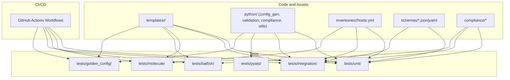
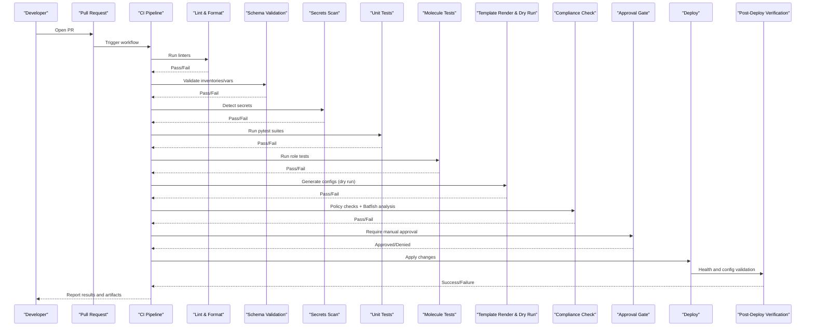
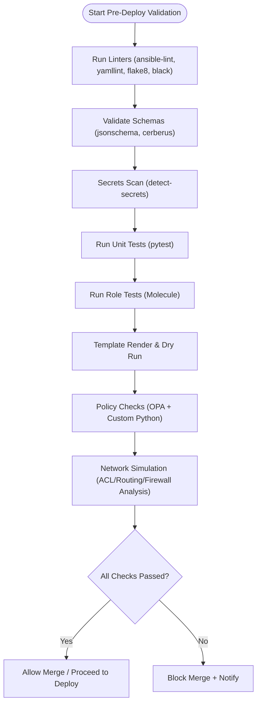
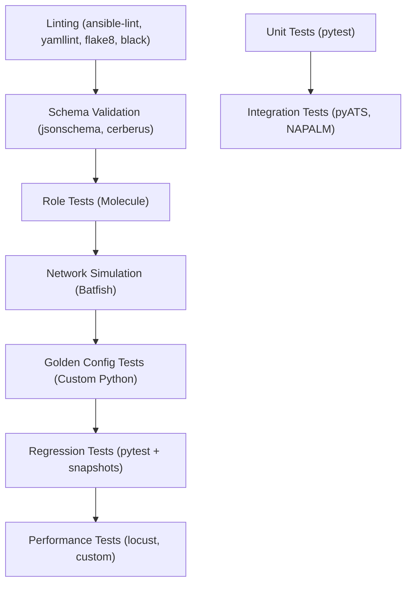
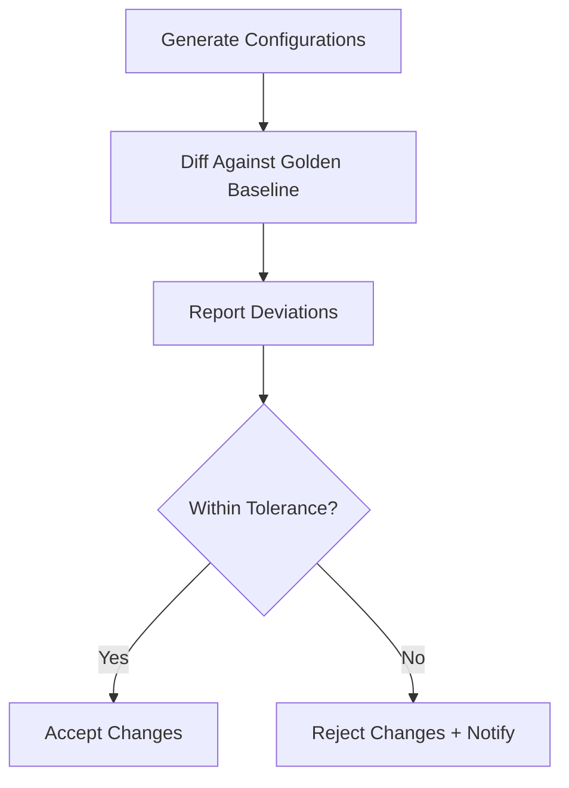
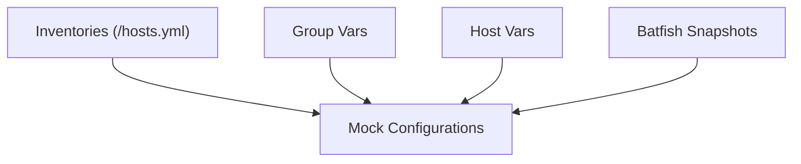
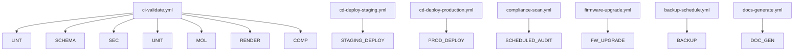
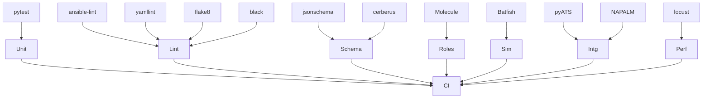

# Configuration Testing & Validation

<cite>
**Referenced Files in This Document**
- [README.md](file://README.md)
</cite>

## Table of Contents
1. [Introduction](#introduction)
2. [Project Structure](#project-structure)
3. [Core Components](#core-components)
4. [Architecture Overview](#architecture-overview)
5. [Detailed Component Analysis](#detailed-component-analysis)
6. [Dependency Analysis](#dependency-analysis)
7. [Performance Considerations](#performance-considerations)
8. [Troubleshooting Guide](#troubleshooting-guide)
9. [Conclusion](#conclusion)
10. [Appendices](#appendices)

## Introduction
This document describes the configuration testing and validation strategies for a production-grade, vendor-agnostic network automation platform. It explains the multi-layered testing approach that includes unit tests for templates and Python modules, integration tests with network simulators like Batfish, golden configuration validation, pre-deployment validation (syntax and semantic checks), policy compliance testing, test data management, mock configurations, automated regression testing, and CI/CD integration with reporting mechanisms. The guidance is derived from the repository’s documented architecture, workflows, and testing strategy.

## Project Structure
The repository organizes code and assets to support end-to-end testing and validation across multiple layers:
- Templates per vendor for Jinja2-based configuration generation
- Python modules for configuration generation, validation, backup, and compliance
- A comprehensive test suite directory structure covering unit, integration, Molecule, Batfish, pyATS, and golden config tests
- Compliance policies and schemas for validation
- CI/CD workflows orchestrated via GitHub Actions

**Diagram sources**
- [README.md:103-180](file://README.md#L103-L180)
- [README.md:479-514](file://README.md#L479-L514)
- [README.md:517-544](file://README.md#L517-L544)

**Section sources**
- [README.md:103-180](file://README.md#L103-L180)
- [README.md:479-514](file://README.md#L479-L514)
- [README.md:517-544](file://README.md#L517-L544)

## Core Components
The testing and validation system is composed of several core components:
- Unit testing framework using pytest for Python modules and Jinja2 filters
- Linting and schema validation for YAML, Python, and Ansible artifacts
- Role-level testing with Molecule
- Network simulation and analysis with Batfish for ACLs, routing, and firewall rules
- Integration testing with pyATS and NAPALM for device connectivity and config parsing
- Golden configuration validation against approved baselines
- Automated regression testing with snapshots to detect unintended changes
- Performance testing for API and bot endpoints during release candidates

These components are executed at defined stages in the CI/CD pipeline to ensure quality gates before deployment.

**Section sources**
- [README.md:517-544](file://README.md#L517-L544)
- [README.md:479-514](file://README.md#L479-L514)

## Architecture Overview
The end-to-end validation flow integrates multiple checks and gates:
- Pull requests trigger linting, schema validation, secrets scanning, unit and integration tests, compliance checks, template rendering dry runs, and approval gates
- Post-deploy verification ensures correctness in target environments
- Automated rollback occurs on failures

**Diagram sources**
- [README.md:34-50](file://README.md#L34-L50)
- [README.md:479-514](file://README.md#L479-L514)

## Detailed Component Analysis

### Pre-Deployment Validation Procedures
Pre-deployment validation encompasses syntax checking, semantic validation, and policy compliance testing:
- Syntax checking: Linters validate YAML, Python, and Ansible files; Jinja2 templates are rendered in dry-run mode to catch errors early
- Semantic validation: Schemas enforce structure and constraints for inventories and variables; Batfish analyzes ACLs, routing, and firewall rules for correctness and reachability
- Policy compliance: OPA policies and custom Python checks enforce security and operational standards such as SSH-only access, NTP configuration, AAA enablement, SNMPv3 usage, cipher suites, firmware approvals, password policies, ACL standards, and firewall rule hygiene

**Diagram sources**
- [README.md:479-514](file://README.md#L479-L514)
- [README.md:517-544](file://README.md#L517-L544)
- [README.md:548-579](file://README.md#L548-L579)

**Section sources**
- [README.md:479-514](file://README.md#L479-L514)
- [README.md:517-544](file://README.md#L517-L544)
- [README.md:548-579](file://README.md#L548-L579)

### Multi-Layered Testing Approach
- Unit tests: pytest validates Python modules and Jinja2 filters
- Linting: ansible-lint, yamllint, flake8, black ensure consistent formatting and style
- Schema validation: jsonschema and cerberus enforce inventory and variable structures
- Role tests: Molecule verifies individual Ansible roles in isolated environments
- Network simulation: Batfish performs deep analysis of ACLs, routing, and firewall rules
- Integration tests: pyATS and NAPALM verify device connectivity and configuration parsing
- Golden configuration tests: Custom Python diffs generated configs against approved baselines
- Regression tests: pytest with snapshots detects unintended changes
- Performance tests: locust and custom scripts load-test APIs and bots during release candidates

**Diagram sources**
- [README.md:517-544](file://README.md#L517-L544)

**Section sources**
- [README.md:517-544](file://README.md#L517-L544)

### Golden Configuration Validation
Golden configuration validation compares generated configurations against approved baselines to ensure consistency and compliance:
- Baseline definitions are maintained under the golden config test directory
- Custom Python tools compute diffs and report deviations
- Scheduled runs and PR-triggered runs maintain ongoing compliance

**Diagram sources**
- [README.md:517-544](file://README.md#L517-L544)

**Section sources**
- [README.md:517-544](file://README.md#L517-L544)

### Test Data Management and Mock Configurations
Test data and mocks are organized by environment and purpose:
- Inventories per environment provide realistic device groupings and attributes
- Group and host variables supply structured inputs for templates and tests
- Mock configurations and snapshots support deterministic testing without live devices
- Batfish snapshots represent network topologies and configurations for simulation

**Diagram sources**
- [README.md:103-180](file://README.md#L103-L180)

**Section sources**
- [README.md:103-180](file://README.md#L103-L180)

### Examples of Test Cases and Validation Rules
Common scenarios covered by the testing framework include:
- Template rendering for multiple vendors and platforms
- ACL and routing rule analysis for reachability and conflicts
- Firewall rule validation to prevent any-any rules and detect shadows/duplicates
- Compliance checks for SSH-only, NTP, AAA, SNMPv3, logging, cipher suites, firmware approvals, password policies, and ACL standards
- Golden configuration diffs to ensure baseline adherence
- Regression detection to avoid unintended changes

These examples align with the documented compliance checks and test types.

**Section sources**
- [README.md:548-579](file://README.md#L548-L579)
- [README.md:517-544](file://README.md#L517-L544)

### Automated Regression Testing
Automated regression testing uses pytest with snapshot comparisons to ensure no unintended configuration changes occur:
- Snapshots capture expected outputs for critical paths
- Any deviation triggers failures and alerts
- Regression tests run on every pull request and scheduled intervals

**Section sources**
- [README.md:517-544](file://README.md#L517-L544)

### CI/CD Integration and Reporting Mechanisms
CI/CD pipelines integrate all validation steps and produce reports:
- Workflows defined in GitHub Actions orchestrate linting, schema validation, secrets scanning, unit and role tests, template rendering, compliance checks, and dry runs
- Approval gates control deployments to staging and production
- Post-deploy verification ensures correctness and triggers automatic rollback on failure
- Artifacts and documentation are auto-generated and published

**Diagram sources**
- [README.md:479-514](file://README.md#L479-L514)

**Section sources**
- [README.md:479-514](file://README.md#L479-L514)

## Dependency Analysis
The testing and validation components depend on each other and external tools:
- Unit tests depend on Python modules and Jinja2 filters
- Role tests depend on Ansible roles and isolated environments
- Network simulation depends on Batfish snapshots and topology definitions
- Integration tests depend on pyATS and NAPALM for device interaction
- Golden config tests depend on baseline definitions and diff utilities
- CI/CD orchestrates these dependencies and enforces gates

**Diagram sources**
- [README.md:517-544](file://README.md#L517-L544)

**Section sources**
- [README.md:517-544](file://README.md#L517-L544)

## Performance Considerations
- Use parallel execution where possible to reduce CI runtime
- Cache dependencies and Docker images for Molecule tests
- Limit scope of Batfish analyses to affected configurations
- Snapshot-based regression tests should be incremental to minimize overhead
- Load testing should be reserved for release candidates to avoid impacting regular development

[No sources needed since this section provides general guidance]

## Troubleshooting Guide
Common issues and resolutions:
- Ansible connection timeouts: Verify SSH reachability using ping against lab inventories
- Template rendering errors: Debug Jinja2 syntax using the configuration generator with debug flags
- Compliance check failures: Review compliance policies and device running config diffs
- CI pipeline failures: Inspect GitHub Actions logs for actionable error messages
- Vault authentication failures: Verify OIDC tokens or AppRole credentials and check Vault policies
- Molecule test failures: Ensure Docker/Podman is running and review molecule configuration
- Batfish analysis errors: Validate Batfish snapshots and topology definitions

**Section sources**
- [README.md:674-685](file://README.md#L674-L685)

## Conclusion
The platform implements a robust, multi-layered configuration testing and validation strategy that integrates unit, linting, schema, role, simulation, integration, golden configuration, regression, and performance testing into a cohesive CI/CD pipeline. Pre-deployment validation ensures syntax and semantic correctness, while policy compliance and golden configuration checks enforce security and operational standards. Automated reporting and rollback mechanisms further enhance reliability and safety across environments.

[No sources needed since this section summarizes without analyzing specific files]

## Appendices

### Quick Commands for Local Execution
- Run all tests: pytest tests/ -v --tb=short
- Run only unit tests: pytest tests/unit/ -v
- Run compliance tests: pytest tests/compliance/ -v
- Run Molecule tests for a specific role: cd roles/cisco_ios_baseline && molecule test

**Section sources**
- [README.md:531-544](file://README.md#L531-L544)