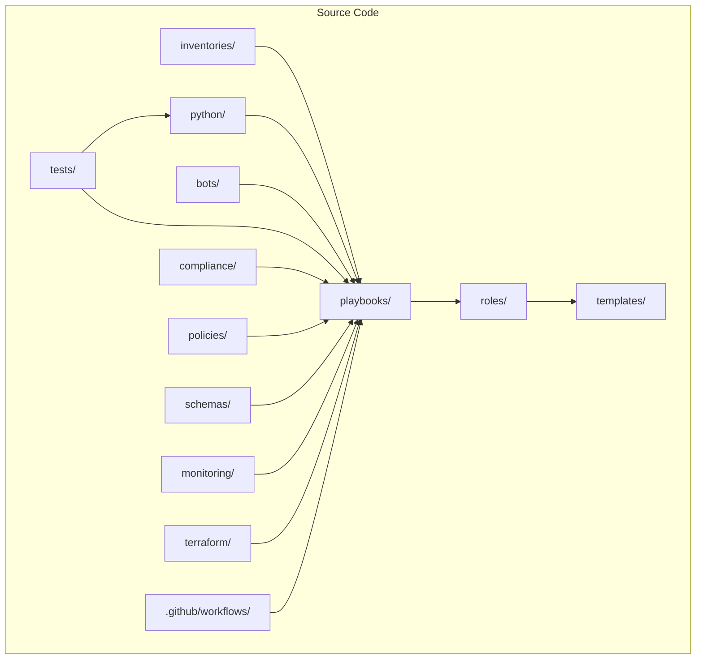
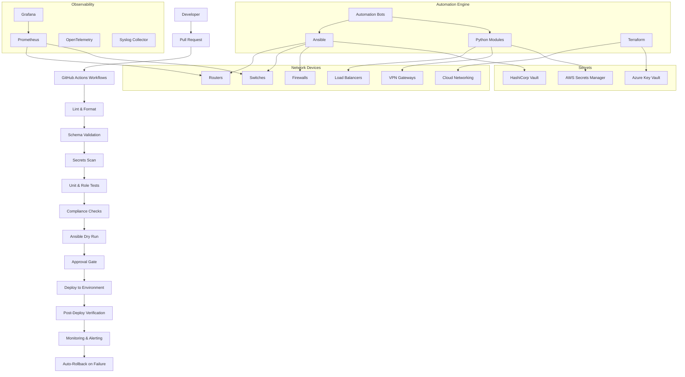
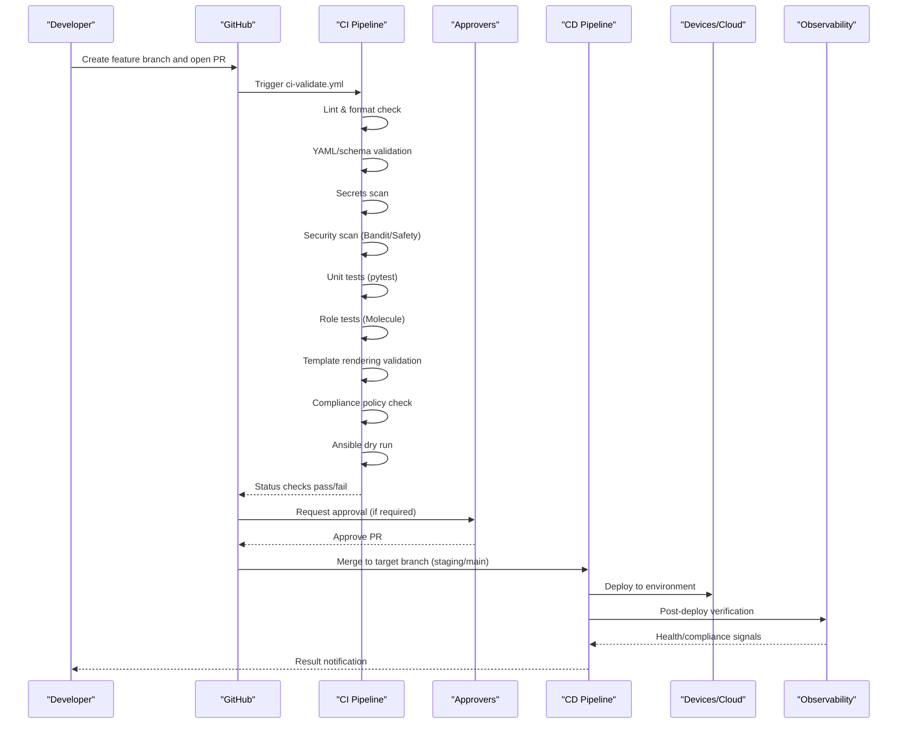
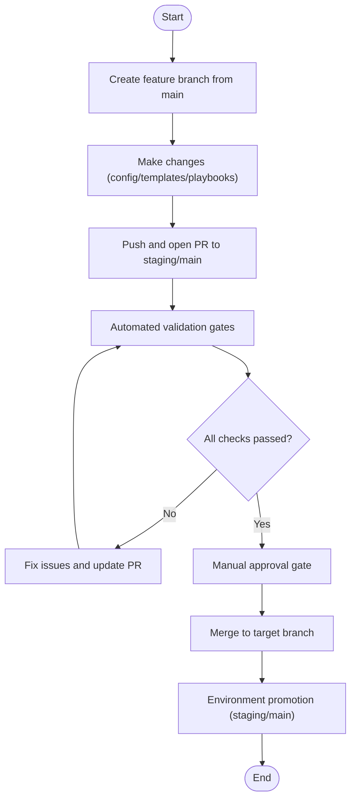
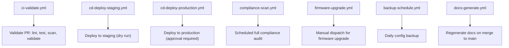
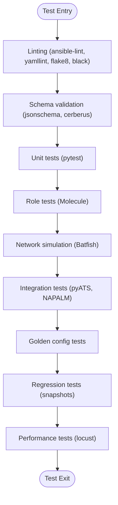
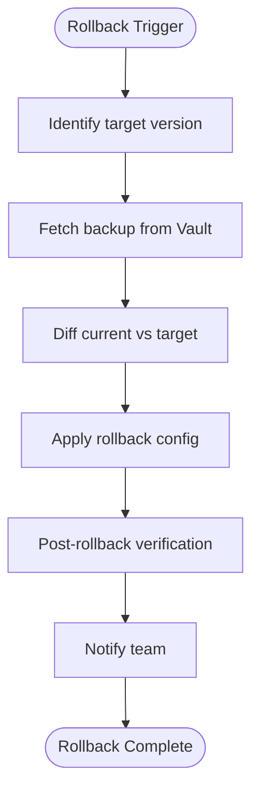
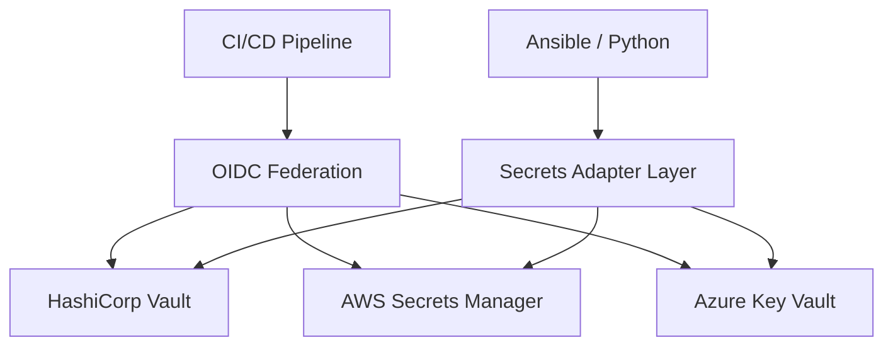
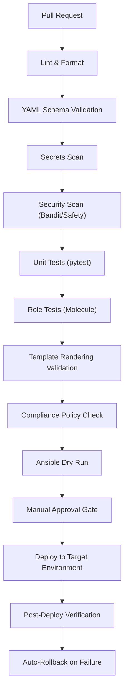

# GitOps Workflow & CI/CD

<cite>
**Referenced Files in This Document**
- [README.md](file://README.md)
</cite>

## Table of Contents
1. [Introduction](#introduction)
2. [Project Structure](#project-structure)
3. [Core Components](#core-components)
4. [Architecture Overview](#architecture-overview)
5. [Detailed Component Analysis](#detailed-component-analysis)
6. [Dependency Analysis](#dependency-analysis)
7. [Performance Considerations](#performance-considerations)
8. [Troubleshooting Guide](#troubleshooting-guide)
9. [Conclusion](#conclusion)

## Introduction
This document describes the end-to-end GitOps workflow for the repository, covering pull request processes, automated validation gates, and deployment automation. It explains the complete change lifecycle from feature branch creation through production deployment, including GitHub Actions workflows such as linting, schema validation, secrets scanning, compliance checks, dry runs, and approval gates. It also details branching strategy, merge policies, environment promotion procedures, automated testing integration, rollback mechanisms, and the integration between version control, CI/CD pipelines, and deployment automation tools.

## Project Structure
The repository is organized to support a comprehensive network automation platform with clear separation of concerns across inventories, playbooks, templates, Python modules, bots, tests, compliance, monitoring, Terraform, and GitHub Actions workflows. The structure enables modular development, robust testing, and safe deployments via GitOps.

**Diagram sources**
- [README.md:103-179](file://README.md#L103-L179)

**Section sources**
- [README.md:103-179](file://README.md#L103-L179)

## Core Components
- Pull Request-driven GitOps model: Changes are proposed via PRs targeting staging or main branches; automated validation gates run before any manual approval.
- Automated validation pipeline: Linting, YAML/schema validation, secrets scanning, security scans, unit and role tests, template rendering validation, compliance policy checks, and Ansible dry runs.
- Approval gates: Manual approvals required before deploying to target environments (staging and production).
- Deployment automation: On merge, GitHub Actions triggers environment-specific deployments with post-deploy verification and auto-rollback on failure.
- Compliance enforcement: Policy checks using OPA/Batfish/custom rules integrated into CI to block non-compliant changes.
- Secrets management: No secrets in Git; OIDC federation used by CI/CD to access secure backends like Vault, AWS Secrets Manager, Azure Key Vault.

**Section sources**
- [README.md:34-50](file://README.md#L34-L50)
- [README.md:479-514](file://README.md#L479-L514)
- [README.md:619-638](file://README.md#L619-L638)
- [README.md:548-579](file://README.md#L548-L579)
- [README.md:339-368](file://README.md#L339-L368)

## Architecture Overview
The GitOps architecture integrates developers, GitHub, CI/CD, automation engines, device fleets, observability, and secrets backends.

**Diagram sources**
- [README.md:34-99](file://README.md#L34-L99)
- [README.md:479-514](file://README.md#L479-L514)

## Detailed Component Analysis

### Pull Request Lifecycle
The PR lifecycle enforces quality and safety at every stage before merging.

**Diagram sources**
- [README.md:479-514](file://README.md#L479-L514)
- [README.md:619-638](file://README.md#L619-L638)

**Section sources**
- [README.md:479-514](file://README.md#L479-L514)
- [README.md:619-638](file://README.md#L619-L638)

### Branching Strategy and Merge Policies
- Branching model: Feature branches created from main; PRs target staging or main.
- Merge policies: Required status checks include linting, schema validation, secrets scanning, unit and role tests, compliance checks, and dry runs. Manual approvals required before merging to protected branches.
- Promotion procedure: Staging merges trigger staging deployments; main merges require additional approvals and trigger production deployments.

**Diagram sources**
- [README.md:619-638](file://README.md#L619-L638)

**Section sources**
- [README.md:619-638](file://README.md#L619-L638)

### GitHub Actions Workflows
Key workflows orchestrate validation, deployment, compliance, backups, documentation generation, and firmware upgrades.

**Diagram sources**
- [README.md:503-514](file://README.md#L503-L514)

**Section sources**
- [README.md:503-514](file://README.md#L503-L514)

### Automated Testing Integration
Testing strategy spans unit tests, linting, schema validation, role tests, network simulation, integration tests, golden config tests, regression tests, and performance tests.

**Diagram sources**
- [README.md:517-544](file://README.md#L517-L544)

**Section sources**
- [README.md:517-544](file://README.md#L517-L544)

### Rollback Mechanisms
Rollbacks are supported for both firmware and configuration changes, with pre/post checks and automatic recovery paths.

**Diagram sources**
- [README.md:660-670](file://README.md#L660-L670)

**Section sources**
- [README.md:660-670](file://README.md#L660-L670)

### Secrets Management Integration
Secrets are never committed; CI/CD uses OIDC federation to securely access backends.

**Diagram sources**
- [README.md:339-368](file://README.md#L339-L368)

**Section sources**
- [README.md:339-368](file://README.md#L339-L368)

## Dependency Analysis
The CI/CD pipeline depends on multiple validation stages and external services. Each stage must succeed before proceeding to deployment.

**Diagram sources**
- [README.md:479-514](file://README.md#L479-L514)

**Section sources**
- [README.md:479-514](file://README.md#L479-L514)

## Performance Considerations
- Parallelize independent validation steps where possible to reduce pipeline duration.
- Cache dependencies (Python packages, Ansible collections, Docker images) to speed up builds.
- Use targeted runs for large repositories (e.g., only run tests affected by changed files).
- Optimize template rendering and compliance checks by limiting scope to impacted devices or groups.
- Monitor pipeline execution times and adjust runner concurrency and job timeouts accordingly.

[No sources needed since this section provides general guidance]

## Troubleshooting Guide
Common issues and resolutions during GitOps operations:

- Ansible connection timeout: Verify SSH reachability against inventory hosts.
- Template rendering error: Debug Jinja2 syntax using provided tooling.
- Compliance check failure: Review compliance policies and running config diffs.
- CI pipeline failure: Inspect GitHub Actions logs for actionable errors.
- Vault authentication failure: Verify OIDC token or AppRole credentials and Vault policies.
- Molecule test failure: Ensure container runtime is available and molecule configuration is correct.
- Batfish analysis error: Validate snapshots and configurations under tests/batfish/snapshots.

**Section sources**
- [README.md:674-685](file://README.md#L674-L685)

## Conclusion
The GitOps workflow ensures that all changes undergo rigorous automated validation, compliance checks, and controlled approvals before reaching production. The integration of GitHub Actions with Ansible, Python modules, and observability tools creates a resilient and auditable deployment process. With robust rollback mechanisms and secrets management via OIDC federation, the platform maintains high reliability and security standards suitable for enterprise-scale network automation.

[No sources needed since this section summarizes without analyzing specific files]