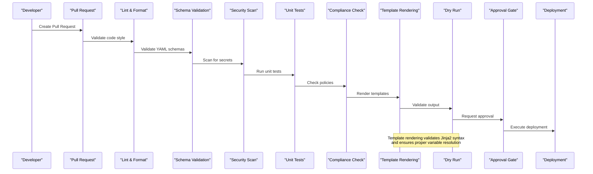
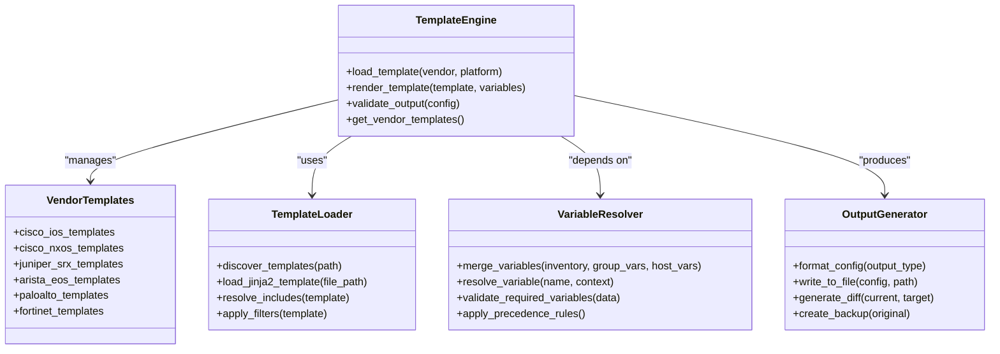
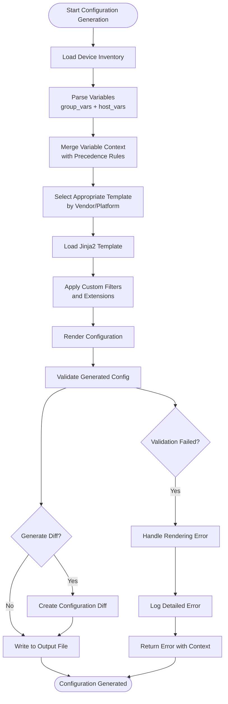
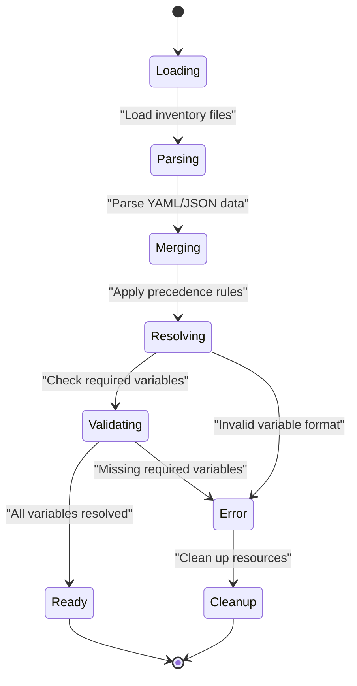
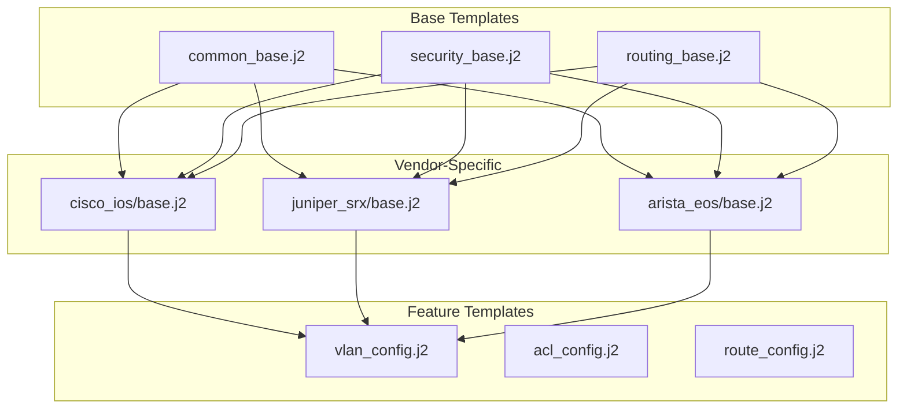

# Template Engine & Generation

<cite>
**Referenced Files in This Document**
- [README.md](file://README.md)
</cite>

## Table of Contents
1. [Introduction](#introduction)
2. [Project Structure](#project-structure)
3. [Core Components](#core-components)
4. [Architecture Overview](#architecture-overview)
5. [Detailed Component Analysis](#detailed-component-analysis)
6. [Dependency Analysis](#dependency-analysis)
7. [Performance Considerations](#performance-considerations)
8. [Troubleshooting Guide](#troubleshooting-guide)
9. [Conclusion](#conclusion)
10. [Appendices](#appendices)

## Introduction

This document explains the Jinja2-based template engine architecture for generating device configurations from structured inventory data across multi-vendor environments. It covers how variables flow through the configuration generation pipeline, the vendor-specific template abstraction layer, and the Python config_gen module responsibilities as described in the project’s architecture.

The system follows a “Network as Code” approach where all device configurations are generated from Jinja2 templates combined with structured data stored in Git. The CI/CD pipeline includes a template rendering validation step to ensure correctness before deployment.

[No sources needed since this section summarizes without analyzing specific files]

## Project Structure

The repository layout defines clear separation between templates, Python modules, inventories, and variables:

- Templates are organized per vendor under templates/, including cisco_ios, cisco_nxos, juniper_srx, arista_eos, paloalto, fortinet, checkpoint, f5, pfsense, opnsense, etc.
- Python automation modules reside under python/, including config_gen for Jinja2-based configuration generation.
- Inventories and variables are organized by environment and scope: inventories/, group_vars/, host_vars/.
- Playbooks orchestrate operations using these templates and variables.

```mermaid
graph TB
subgraph "Templates"
T_CISCO_IOS["templates/cisco_ios"]
T_CISCO_NXOS["templates/cisco_nxos"]
T_JUNIPER_SRX["templates/juniper_srx"]
T_ARISTA_EOS["templates/arista_eos"]
T_PALOALTO["templates/paloalto"]
T_FORTINET["templates/fortinet"]
T_CHECKPOINT["templates/checkpoint"]
T_F5["templates/f5"]
T_PFSENSE["templates/pfsense"]
T_OPNSENSE["templates/opnsense"]
end
subgraph "Python Modules"
P_CONFIG_GEN["python/config_gen"]
P_INVENTORY["python/inventory"]
P_VALIDATION["python/validation"]
P_UTILS["python/utils"]
end
subgraph "Data"
INV_PROD["inventories/production"]
INV_STAGING["inventories/staging"]
INV_LAB["inventories/lab"]
G_VARS["group_vars"]
H_VARS["host_vars"]
end
T_CISCO_IOS --> P_CONFIG_GEN
T_CISCO_NXOS --> P_CONFIG_GEN
T_JUNIPER_SRX --> P_CONFIG_GEN
T_ARISTA_EOS --> P_CONFIG_GEN
T_PALOALTO --> P_CONFIG_GEN
T_FORTINET --> P_CONFIG_GEN
T_CHECKPOINT --> P_CONFIG_GEN
T_F5 --> P_CONFIG_GEN
T_PFSENSE --> P_CONFIG_GEN
T_OPNSENSE --> P_CONFIG_GEN
P_CONFIG_GEN --> P_INVENTORY
P_CONFIG_GEN --> P_VALIDATION
P_CONFIG_GEN --> P_UTILS
INV_PROD --> P_INVENTORY
INV_STAGING --> P_INVENTORY
INV_LAB --> P_INVENTORY
G_VARS --> P_INVENTORY
H_VARS --> P_INVENTORY
```



**Diagram sources**
- [README.md:105-180](file://README.md#L105-L180)

**Section sources**
- [README.md:105-180](file://README.md#L105-L180)

## Core Components

The template engine architecture consists of several key components:

### Configuration Generation Pipeline
The pipeline transforms structured inventory data into device-specific configurations using Jinja2 templates. The process is integrated into the CI/CD workflow with template rendering validation as a critical gate.

### Multi-Vendor Template Abstraction Layer
Templates are organized by vendor and platform, providing consistent interfaces while accommodating vendor-specific syntax and features. Each vendor directory contains platform-specific templates for different device types.

### Python Config Gen Module
The config_gen module serves as the central orchestrator for template rendering, variable resolution, and output generation. It integrates with inventory parsing, validation, and utility functions.

### Inventory and Variable Management
Structured data is organized hierarchically with environment-specific inventories, shared group variables, and device-specific host variables. This structure enables flexible variable precedence and reuse.

**Section sources**
- [README.md:438-456](file://README.md#L438-L456)
- [README.md:105-180](file://README.md#L105-L180)

## Architecture Overview

The template engine architecture follows a layered approach with clear separation of concerns:



**Diagram sources**
- [README.md:36-50](file://README.md#L36-L50)
- [README.md:483-501](file://README.md#L483-L501)

The architecture emphasizes:
- **GitOps principles**: All changes tracked in version control
- **Automated validation**: Multiple layers of quality gates
- **Vendor abstraction**: Consistent interface across different platforms
- **Security-first**: Secrets scanning and compliance checks at every stage

**Section sources**
- [README.md:36-50](file://README.md#L36-L50)
- [README.md:483-501](file://README.md#L483-L501)

## Detailed Component Analysis

### Template Organization and Vendor Abstraction

The template system uses a hierarchical organization strategy that separates vendor-specific implementations while maintaining common patterns:



**Diagram sources**
- [README.md:115-128](file://README.md#L115-L128)
- [README.md:438-456](file://README.md#L438-L456)

### Data Flow Through Configuration Generation

The configuration generation process follows a well-defined data flow:



**Diagram sources**
- [README.md:272-273](file://README.md#L272-L273)
- [README.md:678-679](file://README.md#L678-L679)

### Variable Resolution and Precedence

Variable management follows Ansible-like precedence rules where more specific variables override broader ones:



**Diagram sources**
- [README.md:311-335](file://README.md#L311-L335)

### Template Inheritance Patterns

The template system supports inheritance patterns for code reuse and consistency:



**Diagram sources**
- [README.md:115-128](file://README.md#L115-L128)

**Section sources**
- [README.md:115-128](file://README.md#L115-L128)
- [README.md:311-335](file://README.md#L311-L335)
- [README.md:438-456](file://README.md#L438-L456)

## Dependency Analysis

The template engine has well-defined dependencies between components:

```mermaid
graph TB
subgraph "External Dependencies"
JINJA2["Jinja2 Template Engine"]
YAML["YAML Parser"]
JSON["JSON Parser"]
LOGGING["Logging Framework"]
end
subgraph "Internal Modules"
CONFIG_GEN["config_gen module"]
INVENTORY["inventory parser"]
VALIDATION["validation engine"]
UTILS["utility functions"]
end
subgraph "Template System"
TEMPLATE_LOADER["template loader"]
FILTER_REGISTRY["filter registry"]
EXTENSION_MANAGER["extension manager"]
end
subgraph "Output System"
OUTPUT_FORMATTER["output formatter"]
FILE_WRITER["file writer"]
DIFF_GENERATOR["diff generator"]
end
CONFIG_GEN --> JINJA2
CONFIG_GEN --> YAML
CONFIG_GEN --> JSON
CONFIG_GEN --> LOGGING
CONFIG_GEN --> INVENTORY
CONFIG_GEN --> VALIDATION
CONFIG_GEN --> UTILS
CONFIG_GEN --> TEMPLATE_LOADER
CONFIG_GEN --> FILTER_REGISTRY
CONFIG_GEN --> EXTENSION_MANAGER
CONFIG_GEN --> OUTPUT_FORMATTER
CONFIG_GEN --> FILE_WRITER
CONFIG_GEN --> DIFF_GENERATOR
```



**Diagram sources**
- [README.md:438-456](file://README.md#L438-L456)

Key dependency characteristics:
- **Loose coupling**: Modules communicate through well-defined interfaces
- **Pluggable architecture**: Filters and extensions can be added dynamically
- **Error isolation**: Failures in one component don't cascade to others
- **Testing support**: Each component can be tested independently

**Section sources**
- [README.md:438-456](file://README.md#L438-L456)

## Performance Considerations

The template engine architecture incorporates several performance optimizations:

### Caching Strategies
- Template compilation caching to avoid repeated parsing
- Variable resolution caching for frequently accessed data
- Output caching for unchanged configurations

### Parallel Processing
- Concurrent template rendering for multiple devices
- Asynchronous variable loading and processing
- Batch operations for large-scale deployments

### Memory Management
- Streaming template processing for large configurations
- Garbage collection optimization for long-running processes
- Resource cleanup in error scenarios

### Optimization Opportunities
- Implement template pre-compilation during initialization
- Use efficient data structures for variable lookup
- Optimize file I/O operations with buffering
- Implement intelligent diff algorithms for change detection

[No sources needed since this section provides general guidance]

## Troubleshooting Guide

Common issues and their resolutions in the template engine:

### Template Rendering Errors
When encountering template rendering errors, use debug mode to identify the root cause:

```bash
python -m python.config_gen --debug --device <name>
```

### Variable Resolution Issues
Verify variable precedence and availability:
- Check if required variables are defined in appropriate scopes
- Validate variable formats against expected schemas
- Ensure proper inheritance from parent contexts

### Template Syntax Errors
Use linting tools to validate Jinja2 syntax:
- Check for unclosed tags and filters
- Verify proper indentation and formatting
- Validate template includes and extends statements

### Performance Problems
Monitor template rendering performance:
- Identify slow templates through profiling
- Optimize complex loops and conditionals
- Reduce redundant variable lookups

**Section sources**
- [README.md:678-679](file://README.md#L678-L679)

## Conclusion

The Jinja2-based template engine architecture provides a robust, scalable solution for multi-vendor network configuration generation. Key strengths include:

- **Vendor Abstraction**: Clean separation between vendor-specific implementations and common logic
- **Flexible Variable Management**: Hierarchical variable resolution with clear precedence rules
- **Comprehensive Validation**: Multiple layers of validation throughout the generation pipeline
- **CI/CD Integration**: Seamless integration with automated testing and deployment workflows
- **Extensibility**: Pluggable architecture supporting custom filters, extensions, and output formats

The architecture successfully balances flexibility with maintainability, enabling rapid adaptation to new vendors and platforms while ensuring consistency and reliability across the entire network automation ecosystem.

[No sources needed since this section summarizes without analyzing specific files]

## Appendices

### Quick Start Commands

Generate configuration for a specific device:
```bash
python -m python.config_gen --device core-rtr-01 --output ./output/
```

Run template rendering validation in CI/CD:
```bash
python -m python.config_gen --validate --all-devices
```

Debug template rendering issues:
```bash
python -m python.config_gen --debug --device <device-name>
```

**Section sources**
- [README.md:272-273](file://README.md#L272-L273)
- [README.md:678-679](file://README.md#L678-L679)