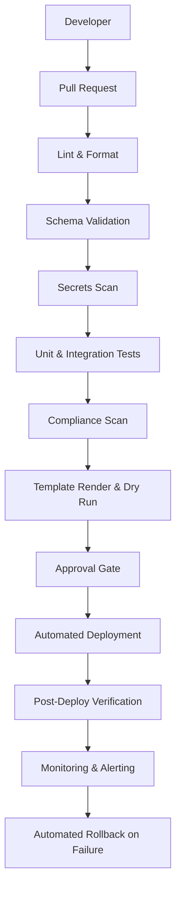
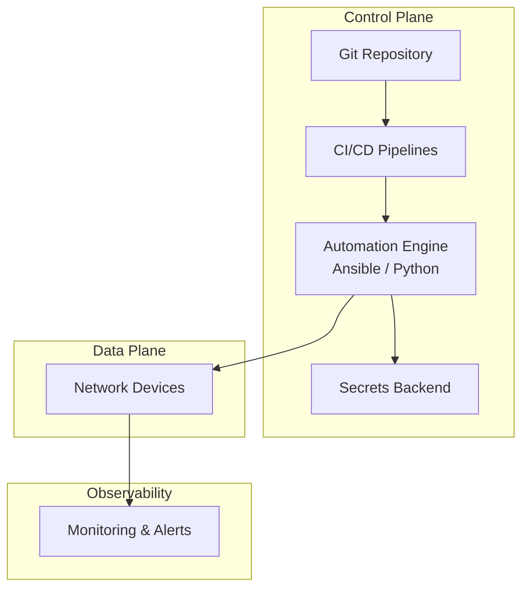
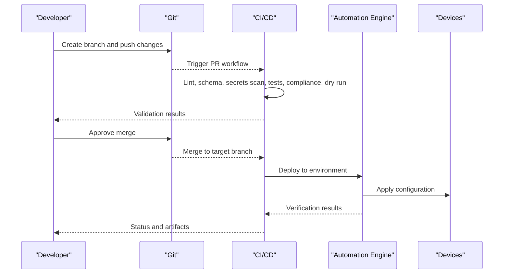
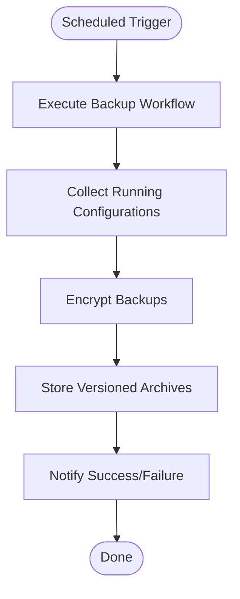
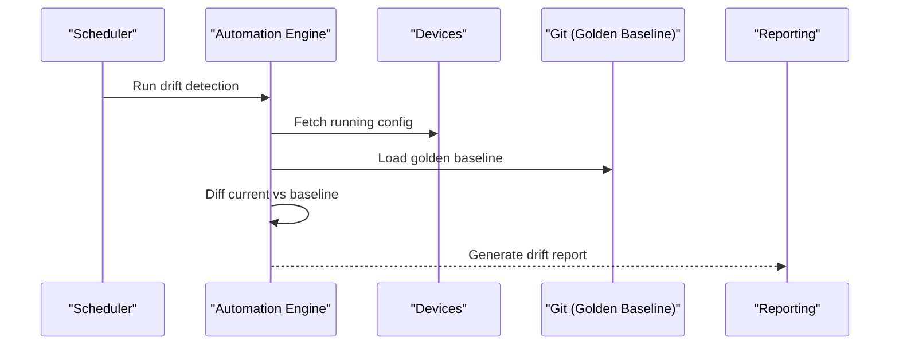
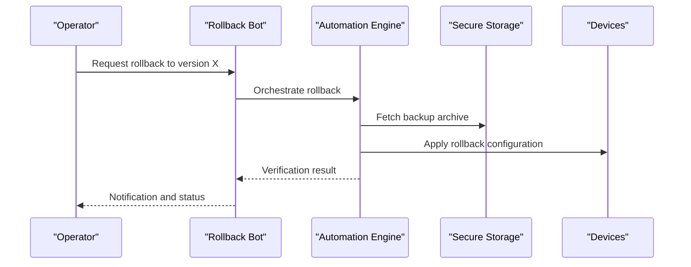
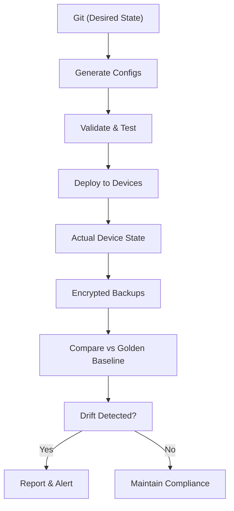
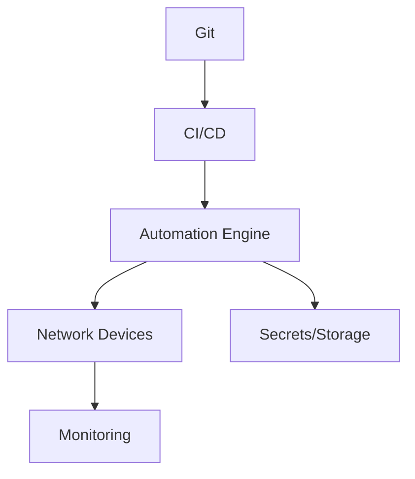

# Version Control & Backup Management

<cite>
**Referenced Files in This Document**
- [README.md](file://README.md)
</cite>

## Table of Contents
1. [Introduction](#introduction)
2. [Project Structure](#project-structure)
3. [Core Components](#core-components)
4. [Architecture Overview](#architecture-overview)
5. [Detailed Component Analysis](#detailed-component-analysis)
6. [Dependency Analysis](#dependency-analysis)
7. [Performance Considerations](#performance-considerations)
8. [Troubleshooting Guide](#troubleshooting-guide)
9. [Conclusion](#conclusion)

## Introduction
This document explains the version control and backup management strategies for configuration lifecycle, including Git-based tracking, branching by environment, commit conventions, automated backups, storage and encryption, retention, golden configuration baselines, drift detection, recovery/rollback procedures, and reconciliation between Git history, backup archives, and device state. The information is derived from the repository’s documented workflows, modules, and automation components.

## Project Structure
The platform follows a GitOps model where all configurations, templates, playbooks, tests, and pipelines are stored in Git. Secrets are never committed. The repository layout includes dedicated directories for inventories per environment, Jinja2 templates per vendor, Python modules (including backup), automation bots (including backup and rollback), CI/CD workflows (including scheduled backups), and test suites (including golden config tests).

**Diagram sources**
- [README.md:36-50](file://README.md#L36-L50)

**Section sources**
- [README.md:103-180](file://README.md#L103-L180)
- [README.md:36-50](file://README.md#L36-L50)

## Core Components
- Git-driven change control with pull requests, validation gates, approvals, and automated deployment.
- Automated backup scheduling via CI/CD workflow.
- Backup module providing versioning and encryption.
- Golden configuration baseline management and drift detection.
- Rollback mechanisms to last known good configuration.
- Bots exposing APIs for backup triggers and rollbacks.

Key references:
- GitOps workflow and pipeline stages
- Scheduled backup workflow
- Operations playbooks (backup, restore, golden config, drift detection, config rollback)
- Python backup module description
- Automation bots (Backup Bot, Rollback Bot)

**Section sources**
- [README.md:619-638](file://README.md#L619-L638)
- [README.md:479-514](file://README.md#L479-L514)
- [README.md:418-435](file://README.md#L418-L435)
- [README.md:438-456](file://README.md#L438-L456)
- [README.md:460-476](file://README.md#L460-L476)

## Architecture Overview
The system integrates Git as the single source of truth for desired state, CI/CD for validation and deployment, and an automation engine that applies changes and performs operational tasks such as backups and rollbacks. Backups are captured, encrypted, and versioned; golden baselines are maintained and compared against running configs to detect drift.

[No sources needed since this diagram shows conceptual architecture, not direct code mapping]

## Detailed Component Analysis

### Git-Based Configuration Tracking and Branching Strategy
- All changes originate from feature branches and flow through pull requests targeting staging or main.
- Environments are represented by branches and/or inventory sets (production, staging, lab, dr).
- Pre-merge checks include linting, schema validation, secrets scanning, compliance policy checks, template rendering, and dry runs.
- Post-merge deployment is automated with verification and automatic rollback on failure.

**Diagram sources**
- [README.md:619-638](file://README.md#L619-L638)
- [README.md:479-514](file://README.md#L479-L514)

**Section sources**
- [README.md:619-638](file://README.md#L619-L638)
- [README.md:479-514](file://README.md#L479-L514)

### Commit Conventions
- Use descriptive messages following conventional commits style.
- Examples include feat, fix, docs, test, refactor, ci prefixes.
- All PRs must pass linting, unit tests, schema validation, secrets scanning, and compliance checks.

**Section sources**
- [README.md:713-730](file://README.md#L713-L730)

### Automated Backup Scheduling and Storage
- A scheduled CI/CD workflow triggers daily backups at 02:00 UTC.
- The backup process is orchestrated via automation engines and exposed through a Backup Bot API endpoint.
- Backups are managed by a Python module that provides versioning and encryption.

**Diagram sources**
- [README.md:479-514](file://README.md#L479-L514)
- [README.md:438-456](file://README.md#L438-L456)
- [README.md:460-476](file://README.md#L460-L476)

**Section sources**
- [README.md:479-514](file://README.md#L479-L514)
- [README.md:438-456](file://README.md#L438-L456)
- [README.md:460-476](file://README.md#L460-L476)

### Encryption and Retention Policies
- Backups are encrypted before storage.
- Versioning ensures historical snapshots are retained and retrievable.
- Specific retention intervals are not detailed in the repository documentation; policies should be defined and enforced by the organization.

**Section sources**
- [README.md:438-456](file://README.md#L438-L456)

### Golden Configuration Baseline and Drift Detection
- Golden configuration baseline can be applied via a dedicated playbook.
- Drift detection compares current device state against the approved baseline and reports differences.
- Golden config tests compare generated or running configurations against the baseline.

**Diagram sources**
- [README.md:418-435](file://README.md#L418-L435)
- [README.md:517-544](file://README.md#L517-L544)

**Section sources**
- [README.md:418-435](file://README.md#L418-L435)
- [README.md:517-544](file://README.md#L517-L544)

### Recovery, Rollback, and Disaster Recovery Procedures
- Configuration rollback uses the last known good configuration retrieved from secure storage.
- Firmware upgrades include pre/post health checks and automatic rollback on failure.
- Restore operations are supported via dedicated playbooks.

**Diagram sources**
- [README.md:418-435](file://README.md#L418-L435)
- [README.md:460-476](file://README.md#L460-L476)

**Section sources**
- [README.md:418-435](file://README.md#L418-L435)
- [README.md:460-476](file://README.md#L460-L476)

### Integration Between Git History, Backup Archives, and Device State Reconciliation
- Desired state is defined in Git (templates, variables, playbooks).
- Generated configurations are validated and deployed via CI/CD.
- Actual device state is periodically backed up and compared against the golden baseline to detect drift.
- Discrepancies trigger reporting and optional remediation workflows.

**Diagram sources**
- [README.md:619-638](file://README.md#L619-L638)
- [README.md:418-435](file://README.md#L418-L435)
- [README.md:438-456](file://README.md#L438-L456)

**Section sources**
- [README.md:619-638](file://README.md#L619-L638)
- [README.md:418-435](file://README.md#L418-L435)
- [README.md:438-456](file://README.md#L438-L456)

## Dependency Analysis
- Git is the authoritative source for desired configuration and templates.
- CI/CD orchestrates validation and deployment based on Git events.
- Automation engine executes playbooks and Python modules for backup, drift detection, and rollback.
- Secure storage (e.g., HashiCorp Vault or cloud equivalents) holds secrets and potentially backup archives.
- Monitoring and alerting provide feedback loops for failures and drift.

[No sources needed since this diagram shows conceptual dependencies, not direct code mapping]

## Performance Considerations
- Schedule backups during low-traffic windows to minimize impact on devices.
- Use incremental diffs and targeted scans to reduce overhead when detecting drift.
- Parallelize collection and processing across device groups while respecting rate limits.
- Cache golden baselines locally during comparisons to avoid repeated fetches.

[No sources needed since this section provides general guidance]

## Troubleshooting Guide
Common issues and resolutions related to version control and backup operations:
- Ansible connection timeouts: verify SSH reachability using ping against inventory.
- Template rendering errors: debug configuration generation with appropriate flags.
- Compliance check failures: review policies and device running config diffs.
- CI pipeline failures: inspect GitHub Actions logs for actionable error messages.
- Vault authentication failures: verify OIDC tokens or AppRole credentials and policies.
- Molecule test failures: ensure container runtime is running and check molecule configuration.
- Batfish analysis errors: validate snapshots used for network simulation.

**Section sources**
- [README.md:674-685](file://README.md#L674-L685)

## Conclusion
The platform implements a robust GitOps-driven approach to configuration version control, with comprehensive backup, encryption, and drift detection capabilities. Golden baselines and scheduled validations ensure ongoing compliance, while automated rollback and restore procedures support rapid recovery. Integrating Git history, backup archives, and device state reconciliation enables reliable disaster recovery and continuous assurance of network configuration integrity.