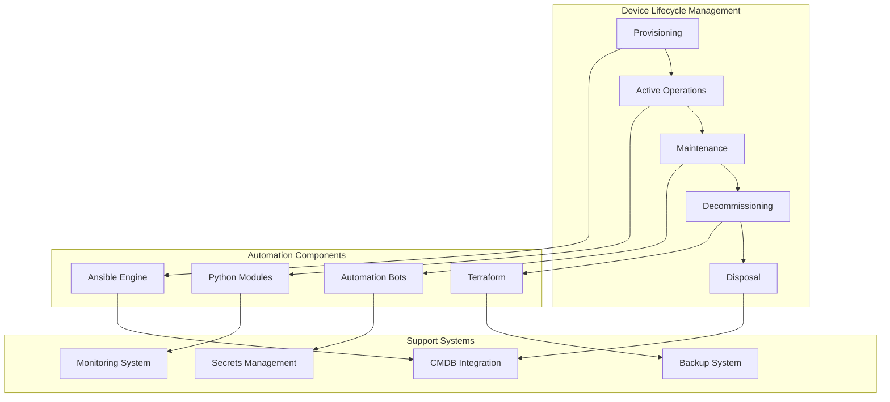
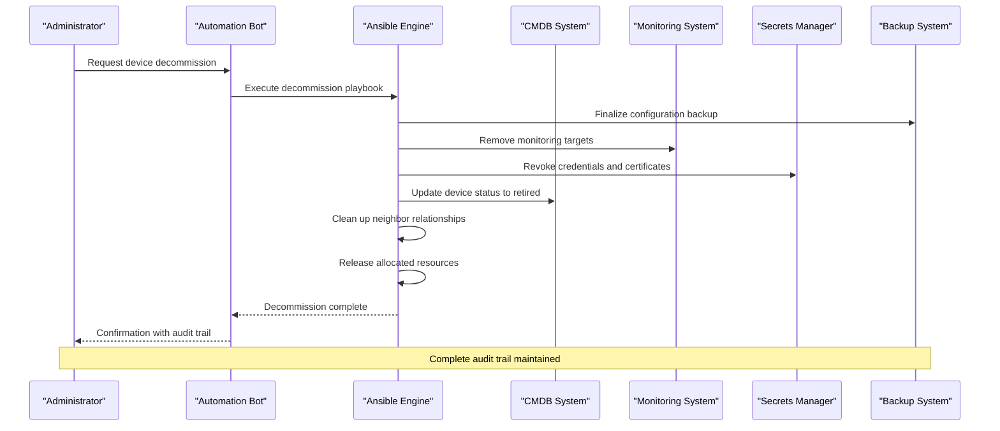
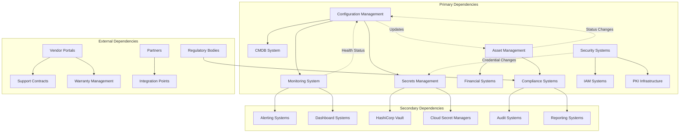

# Device Decommissioning & Retirement

<cite>
**Referenced Files in This Document**
- [README.md](file://README.md)
</cite>

## Table of Contents
1. [Introduction](#introduction)
2. [Project Structure](#project-structure)
3. [Core Components](#core-components)
4. [Architecture Overview](#architecture-overview)
5. [Detailed Component Analysis](#detailed-component-analysis)
6. [Dependency Analysis](#dependency-analysis)
7. [Performance Considerations](#performance-considerations)
8. [Troubleshooting Guide](#troubleshooting-guide)
9. [Conclusion](#conclusion)
10. [Appendices](#appendices)

## Introduction

This document provides comprehensive procedures for device decommissioning and retirement within the Enterprise Network Automation Platform. The platform supports automated lifecycle management for thousands of network devices across multi-vendor, multi-region environments, including routers, switches, firewalls, load balancers, VPN gateways, and cloud networking components.

The decommissioning process encompasses configuration backup finalization, service migration planning, neighbor relationship cleanup, resource release procedures, systematic removal from all systems, secure disposal of credentials and certificates, batch operations, impact analysis, stakeholder notification, asset tracking, warranty management, environmental disposal requirements, audit trail maintenance, and lessons learned documentation.

## Project Structure

The Enterprise Network Automation Platform follows a modular, Git-driven architecture designed for enterprise-scale network automation. The platform structure supports comprehensive device lifecycle management through Ansible playbooks, Python modules, automation bots, and integrated monitoring systems.

**Diagram sources**
- [README.md:34-99](file://README.md#L34-L99)
- [README.md:103-180](file://README.md#L103-L180)

**Section sources**
- [README.md:103-180](file://README.md#L103-L180)

## Core Components

The decommissioning workflow leverages multiple core components of the Enterprise Network Automation Platform:

### Automation Engine Architecture
The platform uses Ansible as the primary automation engine, supported by Python modules, automation bots, and Terraform for infrastructure management. These components work together to execute decommissioning tasks across diverse device types and vendors.

### Inventory Management
Devices are organized by environment, role, region, and vendor in structured inventories. Each inventory entry contains comprehensive device metadata including hostname, IP address, vendor, platform, role, region, and site information.

### Secrets Management
The platform integrates with HashiCorp Vault, AWS Secrets Manager, Azure Key Vault, CyberArk PAM, and Ansible Vault for secure credential management. No secrets are stored in Git, ensuring security throughout the decommissioning process.

### Monitoring and Observability
Comprehensive monitoring through Prometheus, Grafana, OpenTelemetry, and Alertmanager provides visibility into device health, automation metrics, compliance status, and operational performance during decommissioning activities.

**Section sources**
- [README.md:52-99](file://README.md#L52-L99)
- [README.md:284-336](file://README.md#L284-L336)
- [README.md:339-368](file://README.md#L339-L368)
- [README.md:583-616](file://README.md#L583-L616)

## Architecture Overview

The decommissioning architecture integrates multiple systems to ensure complete and auditable device retirement:

**Diagram sources**
- [README.md:460-476](file://README.md#L460-L476)
- [README.md:371-435](file://README.md#L371-L435)

## Detailed Component Analysis

### Configuration Backup Finalization

The decommissioning process begins with comprehensive configuration backup finalization using the platform's backup management system:

#### Backup Strategy
- **Final Snapshot**: Capture current running configuration before any changes
- **Version Control**: Store backups with timestamps and change context
- **Encryption**: Ensure all backups are encrypted at rest and in transit
- **Retention Policy**: Apply appropriate retention periods based on compliance requirements

#### Automated Backup Process
The backup system supports versioned backups with encryption, integrating with the CI/CD pipeline for automated execution and validation.

**Section sources**
- [README.md:421-422](file://README.md#L421-L422)
- [README.md:451-452](file://README.md#L451-L452)
- [README.md:511-512](file://README.md#L511-L512)

### Service Migration Planning

Service migration involves identifying dependencies and ensuring seamless transition of services from decommissioned devices:

#### Dependency Analysis
- **Neighbor Discovery**: Use CDP/LLDP discovery to identify connected devices
- **Traffic Flow Analysis**: Analyze routing protocols and traffic patterns
- **Service Dependencies**: Map application dependencies on network services
- **Impact Assessment**: Evaluate potential service disruptions

#### Migration Execution
- **Gradual Transition**: Implement phased migration to minimize risk
- **Rollback Capability**: Maintain ability to revert if issues occur
- **Validation Testing**: Verify service continuity post-migration

**Section sources**
- [README.md:431-432](file://README.md#L431-L432)

### Neighbor Relationship Cleanup

Systematic cleanup of neighbor relationships ensures network stability during decommissioning:

#### Protocol-Specific Cleanup
- **OSPF**: Graceful area border router transitions
- **BGP**: Proper session teardown and route withdrawal
- **STP/RSTP**: Bridge topology recalculation
- **VRRP/HSRP**: Failover to standby controllers

#### Verification Procedures
- **Topology Validation**: Confirm clean network topology
- **Route Convergence**: Verify routing table stability
- **Connectivity Testing**: Validate end-to-end connectivity

**Section sources**
- [README.md:405-409](file://README.md#L405-L409)
- [README.md:414-416](file://README.md#L414-L416)

### Resource Release Procedures

Comprehensive resource release ensures efficient utilization of network assets:

#### IP Address Management
- **DHCP Pool Release**: Return leased addresses to pools
- **Static Assignment Removal**: Clean up static IP assignments
- **Subnet Utilization**: Update subnet allocation records

#### VLAN and Interface Management
- **Port Shutdown**: Gracefully disable interfaces
- **VLAN Membership**: Remove port from VLAN memberships
- **Trunk Configuration**: Clean up trunk configurations

#### Security Zone Cleanup
- **Firewall Rules**: Remove device-specific firewall rules
- **ACL Entries**: Clean up access control lists
- **Security Policies**: Remove device-based security policies

**Section sources**
- [README.md:390-399](file://README.md#L390-L399)

### Systematic Removal from All Systems

Complete removal from all management systems ensures no orphaned configurations or references remain:

#### CMDB Synchronization
- **Status Update**: Change device status to "retired" or "decommissioned"
- **Asset Records**: Update asset management records
- **Warranty Information**: Archive warranty and support details
- **Cost Allocation**: Transfer costs to appropriate cost centers

#### Monitoring System Cleanup
- **Target Removal**: Remove device from monitoring targets
- **Metric Collection**: Stop metric collection for decommissioned device
- **Alert Rules**: Remove device-specific alert rules
- **Dashboard Updates**: Update dashboards to reflect current inventory

#### Configuration Management Database
- **Configuration Archives**: Move configurations to archive storage
- **Change History**: Preserve complete change history
- **Audit Trail**: Maintain comprehensive audit trail

**Section sources**
- [README.md:443-444](file://README.md#L443-L444)
- [README.md:606-616](file://README.md#L606-L616)

### Secure Disposal of Credentials and Certificates

Secure handling of credentials and certificates is critical for maintaining security posture:

#### Credential Revocation
- **Password Rotation**: Force password rotation for shared credentials
- **API Token Revocation**: Revoke API tokens and service accounts
- **SSH Key Removal**: Remove SSH keys from authorized key stores
- **Certificate Revocation**: Revoke TLS certificates and CA chains

#### Secrets Management Integration
- **Vault Cleanup**: Remove secrets from HashiCorp Vault
- **Cloud Secret Managers**: Clean up AWS Secrets Manager, Azure Key Vault entries
- **Environment Variables**: Remove sensitive environment variables
- **Local Storage**: Securely delete any local secret copies

#### Certificate Lifecycle Management
- **PKI Integration**: Use ACME or Vault PKI for certificate management
- **Auto-Renewal**: Configure auto-renewal for remaining certificates
- **Revocation Lists**: Update CRL and OCSP responses

**Section sources**
- [README.md:339-368](file://README.md#L339-L368)

### Batch Decommissioning Operations

The platform supports batch operations for efficient decommissioning of multiple devices:

#### Batch Processing Framework
- **Parallel Execution**: Execute decommissioning tasks across multiple devices simultaneously
- **Dependency Resolution**: Handle inter-device dependencies automatically
- **Error Handling**: Continue processing other devices when individual failures occur
- **Progress Tracking**: Monitor overall progress and completion status

#### Workflow Orchestration
- **Staged Rollout**: Implement phased decommissioning across regions or sites
- **Approval Gates**: Require manual approval for production decommissioning
- **Notification System**: Send automated notifications to stakeholders
- **Audit Logging**: Maintain comprehensive logs for compliance

**Section sources**
- [README.md:460-476](file://README.md#L460-L476)

### Impact Analysis Procedures

Comprehensive impact analysis ensures safe decommissioning without service disruption:

#### Pre-Decommissioning Analysis
- **Traffic Analysis**: Review historical traffic patterns and peak usage
- **Dependency Mapping**: Identify all dependent services and applications
- **Capacity Planning**: Assess capacity impact on remaining devices
- **Risk Assessment**: Evaluate potential risks and mitigation strategies

#### Post-Decommissioning Validation
- **Service Continuity**: Verify all services remain operational
- **Performance Metrics**: Monitor performance indicators for degradation
- **Error Rates**: Track error rates for anomalies
- **User Experience**: Validate user experience remains acceptable

**Section sources**
- [README.md:606-616](file://README.md#L606-L616)

### Stakeholder Notification Workflows

Automated notification workflows keep all stakeholders informed throughout the decommissioning process:

#### Notification Channels
- **Email Notifications**: Send detailed emails to affected teams
- **ChatOps Integration**: Post updates in Slack/Teams channels
- **Dashboard Updates**: Update project management dashboards
- **Executive Reports**: Generate summary reports for leadership

#### Communication Templates
- **Pre-Notification**: Advance notice of planned decommissioning
- **In-Progress Updates**: Regular status updates during execution
- **Completion Confirmation**: Final confirmation with results
- **Post-Mortem**: Lessons learned and improvement recommendations

**Section sources**
- [README.md:460-476](file://README.md#L460-L476)

### Asset Tracking and Warranty Management

Comprehensive asset tracking ensures proper financial and operational management:

#### Asset Lifecycle Management
- **Asset Registration**: Register devices in asset management systems
- **Location Tracking**: Track physical and logical locations
- **Ownership Attribution**: Assign ownership to departments or projects
- **Cost Center Allocation**: Allocate costs to appropriate budget centers

#### Warranty and Support Management
- **Warranty Tracking**: Monitor warranty expiration dates
- **Support Contracts**: Track support contract renewals
- **Maintenance Schedules**: Schedule preventive maintenance
- **End-of-Life Planning**: Plan for equipment refresh cycles

#### Environmental Compliance
- **E-Waste Regulations**: Comply with electronic waste disposal regulations
- **Data Sanitization**: Ensure complete data destruction
- **Certification Requirements**: Obtain disposal certifications
- **Environmental Impact**: Minimize environmental footprint

**Section sources**
- [README.md:430-431](file://README.md#L430-L431)

### Audit Trail Maintenance

Comprehensive audit trails ensure compliance and accountability:

#### Audit Data Collection
- **Action Logging**: Log all decommissioning actions with timestamps
- **User Attribution**: Attribute actions to specific users or automation
- **Change Documentation**: Document all configuration changes
- **Approval Records**: Maintain approval chain documentation

#### Compliance Reporting
- **Regulatory Compliance**: Generate reports for regulatory requirements
- **Internal Audits**: Provide data for internal audit processes
- **Security Reviews**: Support security assessment activities
- **Operational Reviews**: Enable operational effectiveness reviews

#### Data Retention
- **Retention Policies**: Apply appropriate data retention periods
- **Archive Management**: Manage long-term archival of audit data
- **Access Controls**: Restrict access to sensitive audit information
- **Data Destruction**: Securely destroy audit data after retention period

**Section sources**
- [README.md:548-579](file://README.md#L548-579)

### Lessons Learned Documentation

Continuous improvement through documented lessons learned:

#### Post-Implementation Review
- **Success Metrics**: Measure success against defined criteria
- **Issue Identification**: Document any issues encountered
- **Process Improvements**: Identify opportunities for process enhancement
- **Technology Updates**: Recommend technology or tool improvements

#### Knowledge Base Updates
- **Procedure Updates**: Update standard operating procedures
- **Template Refinements**: Improve templates and automation scripts
- **Training Materials**: Update training materials based on experience
- **Best Practices**: Document best practices discovered during implementation

**Section sources**
- [README.md:701-731](file://README.md#L701-L731)

## Dependency Analysis

The decommissioning process involves complex dependencies between multiple systems and components:

**Diagram sources**
- [README.md:52-99](file://README.md#L52-L99)
- [README.md:339-368](file://README.md#L339-L368)

**Section sources**
- [README.md:52-99](file://README.md#L52-L99)

## Performance Considerations

Optimizing decommissioning performance while maintaining reliability:

### Parallel Processing
- **Concurrent Operations**: Execute independent tasks in parallel where possible
- **Resource Throttling**: Prevent overwhelming target systems with too many concurrent requests
- **Batch Sizing**: Optimize batch sizes for different operation types
- **Retry Logic**: Implement intelligent retry mechanisms for transient failures

### Resource Optimization
- **Connection Pooling**: Reuse connections to reduce overhead
- **Caching Strategies**: Cache frequently accessed data to improve performance
- **Memory Management**: Monitor and optimize memory usage during large-scale operations
- **Network Efficiency**: Minimize network overhead through optimized communication patterns

### Scalability Considerations
- **Horizontal Scaling**: Scale out processing across multiple workers
- **Queue-Based Processing**: Use message queues for distributed task processing
- **Load Balancing**: Distribute workload across available resources
- **Monitoring**: Implement comprehensive performance monitoring and alerting

## Troubleshooting Guide

Common issues and resolution strategies during decommissioning:

### Connection and Authentication Issues
- **Authentication Failures**: Verify credentials and permissions in secrets management
- **Connection Timeouts**: Check network connectivity and firewall rules
- **Permission Errors**: Validate service account permissions and access controls
- **Certificate Issues**: Verify certificate validity and trust chain

### Configuration and State Problems
- **Configuration Conflicts**: Resolve conflicts between decommissioning and active configurations
- **State Inconsistencies**: Reconcile state differences between systems
- **Orphaned Resources**: Identify and clean up orphaned resources
- **Dependency Violations**: Resolve dependency violations preventing decommissioning

### Monitoring and Visibility Issues
- **Missing Metrics**: Verify monitoring agent installation and configuration
- **Alert Storms**: Implement alert suppression during decommissioning
- **Dashboard Gaps**: Update dashboards to reflect current system state
- **Log Aggregation**: Ensure logs are properly collected and indexed

### Recovery and Rollback Procedures
- **Partial Success**: Handle cases where some operations succeed while others fail
- **Rollback Triggers**: Define clear rollback triggers and procedures
- **Data Recovery**: Restore data from backups if needed
- **Service Restoration**: Rapidly restore services if decommissioning causes issues

**Section sources**
- [README.md:674-685](file://README.md#L674-L685)

## Conclusion

The Enterprise Network Automation Platform provides comprehensive capabilities for device decommissioning and retirement through its modular architecture, integrated systems, and automated workflows. The platform's approach ensures secure, auditable, and efficient device lifecycle management while maintaining network stability and compliance.

Key strengths include:
- **Comprehensive Automation**: End-to-end automation of decommissioning workflows
- **Multi-Vendor Support**: Consistent processes across diverse device types and vendors
- **Security Integration**: Deep integration with secrets management and security systems
- **Monitoring and Observability**: Full visibility into decommissioning operations
- **Compliance and Audit**: Built-in compliance checks and comprehensive audit trails
- **Scalability**: Ability to handle large-scale decommissioning operations efficiently

The platform's GitOps approach ensures that all decommissioning procedures are version-controlled, testable, and reproducible, providing confidence in the reliability and consistency of the retirement process.

## Appendices

### A. Decommissioning Checklist

#### Pre-Decommissioning
- [ ] Impact analysis completed and approved
- [ ] Service migration plan finalized
- [ ] Stakeholders notified
- [ ] Backup verification completed
- [ ] Rollback procedures tested

#### During Decommissioning
- [ ] Configuration backup finalized
- [ ] Neighbor relationships cleaned up
- [ ] Services migrated successfully
- [ ] Monitoring targets removed
- [ ] Credentials and certificates revoked
- [ ] CMDB updated
- [ ] Asset records archived

#### Post-Decommissioning
- [ ] System cleanup verified
- [ ] Audit trail complete
- [ ] Lessons learned documented
- [ ] Physical disposal completed
- [ ] Final reporting submitted

### B. Emergency Decommissioning Procedures

For emergency situations requiring immediate device decommissioning:

1. **Immediate Isolation**: Quickly isolate the device from the network
2. **Emergency Backup**: Perform emergency configuration backup
3. **Critical Service Migration**: Migrate only critical services
4. **Credential Revocation**: Immediately revoke all credentials
5. **Incident Documentation**: Document the incident and response
6. **Post-Incident Review**: Conduct thorough post-incident review

### C. Compliance Requirements Matrix

| Regulation | Requirement | Implementation |
|------------|-------------|----------------|
| SOX | Financial data protection | Audit trails, access controls |
| PCI DSS | Payment card data security | Encryption, access logging |
| HIPAA | Healthcare data privacy | Data classification, access controls |
| GDPR | Personal data protection | Data deletion, consent management |
| NIST | Cybersecurity framework | Risk assessment, continuous monitoring |