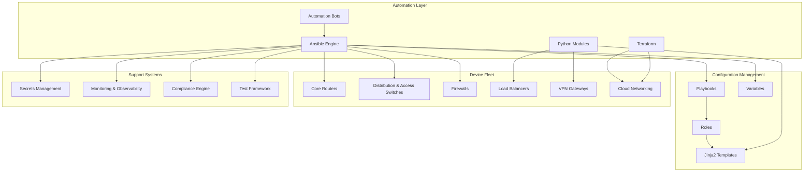
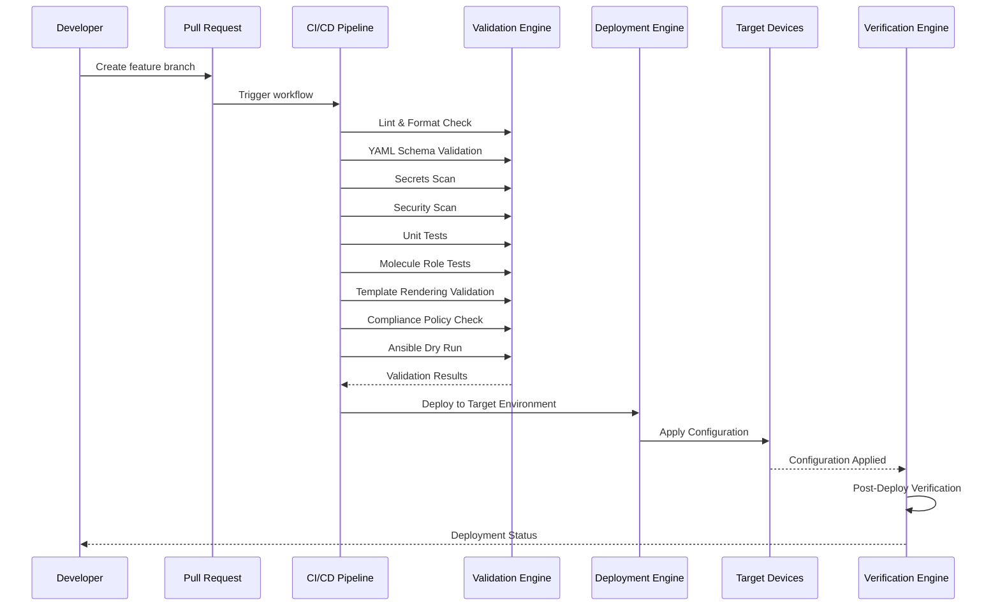
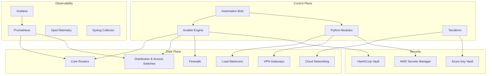
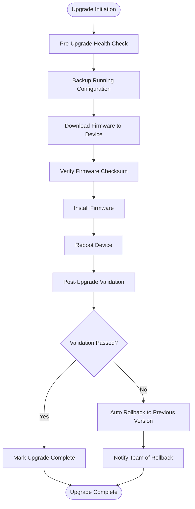
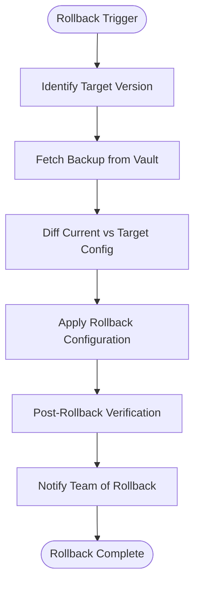
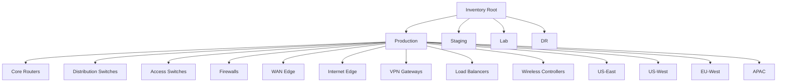
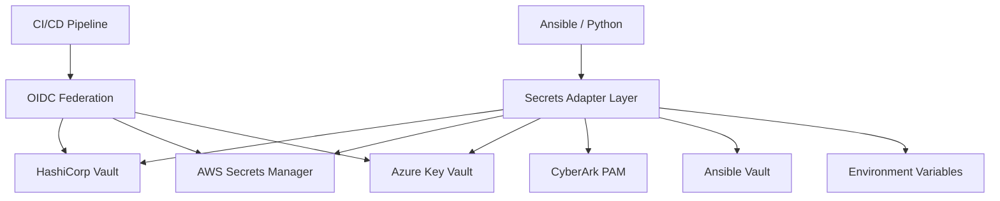
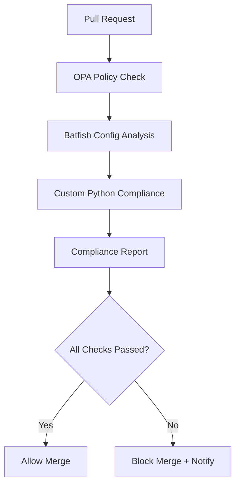
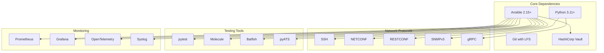

# Device Lifecycle Management

<cite>
**Referenced Files in This Document**
- [README.md](file://README.md)
</cite>

## Table of Contents
1. [Introduction](#introduction)
2. [Project Structure](#project-structure)
3. [Core Components](#core-components)
4. [Architecture Overview](#architecture-overview)
5. [Detailed Component Analysis](#detailed-component-analysis)
6. [Dependency Analysis](#dependency-analysis)
7. [Performance Considerations](#performance-considerations)
8. [Troubleshooting Guide](#troubleshooting-guide)
9. [Conclusion](#conclusion)

## Introduction

This document provides comprehensive guidance for managing the complete device lifecycle within the Enterprise Network Automation Platform. The platform implements Infrastructure as Code principles to automate the entire journey from initial provisioning through decommissioning, supporting thousands of network devices across multi-vendor, multi-region environments.

The system follows GitOps methodology where every configuration, policy, template, test, pipeline, dashboard, and bot is stored in Git with secrets never committed. All changes follow strict version control, automated validation, approval workflows, and deployment processes.

## Project Structure

The platform follows a modular architecture organized by functionality:



**Diagram sources**
- [README.md:36-99](file://README.md#L36-L99)

**Section sources**
- [README.md:103-180](file://README.md#L103-L180)

## Core Components

### Device Lifecycle Playbooks

The platform provides comprehensive playbooks for each stage of device lifecycle management:

#### Initial Provisioning Workflow
- **Bootstrap Process**: Complete device initialization including hostname configuration, AAA setup (TACACS+/RADIUS), NTP/DNS configuration, SSH hardening, certificate deployment, banner management, and SNMP/Syslog configuration
- **First-time Configuration Baselines**: Golden configuration templates and compliance enforcement
- **Onboarding Procedures**: Automated device registration and inventory population

#### Configuration Management
- **Update Procedures**: Version-controlled configuration changes with automated testing
- **Version Control Integration**: Git-based change tracking with branch protection
- **Change Management Workflows**: Approval gates and rollback capabilities

#### Decommissioning Processes
- **Device Retirement**: Safe removal from production environment
- **Asset Cleanup**: Configuration backup, monitoring removal, and inventory cleanup

### Supported Vendors and Platforms

| Vendor | Platform | Protocol | Status |
|---|---|---|---|
| Cisco | IOS, IOS-XE, NX-OS | SSH, NETCONF, RESTCONF | Supported |
| Juniper | SRX, MX | SSH, NETCONF | Supported |
| Arista | EOS | SSH, eAPI, NETCONF | Supported |
| Palo Alto | PAN-OS | SSH, API | Supported |
| Fortinet | FortiOS | SSH, API | Supported |
| Check Point | Gaia | SSH, API | Supported |
| F5 | BIG-IP | SSH, iControl REST | Supported |
| pfSense | FreeBSD-based | SSH, API | Supported |
| OPNsense | FreeBSD-based | SSH, API | Supported |

**Section sources**
- [README.md:203-227](file://README.md#L203-L227)

## Architecture Overview

The platform implements a comprehensive automation architecture with multiple layers:



**Diagram sources**
- [README.md:483-501](file://README.md#L483-L501)

### Automation Engine Architecture



**Diagram sources**
- [README.md:54-99](file://README.md#L54-L99)

## Detailed Component Analysis

### Bootstrap Process and Initial Provisioning

The bootstrap process encompasses all critical first-time configuration tasks:

#### Hostname Configuration
- Automated hostname assignment from inventory data
- Consistent naming conventions across environments
- DNS integration for proper resolution

#### AAA Setup (TACACS+/RADIUS)
- Centralized authentication configuration
- Multi-factor authentication support
- Role-based access control implementation

#### NTP/DNS Configuration
- Time synchronization with redundant servers
- DNS resolver configuration for name resolution
- Timezone and locale settings

#### SSH Hardening
- Secure cipher suite enforcement
- Key-based authentication only
- Connection timeout and rate limiting

#### Certificate Deployment
- TLS certificate management
- Automated renewal processes
- Certificate validation and rotation

#### Banner Management
- Legal disclaimer banners
- Maintenance window notifications
- Contact information display

#### SNMP/Syslog Configuration
- SNMPv3 security enforcement
- Syslog destination configuration
- Log forwarding and retention policies

**Section sources**
- [README.md:373-386](file://README.md#L373-L386)

### Configuration Update Procedures

#### Version Control Integration
- Git-based configuration management
- Branch protection rules
- Signed commits requirement
- Change history tracking

#### Change Management Workflows
- Pull request-based changes
- Automated validation and testing
- Peer review requirements
- Approval gates for production

#### Rollback Capabilities
- Automatic rollback on failure
- Manual rollback procedures
- Configuration version comparison
- Impact assessment tools

**Section sources**
- [README.md:619-638](file://README.md#L619-L638)

### Firmware Upgrade and Rollback Workflows



**Diagram sources**
- [README.md:646-658](file://README.md#L646-L658)

### Configuration Rollback Process



**Diagram sources**
- [README.md:662-670](file://README.md#L662-L670)

### Inventory Design and Organization

Devices are organized by environment, role, region, and vendor:



**Diagram sources**
- [README.md:288-309](file://README.md#L288-L309)

### Secrets Architecture

The platform implements a comprehensive secrets management strategy:



**Diagram sources**
- [README.md:343-357](file://README.md#L343-L357)

### Compliance Strategy

Compliance is enforced at every stage from pull request to production runtime:

#### Compliance Checks
- SSH-only enforcement (no Telnet)
- NTP configuration requirements
- AAA enablement (TACACS+ or RADIUS)
- SNMPv3 enforcement (no SNMPv1/v2c)
- Logging enablement (Syslog required)
- Approved cipher suites
- Approved firmware versions
- Password policy enforcement
- ACL standards compliance
- Firewall rule validation

#### Compliance Flow



**Diagram sources**
- [README.md:570-579](file://README.md#L570-L579)

## Dependency Analysis

The platform has well-defined dependencies between components:



**Diagram sources**
- [README.md:184-199](file://README.md#L184-L199)

**Section sources**
- [README.md:184-199](file://README.md#L184-L199)

## Performance Considerations

The platform is designed for enterprise-scale operations with performance optimization in mind:

### Scalability Features
- Parallel execution capabilities
- Connection pooling and reuse
- Caching mechanisms for frequently accessed data
- Asynchronous processing for long-running tasks

### Resource Optimization
- Efficient template rendering
- Minimal memory footprint
- Optimized network connections
- Batch processing for large device fleets

### Monitoring and Metrics
- Comprehensive observability stack
- Performance metrics collection
- Bottleneck identification
- Capacity planning insights

## Troubleshooting Guide

### Common Issues and Resolutions

| Issue | Resolution |
|---|---|
| Ansible connection timeout | Verify SSH reachability using ping module against target devices |
| Template rendering error | Debug Jinja2 syntax using config generation module with debug flag |
| Compliance check failure | Review compliance policies and examine device running configuration differences |
| CI pipeline failure | Check GitHub Actions logs; failures typically include actionable error messages |
| Vault authentication failure | Verify OIDC token or AppRole credentials; check Vault policies and permissions |
| Molecule test failure | Ensure Docker/Podman is running; check molecule configuration files |
| Batfish analysis error | Validate Batfish snapshots in the designated test directory |

### Diagnostic Commands

```bash
# Test device connectivity
ansible all -m ping -i inventories/lab/hosts.yml

# Generate configuration with debugging
python -m python.config_gen --debug --device <device-name>

# Run compliance checks locally
python -m python.compliance --inventory inventories/lab/hosts.yml

# Execute unit tests
pytest tests/unit/ -v

# Run specific playbook in dry-run mode
ansible-playbook playbooks/compliance_scan.yml -i inventories/lab/hosts.yml --check --diff
```

**Section sources**
- [README.md:674-685](file://README.md#L674-L685)

## Conclusion

The Enterprise Network Automation Platform provides a comprehensive solution for device lifecycle management, implementing best practices from Fortune 100 enterprises. The platform's modular architecture, strict compliance enforcement, and GitOps methodology ensure reliable, secure, and scalable network automation across diverse vendor ecosystems.

Key strengths include:
- Complete lifecycle coverage from provisioning to decommissioning
- Multi-vendor support with consistent automation interfaces
- Robust security and compliance framework
- Comprehensive testing and validation strategies
- Enterprise-grade observability and monitoring
- Automated rollback and recovery capabilities

The platform successfully demonstrates how modern network automation can transform traditional manual processes into efficient, repeatable, and auditable workflows suitable for large-scale enterprise environments.