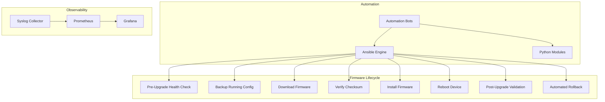
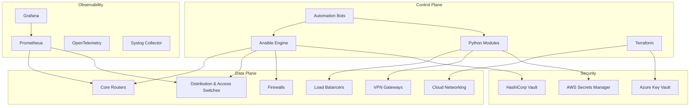
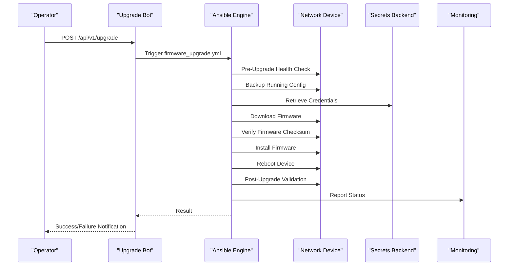
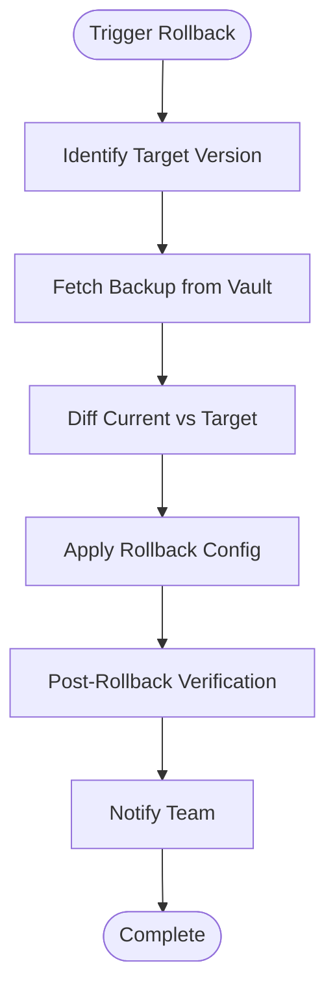
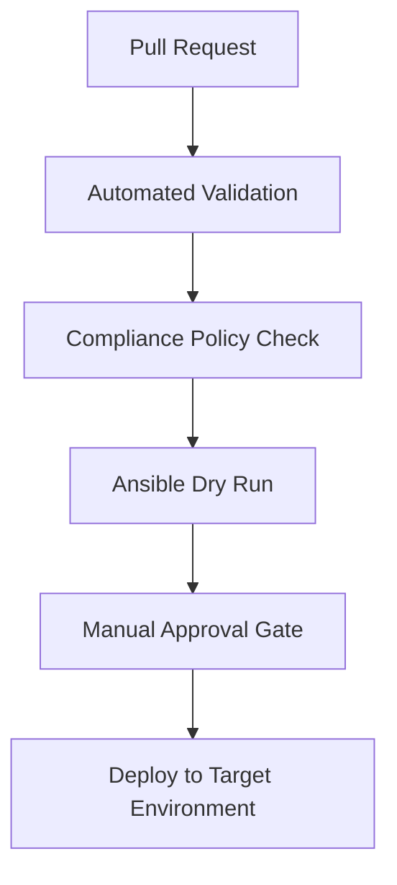
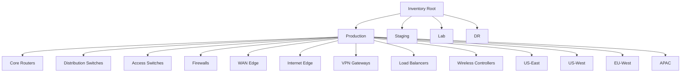
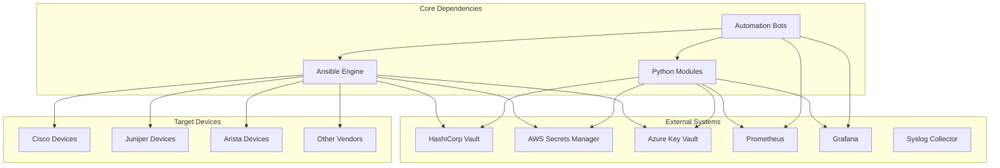

# Firmware & Software Management

<cite>
**Referenced Files in This Document**
- [README.md](file://README.md)
</cite>

## Table of Contents
1. [Introduction](#introduction)
2. [Project Structure](#project-structure)
3. [Core Components](#core-components)
4. [Architecture Overview](#architecture-overview)
5. [Detailed Component Analysis](#detailed-component-analysis)
6. [Dependency Analysis](#dependency-analysis)
7. [Performance Considerations](#performance-considerations)
8. [Troubleshooting Guide](#troubleshooting-guide)
9. [Conclusion](#conclusion)
10. [Appendices](#appendices)

## Introduction
This document describes the firmware and software lifecycle management approach for network devices as implemented by the Enterprise Network Automation Platform. It covers end-to-end workflows including pre-upgrade health checks, backup procedures, firmware download and verification, installation processes, post-upgrade validation, automated rollback mechanisms, approval processes, vendor support matrices, compatibility testing strategies, mass upgrade orchestration, upgrade windows, monitoring, troubleshooting, emergency recovery, change management coordination, and integration with vendor repositories.

The platform is GitOps-driven, multi-vendor, and integrates automation engines (Ansible, Python), bots, CI/CD pipelines, secrets management, compliance enforcement, and observability to ensure safe, repeatable, and auditable firmware operations at scale.

## Project Structure
The repository provides a comprehensive blueprint for enterprise-grade network automation. The firmware and software lifecycle is orchestrated through playbooks, roles, Python modules, automation bots, CI/CD workflows, and monitoring dashboards. Key areas include:

- Playbooks for device lifecycle and operations, including firmware upgrade and rollback
- Python modules for backup, validation, telemetry, and utilities
- Automation bots exposing APIs for self-service operations such as upgrades and rollbacks
- CI/CD workflows that validate changes and trigger deployments
- Monitoring dashboards tracking firmware versions and upgrade progress



**Diagram sources**
- [README.md:36-50](file://README.md#L36-L50)
- [README.md:54-99](file://README.md#L54-L99)
- [README.md:646-670](file://README.md#L646-L670)

**Section sources**
- [README.md:103-180](file://README.md#L103-L180)
- [README.md:438-456](file://README.md#L438-L456)
- [README.md:460-476](file://README.md#L460-L476)
- [README.md:479-514](file://README.md#L479-L514)
- [README.md:583-616](file://README.md#L583-L616)

## Core Components
- Firmware Upgrade Playbook: Orchestrates full firmware upgrade workflow with pre/post checks and rollback on failure.
- Firmware Rollback Playbook: Restores last known good configuration or firmware state when upgrades fail.
- Configuration Rollback Playbook: Applies rollback to the last known good configuration baseline.
- Backup Bot: Triggers and schedules device backups; supports versioning and encryption.
- Upgrade Bot: Exposes API endpoints to orchestrate firmware upgrades with rollback capabilities.
- Rollback Bot: Provides one-click rollback to last known good configuration via API and ChatOps.
- CI/CD Workflows: Include a manual dispatch workflow for orchestrated firmware upgrades.
- Monitoring Dashboards: Track firmware versions across fleet and upgrade progress.

Operational playbooks include:
- `firmware_upgrade.yml`: Upgrade device firmware with pre/post checks
- `firmware_rollback.yml`: Rollback firmware on failure
- `config_rollback.yml`: Rollback configuration to last known good
- `backup.yml` / `restore.yml`: Backup and restore configurations

**Section sources**
- [README.md:421-434](file://README.md#L421-L434)
- [README.md:468-476](file://README.md#L468-L476)
- [README.md:510-513](file://README.md#L510-L513)
- [README.md:612-616](file://README.md#L612-L616)

## Architecture Overview
The firmware and software lifecycle integrates multiple layers:

- Control Plane: Ansible engine orchestrates device operations; Python modules provide reusable logic; automation bots expose APIs and ChatOps integrations.
- Data Plane: Multi-vendor devices (routers, switches, firewalls, load balancers, VPN gateways, cloud networking components).
- Observability: Prometheus, Grafana, OpenTelemetry, and Syslog collectors monitor device health and upgrade progress.
- Security: Secrets backends (Vault, AWS Secrets Manager, Azure Key Vault) secure credentials used during firmware operations.



**Diagram sources**
- [README.md:54-99](file://README.md#L54-L99)

## Detailed Component Analysis

### Firmware Upgrade Workflow
End-to-end process for upgrading firmware on network devices:



Key steps:
- Pre-upgrade health check ensures device readiness
- Backup running configuration prior to changes
- Secure credential retrieval from secrets backend
- Firmware download and checksum verification
- Installation and controlled reboot
- Post-upgrade validation against expected state
- Automated rollback if validation fails

**Diagram sources**
- [README.md:646-658](file://README.md#L646-L658)
- [README.md:468-476](file://README.md#L468-L476)
- [README.md:339-368](file://README.md#L339-L368)

**Section sources**
- [README.md:421-434](file://README.md#L421-L434)
- [README.md:646-658](file://README.md#L646-L658)

### Automated Rollback Mechanisms
When upgrades fail, the system performs automated rollback to restore stability:



Rollback types:
- Firmware rollback: Restore previous firmware image
- Configuration rollback: Apply last known good configuration baseline

**Diagram sources**
- [README.md:662-670](file://README.md#L662-L670)

**Section sources**
- [README.md:424-426](file://README.md#L424-L426)
- [README.md:662-670](file://README.md#L662-L670)

### Firmware Approval Processes
Change control and approval workflows integrate with GitOps practices:

- Pull requests trigger automated validation, security scanning, and compliance checks
- Manual approval gates required before production deployment
- Change advisory board (CAB) involvement for high-risk changes
- Audit trails maintained through Git history and CI/CD logs

Approval flow:


**Diagram sources**
- [README.md:483-501](file://README.md#L483-L501)
- [README.md:619-638](file://README.md#L619-L638)

**Section sources**
- [README.md:479-514](file://README.md#L479-L514)
- [README.md:619-638](file://README.md#L619-L638)

### Vendor Support Matrices
Multi-vendor support includes both on-premises and cloud platforms:

On-Premises / Data Center:
- Cisco (IOS, IOS-XE, NX-OS) via SSH, NETCONF, RESTCONF
- Juniper (SRX, MX) via SSH, NETCONF
- Arista (EOS) via SSH, eAPI, NETCONF
- Palo Alto (PAN-OS) via SSH, API
- Fortinet (FortiOS) via SSH, API
- Check Point (Gaia) via SSH, API
- F5 (BIG-IP) via SSH, iControl REST
- pfSense/OPNsense via SSH, API

Cloud Networking:
- AWS VPC, Subnets, Route Tables, Security Groups, Transit Gateway
- Azure VNets, NSGs, ExpressRoute, Application Gateway
- GCP VPC, Firewall Rules, Cloud Router, Cloud NAT

**Section sources**
- [README.md:203-226](file://README.md#L203-L226)

### Compatibility Testing Strategies
Comprehensive testing ensures firmware compatibility and safety:

- Unit tests for Python modules and Jinja2 filters
- Schema validation for inventory and configuration data
- Molecule role tests for individual automation components
- Network simulation using Batfish for ACL, routing, and firewall rule analysis
- Integration tests using pyATS and NAPALM for device connectivity and config parsing
- Golden config tests to detect drift from approved baselines
- Regression tests to prevent unintended configuration changes
- Performance tests for API and bot endpoint load testing

Testing execution:
```bash
pytest tests/ -v --tb=short
pytest tests/unit/ -v
pytest tests/compliance/ -v
cd roles/cisco_ios_baseline && molecule test
```

**Section sources**
- [README.md:517-544](file://README.md#L517-L544)

### Mass Firmware Upgrade Orchestration
Scale firmware upgrades across device fleets using:

- Inventory organization by environment, role, region, and vendor
- Ansible playbooks targeting specific device groups
- Staggered rollout strategies to minimize impact
- Real-time monitoring and alerting during upgrades
- Automated rollback triggers based on health metrics

Inventory design supports hierarchical grouping:


**Diagram sources**
- [README.md:288-309](file://README.md#L288-L309)

**Section sources**
- [README.md:284-335](file://README.md#L284-L335)

### Managing Upgrade Windows
Coordinate maintenance windows through:

- Scheduled CI/CD workflows for automated upgrades
- Manual dispatch triggers for urgent changes
- Integration with change management systems
- Real-time status reporting and notifications
- Automated rollback if predefined thresholds are exceeded

**Section sources**
- [README.md:505-514](file://README.md#L505-L514)

### Monitoring Upgrade Progress
Track firmware operations through comprehensive observability:

- Prometheus metrics collection from devices and automation systems
- Grafana dashboards for real-time visibility
- OpenTelemetry for distributed tracing
- Syslog collection for device event correlation
- Alertmanager integration for critical notifications

Dashboard coverage includes:
- Network Health: Device up/down, CPU, memory, interface status
- Automation Metrics: Job success/failure rates, execution time, drift count
- Compliance Overview: Policy violations by severity, trend over time
- Upgrade Tracker: Firmware versions across fleet, upgrade progress
- API Performance: Bot endpoint latency, error rates, throughput
- Inventory Drift: Detected drift between Git and running config

**Section sources**
- [README.md:583-616](file://README.md#L583-L616)

### Troubleshooting Failed Upgrades
Common issues and resolutions:

| Issue | Resolution |
|---|---|
| Ansible connection timeout | Verify SSH reachability: `ansible all -m ping -i inventories/lab/hosts.yml` |
| Template rendering error | Check Jinja2 syntax: `python -m python.config_gen --debug --device <name>` |
| Compliance check failure | Review `compliance/` policies and device running config diff |
| CI pipeline failure | Check GitHub Actions logs; most failures include actionable error messages |
| Vault authentication failure | Verify OIDC token or AppRole credentials; check Vault policies |
| Molecule test failure | Ensure Docker/Podman is running; check `molecule/default/molecule.yml` |
| Batfish analysis error | Validate Batfish snapshot in `tests/batfish/snapshots/` |

**Section sources**
- [README.md:674-685](file://README.md#L674-L685)

### Emergency Recovery Procedures
In case of catastrophic failures:

- Automated rollback to last known good configuration
- One-click rollback via Rollback Bot API
- Configuration restoration from encrypted backups stored in Vault
- Device re-provisioning from golden configuration baseline
- Escalation procedures with team notifications

**Section sources**
- [README.md:424-426](file://README.md#L424-L426)
- [README.md:468-476](file://README.md#L468-L476)

### Coordination with Change Management Processes
Integration with organizational change management:

- Git pull request workflow enforces peer review and approval
- Change advisory board (CAB) involvement for production changes
- Audit trails maintained through Git history and CI/CD logs
- Automated compliance checks ensure policy adherence
- Real-time status reporting to stakeholders

**Section sources**
- [README.md:619-638](file://README.md#L619-L638)

### Integration with Vendor Repositories
While not explicitly detailed in the repository structure, the platform's architecture supports integration patterns:

- Python modules can be extended to query vendor repositories for firmware availability
- CI/CD workflows can be configured to automatically check for new firmware versions
- Secret management secures repository access credentials
- Automated testing validates firmware compatibility before deployment

**Section sources**
- [README.md:438-456](file://README.md#L438-L456)
- [README.md:339-368](file://README.md#L339-L368)

## Dependency Analysis
The firmware and software management system has clear dependency relationships:



**Diagram sources**
- [README.md:54-99](file://README.md#L54-L99)
- [README.md:339-368](file://README.md#L339-L368)

**Section sources**
- [README.md:54-99](file://README.md#L54-L99)
- [README.md:339-368](file://README.md#L339-L368)

## Performance Considerations
Optimize firmware operations for large-scale deployments:

- Use parallel execution in Ansible playbooks for concurrent device updates
- Implement staggered rollout strategies to avoid network congestion
- Leverage caching mechanisms for firmware downloads
- Monitor resource utilization during bulk operations
- Configure appropriate timeouts and retry logic for resilient operations
- Utilize incremental updates where supported by vendors

## Troubleshooting Guide
Systematic approach to diagnosing and resolving firmware issues:

1. **Health Assessment**: Run pre-upgrade health checks to identify potential issues
2. **Log Analysis**: Review Ansible logs, device syslog, and monitoring alerts
3. **Configuration Comparison**: Use diff tools to compare current vs. target configurations
4. **Connectivity Verification**: Ensure network paths and credentials are valid
5. **Rollback Execution**: Execute automated rollback procedures when necessary
6. **Escalation**: Follow established escalation procedures for complex issues

**Section sources**
- [README.md:674-685](file://README.md#L674-L685)

## Conclusion
The Enterprise Network Automation Platform provides a comprehensive framework for firmware and software lifecycle management across diverse network environments. Through GitOps practices, automated testing, robust monitoring, and integrated security controls, the platform enables safe, scalable, and auditable firmware operations at enterprise scale. The modular architecture supports multi-vendor environments while maintaining consistency and reliability through standardized processes and automated safeguards.

## Appendices

### Quick Reference Commands
```bash
# Run firmware upgrade playbook
ansible-playbook playbooks/firmware_upgrade.yml -i inventories/production/hosts.yml

# Trigger configuration backup
ansible-playbook playbooks/backup.yml -i inventories/production/hosts.yml

# Execute configuration rollback
ansible-playbook playbooks/config_rollback.yml -i inventories/production/hosts.yml

# Run unit tests
pytest tests/unit/ -v

# Validate environment setup
python scripts/validate_environment.py
```

**Section sources**
- [README.md:264-280](file://README.md#L264-L280)