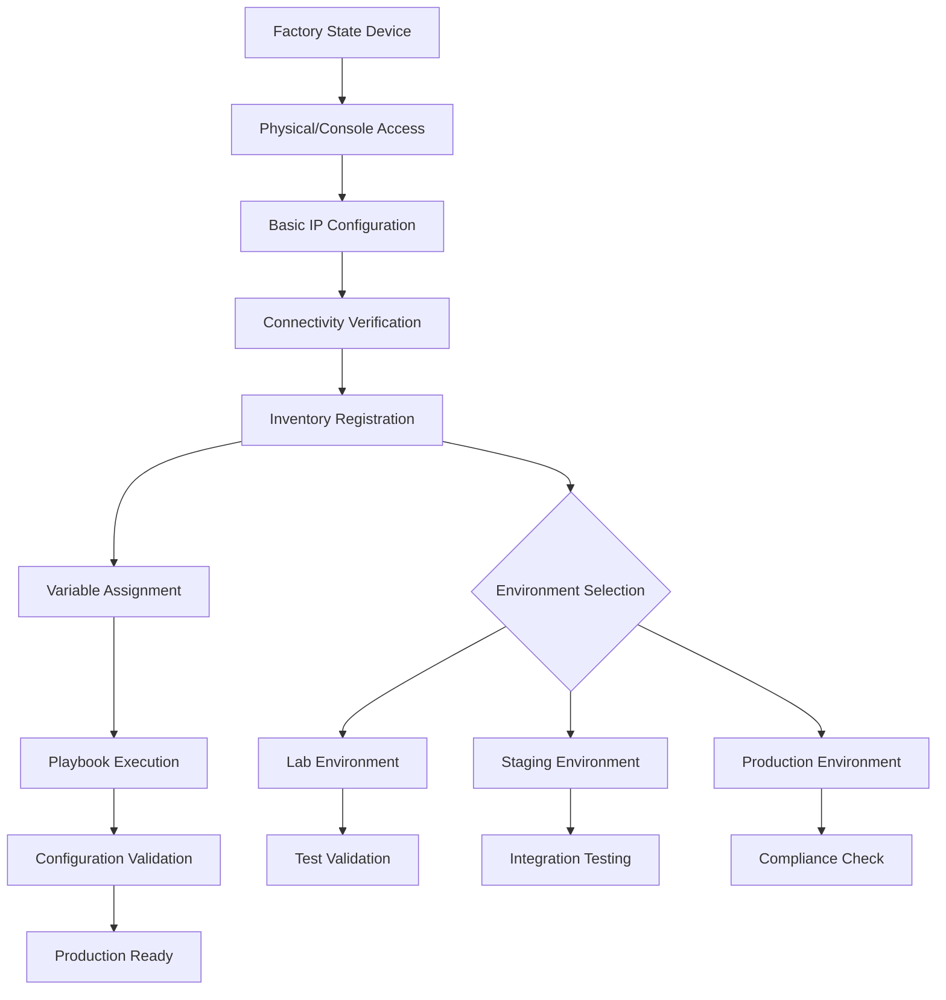
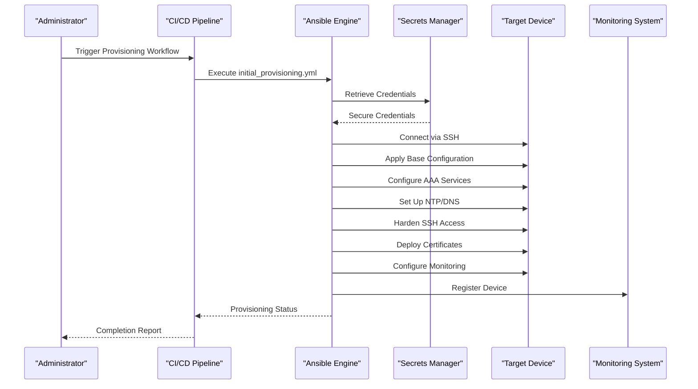
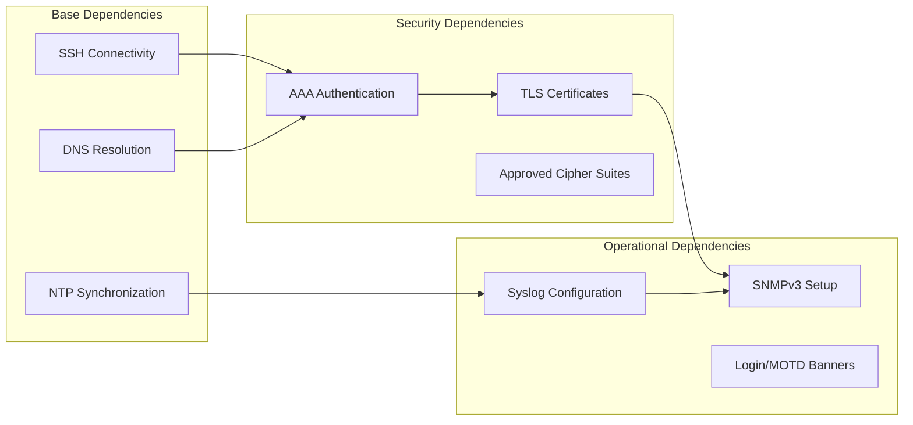
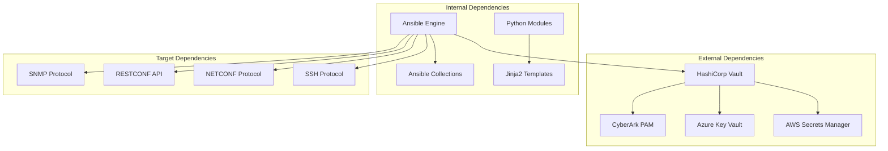

# Initial Provisioning & Bootstrap

<cite>
**Referenced Files in This Document**
- [README.md](file://README.md)
</cite>

## Table of Contents
1. [Introduction](#introduction)
2. [Project Structure](#project-structure)
3. [Core Components](#core-components)
4. [Architecture Overview](#architecture-overview)
5. [Detailed Component Analysis](#detailed-component-analysis)
6. [Dependency Analysis](#dependency-analysis)
7. [Performance Considerations](#performance-considerations)
8. [Troubleshooting Guide](#troubleshooting-guide)
9. [Security Considerations](#security-considerations)
10. [Conclusion](#conclusion)

## Introduction

This document provides comprehensive guidance for the initial device provisioning and bootstrap process within the Enterprise Network Automation Platform. The platform implements a production-grade, vendor-agnostic approach to network automation, designed to manage thousands of network devices across multi-vendor, multi-region environments using Infrastructure as Code principles.

The initial provisioning workflow encompasses the complete first-time configuration of network devices from factory state, including hostname assignment, AAA setup (TACACS+/RADIUS), NTP/DNS configuration, SSH hardening with cipher standards, certificate deployment, banner management, SNMPv3 configuration, and Syslog setup. This process ensures that devices are securely configured and integrated into the automated management infrastructure.

## Project Structure

The platform follows a modular architecture with clear separation of concerns:

```mermaid
graph TB
subgraph "Automation Layer"
Playbooks[Ansible Playbooks]
Roles[Reusable Roles]
Templates[Jinja2 Templates]
end
subgraph "Data Layer"
Inventories[Device Inventories]
GroupVars[Group Variables]
HostVars[Host Variables]
end
subgraph "Execution Layer"
AnsibleEngine[Ansible Engine]
PythonModules[Python Modules]
Collections[Ansible Collections]
end
subgraph "Target Devices"
Routers[Routers]
Switches[Switches]
Firewalls[Firewalls]
OtherDevices[Other Network Devices]
end
Playbooks --> Roles
Playbooks --> Templates
Playbooks --> Inventories
Roles --> Templates
AnsibleEngine --> Playbooks
PythonModules --> AnsibleEngine
AnsibleEngine --> Target Devices
```

**Diagram sources**
- [README.md:103-180](file://README.md#L103-L180)

The repository structure supports multiple environments (production, staging, lab, DR) with device organization by environment, role, region, and vendor. Each inventory entry defines critical device attributes including connectivity information, vendor specifications, platform details, and operational context.

**Section sources**
- [README.md:103-180](file://README.md#L103-L180)
- [README.md:284-336](file://README.md#L284-L336)

## Core Components

### Initial Provisioning Playbook

The `initial_provisioning.yml` playbook serves as the primary orchestration point for device bootstrap operations. It coordinates the execution of multiple specialized playbooks to ensure comprehensive device configuration:

| Component | Purpose | Execution Order |
|-----------|---------|-----------------|
| Hostname Configuration | Sets device hostname from inventory data | 1st |
| AAA Setup | Configures TACACS+/RADIUS authentication | 2nd |
| NTP Configuration | Establishes time synchronization servers | 3rd |
| DNS Configuration | Sets up domain name resolution | 4th |
| SSH Hardening | Applies security best practices for SSH access | 5th |
| Certificate Deployment | Installs TLS certificates for secure communications | 6th |
| Banner Management | Configures login and MOTD banners | 7th |
| SNMPv3 Configuration | Enables secure monitoring capabilities | 8th |
| Syslog Setup | Configures centralized logging destinations | 9th |

### Device Inventory Registration

Device registration follows a structured approach where each device is defined with comprehensive metadata:



**Diagram sources**
- [README.md:284-336](file://README.md#L284-L336)

**Section sources**
- [README.md:371-386](file://README.md#L371-L386)
- [README.md:284-336](file://README.md#L284-L336)

## Architecture Overview

The initial provisioning architecture follows a layered approach with clear separation between control plane and data plane operations:



**Diagram sources**
- [README.md:371-386](file://README.md#L371-L386)
- [README.md:339-368](file://README.md#L339-L368)

The architecture integrates with multiple secrets backends including HashiCorp Vault, AWS Secrets Manager, Azure Key Vault, and CyberArk PAM through a unified adapter layer. This ensures secure credential management throughout the provisioning process.

**Section sources**
- [README.md:339-368](file://README.md#L339-L368)
- [README.md:371-386](file://README.md#L371-L386)

## Detailed Component Analysis

### Initial Provisioning Workflow

The initial provisioning process follows a systematic sequence to ensure reliable device onboarding:

#### Prerequisite Checks

Before executing the provisioning playbook, several prerequisite checks must be satisfied:

1. **Network Connectivity**: Verify SSH reachability to target devices
2. **Credential Availability**: Ensure proper credentials are available in secrets manager
3. **Inventory Validation**: Confirm device entries exist in appropriate inventory files
4. **Template Rendering**: Validate Jinja2 templates render correctly for target platform
5. **Compliance Pre-check**: Run preliminary compliance scans against current device state

#### Dependency Resolution

The provisioning system resolves dependencies through a hierarchical approach:



**Diagram sources**
- [README.md:371-386](file://README.md#L371-L386)

#### Step-by-Step Execution Flow

The provisioning process executes in the following order:

1. **Hostname Assignment**: Sets unique device identifier from inventory data
2. **AAA Configuration**: Establishes centralized authentication via TACACS+ or RADIUS
3. **Time Synchronization**: Configures NTP servers for accurate timestamping
4. **DNS Resolution**: Sets up domain name services for service discovery
5. **SSH Hardening**: Applies security policies including approved cipher suites
6. **Certificate Management**: Deploys TLS certificates for encrypted communications
7. **Banner Configuration**: Sets legal and informational login banners
8. **SNMPv3 Setup**: Enables secure network monitoring capabilities
9. **Syslog Configuration**: Establishes centralized log collection

**Section sources**
- [README.md:371-386](file://README.md#L371-L386)

### Device Onboarding Procedures

#### From Factory State

The complete device onboarding process from factory state involves:

1. **Physical Access**: Console access for initial IP configuration
2. **Basic Connectivity**: Configure management interface IP address
3. **SSH Enablement**: Enable SSH access with basic authentication
4. **Inventory Registration**: Add device to appropriate environment inventory
5. **Variable Assignment**: Configure device-specific variables in host_vars
6. **Automated Provisioning**: Execute initial provisioning playbook
7. **Validation**: Verify all configurations applied successfully
8. **Integration**: Integrate with monitoring and management systems

#### Inventory Registration Process

Device registration requires comprehensive metadata definition:

| Field | Description | Example |
|-------|-------------|---------|
| ansible_host | Management IP address | 10.0.1.1 |
| vendor | Device manufacturer | cisco |
| platform | Operating system/platform | ios-xe |
| role | Device function | core_router |
| region | Geographic location | us-east |
| site | Physical location identifier | dc1 |

**Section sources**
- [README.md:284-336](file://README.md#L284-L336)

### Baseline Configuration Application

The baseline configuration ensures consistent security and operational posture across all devices:

#### Security Baseline Requirements

| Policy | Requirement | Severity |
|--------|-------------|----------|
| SSH Only | No Telnet configuration allowed | Critical |
| AAA Enabled | TACACS+ or RADIUS required | Critical |
| SNMPv3 | No SNMPv1/v2c allowed | High |
| Approved Ciphers | Only approved cipher suites in SSH/TLS | High |
| Password Policy | Minimum length, complexity, rotation | Critical |

#### Operational Baseline Requirements

| Service | Requirement | Priority |
|---------|-------------|----------|
| NTP | All devices must have NTP configured | High |
| Syslog | Centralized logging must be enabled | Medium |
| DNS | Domain name resolution must be functional | Medium |
| Monitoring | SNMPv3 monitoring must be active | High |

**Section sources**
- [README.md:552-566](file://README.md#L552-L566)

## Dependency Analysis

The initial provisioning system has well-defined dependency relationships:



**Diagram sources**
- [README.md:339-368](file://README.md#L339-L368)
- [README.md:184-200](file://README.md#L184-L200)

### Component Coupling and Cohesion

The system demonstrates high cohesion within components and loose coupling between modules:

- **High Cohesion**: Each playbook focuses on specific configuration domains
- **Loose Coupling**: Playbooks can execute independently when needed
- **Reusability**: Roles and templates are shared across multiple playbooks
- **Extensibility**: New vendors and platforms can be added through template expansion

### External Dependencies and Integration Points

The provisioning system integrates with multiple external systems:

| Integration Point | Purpose | Failure Impact |
|-------------------|---------|----------------|
| Secrets Managers | Credential retrieval | Authentication failures |
| NTP Servers | Time synchronization | Log timestamp accuracy |
| DNS Servers | Name resolution | Service discovery issues |
| AAA Servers | Authentication | Access control failures |
| Syslog Collectors | Log aggregation | Audit trail gaps |
| Monitoring Systems | Health monitoring | Visibility loss |

**Section sources**
- [README.md:339-368](file://README.md#L339-L368)
- [README.md:184-200](file://README.md#L184-L200)

## Performance Considerations

### Optimization Strategies

The initial provisioning process incorporates several performance optimization strategies:

1. **Parallel Execution**: Multiple device configurations execute concurrently where possible
2. **Connection Reuse**: SSH connections are reused across related tasks
3. **Template Caching**: Rendered templates are cached to avoid repeated processing
4. **Incremental Updates**: Only changed configurations are applied to devices
5. **Retry Logic**: Transient failures trigger automatic retry with exponential backoff

### Scalability Characteristics

The platform scales horizontally through:

- **Ansible Worker Scaling**: Multiple controller nodes can execute playbooks simultaneously
- **Device Grouping**: Related devices are grouped for efficient batch operations
- **Resource Pooling**: Shared resources like secrets managers reduce overhead
- **Asynchronous Processing**: Long-running operations use background processing

### Resource Utilization

Optimal resource utilization requires:

- **Memory Management**: Adequate memory allocation for large device inventories
- **CPU Allocation**: Sufficient CPU resources for parallel task execution
- **Network Bandwidth**: Adequate bandwidth for concurrent device communications
- **Storage Capacity**: Sufficient storage for logs, backups, and audit trails

## Troubleshooting Guide

### Common Connectivity Issues

| Issue | Symptoms | Resolution Steps |
|-------|----------|------------------|
| SSH Connection Timeout | Ansible connection timeout errors | Verify SSH reachability: `ansible all -m ping -i inventories/lab/hosts.yml` |
| Authentication Failures | Invalid credentials or permission denied | Check secrets manager integration and credential permissions |
| Template Rendering Errors | Jinja2 syntax errors during execution | Debug template rendering: `python -m python.config_gen --debug --device <name>` |
| Compliance Check Failures | Policy violations detected | Review compliance policies and device running config diff |
| Vault Authentication Failure | Cannot retrieve secrets | Verify OIDC token or AppRole credentials; check Vault policies |

### Bootstrap-Specific Troubleshooting

#### Factory State Issues

1. **No Management Interface**: Ensure basic IP configuration is applied before automation
2. **Default Credentials**: Change default passwords immediately after initial access
3. **License Requirements**: Verify device licenses support required features
4. **Firmware Compatibility**: Confirm firmware version supports automation protocols

#### Inventory Registration Problems

1. **Incorrect Host Information**: Validate ansible_host values match actual device IPs
2. **Vendor/Platform Mismatch**: Ensure vendor and platform values match device specifications
3. **Missing Variables**: Verify all required variables are defined in host_vars
4. **Syntax Errors**: Validate YAML syntax in inventory files

#### Configuration Application Failures

1. **Permission Denied**: Check user privileges on target devices
2. **Feature Not Supported**: Verify device supports requested configuration features
3. **Conflicting Configurations**: Resolve conflicts with existing device configurations
4. **Resource Constraints**: Ensure device has sufficient resources for new configurations

**Section sources**
- [README.md:674-685](file://README.md#L674-L685)

## Security Considerations

### Initial Access Security

During the initial provisioning process, several security considerations must be addressed:

#### Credential Management

- **Zero Trust Principle**: Treat all initial access as untrusted until verified
- **Least Privilege**: Use minimum required privileges for automation accounts
- **Credential Rotation**: Implement regular credential rotation policies
- **Secure Storage**: Store all credentials in approved secrets managers

#### Network Security

- **Management VLAN**: Isolate device management traffic to dedicated VLANs
- **Access Control Lists**: Restrict management access to authorized networks only
- **Encryption**: Ensure all management communications use encrypted protocols
- **Audit Logging**: Enable comprehensive audit logging for all administrative actions

#### Configuration Security

- **Hardened Defaults**: Apply security-hardened baseline configurations
- **Service Minimization**: Disable unnecessary services and protocols
- **Certificate Management**: Implement proper certificate lifecycle management
- **Compliance Enforcement**: Continuously enforce security compliance policies

### Secret Rotation Policy

| Secret Type | Rotation Interval | Method |
|-------------|-------------------|---------|
| Device passwords | 90 days | Vault auto-rotation + Ansible push |
| API tokens | 30 days | Secrets Manager + Lambda/Function |
| SSH keys | 90 days | Vault SSH CA with short-lived certs |
| TLS certificates | 1 year (auto-renew at 60 days) | ACME / Vault PKI |
| CI/CD tokens | Ephemeral | OIDC federation (no static secrets) |

**Section sources**
- [README.md:359-368](file://README.md#L359-L368)

## Conclusion

The initial device provisioning and bootstrap process within the Enterprise Network Automation Platform provides a comprehensive, secure, and scalable approach to device onboarding. By leveraging Infrastructure as Code principles, automated compliance enforcement, and robust security measures, the platform ensures consistent and reliable device configuration across diverse environments.

Key benefits of this approach include:

- **Consistency**: Standardized configuration across all devices regardless of vendor or platform
- **Security**: Built-in security controls and compliance enforcement throughout the provisioning process
- **Scalability**: Ability to provision thousands of devices efficiently through parallel execution
- **Auditability**: Complete audit trail of all configuration changes and provisioning activities
- **Maintainability**: Centralized configuration management with version control and rollback capabilities

The platform's modular architecture allows for easy extension to support new vendors, platforms, and security requirements while maintaining backward compatibility and operational stability. Through continuous compliance monitoring and automated remediation, the system ensures ongoing adherence to organizational security policies and operational standards.