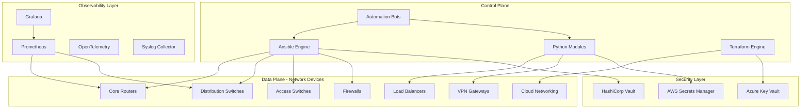
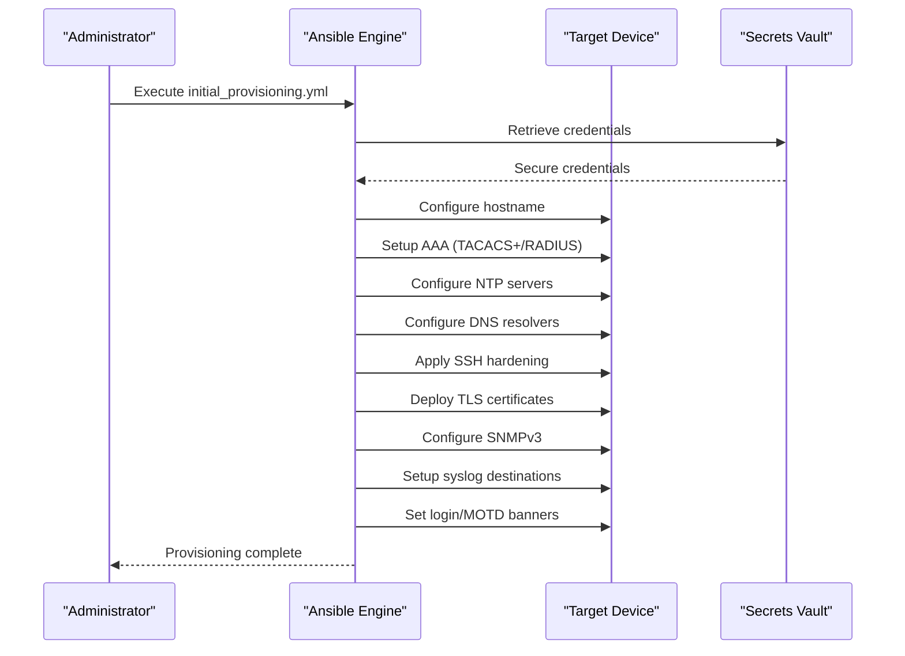
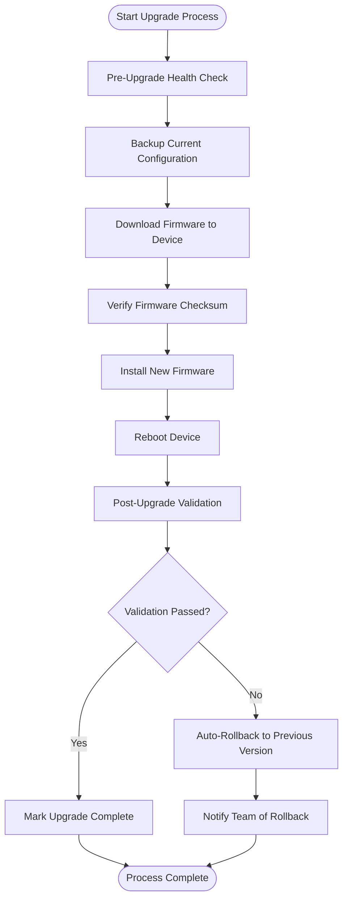
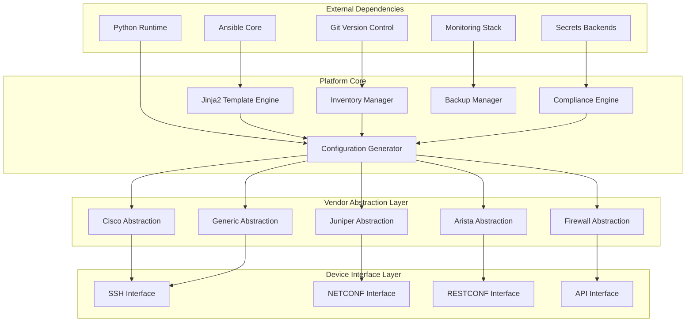

# Device Management

<cite>
**Referenced Files in This Document**
- [README.md](file://README.md)
</cite>

## Table of Contents
1. [Introduction](#introduction)
2. [Project Structure](#project-structure)
3. [Core Components](#core-components)
4. [Architecture Overview](#architecture-overview)
5. [Detailed Component Analysis](#detailed-component-analysis)
6. [Dependency Analysis](#dependency-analysis)
7. [Performance Considerations](#performance-considerations)
8. [Troubleshooting Guide](#troubleshooting-guide)
9. [Conclusion](#conclusion)

## Introduction

The Enterprise Network Automation Platform is a production-grade, vendor-agnostic network automation solution designed to manage thousands of network devices across multi-vendor, multi-region environments. This platform demonstrates Infrastructure as Code, GitOps, CI/CD, compliance enforcement, observability, and security — built for enterprise scale. Every configuration, policy, template, test, pipeline, dashboard, and bot is stored in Git, with secrets never committed. Everything is code.

The platform supports comprehensive device lifecycle management from initial provisioning through decommissioning, covering all major networking vendors including Cisco (IOS, IOS-XE, NX-OS), Juniper (SRX, MX), Arista (EOS), Palo Alto, Fortinet, Check Point, F5, pfSense, and OPNsense. It provides automated network service deployment for Layer 2 services (VLANs, trunks, LACP), Layer 3 protocols (OSPF, BGP, IS-IS, static routes), security services (ACLs, NAT, VPN, firewall rules), and performance optimization (QoS).

## Project Structure

The platform follows a modular architecture organized by functionality:

```mermaid
graph TB
subgraph "Core Infrastructure"
Inventories[Inventories]
GroupVars[Group Variables]
HostVars[Host Variables]
Playbooks[Ansible Playbooks]
Roles[Reusable Roles]
end
subgraph "Templates & Configuration"
Templates[Jinja2 Templates]
Collections[Ansible Collections]
Schemas[JSON/YAML Schemas]
end
subgraph "Automation Engine"
PythonModules[Python Modules]
Bots[Automation Bots]
ConfigGen[Configuration Generator]
end
subgraph "Operations & Testing"
Tests[Test Suites]
Compliance[Compliance Policies]
Pipelines[CI/CD Pipelines]
Monitoring[Monitoring Configs]
end
subgraph "Cloud Integration"
Terraform[Terraform IaC]
Packer[Packer Images]
end
Inventories --> Playbooks
GroupVars --> Playbooks
HostVars --> Playbooks
Templates --> Playbooks
Collections --> Playbooks
PythonModules --> Bots
ConfigGen --> Playbooks
Tests --> Playbooks
Compliance --> Playbooks
Pipelines --> Playbooks
Monitoring --> Playbooks
Terraform --> Cloud
Packer --> Cloud
```

**Diagram sources**
- [README.md:103-180](file://README.md#L103-L180)

**Section sources**
- [README.md:103-180](file://README.md#L103-L180)

## Core Components

### Supported Vendors and Platforms

The platform provides comprehensive support for major networking vendors with their respective platforms and communication protocols:

| Vendor | Platform | Protocol Support | Status |
|--------|----------|------------------|---------|
| **Cisco** | IOS, IOS-XE, NX-OS | SSH, NETCONF, RESTCONF | ✅ Supported |
| **Juniper** | SRX, MX | SSH, NETCONF | ✅ Supported |
| **Arista** | EOS | SSH, eAPI, NETCONF | ✅ Supported |
| **Palo Alto** | PAN-OS | SSH, API | ✅ Supported |
| **Fortinet** | FortiOS | SSH, API | ✅ Supported |
| **Check Point** | Gaia | SSH, API | ✅ Supported |
| **F5** | BIG-IP | SSH, iControl REST | ✅ Supported |
| **pfSense** | FreeBSD-based | SSH, API | ✅ Supported |
| **OPNsense** | FreeBSD-based | SSH, API | ✅ Supported |

### Technology Stack

The platform leverages modern automation technologies:

| Layer | Technologies |
|-------|-------------|
| **Automation Engine** | Ansible, Python 3.11+, NAPALM, Netmiko, Nornir |
| **Infrastructure as Code** | Terraform, Packer, Ansible |
| **Protocols** | NETCONF, RESTCONF, SSH, SNMPv3, gRPC, Telemetry Streaming |
| **Templates** | Jinja2, YAML structured data |
| **CI/CD** | GitHub Actions, pre-commit hooks |
| **Testing** | pytest, Molecule, ansible-lint, yamllint, Batfish, pyATS |
| **Compliance** | Custom Python checks, OPA, Batfish ACL analysis |
| **Monitoring** | Prometheus, Grafana, OpenTelemetry, Alertmanager, Syslog |
| **Secrets** | HashiCorp Vault, AWS Secrets Manager, Azure Key Vault, CyberArk, Ansible Vault |

**Section sources**
- [README.md:184-200](file://README.md#L184-L200)
- [README.md:203-217](file://README.md#L203-L217)

## Architecture Overview

The platform implements a comprehensive automation engine architecture that separates control plane operations from data plane interactions:

**Diagram sources**
- [README.md:54-99](file://README.md#L54-L99)

## Detailed Component Analysis

### Device Lifecycle Management

The platform provides comprehensive device lifecycle management through dedicated playbooks and automation workflows:

#### Initial Provisioning Workflow

**Diagram sources**
- [README.md:371-386](file://README.md#L371-L386)

#### Device Lifecycle Playbooks

| Playbook | Purpose | Command Example |
|----------|---------|-----------------|
| `initial_provisioning.yml` | Bootstrap new device with baseline configuration | `ansible-playbook playbooks/initial_provisioning.yml -i inventories/lab/hosts.yml` |
| `hostname.yml` | Set device hostname from inventory variables | `ansible-playbook playbooks/hostname.yml -l <device>` |
| `aaa.yml` | Configure authentication, authorization, and accounting | `ansible-playbook playbooks/aaa.yml` |
| `ntp.yml` | Configure Network Time Protocol servers | `ansible-playbook playbooks/ntp.yml` |
| `dns.yml` | Configure DNS resolver settings | `ansible-playbook playbooks/dns.yml` |
| `snmp.yml` | Configure SNMPv3 monitoring | `ansible-playbook playbooks/snmp.yml` |
| `syslog.yml` | Configure centralized logging | `ansible-playbook playbooks/syslog.yml` |
| `ssh_hardening.yml` | Apply SSH security hardening | `ansible-playbook playbooks/ssh_hardening.yml` |
| `certificates.yml` | Deploy TLS certificates | `ansible-playbook playbooks/certificates.yml` |
| `banners.yml` | Configure login and MOTD banners | `ansible-playbook playbooks/banners.yml` |

**Section sources**
- [README.md:371-386](file://README.md#L371-L386)

### Network Service Automation

#### Layer 2 Services

The platform automates Layer 2 network services including VLAN management, trunk configuration, and link aggregation:

| Service | Playbook | Description |
|---------|----------|-------------|
| **VLAN Management** | `vlan.yml` | Create and modify VLANs across multiple devices |
| **Trunk Configuration** | `trunk.yml` | Configure trunk interfaces for inter-switch connectivity |
| **Link Aggregation** | `lacp.yml` | Configure LACP and port channels for bandwidth aggregation |
| **Quality of Service** | `qos.yml` | Apply QoS policies for traffic prioritization |

#### Layer 3 Routing Protocols

Comprehensive routing protocol automation for enterprise networks:

| Protocol | Playbook | Capabilities |
|----------|----------|--------------|
| **OSPF** | `ospf.yml` | Configure OSPF areas, neighbors, and route policies |
| **BGP** | `bgp.yml` | Configure BGP peering, route maps, and policies |
| **IS-IS** | `isis.yml` | Configure IS-IS routing domains and levels |
| **Static Routes** | `static_routes.yml` | Manage static routing configurations |
| **Loopback Interfaces** | `loopbacks.yml` | Configure loopback interfaces for management and routing |

#### Security Services

Advanced security automation for comprehensive network protection:

| Security Service | Playbook | Features |
|------------------|----------|----------|
| **Access Control Lists** | `acl.yml` | Manage ACLs with validation and compliance checking |
| **Network Address Translation** | `nat.yml` | Configure NAT rules for address translation |
| **Virtual Private Networks** | `vpn.yml` | Site-to-site and remote-access VPN configuration |
| **Firewall Rules** | `firewall_rules.yml` | Deploy and manage firewall rule sets |

#### High Availability

Redundancy and failover automation:

| HA Protocol | Playbook | Purpose |
|-------------|----------|---------|
| **VRRP** | `vrrp.yml` | Virtual Router Redundancy Protocol configuration |
| **HSRP** | `hsrp.yml` | Hot Standby Router Protocol configuration |

**Section sources**
- [README.md:388-416](file://README.md#L388-L416)

### Operational Procedures

#### Backup and Recovery

Automated backup and recovery procedures ensure business continuity:

| Operation | Playbook | Description |
|-----------|----------|-------------|
| **Configuration Backup** | `backup.yml` | Automated backup of running configurations |
| **Configuration Restore** | `restore.yml` | Restore configurations from backups |
| **Golden Configuration** | `golden_config.yml` | Apply approved baseline configurations |
| **Drift Detection** | `drift_detection.yml` | Detect configuration changes from baseline |

#### Firmware Management

Safe firmware upgrade and rollback procedures:

**Diagram sources**
- [README.md:646-658](file://README.md#L646-L658)

| Firmware Operation | Playbook | Features |
|--------------------|----------|----------|
| **Firmware Upgrade** | `firmware_upgrade.yml` | Automated upgrade with pre/post health checks |
| **Firmware Rollback** | `firmware_rollback.yml` | Automatic rollback on upgrade failure |
| **Configuration Rollback** | `config_rollback.yml` | Rollback to last known good configuration |

#### Health Monitoring and Compliance

Comprehensive operational monitoring and compliance enforcement:

| Operation | Playbook | Purpose |
|-----------|----------|---------|
| **Health Checks** | `health_check.yml` | Full device health assessment |
| **Inventory Collection** | `inventory_collection.yml` | Collect device inventory data |
| **Neighbor Discovery** | `neighbor_discovery.yml` | Discover CDP/LLDP neighbors |
| **License Validation** | `license_validation.yml` | Validate license compliance |
| **Monitoring Agents** | `monitoring_agents.yml` | Deploy and configure monitoring agents |
| **Compliance Scans** | `compliance_scan.yml` | Run comprehensive compliance checks |

**Section sources**
- [README.md:418-434](file://README.md#L418-L434)
- [README.md:642-670](file://README.md#L642-L670)

### Python Automation Modules

The platform includes reusable, typed, and documented Python modules under the `python/` directory:

| Module | Purpose | Key Features |
|--------|---------|--------------|
| **inventory/** | Inventory parsing, device enrichment, CMDB integration | Multi-source inventory management |
| **netconf/** | NETCONF client with capability negotiation | YANG model support |
| **restconf/** | RESTCONF client with YANG model support | RESTful API abstraction |
| **ssh/** | SSH abstraction over Netmiko/Paramiko with retry | Connection pooling and error handling |
| **snmp/** | SNMPv3 polling and trap handling | Secure SNMP operations |
| **telemetry/** | Model-driven telemetry receiver and parser | Real-time data collection |
| **config_gen/** | Jinja2-based configuration generation from structured data | Template rendering engine |
| **validation/** | Pre-deployment config validation (syntax + semantics) | Configuration testing |
| **backup/** | Backup management with versioning and encryption | Secure backup storage |
| **compliance/** | Compliance engine with pluggable rule sets | Policy enforcement |
| **utils/** | Logging, retry, concurrency, diff, bulk operations | Common utilities |

All modules follow PEP 8 standards, use type hints, include docstrings, and have corresponding unit tests.

**Section sources**
- [README.md:438-456](file://README.md#L438-L456)

### Automation Bots

The platform provides self-service automation through REST APIs and ChatOps integrations:

| Bot | API Endpoint | ChatOps Integration | Purpose |
|-----|--------------|-------------------|---------|
| **Firewall Bot** | `/api/v1/firewall/rules` | Slack/Teams | Request, validate, and deploy firewall rules |
| **VLAN Bot** | `/api/v1/vlan` | Slack | Provision VLANs with approval workflow |
| **Port Bot** | `/api/v1/port` | Slack | Enable/disable/configure switch ports |
| **Backup Bot** | `/api/v1/backup` | GitHub | Trigger and schedule device backups |
| **Health Bot** | `/api/v1/health` | Slack/Teams | On-demand health checks across all devices |
| **Compliance Bot** | `/api/v1/compliance` | GitHub | Run compliance scans and report violations |
| **Upgrade Bot** | `/api/v1/upgrade` | Slack | Orchestrate firmware upgrades with rollback |
| **Rollback Bot** | `/api/v1/rollback` | Slack/Teams | One-click rollback to last known good config |
| **ChatOps Bot** | `/api/v1/chatops` | Slack/Teams | Unified command router for all bot operations |
| **Approval Bot** | `/api/v1/approvals` | Slack/Teams | Manage approval workflows for change requests |

**Section sources**
- [README.md:460-476](file://README.md#L460-L476)

## Dependency Analysis

The platform implements a well-structured dependency hierarchy with clear separation of concerns:

**Diagram sources**
- [README.md:103-180](file://README.md#L103-L180)
- [README.md:184-200](file://README.md#L184-L200)

**Section sources**
- [README.md:103-180](file://README.md#L103-L180)
- [README.md:184-200](file://README.md#L184-L200)

## Performance Considerations

The platform is designed for enterprise-scale operations with several performance optimizations:

### Concurrency and Parallelism
- **Parallel Execution**: Ansible playbooks execute tasks concurrently across device groups
- **Connection Pooling**: SSH and API connections are pooled to reduce overhead
- **Batch Operations**: Bulk configuration updates minimize API calls and connection establishment

### Resource Optimization
- **Lazy Loading**: Python modules load only required components
- **Caching**: Configuration templates and device data are cached where appropriate
- **Memory Management**: Stream processing for large configuration files

### Scalability Features
- **Horizontal Scaling**: Multiple automation workers can run simultaneously
- **Queue-Based Processing**: Long-running operations use message queues
- **Asynchronous Operations**: Non-blocking operations for improved throughput

## Troubleshooting Guide

Common issues and their resolutions:

| Issue | Resolution |
|-------|------------|
| **Ansible connection timeout** | Verify SSH reachability: `ansible all -m ping -i inventories/lab/hosts.yml` |
| **Template rendering error** | Check Jinja2 syntax: `python -m python.config_gen --debug --device <name>` |
| **Compliance check failure** | Review `compliance/` policies and device running config diff |
| **CI pipeline failure** | Check GitHub Actions logs; most failures include actionable error messages |
| **Vault authentication failure** | Verify OIDC token or AppRole credentials; check Vault policies |
| **Molecule test failure** | Ensure Docker/Podman is running; check `molecule/default/molecule.yml` |
| **Batfish analysis error** | Validate Batfish snapshot in `tests/batfish/snapshots/` |

### Debugging Tools

| Tool | Purpose | Usage |
|------|---------|-------|
| **Ansible Debug** | Detailed playbook execution logs | `ansible-playbook -vvv playbook.yml` |
| **Python Debug Mode** | Configuration generation debugging | `python -m python.config_gen --debug` |
| **Compliance Reports** | Detailed compliance violation reports | Generated automatically during scans |
| **Backup Diff** | Configuration change visualization | Compare current vs. target configurations |

**Section sources**
- [README.md:674-685](file://README.md#L674-L685)

## Conclusion

The Enterprise Network Automation Platform provides comprehensive device management capabilities for enterprise networks. With support for nine major vendors, extensive protocol coverage, and automated lifecycle management, it enables organizations to achieve consistent, compliant, and scalable network operations. The platform's modular architecture, robust testing framework, and comprehensive monitoring ensure reliability and maintainability at scale.

Key strengths include:
- **Multi-Vendor Support**: Comprehensive coverage of major networking vendors
- **Protocol Flexibility**: Support for SSH, NETCONF, RESTCONF, and vendor-specific APIs
- **Complete Lifecycle Management**: From initial provisioning to decommissioning
- **Automated Compliance**: Continuous compliance enforcement throughout the deployment pipeline
- **Operational Excellence**: Advanced backup, recovery, and rollback capabilities
- **Self-Service Automation**: REST APIs and ChatOps for streamlined operations

The platform represents a mature approach to network automation that balances flexibility with standardization, enabling enterprises to automate complex network operations while maintaining security and compliance requirements.