# High Availability Configuration

<cite>
**Referenced Files in This Document**
- [README.md](file://README.md)
</cite>

## Table of Contents
1. [Introduction](#introduction)
2. [Project Structure](#project-structure)
3. [Core Components](#core-components)
4. [Architecture Overview](#architecture-overview)
5. [Detailed Component Analysis](#detailed-component-analysis)
6. [Dependency Analysis](#dependency-analysis)
7. [Performance Considerations](#performance-considerations)
8. [Troubleshooting Guide](#troubleshooting-guide)
9. [Conclusion](#conclusion)
10. [Appendices](#appendices)

## Introduction

This document provides comprehensive guidance for implementing high availability (HA) configuration automation using Virtual Router Redundancy Protocol (VRRP) and Hot Standby Router Protocol (HSRP). The enterprise network automation platform described in this repository offers a production-grade solution for managing thousands of network devices across multi-vendor environments with automated HA configuration deployment.

The platform supports vendor-agnostic automation through Ansible playbooks, Jinja2 templates, and structured data management, enabling consistent HA implementation across Cisco, Juniper, and Arista platforms while maintaining compliance and security standards.

## Project Structure

The network automation platform follows a modular architecture designed for enterprise-scale deployments:

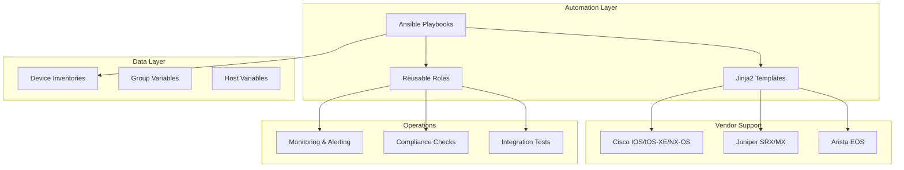

**Diagram sources**
- [README.md:103-180](file://README.md#L103-L180)

**Section sources**
- [README.md:103-180](file://README.md#L103-L180)

## Core Components

### High Availability Playbooks

The platform includes dedicated playbooks for VRRP and HSRP configuration automation:

| Playbook | Purpose | Target Devices |
|----------|---------|----------------|
| `vrrp.yml` | Configure VRRP virtual router redundancy | Core routers, distribution switches |
| `hsrp.yml` | Configure HSRP active/standby failover | Edge routers, firewall pairs |

### Multi-Vendor Template Architecture

The automation engine uses vendor-specific Jinja2 templates to generate platform-appropriate configurations:

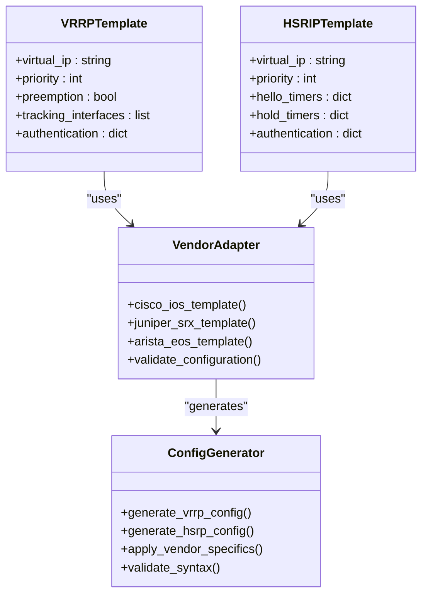

**Diagram sources**
- [README.md:116-128](file://README.md#L116-L128)

**Section sources**
- [README.md:411-416](file://README.md#L411-L416)
- [README.md:116-128](file://README.md#L116-L128)

## Architecture Overview

The high availability automation system follows a GitOps-driven approach with comprehensive validation and testing:

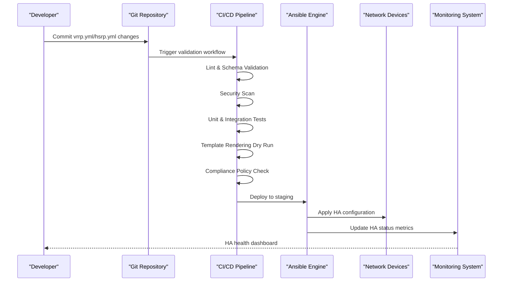

**Diagram sources**
- [README.md:479-501](file://README.md#L479-L501)

## Detailed Component Analysis

### VRRP Configuration Automation

#### Virtual IP Address Assignment

The VRRP automation manages virtual IP address allocation across redundant router pairs:

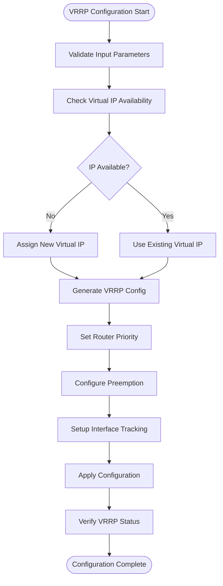

**Diagram sources**
- [README.md:411-416](file://README.md#L411-L416)

#### Priority Configuration and Preemption Settings

The automation handles priority-based master election and preemption behavior:

| Parameter | Description | Default Value | Range |
|-----------|-------------|---------------|-------|
| Priority | Master router election priority | 100 | 1-254 |
| Preemption | Automatic takeover when higher priority available | Enabled | true/false |
| Preemption Delay | Delay before preemption takes effect | 0 seconds | 0-3600 |
| Advertisement Interval | VRRP message frequency | 1 second | 1-4095 |

#### Tracking Mechanisms

Interface tracking enables automatic priority adjustment based on interface status:

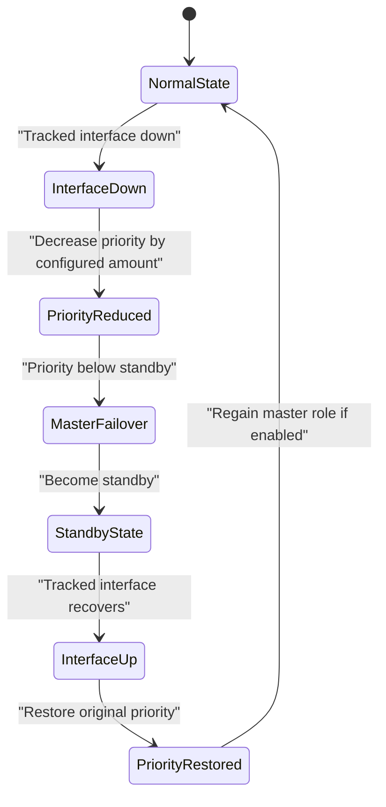

**Diagram sources**
- [README.md:411-416](file://README.md#L411-L416)

### HSRP Configuration Automation

#### Active/Standby Role Management

HSRP automation manages active and standby router roles with configurable priorities:

| Role | Function | Priority Range |
|------|----------|----------------|
| Active | Handles all traffic for virtual IP | 0-255 (default: 100) |
| Standby | Monitors active router, ready to take over | 0-255 (default: lower than active) |
| Listen | Passive monitoring of HSRP messages | Any value |

#### Timer Configuration

HSRP timing parameters control convergence behavior:

| Timer Type | Description | Default | Tunable Range |
|------------|-------------|---------|---------------|
| Hello Time | Frequency of hello messages | 3 seconds | 1-255 |
| Hold Time | Time before declaring neighbor down | 10 seconds | 1-255 |
| Wait Time | Time before becoming active after standby | 20 seconds | 1-255 |

#### Authentication Methods

The automation supports multiple authentication schemes:

| Method | Security Level | Configuration Complexity |
|--------|----------------|--------------------------|
| None | No authentication | Low |
| Clear Text | Basic password protection | Medium |
| MD5 | Cryptographic authentication | High |

### Multi-Layer Redundancy Design Patterns

#### Link Aggregation with Device Redundancy

The platform implements combined link aggregation and device redundancy patterns:

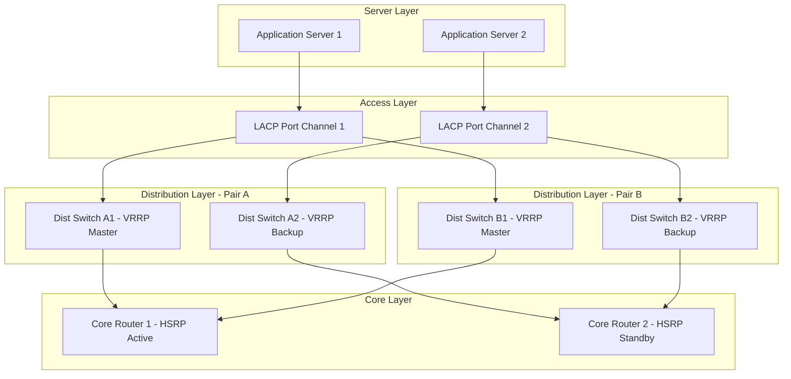

**Diagram sources**
- [README.md:103-180](file://README.md#L103-L180)

#### Path Diversity Implementation

Multi-path routing ensures optimal traffic distribution and redundancy:

| Path Type | Protocol | Load Balancing | Failover |
|-----------|----------|----------------|----------|
| Equal-Cost Multipath (ECMP) | OSPF/BGP | Hash-based | Automatic |
| Unequal-Cost Load Balancing | EIGRP | Weight-based | Manual intervention |
| Policy-Based Routing | PBR | Application-aware | Conditional |

### Practical Examples Using Playbooks

#### VRRP Playbook Structure

The `vrrp.yml` playbook automates VRRP configuration across multiple vendors:

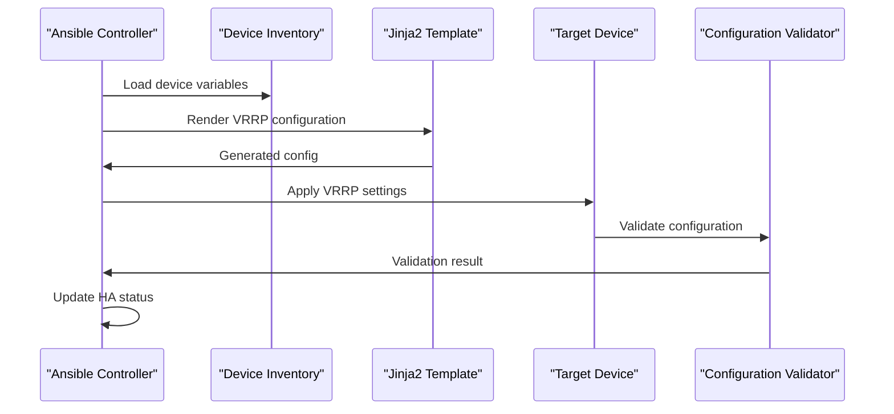

**Diagram sources**
- [README.md:411-416](file://README.md#L411-L416)

#### HSRP Playbook Structure

The `hsrp.yml` playbook manages HSRP active/standby relationships:

| Task | Description | Vendor Support |
|------|-------------|----------------|
| Configure HSRP Group | Create HSRP group with virtual IP | Cisco, Juniper, Arista |
| Set Priority | Configure router priority for role selection | All supported vendors |
| Enable Preemption | Allow automatic role takeover | All supported vendors |
| Configure Timers | Set hello and hold timer values | All supported vendors |
| Enable Authentication | Configure HSRP authentication method | All supported vendors |
| Verify Status | Check HSRP state and neighbor status | All supported vendors |

### Health Check Integration

#### Automated Health Monitoring

The platform integrates comprehensive health checks for HA components:

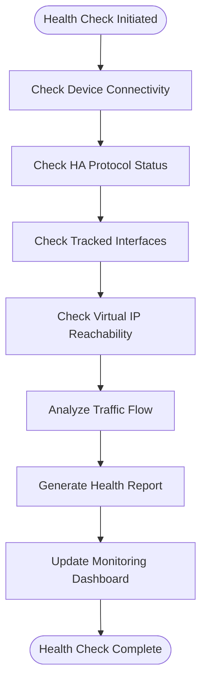

**Diagram sources**
- [README.md:430](file://README.md#L430)

#### Automatic Failover Triggers

The automation system monitors various conditions to trigger automatic failover:

| Condition | Detection Method | Action | Recovery |
|-----------|------------------|--------|----------|
| Interface Failure | SNMP polling / API queries | Reduce priority / Deactivate HSRP | Restore when interface recovers |
| CPU Overload | Performance metrics collection | Priority reduction / Traffic redirection | Return to normal when load decreases |
| Memory Exhaustion | Resource utilization monitoring | Graceful shutdown / Failover initiation | Restart services after recovery |
| Link Quality Degradation | Packet loss / latency monitoring | Route traffic to backup path | Return to primary when quality improves |

### Post-Failover Verification Procedures

#### Automated Verification Workflow

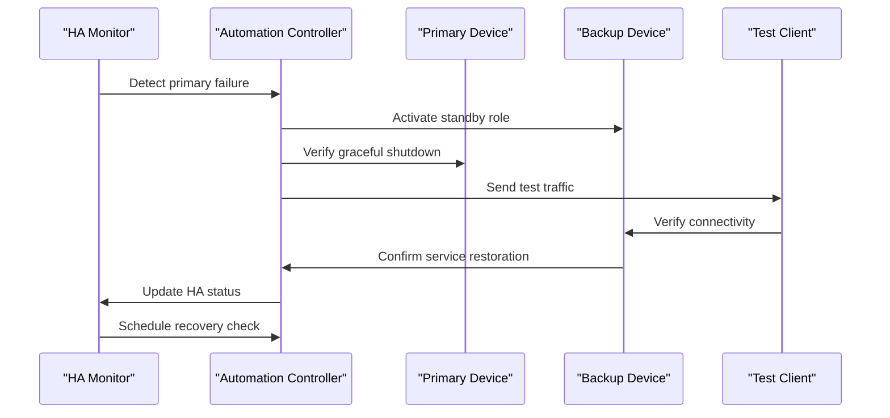

**Diagram sources**
- [README.md:430](file://README.md#L430)

### Monitoring Strategies for HA Status Tracking

#### Comprehensive Monitoring Architecture

The platform implements multi-layered monitoring for HA components:

| Monitoring Layer | Metrics Collected | Alert Thresholds | Response Actions |
|------------------|-------------------|------------------|------------------|
| Protocol Level | VRRP/HSRP state, neighbor count | State changes, timeout events | Immediate alerting, log generation |
| Interface Level | Link status, bandwidth utilization | Error rates, packet drops | Traffic rerouting, capacity alerts |
| Device Level | CPU/memory usage, temperature | Resource thresholds | Load balancing, maintenance alerts |
| Service Level | Virtual IP reachability, response time | Latency, availability targets | Failover triggers, capacity planning |

#### Alerting and Notification

The monitoring system provides comprehensive alerting capabilities:

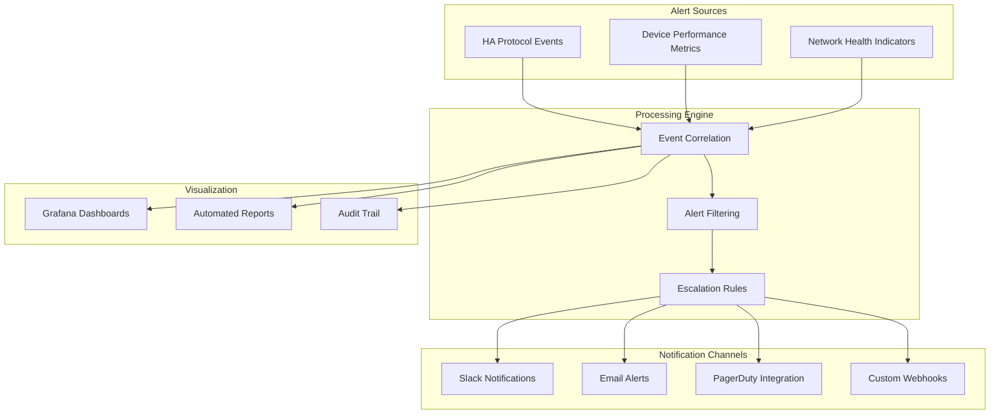

**Diagram sources**
- [README.md:583-604](file://README.md#L583-L604)

## Dependency Analysis

### Component Relationships

The HA automation system maintains clear separation of concerns with well-defined interfaces:

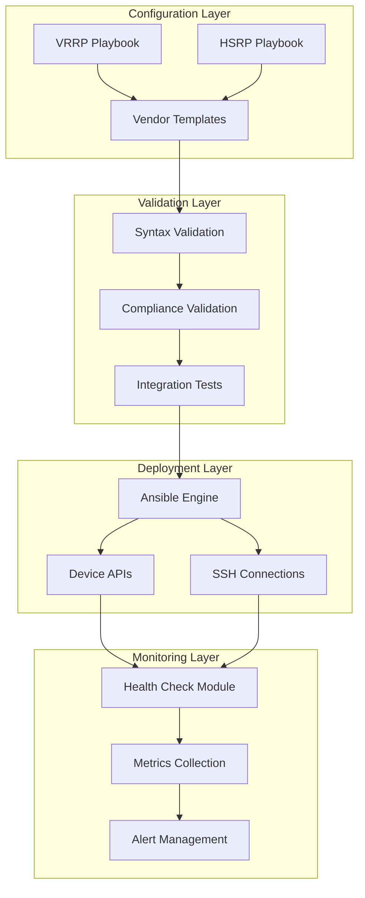

**Diagram sources**
- [README.md:103-180](file://README.md#L103-L180)

### External Dependencies

The platform relies on several external systems and services:

| Dependency | Purpose | Version Requirements |
|------------|---------|---------------------|
| Ansible | Configuration automation engine | 2.15+ |
| Python | Scripting and automation modules | 3.11+ |
| Jinja2 | Template rendering engine | Latest stable |
| Netmiko | SSH connectivity abstraction | Latest stable |
| NAPALM | Multi-vendor network abstraction | Latest stable |
| Prometheus | Metrics collection and storage | Latest stable |
| Grafana | Visualization and dashboards | Latest stable |

**Section sources**
- [README.md:184-199](file://README.md#L184-L199)

## Performance Considerations

### Convergence Time Optimization

Optimizing HA convergence times involves careful tuning of protocol timers and network topology:

| Optimization Area | Strategy | Impact | Trade-offs |
|-------------------|----------|--------|------------|
| Timer Tuning | Reduce hello/hold timers | Faster detection | Increased CPU usage, false positives |
| Topology Design | Minimize hop count | Reduced propagation delay | Limited design flexibility |
| Interface Tracking | Selective tracking | Targeted failover | Complex configuration |
| Load Distribution | ECMP with weighted paths | Balanced resource utilization | Requires routing protocol support |

### Scalability Considerations

The platform is designed for large-scale deployments:

- **Parallel Processing**: Concurrent device configuration updates
- **Connection Pooling**: Efficient SSH connection management
- **Caching**: Local caching of device information and templates
- **Batch Operations**: Group-based configuration application
- **Resource Limits**: Configurable limits for concurrent operations

## Troubleshooting Guide

### Common HA Configuration Issues

| Issue | Symptoms | Resolution |
|-------|----------|------------|
| Virtual IP Conflicts | Multiple devices claiming same VIP | Verify IP assignment uniqueness |
| Priority Misconfiguration | Unexpected master election | Review priority settings and preemption |
| Timer Mismatch | Flapping between states | Ensure consistent timer values across peers |
| Authentication Failures | Neighbor relationship not established | Verify authentication keys and methods |
| Interface Tracking Issues | Incorrect failover behavior | Check tracked interface status and priority adjustments |

### Debugging Commands and Logs

The platform provides comprehensive debugging capabilities:

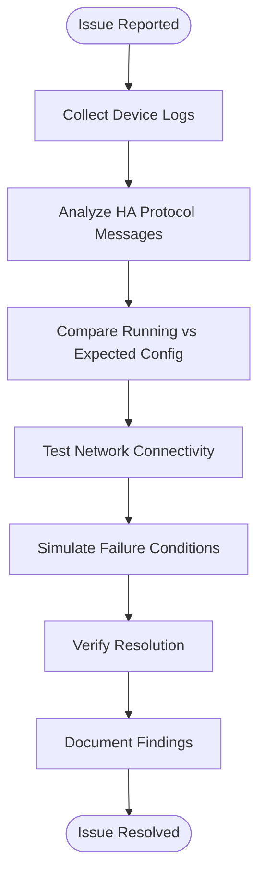

**Diagram sources**
- [README.md:674-685](file://README.md#L674-L685)

### Automated Diagnostics

The health check module provides automated diagnostic capabilities:

| Diagnostic Type | Description | Output |
|-----------------|-------------|--------|
| Protocol Health | VRRP/HSRP neighbor status and state | Status report with timestamps |
| Interface Status | Physical and logical interface health | Interface summary with error counts |
| Resource Utilization | CPU, memory, and storage usage | Resource utilization trends |
| Configuration Drift | Comparison with baseline configuration | Diff report highlighting changes |

**Section sources**
- [README.md:674-685](file://README.md#L674-L685)

## Conclusion

The enterprise network automation platform provides a comprehensive solution for high availability configuration management using VRRP and HSRP protocols. The system's vendor-agnostic approach, combined with robust validation, testing, and monitoring capabilities, ensures reliable HA deployments across diverse network environments.

Key benefits include:

- **Consistent Configuration**: Automated template-based configuration generation
- **Multi-Vendor Support**: Unified automation across Cisco, Juniper, and Arista platforms  
- **Comprehensive Testing**: Extensive validation and integration testing framework
- **Real-time Monitoring**: Continuous health monitoring and alerting
- **GitOps Integration**: Full lifecycle management through version control
- **Compliance Enforcement**: Automated policy checking and remediation

The platform's modular architecture and extensive tooling ecosystem enable organizations to implement sophisticated HA strategies while maintaining operational excellence and security compliance.

## Appendices

### Vendor-Specific Implementation Notes

#### Cisco Platforms

- **IOS/IOS-XE**: Full VRRP and HSRP support with advanced features
- **NX-OS**: Enhanced VRRP with additional tracking options
- **Feature Matrix**: Platform-specific capability variations documented

#### Juniper Platforms

- **SRX**: VRRP implementation with zone-based policies
- **MX**: Advanced HSRP-like functionality with Juniper extensions
- **Configuration Style**: XML-based configuration management

#### Arista Platforms

- **EOS**: Native VRRP and HSRP support with eAPI integration
- **CloudVision**: Centralized management and monitoring
- **Automation**: REST API and NETCONF support

### Reference Documentation

For detailed implementation guidance, refer to the following sections in the main documentation:

- [Repository Layout:103-180](file://README.md#L103-L180)
- [Technology Stack:184-199](file://README.md#L184-L199)
- [Supported Vendors](file://README.md:203-226)
- [Playbook Catalogue:371-435](file://README.md#L371-L435)
- [Monitoring & Observability:583-616](file://README.md#L583-L616)