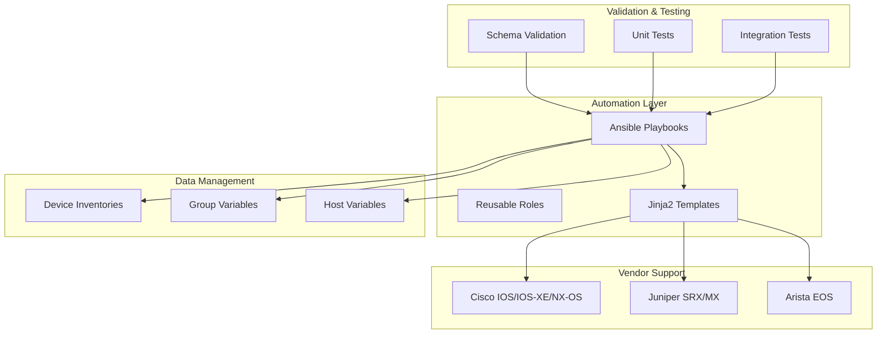
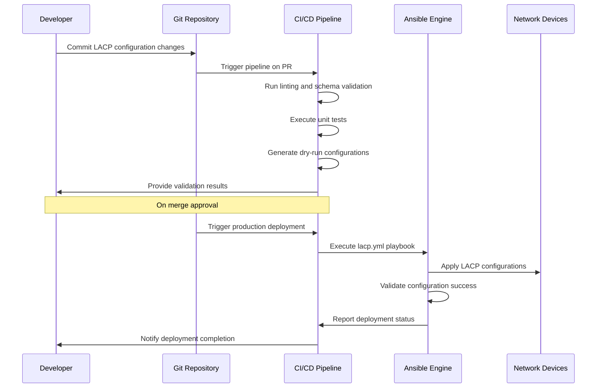
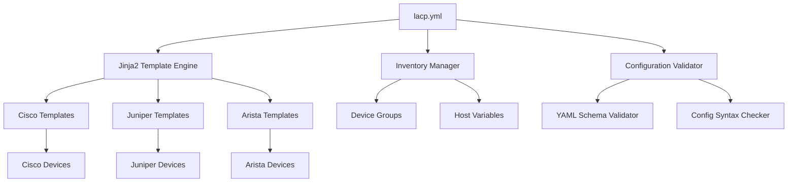

# LACP and Port Channel Automation

<cite>
**Referenced Files in This Document**
- [README.md](file://README.md)
</cite>

## Table of Contents
1. [Introduction](#introduction)
2. [Project Structure](#project-structure)
3. [Core Components](#core-components)
4. [Architecture Overview](#architecture-overview)
5. [Detailed Component Analysis](#detailed-component-analysis)
6. [Dependency Analysis](#dependency-analysis)
7. [Performance Considerations](#performance-considerations)
8. [Troubleshooting Guide](#troubleshooting-guide)
9. [Conclusion](#conclusion)

## Introduction

This document provides comprehensive documentation for Link Aggregation Control Protocol (LACP) and port channel automation using the enterprise network automation platform. The platform implements Infrastructure as Code principles to automate link aggregation configuration across multi-vendor environments including Cisco, Juniper, and Arista platforms.

The automation system manages LACP configurations, load balancing algorithms, member interface management, and operational state monitoring through a unified Ansible-based framework with vendor-specific template generation.

## Project Structure

The network automation platform follows a modular architecture designed for enterprise-scale deployment across thousands of devices. The LACP automation functionality is integrated within the broader automation ecosystem.

**Diagram sources**
- [README.md:103-180](file://README.md#L103-L180)

**Section sources**
- [README.md:103-180](file://README.md#L103-L180)

## Core Components

### LACP Configuration Framework

The platform implements a comprehensive LACP automation framework that supports multiple vendors and configuration scenarios. The core components include:

#### Playbook Architecture
The `lacp.yml` playbook serves as the primary entry point for LACP configuration automation, orchestrating the entire lifecycle from validation to deployment.

#### Template System
Vendor-specific Jinja2 templates generate platform-appropriate configurations:
- **Cisco**: `channel-group` commands with LACP negotiation modes
- **Juniper**: `aggregate ethernet` interfaces with LACP parameters  
- **Arista**: `port-channel` interfaces with LACP configuration

#### Variable Management
Structured YAML variables define bundle characteristics, member interfaces, and operational parameters.

**Section sources**
- [README.md:371-435](file://README.md#L371-L435)

## Architecture Overview

The LACP automation system follows a GitOps model where all configurations are version-controlled and deployed through automated pipelines.

**Diagram sources**
- [README.md:34-50](file://README.md#L34-L50)
- [README.md:479-501](file://README.md#L479-L501)

## Detailed Component Analysis

### LACP Playbook Implementation

The `lacp.yml` playbook orchestrates the complete LACP configuration lifecycle across supported vendor platforms.

#### Key Responsibilities
- **Configuration Generation**: Renders vendor-specific templates from structured data
- **Member Interface Management**: Adds/removes physical interfaces from bundles
- **Operational State Monitoring**: Validates LACP negotiation and bundle health
- **Rollback Capability**: Supports configuration rollback on failure

#### Vendor-Specific Implementations

##### Cisco Platform (channel-group)
- Supports both active and passive LACP modes
- Configures EtherChannel with LACP negotiation
- Manages member interface assignment to channel groups
- Handles load balancing algorithm selection

##### Juniper Platform (aggregate ethernet)
- Creates aggregate Ethernet interfaces with LACP
- Configures LACP parameters (system-id, priority, timeout)
- Manages member interface binding to aggregates
- Supports different LACP modes (active/passive)

##### Arista Platform (port-channel)
- Configures port-channel interfaces with LACP
- Sets administrative modes and load balancing policies
- Manages member interface membership
- Provides operational state monitoring

**Section sources**
- [README.md:116-128](file://README.md#L116-L128)
- [README.md:394](file://README.md#L394)

### Load Balancing Algorithms

The platform supports multiple load balancing algorithms for optimal traffic distribution across aggregated links:

| Algorithm | Description | Use Case |
|-----------|-------------|----------|
| src-dst-ip | Hashes source and destination IP addresses | IP-based traffic distribution |
| src-dst-mac | Hashes source and destination MAC addresses | Layer 2 traffic balancing |
| src-dst-port | Hashes source and destination ports | Application-aware distribution |
| src-dst-ip-port | Combined IP and port hashing | Enhanced traffic distribution |

### Administrative Modes

LACP administrative modes control how interfaces negotiate link aggregation:

- **Active Mode**: Interface actively initiates LACP negotiation
- **Passive Mode**: Interface responds to LACP negotiation requests
- **On Mode**: Static aggregation without LACP protocol

### Operational States

The automation system monitors key operational states:

- **Bundle Status**: Overall port channel health
- **Member Status**: Individual interface participation
- **LACP Negotiation**: Protocol handshake completion
- **Load Distribution**: Traffic flow across members

**Section sources**
- [README.md:203-218](file://README.md#L203-L218)

## Dependency Analysis

The LACP automation system has well-defined dependencies within the broader automation framework.

**Diagram sources**
- [README.md:103-180](file://README.md#L103-L180)

**Section sources**
- [README.md:103-180](file://README.md#L103-L180)

## Performance Considerations

### Bandwidth Utilization Optimization

The platform provides mechanisms for monitoring and optimizing bandwidth utilization across aggregated links:

- **Traffic Distribution Analysis**: Monitors load distribution across bundle members
- **Bottleneck Detection**: Identifies underutilized or overloaded links
- **Capacity Planning**: Provides metrics for bundle sizing decisions

### Failure Detection Mechanisms

Advanced failure detection ensures high availability:

- **Link Failure Detection**: Immediate detection of member interface failures
- **LACP Timeout Monitoring**: Detects protocol communication failures
- **Health Check Integration**: Integrates with device health monitoring systems

### Scalability Considerations

The automation framework scales to support large deployments:

- **Parallel Execution**: Concurrent configuration application across device groups
- **Incremental Updates**: Targeted updates to specific bundles or interfaces
- **Resource Optimization**: Efficient memory and CPU usage during bulk operations

## Troubleshooting Guide

### Common Issues and Resolution

#### LACP Negotiation Failures
- **Symptom**: Bundle remains down despite correct configuration
- **Causes**: Mismatched administrative modes, incompatible VLAN settings
- **Resolution**: Verify both ends use compatible LACP modes (active-passive or active-active)

#### Member Interface Issues
- **Symptom**: Interfaces flap or fail to join bundle
- **Causes**: Speed/duplex mismatches, VLAN configuration errors
- **Resolution**: Ensure consistent interface parameters across all bundle members

#### Load Balancing Problems
- **Symptom**: Uneven traffic distribution across links
- **Causes**: Suboptimal hash algorithm selection, asymmetric traffic patterns
- **Resolution**: Adjust load balancing algorithm based on traffic characteristics

### Validation Procedures

#### Pre-Deployment Validation
- **Syntax Validation**: Verify configuration syntax before deployment
- **Compatibility Checks**: Ensure device compatibility with LACP features
- **Impact Assessment**: Analyze potential service disruption during changes

#### Post-Deployment Verification
- **Operational State**: Confirm bundle reaches desired operational state
- **Traffic Flow**: Validate traffic distribution across members
- **Error Monitoring**: Check for interface errors or LACP protocol messages

### Monitoring and Alerting

The platform integrates with monitoring systems to provide real-time visibility:

- **Bundle Health Metrics**: Track bundle status and member participation
- **Performance Metrics**: Monitor bandwidth utilization and error rates
- **Alerting Rules**: Configure alerts for degradation or failure conditions

**Section sources**
- [README.md:674-685](file://README.md#L674-L685)

## Conclusion

The LACP and port channel automation system provides a comprehensive solution for managing link aggregation across multi-vendor network environments. Through its modular architecture, vendor-agnostic design, and robust validation framework, the platform enables reliable and scalable automation of link aggregation configurations.

Key benefits include:
- **Multi-Vendor Support**: Unified automation across Cisco, Juniper, and Arista platforms
- **GitOps Integration**: Version-controlled configurations with automated deployment
- **Comprehensive Validation**: Pre-deployment checks and post-deployment verification
- **Operational Visibility**: Integrated monitoring and troubleshooting capabilities

The platform's design ensures that link aggregation automation can scale to support enterprise networks while maintaining reliability and operational excellence.