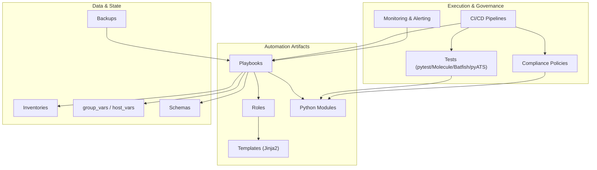
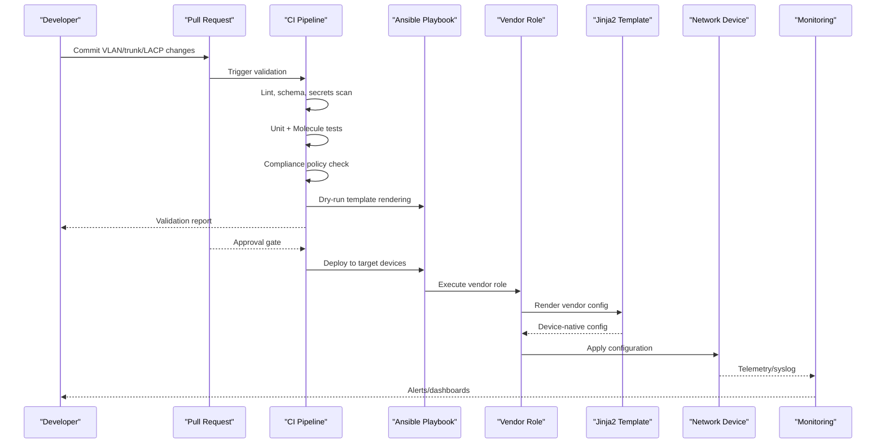
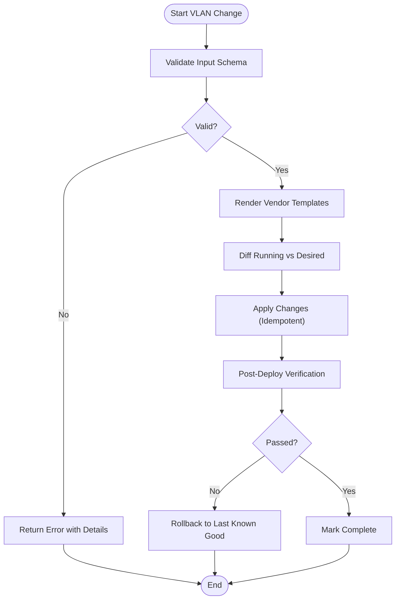
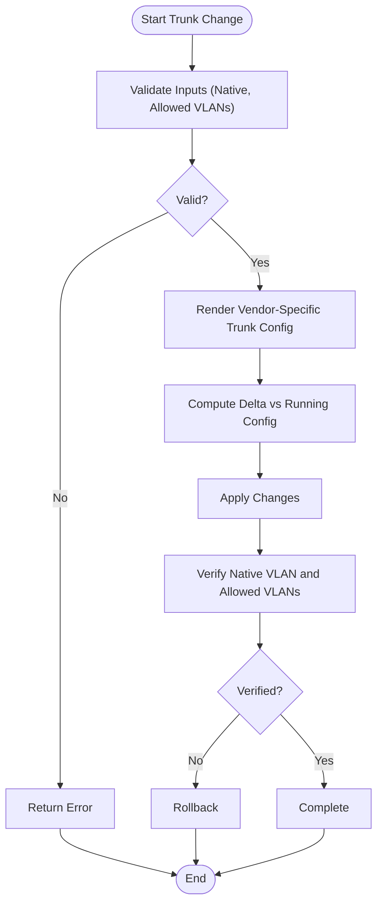
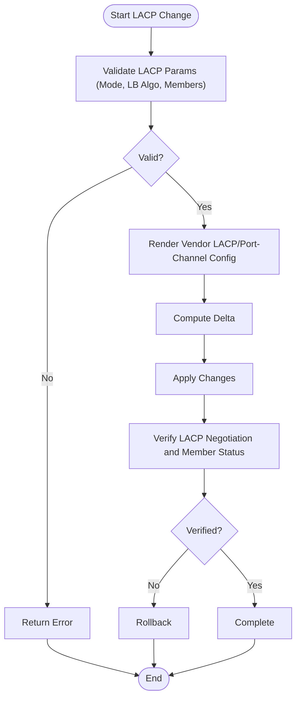
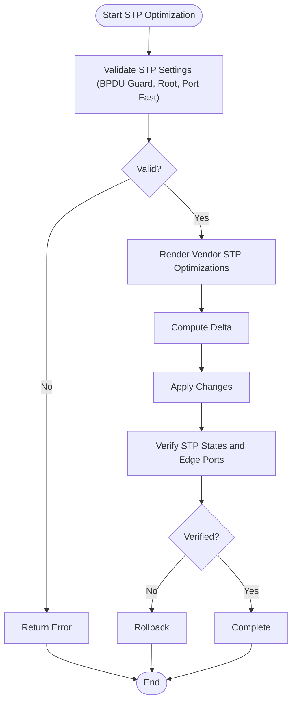
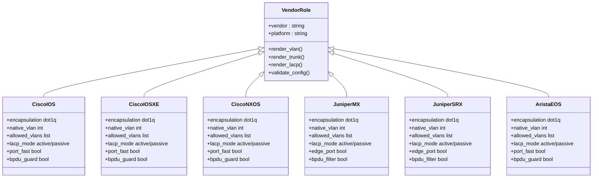
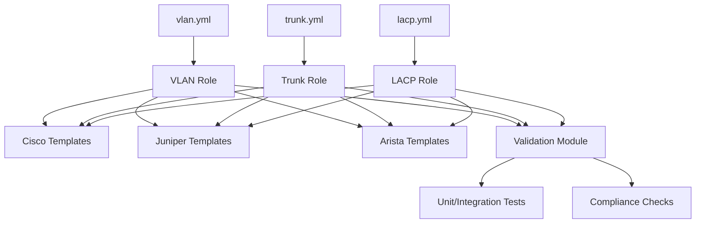

# Layer 2 Services Automation

<cite>
**Referenced Files in This Document**
- [README.md](file://README.md)
</cite>

## Table of Contents
1. [Introduction](#introduction)
2. [Project Structure](#project-structure)
3. [Core Components](#core-components)
4. [Architecture Overview](#architecture-overview)
5. [Detailed Component Analysis](#detailed-component-analysis)
6. [Dependency Analysis](#dependency-analysis)
7. [Performance Considerations](#performance-considerations)
8. [Troubleshooting Guide](#troubleshooting-guide)
9. [Conclusion](#conclusion)
10. [Appendices](#appendices)

## Introduction

This document provides comprehensive guidance for automating Layer 2 network services within an enterprise-scale, multi-vendor network automation platform. It covers VLAN provisioning workflows, trunk interface configuration, LACP/port-channel setup, spanning tree optimization, validation procedures, rollback strategies, and troubleshooting techniques. The content is aligned with the platform’s GitOps-driven, compliance-enforced approach and supports Cisco IOS/IOS-XE/NX-OS, Juniper (MX/SRX), Arista EOS, and other vendors via Jinja2 templates and Ansible roles.

## Project Structure

The platform organizes automation artifacts by environment, role, and vendor:
- Playbooks orchestrate end-to-end tasks (e.g., VLAN creation, trunking, LACP).
- Roles encapsulate reusable logic per vendor/platform.
- Templates render vendor-specific configurations from structured data.
- Python modules provide shared utilities for config generation, validation, backup, and compliance.

[No sources needed since this diagram shows conceptual workflow, not actual code structure]

**Section sources**
- [README.md:103-180](file://README.md#L103-L180)
- [README.md:438-456](file://README.md#L438-L456)

## Core Components

- Playbooks:
  - vlan.yml: Create/modify/delete VLANs with naming conventions and tagging strategy.
  - trunk.yml: Configure IEEE 802.1Q trunks, native VLAN, allowed VLAN lists.
  - lacp.yml: Configure LACP/port-channels, load balancing algorithms, member interfaces, channel groups.
- Roles: Vendor-specific implementations for Cisco IOS/IOS-XE/NX-OS, Juniper MX/SRX, Arista EOS, etc.
- Templates: Jinja2 templates per vendor to render device-native configuration.
- Python modules: Config generation, validation, backup, compliance, SSH/NETCONF/RESTCONF clients.
- Validation and testing: Schema checks, unit/integration tests, Batfish analysis, golden config diffs.
- Rollback and recovery: Automated backups, versioned configs, one-click rollback.

**Section sources**
- [README.md:388-435](file://README.md#L388-L435)
- [README.md:438-456](file://README.md#L438-L456)

## Architecture Overview

Layer 2 automation follows a GitOps flow: changes are validated, approved, deployed, verified, and monitored. Vendor abstraction is achieved through roles and templates, while Python modules handle connectivity and state management.

**Diagram sources**
- [README.md:479-501](file://README.md#L479-L501)
- [README.md:619-638](file://README.md#L619-L638)

## Detailed Component Analysis

### VLAN Provisioning Workflow

Objectives:
- Create, modify, delete VLANs consistently across vendors.
- Enforce naming conventions and tagging strategies.
- Ensure idempotency and safe rollbacks.

Key elements:
- Data model: VLAN ID, name, description, status, associated services.
- Naming convention: e.g., <site>-<function>-<vlanid> or similar consistent scheme.
- Tagging strategy: Native VLAN reserved; tagged VLANs explicitly enumerated per trunk.
- Idempotent operations: Compare desired vs. running state; apply only deltas.
- Validation: Schema checks, syntax validation, dry-run, post-deploy verification.

[No sources needed since this diagram shows conceptual workflow, not actual code structure]

Practical usage references:
- Playbook: vlan.yml
- Roles/Templates: cisco_ios, cisco_iosxe, cisco_nxos, juniper_mx, juniper_srx, arista_eos
- Validation: schemas, unit tests, integration tests

**Section sources**
- [README.md:388-399](file://README.md#L388-L399)
- [README.md:116-128](file://README.md#L116-L128)
- [README.md:438-456](file://README.md#L438-L456)

### Trunk Interface Configuration

Objectives:
- Configure IEEE 802.1Q encapsulation.
- Set native VLAN appropriately (avoid conflicts).
- Define allowed VLAN lists per trunk.
- Ensure consistency across multi-vendor environments.

Key elements:
- Encapsulation mode: 802.1Q where applicable.
- Native VLAN: Reserved for control traffic; ensure both ends match.
- Allowed VLANs: Explicit allowlists to minimize risk.
- Port modes: Access vs. trunk; enforce policies.
- Validation: Check native VLAN alignment and allowed VLAN sets.

[No sources needed since this diagram shows conceptual workflow, not actual code structure]

Practical usage references:
- Playbook: trunk.yml
- Roles/Templates: cisco_ios, cisco_iosxe, cisco_nxos, juniper_mx, juniper_srx, arista_eos

**Section sources**
- [README.md:390-394](file://README.md#L390-L394)
- [README.md:116-128](file://README.md#L116-L128)

### LACP/Port-Channel Setup

Objectives:
- Configure LACP port channels with appropriate load balancing algorithms.
- Manage member interfaces and channel group membership.
- Ensure link aggregation stability and failover behavior.

Key elements:
- Channel protocol: LACP active/passive/aggressive as required.
- Load balancing: Per-source-dest IP, MAC, or combination depending on traffic profile.
- Member interfaces: Consistent speed/duplex; no mismatched settings.
- Channel group: Bundle interfaces into logical port-channel; verify operational state.
- Validation: Check LACP negotiation, member status, and throughput distribution.

[No sources needed since this diagram shows conceptual workflow, not actual code structure]

Practical usage references:
- Playbook: lacp.yml
- Roles/Templates: cisco_ios, cisco_iosxe, cisco_nxos, juniper_mx, juniper_srx, arista_eos

**Section sources**
- [README.md:394-395](file://README.md#L394-L395)
- [README.md:116-128](file://README.md#L116-L128)

### Spanning Tree Optimization

Objectives:
- Optimize STP behavior using BPDU guard, root bridge election, port fast, and edge ports.
- Prevent loops and reduce convergence time at access layer.

Key elements:
- BPDU guard: Enable on edge ports to prevent rogue switches.
- Root bridge election: Designate primary/secondary roots per region or function.
- Port fast: Enable on access ports connected to endpoints.
- Edge ports: Mark ports as edge to bypass STP delays.
- Validation: Confirm BPDU guard enabled on edges, correct root priorities, and port fast states.

[No sources needed since this diagram shows conceptual workflow, not actual code structure]

Practical usage references:
- Roles/Templates: cisco_ios, cisco_iosxe, cisco_nxos, juniper_mx, juniper_srx, arista_eos
- Compliance: Checks for BPDU guard and edge port policies

**Section sources**
- [README.md:116-128](file://README.md#L116-L128)
- [README.md:548-579](file://README.md#L548-L579)

### Vendor-Specific Implementations

Supported platforms include Cisco IOS/IOS-XE/NX-OS, Juniper MX/SRX, and Arista EOS. Each vendor has dedicated roles and templates to render native configuration.

[No sources needed since this diagram shows conceptual relationships, not actual code structure]

Practical usage references:
- Roles/Templates: cisco_ios, cisco_iosxe, cisco_nxos, juniper_mx, juniper_srx, arista_eos

**Section sources**
- [README.md:116-128](file://README.md#L116-L128)

## Dependency Analysis

Layer 2 automation depends on:
- Playbooks orchestrating roles and templates.
- Roles implementing vendor-specific logic.
- Templates generating device-native configuration.
- Python modules providing connectivity, validation, backup, and compliance.
- CI/CD pipelines enforcing linting, schema validation, security scanning, compliance, and dry runs.

[No sources needed since this diagram shows conceptual dependencies, not actual code structure]

**Section sources**
- [README.md:388-435](file://README.md#L388-L435)
- [README.md:438-456](file://README.md#L438-L456)

## Performance Considerations

- Use idempotent operations to minimize churn and reduce deployment time.
- Prefer explicit allowlists for VLANs on trunks to limit processing overhead.
- Batch operations where possible to reduce API/SSH calls.
- Leverage parallel execution in playbooks for multi-device deployments.
- Monitor telemetry and logs to detect performance regressions early.

[No sources needed since this section provides general guidance]

## Troubleshooting Guide

Common issues and resolutions:
- Connection timeouts: Verify SSH reachability and credentials.
- Template rendering errors: Inspect Jinja2 syntax and variable definitions.
- Compliance failures: Review policy violations and device running config diffs.
- CI pipeline failures: Check GitHub Actions logs for actionable error messages.
- Vault authentication failures: Verify OIDC tokens or AppRole credentials.
- Molecule test failures: Ensure Docker/Podman is running; check molecule configuration.
- Batfish analysis errors: Validate snapshots and topology inputs.

Operational tips:
- Use dry-run and diff modes before applying changes.
- Maintain last known good backups for quick rollback.
- Validate native VLAN alignment and allowed VLAN lists on trunks.
- Confirm LACP negotiation and member interface states.
- Ensure BPDU guard and edge port policies are enforced at access layer.

**Section sources**
- [README.md:674-685](file://README.md#L674-L685)

## Conclusion

This guide outlines a robust, vendor-agnostic approach to automating Layer 2 services across a multi-vendor enterprise network. By leveraging playbooks, roles, templates, and Python modules within a GitOps-driven CI/CD pipeline, organizations can achieve consistent VLAN provisioning, trunk configuration, LACP/port-channel setup, and spanning tree optimizations. Comprehensive validation, compliance enforcement, monitoring, and automated rollback ensure reliability and safety in production environments.

[No sources needed since this section summarizes without analyzing specific files]

## Appendices

### Practical Playbook Usage References

- VLAN provisioning:
  - Playbook: vlan.yml
  - Roles/Templates: cisco_ios, cisco_iosxe, cisco_nxos, juniper_mx, juniper_srx, arista_eos
- Trunk configuration:
  - Playbook: trunk.yml
  - Roles/Templates: cisco_ios, cisco_iosxe, cisco_nxos, juniper_mx, juniper_srx, arista_eos
- LACP/port-channel:
  - Playbook: lacp.yml
  - Roles/Templates: cisco_ios, cisco_iosxe, cisco_nxos, juniper_mx, juniper_srx, arista_eos

**Section sources**
- [README.md:388-399](file://README.md#L388-L399)
- [README.md:116-128](file://README.md#L116-L128)