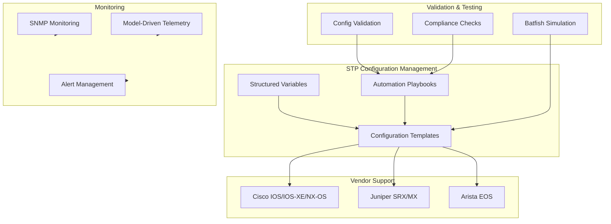
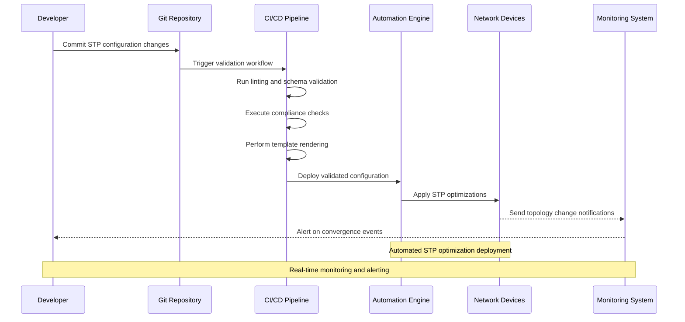
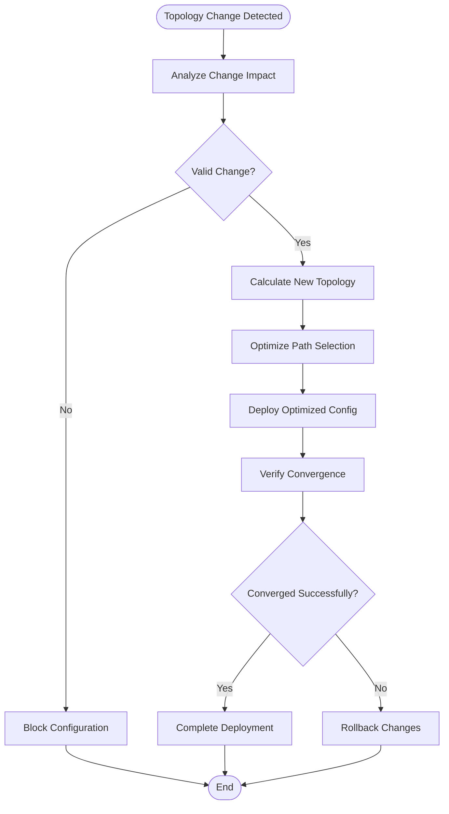
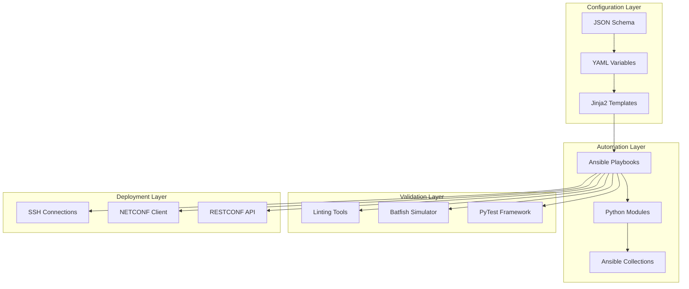

# Spanning Tree Protocol Optimization

<cite>
**Referenced Files in This Document**
- [README.md](file://README.md)
</cite>

## Table of Contents
1. [Introduction](#introduction)
2. [Project Structure](#project-structure)
3. [Core Components](#core-components)
4. [Architecture Overview](#architecture-overview)
5. [Detailed Component Analysis](#detailed-component-analysis)
6. [Dependency Analysis](#dependency-analysis)
7. [Performance Considerations](#performance-considerations)
8. [Troubleshooting Guide](#troubleshooting-guide)
9. [Conclusion](#conclusion)
10. [Appendices](#appendices)

## Introduction

This document provides comprehensive guidance for optimizing and automating Spanning Tree Protocol (STP) configurations across multi-vendor network environments. It covers Rapid STP (RSTP), Multiple STP (MSTP), BPDU guard, root bridge election policies, port fast settings, edge port configuration, and vendor-specific implementations for Cisco, Juniper, and Arista platforms.

The content is designed for network engineers and automation specialists working with enterprise-scale infrastructure, leveraging best practices from Fortune 100 organizations and integrating with modern DevOps workflows.

## Project Structure

The network automation platform follows a modular architecture supporting multiple vendors and protocols. For STP optimization, the relevant components include:



**Diagram sources**
- [README.md:103-180](file://README.md#L103-L180)

**Section sources**
- [README.md:103-180](file://README.md#L103-L180)

## Core Components

### STP Variable Structures

The platform uses structured data models for STP configuration management:

#### Root Bridge Election Policies
- **Priority-based selection**: Configurable bridge priority values (0-61440, increments of 4096)
- **System ID extension**: Automatic MAC address integration for unique identification
- **Region-based hierarchy**: MSTP region design for scalable topologies

#### Port Role Configuration
- **Edge ports**: Designated for end-host connections with immediate forwarding state
- **Point-to-point links**: Optimized for direct device connections
- **Shared media**: Legacy hub connections requiring full STP convergence

#### BPDU Guard Implementation
- **Port security integration**: Automatic shutdown on unauthorized BPDU reception
- **Conditional enforcement**: Selective application based on port role and location
- **Recovery mechanisms**: Automated re-enablement after configured intervals

**Section sources**
- [README.md:438-456](file://README.md#L438-L456)

### Vendor-Specific Implementations

#### Cisco Platforms (IOS/IOS-XE/NX-OS)
- **spanning-tree mode**: Global STP mode configuration (pvst+, rapid-pvst+, mstp)
- **BPDU guard**: `spanning-tree bpduguard enable` at interface level
- **Port fast**: `spanning-tree portfast` for edge port designation
- **Root bridge optimization**: `spanning-tree vlan <vlan-id> priority <priority>`

#### Juniper Platforms (SRX/MX)
- **rstp protocol**: Enable RSTP protocol family
- **edge-port**: Configure interfaces as edge ports
- **bpdu-guard**: Enable BPDU guard protection
- **root-bridge**: Set bridge priority for root election

#### Arista Platforms (EOS)
- **spanning-tree mode**: Configure STP mode (rapid-pvst, mstp)
- **spanning-tree portfast**: Enable port fast on access ports
- **spanning-tree bpdu-filter**: Filter BPDUs on specific interfaces
- **spanning-tree root primary/secondary**: Configure root bridge roles

**Section sources**
- [README.md:203-226](file://README.md#L203-L226)

## Architecture Overview

The STP optimization architecture integrates with the broader network automation platform:



**Diagram sources**
- [README.md:36-50](file://README.md#L36-L50)
- [README.md:479-501](file://README.md#L479-L501)

## Detailed Component Analysis

### STP Topology Optimization Strategies

#### Root Bridge Placement Strategy
- **Core layer positioning**: Place root bridges in core switches for optimal traffic flow
- **Redundancy planning**: Configure secondary root bridges for failover scenarios
- **VLAN-specific optimization**: Different root bridges per VLAN for load balancing

#### Convergence Time Optimization
- **Rapid STP adoption**: Migrate from traditional STP to RSTP for faster convergence
- **Port role optimization**: Properly configure edge ports and point-to-point links
- **Hello time tuning**: Adjust hello times based on network size and requirements

#### Loop Prevention Mechanisms
- **BPDU guard enforcement**: Protect against rogue switch connections
- **Loop guard activation**: Prevent alternate loop conditions
- **Root guard implementation**: Protect designated root bridge elections



**Diagram sources**
- [README.md:642-670](file://README.md#L642-L670)

### Practical STP Variable Structures

#### Inventory-Based Configuration
```yaml
# Example STP variable structure for inventory management
stopping_tree:
  global_settings:
    mode: "rapid-pvst"
    hello_time: 2
    forward_delay: 15
    max_age: 20
  
  root_bridge:
    primary_priority: 24576
    secondary_priority: 28672
  
  port_optimization:
    edge_ports: ["Gi1/0/1", "Gi1/0/2"]
    bpdu_guard_enabled: true
    loop_guard_enabled: true
  
  vlan_specific:
    - vlan_id: 100
      priority: 24576
      root_port_cost: 4
```

#### Template-Driven Generation
- **Jinja2 templates**: Generate vendor-specific configurations from structured data
- **Variable inheritance**: Inherit default STP settings with device-specific overrides
- **Conditional logic**: Apply different configurations based on device role and location

**Section sources**
- [README.md:116-128](file://README.md#L116-L128)
- [README.md:438-456](file://README.md#L438-L456)

### Validation Procedures

#### Pre-Deployment Validation
- **Syntax checking**: Validate configuration syntax before deployment
- **Conflict detection**: Identify potential STP conflicts and loops
- **Impact analysis**: Assess the impact of STP changes on network topology

#### Post-Deployment Verification
- **Topology verification**: Confirm expected STP topology after changes
- **Convergence testing**: Measure convergence times and validate performance
- **Loop detection**: Ensure no bridging loops exist in the network

#### Compliance Monitoring
- **Policy enforcement**: Ensure STP configurations comply with organizational standards
- **Drift detection**: Monitor for unauthorized STP configuration changes
- **Audit reporting**: Generate compliance reports for regulatory requirements

**Section sources**
- [README.md:517-544](file://README.md#L517-L544)

## Dependency Analysis

The STP optimization system has well-defined dependencies within the automation platform:



**Diagram sources**
- [README.md:103-180](file://README.md#L103-L180)

**Section sources**
- [README.md:103-180](file://README.md#L103-L180)

## Performance Considerations

### Convergence Optimization
- **RSTP benefits**: Achieve sub-second convergence compared to 30-50 seconds with traditional STP
- **PortFast usage**: Immediate forwarding for edge ports eliminates unnecessary delay
- **Hello time adjustment**: Reduce hello times for faster failure detection (with caution)

### Resource Utilization
- **CPU impact**: STP calculations consume CPU resources; optimize topology to minimize complexity
- **Memory usage**: Each VLAN maintains separate STP instances; consider MSTP for large deployments
- **Bandwidth consumption**: BPDU transmission overhead increases with number of VLANs

### Scalability Planning
- **Hierarchical design**: Use three-tier architecture to limit STP domain size
- **MSTP regions**: Group VLANs into MST regions for improved scalability
- **Root bridge placement**: Strategic placement reduces path calculation complexity

## Troubleshooting Guide

### Common STP Issues and Resolutions

#### STP Flapping Detection
- **Symptoms**: Frequent topology changes, interface flapping, routing instability
- **Causes**: Unstable physical links, misconfigured edge ports, BPDU guard violations
- **Resolution**: Investigate physical connectivity, verify edge port configuration, check for unauthorized devices

#### Root Bridge Election Problems
- **Symptoms**: Unexpected root bridge, suboptimal paths, traffic congestion
- **Causes**: Incorrect priority configuration, unauthorized root bridge introduction
- **Resolution**: Verify bridge priorities, implement root guard, monitor BPDU messages

#### Convergence Failures
- **Symptoms**: Slow convergence, temporary loops, packet loss during topology changes
- **Causes**: Misconfigured timers, incompatible STP modes, excessive network diameter
- **Resolution**: Standardize STP modes, optimize timer values, review network topology

### Monitoring Approaches

#### Topology Change Monitoring
- **SNMP traps**: Monitor STP topology change notifications
- **Syslog integration**: Capture STP-related log messages
- **Telemetry streaming**: Real-time STP state monitoring using model-driven telemetry

#### Convergence Event Tracking
- **Performance metrics**: Track convergence times and frequency of topology changes
- **Alerting thresholds**: Configure alerts for excessive topology changes
- **Trend analysis**: Monitor convergence performance over time

**Section sources**
- [README.md:583-616](file://README.md#L583-L616)

## Conclusion

Spanning Tree Protocol optimization requires careful planning, systematic implementation, and continuous monitoring. By leveraging the automated platform's capabilities, organizations can achieve:

- **Faster convergence**: Sub-second recovery through RSTP and proper edge port configuration
- **Enhanced security**: BPDU guard and root guard prevent unauthorized topology modifications
- **Improved scalability**: MSTP enables efficient management of large VLAN deployments
- **Automated operations**: Consistent configuration management across multi-vendor environments
- **Proactive monitoring**: Early detection of STP issues through comprehensive observability

The integration with DevOps practices ensures that STP optimizations are deployed consistently, validated thoroughly, and monitored continuously, providing a robust foundation for enterprise network reliability.

## Appendices

### Quick Reference Commands

#### Cisco IOS/IOS-XE
- Enable RSTP: `spanning-tree mode rapid-pvst`
- Configure BPDU guard: `spanning-tree bpduguard enable`
- Enable PortFast: `spanning-tree portfast`
- Set root priority: `spanning-tree vlan <id> priority <value>`

#### Juniper MX/SRX
- Enable RSTP: `set protocols rstp`
- Configure edge port: `set interfaces <iface> unit 0 family ethernet-switching edge-port`
- Enable BPDU guard: `set protocols rstp interface <iface> bpdu-guard`

#### Arista EOS
- Enable RSTP: `spanning-tree mode rapid-pvst`
- Configure PortFast: `spanning-tree portfast`
- Enable BPDU filter: `spanning-tree bpdufilter enable`

### Best Practices Checklist

- [ ] Standardize on RSTP or MSTP across all platforms
- [ ] Configure appropriate root bridge priorities
- [ ] Enable BPDU guard on all edge ports
- [ ] Implement loop guard on non-edge ports
- [ ] Monitor topology change frequency
- [ ] Document STP design decisions
- [ ] Test changes in staging environment first
- [ ] Maintain configuration backups
- [ ] Establish rollback procedures
- [ ] Train team on STP troubleshooting