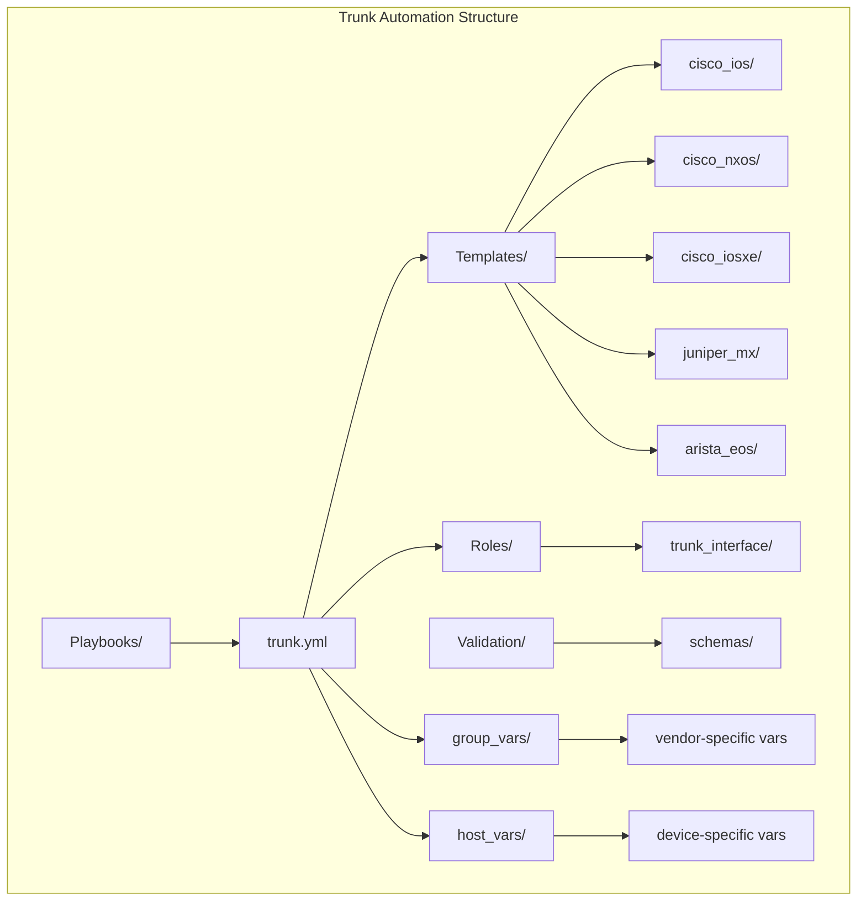
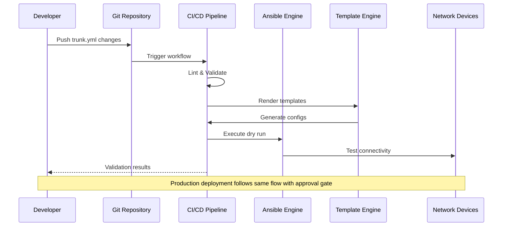
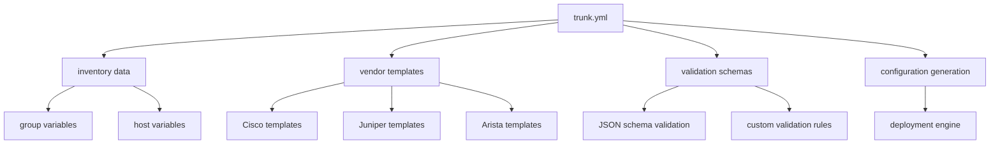

# Trunk Interface Configuration

<cite>
**Referenced Files in This Document**
- [README.md](file://README.md)
</cite>

## Table of Contents
1. [Introduction](#introduction)
2. [Project Structure](#project-structure)
3. [Core Components](#core-components)
4. [Architecture Overview](#architecture-overview)
5. [Detailed Component Analysis](#detailed-component-analysis)
6. [Dependency Analysis](#dependency-analysis)
7. [Performance Considerations](#performance-considerations)
8. [Troubleshooting Guide](#troubleshooting-guide)
9. [Conclusion](#conclusion)
10. [Appendices](#appendices)

## Introduction

This document provides comprehensive guidance for implementing trunk interface automation using the trunk.yml playbook within the Enterprise Network Automation Platform. The platform supports multi-vendor environments including Cisco, Juniper, and Arista devices, enabling consistent trunk configuration management across diverse network infrastructures.

The trunk interface automation system leverages Infrastructure as Code principles, GitOps workflows, and vendor-agnostic templates to ensure standardized trunk configurations while accommodating platform-specific requirements. This approach enables scalable deployment of IEEE 802.1Q encapsulation, native VLAN settings, allowed VLAN lists, and dynamic trunking protocols (DTP) across enterprise networks.

## Project Structure

The trunk interface automation follows the established repository layout with dedicated directories for playbooks, templates, roles, and validation components:



**Diagram sources**
- [README.md:103-180](file://README.md#L103-L180)

**Section sources**
- [README.md:103-180](file://README.md#L103-L180)

## Core Components

The trunk interface automation system consists of several key components working together to provide comprehensive trunk management capabilities:

### Playbook Architecture
The trunk.yml playbook serves as the primary orchestration component, coordinating between inventory data, vendor-specific templates, and device connectivity. It implements idempotent operations ensuring consistent trunk configurations across all target devices.

### Template System
Vendor-specific Jinja2 templates handle platform differences while maintaining consistent configuration semantics. Each vendor template translates common trunk concepts into vendor-specific syntax:

- **Cisco**: Uses switchport mode trunk commands with DTP control
- **Juniper**: Implements unit interfaces with encapsulation settings  
- **Arista**: Applies switchport trunk configuration with VLAN pruning

### Data Management
Structured YAML variables define trunk parameters including VLAN lists, native VLAN assignments, and protocol settings. The system supports both group-level and device-specific overrides through Ansible's variable precedence model.

**Section sources**
- [README.md:371-435](file://README.md#L371-L435)
- [README.md:103-180](file://README.md#L103-L180)

## Architecture Overview

The trunk interface automation follows a layered architecture pattern that separates concerns between orchestration, templating, and execution:



**Diagram sources**
- [README.md:479-501](file://README.md#L479-L501)

The architecture ensures that trunk configurations are validated before deployment, supporting rollback capabilities and compliance enforcement throughout the lifecycle.

## Detailed Component Analysis

### Trunk Interface Variables and Data Model

The trunk interface automation uses structured data models to define interface configurations consistently across vendors:

#### Core Trunk Parameters
- **Interface identification**: Port names, port channels, or logical interfaces
- **Encapsulation type**: IEEE 802.1Q standard tagging
- **Native VLAN**: Untagged traffic handling
- **Allowed VLANs**: VLAN pruning and filtering
- **Dynamic Trunking Protocol (DTP)**: Negotiation behavior
- **Security settings**: Port security and storm control

#### Vendor-Specific Mappings
Each vendor platform maps these core parameters to their specific command syntax while maintaining semantic equivalence.

**Section sources**
- [README.md:103-180](file://README.md#L103-L180)

### IEEE 802.1Q Encapsulation Configuration

IEEE 802.1Q encapsulation forms the foundation of trunked networking, providing VLAN tagging for multiple broadcast domains over a single physical link. The automation system handles encapsulation configuration through vendor-specific templates that translate common parameters into platform-appropriate commands.

#### Encapsulation Best Practices
- Consistent native VLAN assignment across trunk links
- Explicit VLAN allow lists for security and performance
- Proper DTP negotiation settings to prevent unauthorized trunk formation
- Storm control and broadcast suppression for network stability

### Native VLAN Settings Management

Native VLAN configuration requires careful attention to security implications. The automation system enforces consistent native VLAN policies across all trunk interfaces while preventing VLAN hopping attacks through proper configuration validation.

#### Security Considerations
- Native VLAN should never match user VLANs
- Consistent native VLAN across all trunks in a domain
- Explicit native VLAN configuration rather than relying on defaults
- Monitoring for native VLAN mismatches

### Allowed VLAN Lists and VLAN Pruning

VLAN pruning optimizes bandwidth utilization by limiting which VLANs traverse each trunk link. The automation system manages VLAN allow lists through structured data definitions that support bulk operations and dependency validation.

#### VLAN Pruning Strategies
- Least privilege principle: Only allow necessary VLANs per trunk
- Hierarchical VLAN organization for easier management
- Automated validation to prevent VLAN sprawl
- Integration with VLAN provisioning workflows

**Section sources**
- [README.md:371-435](file://README.md#L371-L435)

### Dynamic Trunking Protocols (DTP) Configuration

Dynamic Trunking Protocol (DTP) enables automatic trunk negotiation between switches. The automation system configures DTP behavior to balance convenience with security requirements.

#### DTP Security Models
- **Static trunk**: No negotiation, explicit configuration only
- **Desirable**: Actively negotiate trunk formation
- **Auto**: Passively respond to negotiation requests
- **None**: Disable DTP entirely for maximum security

#### Security Recommendations
- Disable DTP on access ports and edge connections
- Use static trunk configuration for critical infrastructure links
- Implement port security features alongside DTP controls
- Monitor for unexpected trunk negotiations

### Practical Examples and Deployment Scenarios

#### Single Interface Configuration
Individual trunk interfaces can be configured through host-specific variables, allowing granular control over edge cases and special requirements.

#### Bulk Deployment Operations
Group-based configuration enables simultaneous deployment across multiple devices, supporting large-scale trunk reconfiguration projects with consistent policies.

#### Inter-Switch Link Optimization
Point-to-point trunk optimization includes LACP configuration, bandwidth allocation, and failover strategies for high-availability designs.

**Section sources**
- [README.md:284-335](file://README.md#L284-L335)

### Vendor-Specific Implementations

#### Cisco Platforms (IOS, IOS-XE, NX-OS)
Cisco implementations use switchport mode trunk commands with extensive DTP control options. The automation handles platform differences between traditional IOS and NX-OS platforms.

Key configuration elements include:
- Switchport mode trunk/dynamic auto/desirable
- Switchport trunk native vlan
- Switchport trunk allowed vlan
- Switchport nonegotiate for security hardening

#### Juniper Platforms (MX Series)
Juniper implementations utilize unit interfaces with encapsulation settings. The automation translates common trunk concepts into Juniper's hierarchical configuration model.

Configuration focuses on:
- Unit interface creation with VLAN encapsulation
- Native VLAN configuration through untagged settings
- VLAN filtering through accept list mechanisms
- LACP configuration for link aggregation

#### Arista Platforms (EOS)
Arista EOS implementations follow Cisco-like syntax with enhanced automation capabilities. The automation leverages EOS's API-driven configuration management.

Features include:
- Switchport trunk mode configuration
- VLAN allow list management
- Enhanced monitoring and telemetry integration
- Python scripting support for advanced scenarios

**Section sources**
- [README.md:203-226](file://README.md#L203-L226)
- [README.md:103-180](file://README.md#L103-L180)

### Validation Procedures and Testing

The automation system includes comprehensive validation procedures to ensure trunk connectivity and configuration correctness:

#### Pre-Deployment Validation
- Syntax validation against vendor-specific schemas
- Dependency checking for referenced VLANs
- Conflict detection for overlapping configurations
- Dry-run execution to verify idempotency

#### Post-Deployment Verification
- Interface status verification
- VLAN membership validation
- Traffic flow testing
- Error rate monitoring

#### Compliance Checking
Automated compliance checks ensure trunk configurations meet organizational security policies and operational standards.

**Section sources**
- [README.md:517-544](file://README.md#L517-L544)

### Troubleshooting Techniques

Common trunk configuration issues and their resolution strategies:

#### VLAN Pruning Issues
- Verify VLAN existence on both ends of trunk links
- Check for inconsistent VLAN allow lists
- Validate native VLAN consistency
- Review spanning tree topology for blocking conditions

#### Connectivity Problems
- Interface error counters and statistics
- Cable and hardware diagnostics
- Protocol negotiation verification
- Spanning tree state analysis

#### Performance Issues
- Bandwidth utilization monitoring
- Broadcast storm detection
- Buffer overflow analysis
- QoS policy effectiveness

### Monitoring and Observability

The automation system integrates with the platform's monitoring infrastructure to provide comprehensive visibility into trunk interface health and performance:

#### Key Metrics
- Interface utilization and error rates
- VLAN membership changes
- Trunk negotiation events
- Security violation alerts

#### Alerting Policies
- Critical: Interface down, excessive errors
- Warning: High utilization, configuration drift
- Informational: VLAN changes, maintenance activities

#### Dashboard Integration
Grafana dashboards provide real-time visibility into trunk interface status, performance trends, and security events across the entire network fabric.

**Section sources**
- [README.md:583-616](file://README.md#L583-L616)

## Dependency Analysis

The trunk interface automation has well-defined dependencies within the broader automation ecosystem:



**Diagram sources**
- [README.md:103-180](file://README.md#L103-L180)

The dependency structure ensures loose coupling between components while maintaining clear interfaces for extensibility and maintenance.

## Performance Considerations

Optimizing trunk interface automation for large-scale deployments involves several key considerations:

### Scalability Patterns
- Parallel execution across device groups
- Incremental configuration updates
- Efficient template rendering
- Connection pooling for device communication

### Resource Optimization
- Minimal configuration changes through idempotent operations
- Batch processing for bulk operations
- Caching of device capabilities and supported features
- Optimized polling intervals for monitoring

### Failure Handling
- Graceful degradation when devices are unavailable
- Partial deployment with rollback capabilities
- Comprehensive logging and audit trails
- Automated recovery procedures

## Troubleshooting Guide

Common issues encountered during trunk interface automation and their resolutions:

### Connection and Authentication Issues
- Verify SSH connectivity and credentials
- Check firewall rules and ACLs
- Validate device reachability and response times
- Review authentication method compatibility

### Template Rendering Errors
- Validate YAML syntax and variable definitions
- Check vendor-specific template compatibility
- Verify feature availability on target platforms
- Review Jinja2 filter usage and custom functions

### Configuration Conflicts
- Identify conflicting VLAN assignments
- Detect overlapping security policies
- Resolve spanning tree conflicts
- Address routing protocol interactions

### Monitoring and Diagnostics
- Utilize platform-specific diagnostic commands
- Analyze interface statistics and error counters
- Review syslog messages for relevant events
- Leverage telemetry data for trend analysis

**Section sources**
- [README.md:674-685](file://README.md#L674-L685)

## Conclusion

The trunk interface automation system provides a robust, scalable solution for managing trunk configurations across multi-vendor network environments. By leveraging Infrastructure as Code principles, the system ensures consistency, repeatability, and compliance while accommodating vendor-specific requirements.

The modular architecture supports easy extension to additional vendors and platforms, while the comprehensive validation and monitoring capabilities provide confidence in automated deployments. The GitOps workflow enables collaborative development with built-in quality gates and rollback capabilities.

Future enhancements may include AI-driven anomaly detection, automated remediation workflows, and deeper integration with network digital twin technologies for simulation and testing.

## Appendices

### Quick Reference Commands

#### Development Workflow
```bash
# Validate trunk configuration changes
ansible-playbook playbooks/trunk.yml --check --diff -i inventories/lab/hosts.yml

# Generate configuration without deployment
python -m python.config_gen --device <device-name> --output ./output/

# Run validation tests
pytest tests/unit/ -v
```

#### Monitoring Queries
- Interface utilization metrics via Prometheus
- Error rate trending in Grafana dashboards
- Configuration drift detection reports
- Security event correlation analysis

**Section sources**
- [README.md:264-280](file://README.md#L264-L280)
- [README.md:517-544](file://README.md#L517-L544)