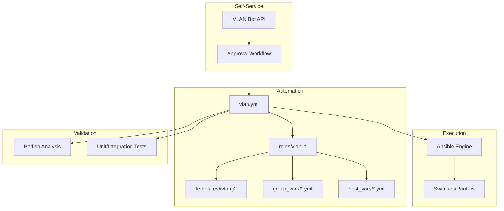
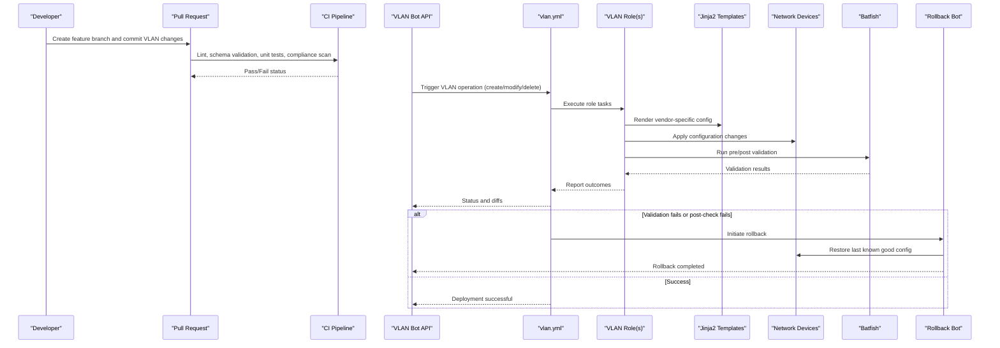
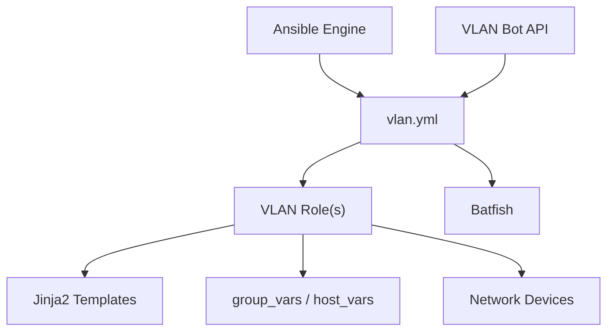

# VLAN Provisioning and Management

<cite>
**Referenced Files in This Document**
- [README.md](file://README.md)
</cite>

## Table of Contents
1. [Introduction](#introduction)
2. [Project Structure](#project-structure)
3. [Core Components](#core-components)
4. [Architecture Overview](#architecture-overview)
5. [Detailed Component Analysis](#detailed-component-analysis)
6. [Dependency Analysis](#dependency-analysis)
7. [Performance Considerations](#performance-considerations)
8. [Troubleshooting Guide](#troubleshooting-guide)
9. [Conclusion](#conclusion)
10. [Appendices](#appendices)

## Introduction
This document describes the VLAN automation capabilities of the platform, focusing on how VLANs are created, modified, and deleted across multi-vendor devices using Ansible playbooks, Jinja2 templates, structured variables, and automated validation. It also covers naming conventions, tagging strategies, VLAN ID allocation policies, bulk operations, lifecycle management, validation with Batfish, rollback strategies, and troubleshooting common issues such as trunk mismatches and native VLAN conflicts.

The repository provides a comprehensive network automation framework that uses GitOps practices, CI/CD pipelines, and testing to ensure safe and repeatable VLAN provisioning at scale.

## Project Structure
VLAN automation is implemented through a combination of:
- Playbooks for orchestration (e.g., vlan.yml)
- Roles for reusable logic
- Jinja2 templates per vendor family (Cisco IOS/IOS-XE/NX-OS, Juniper SRX/MX, Arista EOS)
- Structured variables in group_vars and host_vars
- Validation via Batfish and integration tests
- Automation bots exposing self-service APIs for VLAN requests

**Diagram sources**
- [README.md:103-180](file://README.md#L103-L180)
- [README.md:371-435](file://README.md#L371-L435)
- [README.md:460-478](file://README.md#L460-L478)
- [README.md:517-545](file://README.md#L517-L545)

**Section sources**
- [README.md:103-180](file://README.md#L103-L180)
- [README.md:371-435](file://README.md#L371-L435)
- [README.md:460-478](file://README.md#L460-L478)
- [README.md:517-545](file://README.md#L517-L545)

## Core Components
- Playbook: vlan.yml orchestrates VLAN creation/modification/deletion across target device groups.
- Roles: Reusable roles encapsulate vendor-specific tasks and template rendering.
- Templates: Jinja2 templates under templates/<vendor>/ generate device-native VLAN configuration for Cisco IOS/IOS-XE/NX-OS, Juniper SRX/MX, and Arista EOS.
- Variables: group_vars and host_vars define VLAN metadata, naming conventions, tagging policies, and allocation ranges.
- Bots: The VLAN bot exposes an API endpoint for self-service VLAN provisioning with approval workflows.
- Validation: Batfish-based analysis validates connectivity and policy implications before deployment.

Key responsibilities:
- Parse structured VLAN definitions from variables
- Render vendor-specific configurations using Jinja2 templates
- Apply changes idempotently via Ansible
- Validate generated configs with Batfish
- Provide rollback mechanisms on failure

**Section sources**
- [README.md:371-435](file://README.md#L371-L435)
- [README.md:103-180](file://README.md#L103-L180)
- [README.md:460-478](file://README.md#L460-L478)
- [README.md:517-545](file://README.md#L517-L545)

## Architecture Overview
The VLAN provisioning workflow integrates GitOps, CI/CD, and automated validation:

**Diagram sources**
- [README.md:371-435](file://README.md#L371-L435)
- [README.md:460-478](file://README.md#L460-L478)
- [README.md:517-545](file://README.md#L517-L545)
- [README.md:619-638](file://README.md#L619-L638)
- [README.md:642-670](file://README.md#L642-L670)

## Detailed Component Analysis

### VLAN Playbook Structure (vlan.yml)
- Purpose: Orchestrate VLAN lifecycle operations across device groups.
- Inputs: VLAN definitions from group_vars/host_vars; target device selection via inventory.
- Tasks:
  - Validate inputs and enforce naming and ID policies
  - Render vendor-specific VLAN configurations using Jinja2 templates
  - Apply changes idempotently
  - Perform pre/post validation with Batfish
  - Handle failures with automatic rollback

Operational modes:
- Create: Add new VLAN entries and apply to devices
- Modify: Update VLAN names, descriptions, or attributes
- Delete: Remove VLAN definitions and clean up device configuration

**Section sources**
- [README.md:371-435](file://README.md#L371-L435)
- [README.md:619-638](file://README.md#L619-L638)

### VLAN Creation Workflows
- Naming Conventions:
  - Use descriptive names indicating purpose and scope (e.g., tenant, service type, region)
  - Enforce consistent casing and separators
- Tagging Strategies:
  - Assign tags for classification (e.g., production, staging, lab)
  - Use tags to filter device targeting and reporting
- VLAN ID Allocation Policies:
  - Reserve ranges by function (management, user data, voice, guest, etc.)
  - Avoid overlap between environments and regions
  - Maintain auditability via structured variable definitions

Bulk Operations:
- Define multiple VLANs in a single variable structure
- Iterate over device groups to apply consistently
- Use Ansible loops and conditional logic to minimize repetition

Lifecycle Management:
- Create: Add VLAN entry and render configuration
- Modify: Update attributes and re-render affected devices
- Delete: Remove VLAN definition and purge configuration

**Section sources**
- [README.md:103-180](file://README.md#L103-L180)
- [README.md:371-435](file://README.md#L371-L435)

### Multi-Vendor Jinja2 Templates
Templates are organized per vendor family to generate native syntax:
- Cisco IOS/IOS-XE/NX-OS:
  - VLAN database commands and interface assignments
  - Trunk port configuration and allowed VLAN lists
  - Native VLAN settings where applicable
- Juniper SRX/MX:
  - VLAN interfaces and bridge domains
  - Interface families and VLAN tagging
- Arista EOS:
  - VLAN definitions and switchport configurations
  - Trunk mode and allowed VLAN lists

Template Rendering:
- Input variables include VLAN ID, name, description, tags, and interface mappings
- Conditional blocks handle vendor-specific differences
- Idempotent generation ensures no unintended changes

**Section sources**
- [README.md:103-180](file://README.md#L103-L180)
- [README.md:371-435](file://README.md#L371-L435)

### Practical Examples of VLAN Variable Structures
Variables are defined in group_vars and host_vars:
- group_vars:
  - Shared VLAN definitions across device groups
  - Common naming conventions and allocation ranges
- host_vars:
  - Per-device overrides for specific interfaces or VLAN memberships
  - Site-specific trunk configurations

Example structures:
- VLAN list with ID, name, description, tags
- Interface mappings specifying access/trunk ports and allowed VLANs
- Vendor-specific parameters (e.g., native VLAN, trunk encapsulation)

Note: Refer to the repository’s examples directory for concrete YAML structures.

**Section sources**
- [README.md:103-180](file://README.md#L103-L180)
- [README.md:371-435](file://README.md#L371-L435)

### Validation Procedures Using Batfish
- Pre-deployment:
  - Generate candidate configurations
  - Run Batfish analysis to detect connectivity issues and policy violations
- Post-deployment:
  - Validate actual device state against expected configuration
  - Ensure VLAN reachability and trunk consistency

Integration points:
- CI pipeline includes Batfish checks for any PR affecting VLAN configuration
- Automated reports highlight potential risks before merge

**Section sources**
- [README.md:517-545](file://README.md#L517-L545)
- [README.md:619-638](file://README.md#L619-L638)

### Rollback Strategies for Failed Deployments
- Automatic rollback triggers when:
  - Post-deploy verification fails
  - Batfish analysis detects critical issues
- Rollback process:
  - Identify last known good configuration version
  - Apply rollback configuration to affected devices
  - Verify restoration and notify stakeholders

**Section sources**
- [README.md:619-638](file://README.md#L619-L638)
- [README.md:642-670](file://README.md#L642-L670)

### Troubleshooting Common VLAN Issues
- Trunk Mismatches:
  - Check allowed VLAN lists and trunk encapsulation settings
  - Ensure consistent native VLAN configuration across links
- Native VLAN Conflicts:
  - Verify native VLAN alignment on both ends of trunks
  - Confirm no overlapping VLAN IDs on different segments
- Connectivity Problems:
  - Use Batfish to simulate traffic flows and identify blocked paths
  - Review interface statuses and VLAN memberships

Diagnostic steps:
- Inspect generated configurations for inconsistencies
- Compare running configs against intended state
- Leverage logs and monitoring dashboards for real-time insights

**Section sources**
- [README.md:674-685](file://README.md#L674-L685)
- [README.md:517-545](file://README.md#L517-L545)

## Dependency Analysis
VLAN automation depends on several components:
- Ansible Engine executes playbooks and roles
- Jinja2 Templates render vendor-specific configurations
- Structured Variables provide input data
- Batfish performs network simulation and validation
- Automation Bots expose APIs for self-service operations

**Diagram sources**
- [README.md:103-180](file://README.md#L103-L180)
- [README.md:371-435](file://README.md#L371-L435)
- [README.md:460-478](file://README.md#L460-L478)
- [README.md:517-545](file://README.md#L517-L545)

**Section sources**
- [README.md:103-180](file://README.md#L103-L180)
- [README.md:371-435](file://README.md#L371-L435)
- [README.md:460-478](file://README.md#L460-L478)
- [README.md:517-545](file://README.md#L517-L545)

## Performance Considerations
- Bulk Operations:
  - Use parallel execution in Ansible to speed up large-scale deployments
  - Group devices by vendor and site to optimize template rendering
- Configuration Generation:
  - Cache rendered templates where possible to reduce overhead
  - Minimize unnecessary changes by leveraging idempotent tasks
- Validation Efficiency:
  - Run targeted Batfish analyses only on affected segments
  - Incremental validation reduces overall test time

[No sources needed since this section provides general guidance]

## Troubleshooting Guide
Common issues and resolutions:
- Connection Timeouts:
  - Verify SSH reachability and credentials
- Template Rendering Errors:
  - Check Jinja2 syntax and variable completeness
- Compliance Failures:
  - Review policies and device configuration diffs
- CI Pipeline Failures:
  - Inspect GitHub Actions logs for actionable errors
- Vault Authentication Failures:
  - Verify OIDC tokens or AppRole credentials
- Molecule Test Failures:
  - Ensure Docker/Podman is running and check molecule configuration
- Batfish Analysis Errors:
  - Validate snapshots and input configurations

**Section sources**
- [README.md:674-685](file://README.md#L674-L685)

## Conclusion
The VLAN automation capabilities provide a robust, scalable solution for managing VLANs across multi-vendor environments. By leveraging Ansible playbooks, Jinja2 templates, structured variables, and automated validation with Batfish, the platform ensures safe and repeatable VLAN provisioning. GitOps practices, CI/CD pipelines, and rollback strategies further enhance reliability and operational efficiency.

[No sources needed since this section summarizes without analyzing specific files]

## Appendices
- Example VLAN variable structures can be found in the repository’s examples directory.
- For detailed usage instructions, refer to the playbook catalogue and automation bot documentation.

[No sources needed since this section provides general guidance]