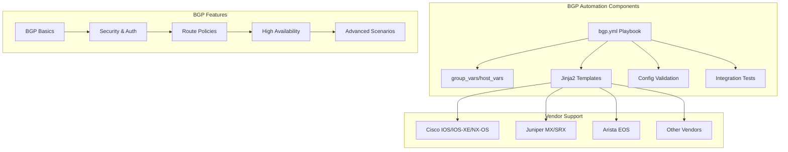
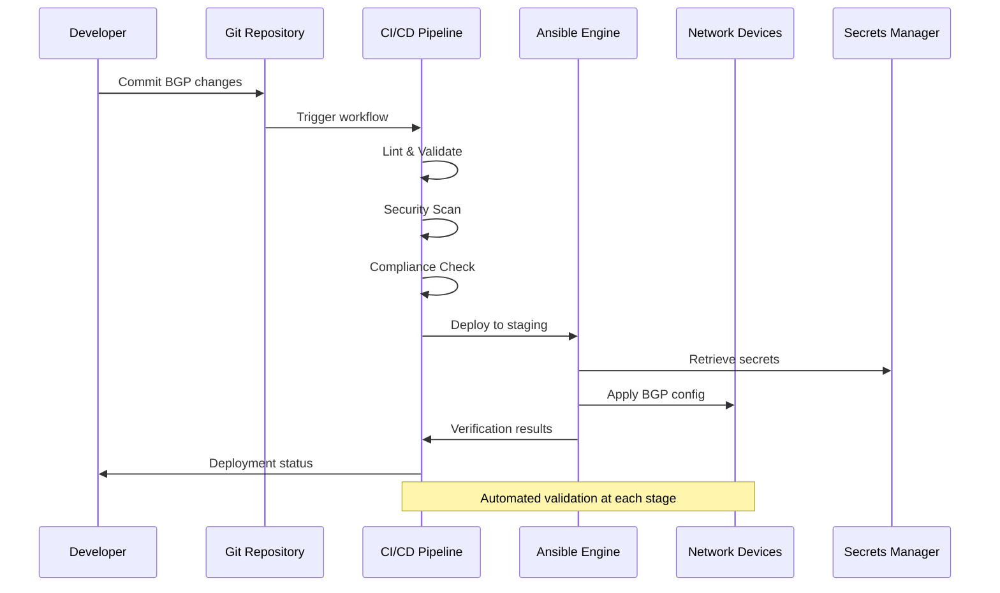
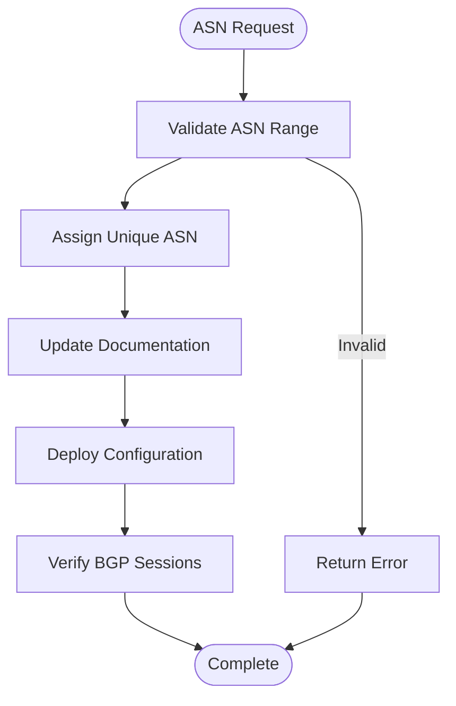
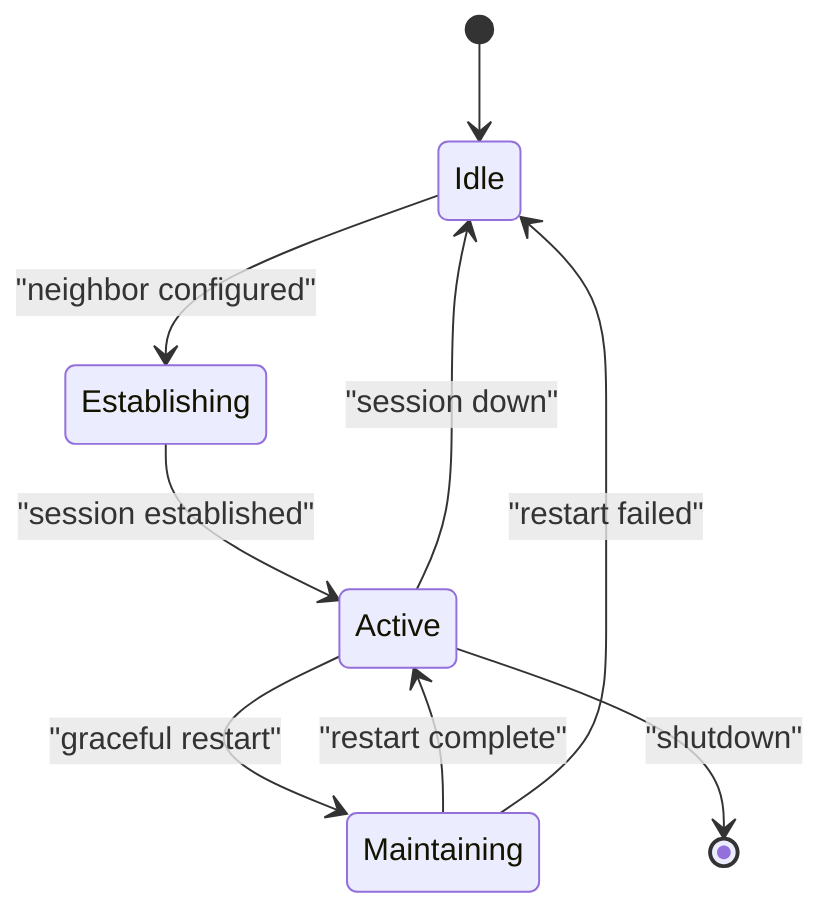
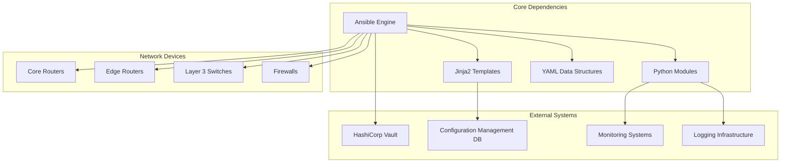

# BGP Peering and Policy Configuration

<cite>
**Referenced Files in This Document**
- [README.md](file://README.md)
</cite>

## Table of Contents
1. [Introduction](#introduction)
2. [Project Structure](#project-structure)
3. [Core Components](#core-components)
4. [Architecture Overview](#architecture-overview)
5. [Detailed Component Analysis](#detailed-component-analysis)
6. [Dependency Analysis](#dependency-analysis)
7. [Performance Considerations](#performance-considerations)
8. [Troubleshooting Guide](#troubleshooting-guide)
9. [Conclusion](#conclusion)
10. [Appendices](#appendices)

## Introduction

This document provides comprehensive guidance for implementing BGP peering and policy automation using the enterprise network automation platform's `bgp.yml` playbook. The platform supports multi-vendor environments with vendor-agnostic configuration generation, enabling consistent BGP deployment across Cisco IOS/IOS-XE/NX-OS, Juniper MX/SRX, Arista EOS, and other supported platforms.

The BGP automation framework encompasses autonomous system management, neighbor authentication, route filtering, traffic engineering, high availability features, and advanced scenarios including route reflection, confederations, and cloud interconnects.

## Project Structure

The BGP automation functionality is part of the broader network automation platform architecture, which follows a modular design pattern with clear separation between data, templates, and execution logic.



**Diagram sources**
- [README.md:103-180](file://README.md#L103-L180)
- [README.md:401-410](file://README.md#L401-L410)

**Section sources**
- [README.md:103-180](file://README.md#L103-L180)
- [README.md:401-410](file://README.md#L401-L410)

## Core Components

The BGP automation system consists of several key components that work together to provide comprehensive routing protocol management:

### BGP Playbook Architecture

The `bgp.yml` playbook serves as the primary orchestration point for BGP configuration deployment. It coordinates multiple Ansible roles and tasks to ensure consistent BGP implementation across diverse device populations.

### Data Management Layer

Structured data management through group_vars and host_vars enables parameterized BGP configurations. This approach supports:
- Device-specific ASN assignments
- Neighbor relationship definitions
- Route policy parameters
- Security credentials (managed via secrets backend)

### Template Engine

Jinja2-based template rendering generates vendor-specific BGP configurations from unified data structures, ensuring consistency while accommodating platform differences.

### Validation Framework

Pre-deployment validation ensures configuration correctness through syntax checking, semantic validation, and compliance verification against organizational policies.

**Section sources**
- [README.md:438-456](file://README.md#L438-L456)
- [README.md:401-410](file://README.md#L401-L410)

## Architecture Overview

The BGP automation architecture follows a layered approach with clear separation of concerns and robust error handling mechanisms.



**Diagram sources**
- [README.md:479-501](file://README.md#L479-L501)
- [README.md:339-357](file://README.md#L339-L357)

### Key Architectural Principles

1. **Infrastructure as Code**: All BGP configurations defined declaratively in version control
2. **GitOps Workflow**: Pull request-driven deployment with automated validation
3. **Secrets Management**: Secure credential handling through centralized vault
4. **Multi-Vendor Support**: Vendor-agnostic configuration generation
5. **Compliance Enforcement**: Automated policy checks throughout deployment pipeline

## Detailed Component Analysis

### Autonomous System Configuration

The BGP automation framework provides comprehensive ASN management capabilities:

#### ASN Assignment Strategy



**Diagram sources**
- [README.md:401-410](file://README.md#L401-L410)

#### Router ID Management

Router ID configuration follows best practices for stability and uniqueness:
- Loopback interface-based router IDs for resilience
- Automatic conflict detection and resolution
- Consistent naming conventions across environments

### eBGP and iBGP Peering Setup

#### Neighbor Authentication

The platform supports multiple authentication methods:
- MD5 password authentication for basic security
- TTL security for enhanced protection
- Graceful restart configuration for session resilience

#### Multi-Homing Scenarios



**Diagram sources**
- [README.md:401-410](file://README.md#L401-L410)

### Route Filtering and Policy Control

#### Prefix Lists and Route Maps

The automation framework implements sophisticated route filtering:
- Prefix-list creation and management
- Route-map policy definition
- Community attribute manipulation
- Traffic engineering controls

#### MED and Local Preference

Policy application includes:
- MED manipulation for outbound path selection
- Local preference settings for inbound traffic control
- Community-based routing decisions
- Conditional route advertisement

### Advanced Scenarios

#### Route Reflection

For large-scale deployments, route reflection capabilities include:
- Route reflector cluster configuration
- Client-server relationship management
- Cluster ID assignment and validation
- Redundancy and failover scenarios

#### Confederation Design

Confederation support encompasses:
- Sub-AS assignment within confederation
- Confederation member router configuration
- Inter-sub-AS peering setup
- Path attribute handling

#### Cloud Interconnect

Cloud connectivity patterns include:
- AWS Direct Connect integration
- Azure ExpressRoute configuration
- GCP Cloud Interconnect setup
- Hybrid cloud routing strategies

**Section sources**
- [README.md:401-410](file://README.md#L401-L410)
- [README.md:203-226](file://README.md#L203-L226)

## Dependency Analysis

The BGP automation system has well-defined dependencies and relationships between components:



**Diagram sources**
- [README.md:52-99](file://README.md#L52-L99)
- [README.md:438-456](file://README.md#L438-L456)

### Component Coupling Analysis

1. **Low Coupling**: Each component maintains clear interfaces and minimal dependencies
2. **High Cohesion**: Related functionality grouped within appropriate modules
3. **Pluggable Architecture**: New vendors and features can be added without disrupting existing functionality
4. **Error Isolation**: Failures in one component don't cascade to others

## Performance Considerations

### Optimization Strategies

The BGP automation framework incorporates several performance optimizations:

#### Parallel Execution
- Concurrent device configuration where possible
- Batch processing for large device populations
- Intelligent task scheduling based on device capabilities

#### Memory Management
- Streaming configuration generation for large topologies
- Efficient data structure usage
- Garbage collection optimization

#### Network Efficiency
- Connection pooling for device communication
- Config diff calculation to minimize changes
- Retry logic with exponential backoff

### Scalability Characteristics

The platform supports scaling to thousands of devices through:
- Horizontal scaling of Ansible controllers
- Distributed execution models
- Asynchronous operation patterns
- Resource-aware scheduling

## Troubleshooting Guide

### Common BGP Issues and Resolutions

| Issue Category | Symptoms | Resolution Steps |
|---|---|---|
| **Session Establishment** | BGP neighbors not forming | Verify ASN configuration, check authentication, validate reachability |
| **Route Propagation** | Routes not being advertised or received | Review route maps, prefix lists, community attributes |
| **Path Selection** | Suboptimal routing paths | Analyze MED, local preference, AS path length |
| **Performance Issues** | High CPU/memory usage | Optimize route filtering, implement aggregation |
| **Stability Problems** | Frequent session flapping | Configure graceful restart, adjust timers, implement BFD |

### Debugging Techniques

#### Configuration Validation
```bash
# Validate BGP configuration before deployment
ansible-playbook playbooks/bgp.yml --check --diff -i inventories/lab/hosts.yml

# Generate configuration without applying
python -m python.config_gen --device <device-name> --output ./output/
```

#### Session Diagnostics
- Monitor BGP session states through monitoring systems
- Use platform-specific show commands for detailed diagnostics
- Implement automated health checks and alerting

#### Log Analysis
- Centralized log collection and correlation
- Pattern matching for common failure scenarios
- Automated incident response workflows

**Section sources**
- [README.md:674-685](file://README.md#L674-L685)

## Conclusion

The BGP peering and policy automation framework provides a comprehensive solution for managing complex routing infrastructures across multi-vendor environments. By leveraging Infrastructure as Code principles, GitOps workflows, and automated validation, the platform ensures consistent, secure, and reliable BGP deployments at scale.

Key benefits include:
- **Consistency**: Uniform BGP configuration across diverse device populations
- **Scalability**: Support for large-scale deployments with thousands of devices
- **Security**: Integrated secrets management and compliance enforcement
- **Reliability**: Automated testing, validation, and rollback capabilities
- **Maintainability**: Version-controlled configurations with full audit trails

The modular architecture enables easy extension for new vendors, protocols, and features while maintaining backward compatibility and operational stability.

## Appendices

### A. Vendor-Specific Implementation Notes

#### Cisco IOS/IOS-XE/NX-OS
- Native support for all BGP features
- Extensive command set coverage
- Advanced traffic engineering capabilities

#### Juniper MX/SRX
- Strong BGP implementation with policy flexibility
- Integration with Junos OS features
- Advanced routing engine capabilities

#### Arista EOS
- Modern BGP implementation with API access
- Strong automation support through eAPI
- Container-native networking capabilities

### B. Best Practices Checklist

- Always use loopback interfaces for BGP sessions
- Implement proper authentication for all neighbor relationships
- Apply route filtering at network boundaries
- Configure graceful restart for session resilience
- Monitor BGP session states and route counts
- Document all policy decisions and exceptions
- Test configurations thoroughly before production deployment

### C. Reference Commands and Patterns

Common BGP configuration patterns and their corresponding Ansible role mappings are documented in the platform's internal reference materials and can be generated through the configuration generation tools.