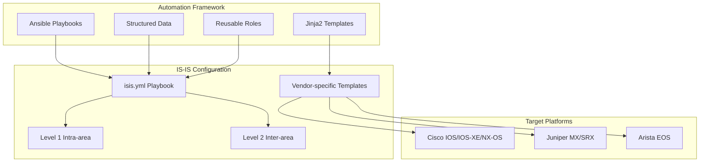
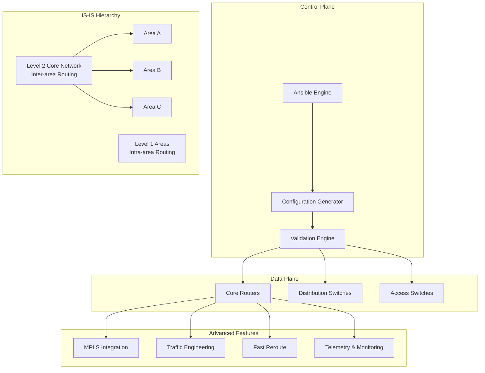
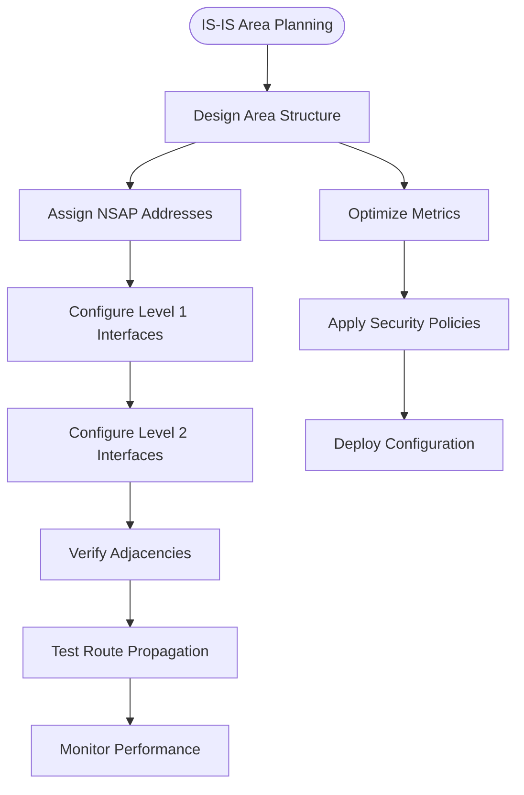
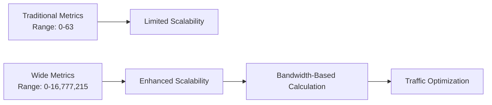
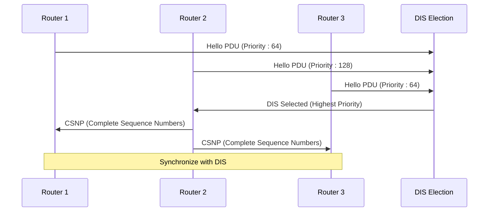
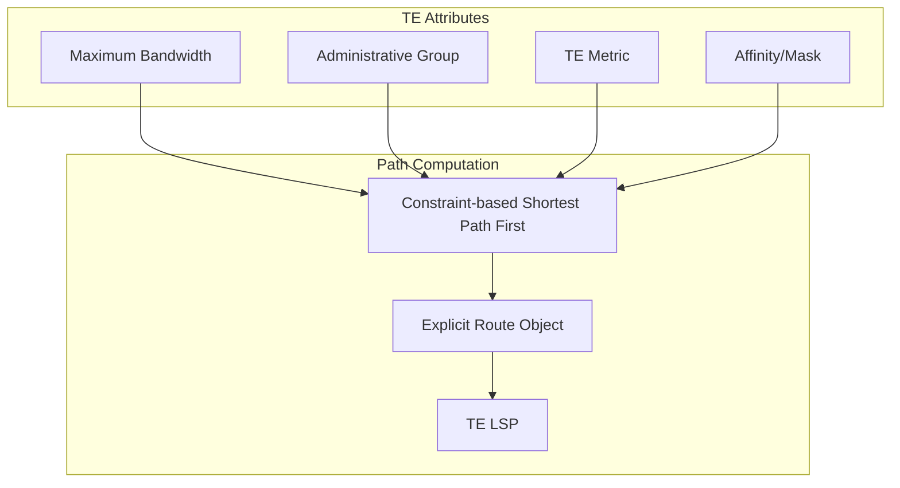
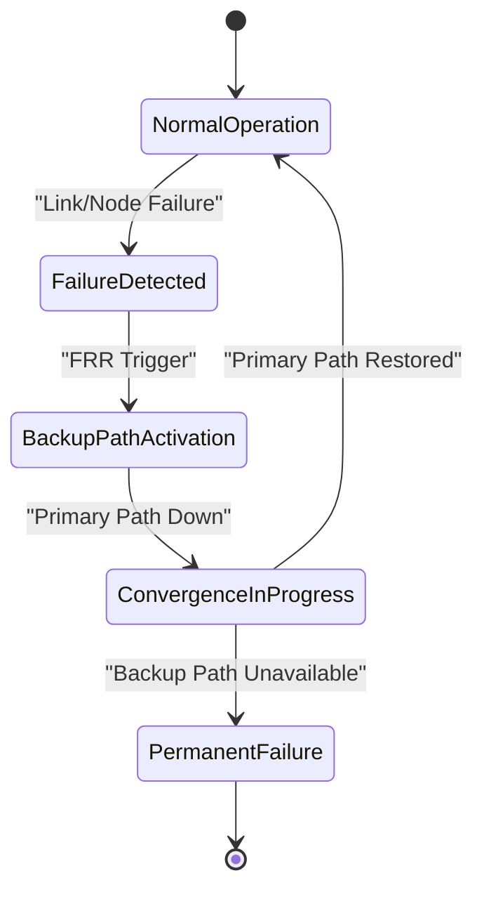
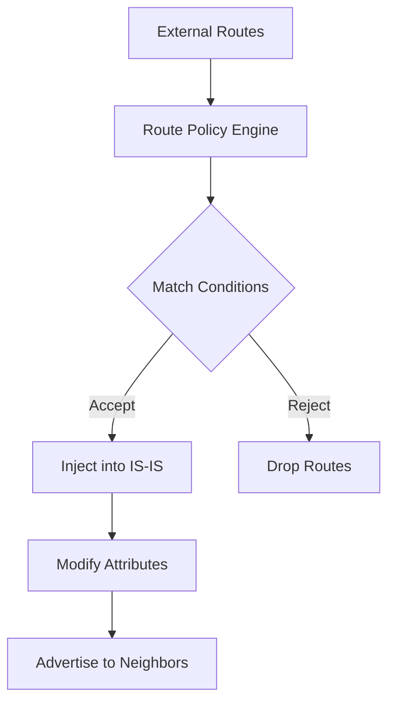
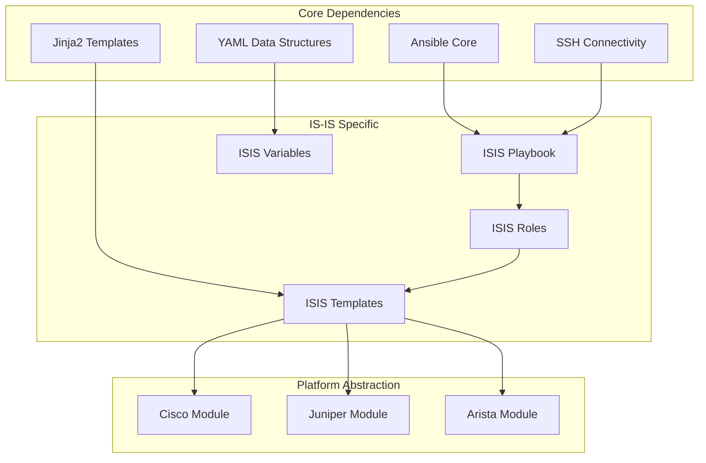
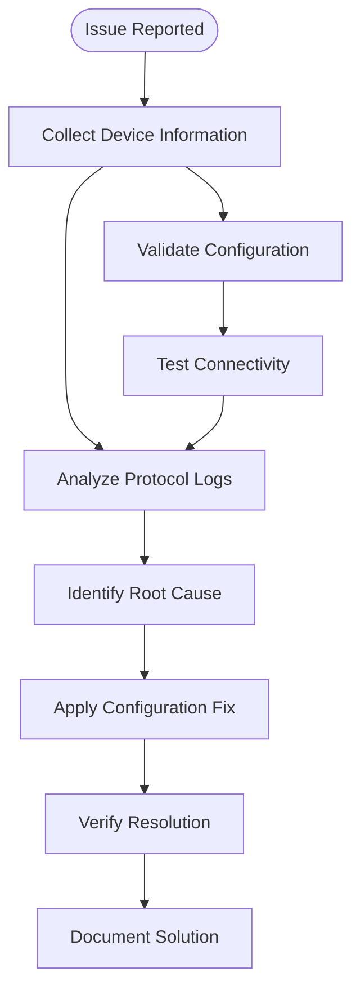

# IS-IS Routing Protocol Deployment

<cite>
**Referenced Files in This Document**
- [README.md](file://README.md)
</cite>

## Table of Contents
1. [Introduction](#introduction)
2. [Project Structure](#project-structure)
3. [Core Components](#core-components)
4. [Architecture Overview](#architecture-overview)
5. [Detailed Component Analysis](#detailed-component-analysis)
6. [Dependency Analysis](#dependency-analysis)
7. [Performance Considerations](#performance-considerations)
8. [Troubleshooting Guide](#troubleshooting-guide)
9. [Conclusion](#conclusion)
10. [Appendices](#appendices)

## Introduction

This document provides comprehensive guidance for deploying IS-IS (Intermediate System to Intermediate System) routing protocol automation using the enterprise network automation platform. The platform supports large-scale enterprise networks with multi-vendor environments including Cisco, Juniper, and Arista platforms.

IS-IS is a link-state routing protocol widely used in service provider and enterprise core networks due to its scalability, fast convergence, and support for both IPv4 and IPv6. The automation platform enables consistent deployment across thousands of devices while maintaining compliance and operational excellence.

The IS-IS automation leverages Ansible playbooks, Jinja2 templates, and structured data management to ensure repeatable, testable, and maintainable routing protocol deployments.

## Project Structure

The network automation platform follows a modular architecture designed for enterprise-scale operations. The IS-IS routing protocol configuration is integrated into the broader automation framework.

**Diagram sources**
- [README.md:103-180](file://README.md#L103-L180)
- [README.md:371-437](file://README.md#L371-L437)

The platform organizes IS-IS configurations through a hierarchical structure:

- **Playbooks**: High-level orchestration scripts (`playbooks/isis.yml`)
- **Roles**: Reusable configuration components (`roles/`)
- **Templates**: Vendor-specific configuration generation (`templates/cisco_ios/`, `templates/juniper_mx/`, `templates/arista_eos/`)
- **Variables**: Structured configuration data (`group_vars/`, `host_vars/`)

**Section sources**
- [README.md:103-180](file://README.md#L103-L180)
- [README.md:371-437](file://README.md#L371-L437)

## Core Components

The IS-IS automation system consists of several key components that work together to provide comprehensive routing protocol management:

### IS-IS Playbook Architecture

The `isis.yml` playbook serves as the primary entry point for IS-IS configuration deployment. It orchestrates the entire configuration process across multiple device types and vendors.

### Template Engine

Jinja2 templates generate vendor-specific IS-IS configurations from structured data, ensuring consistency while accommodating platform differences.

### Variable Management

Structured YAML variables define IS-IS parameters including area addresses, NSAP assignments, metric configurations, and interface settings.

### Multi-Vendor Support

The platform supports three major networking vendors with platform-specific implementations:

| Vendor | Platform | IS-IS Features |
|--------|----------|----------------|
| Cisco | IOS, IOS-XE, NX-OS | Full IS-IS support with MPLS TE extensions |
| Juniper | MX, SRX | Comprehensive IS-IS with FRR capabilities |
| Arista | EOS | Enterprise-grade IS-IS with telemetry integration |

**Section sources**
- [README.md:203-227](file://README.md#L203-L227)
- [README.md:371-437](file://README.md#L371-L437)

## Architecture Overview

The IS-IS deployment architecture follows a layered approach optimized for large-scale enterprise networks:

**Diagram sources**
- [README.md:54-99](file://README.md#L54-L99)
- [README.md:288-309](file://README.md#L288-L309)

### IS-IS Level Hierarchy

The IS-IS protocol implements a two-level hierarchy:

**Level 1 (L1)**: Intra-area routing within a single IS-IS area
- Handles local traffic within the area
- Maintains detailed topology information for the area
- Uses default route injection from L2 routers

**Level 2 (L2)**: Inter-area routing between different IS-IS areas
- Provides backbone connectivity across areas
- Maintains summarized routing information
- Enables route leaking between levels when needed

### Area Addressing Scheme

Enterprise networks typically implement hierarchical area addressing:

**Diagram sources**
- [README.md:103-180](file://README.md#L103-L180)

## Detailed Component Analysis

### IS-IS Level Configuration

#### Level 1 (Intra-area) Configuration

Level 1 routers maintain complete topology information for their area and handle intra-area traffic forwarding. Key configuration elements include:

- **Area Address Assignment**: Unique area identifier for each IS-IS domain
- **Interface Configuration**: Enabling IS-IS on Layer 2 interfaces
- **Metric Configuration**: Path cost calculations for optimal routing
- **Authentication**: Password-based or MD5 authentication for security

#### Level 2 (Inter-area) Configuration

Level 2 routers form the backbone and provide inter-area connectivity:

- **Backbone Area**: Typically Area 0.0000 or custom backbone designation
- **Route Leaking**: Controlled redistribution between L1 and L2
- **Summarization**: Route aggregation to reduce LSP flooding
- **Policy Control**: Traffic engineering and path selection policies

### Metric Tuning Strategies

#### Wide Metrics Implementation

Wide metrics support larger metric values (up to 16 million) compared to traditional metrics (0-63):

#### Bandwidth-Based Calculations

Automatic metric calculation based on interface bandwidth:

- **Cisco**: `metric-style wide` with automatic bandwidth calculation
- **Juniper**: `metric-style wide` with interface bandwidth reference
- **Arista**: `metric-style wide` with configurable bandwidth reference

#### Administrative Weight Adjustments

Administrative weights allow manual override of calculated metrics:

- **Per-interface weighting**: Adjust metrics for specific links
- **Policy-based adjustments**: Dynamic metric modification based on conditions
- **Load balancing control**: Influence ECMP path selection

### Network Types and DIS Election

#### Point-to-Point Networks

Point-to-point links require minimal configuration:

- **No DIS election**: Direct adjacency formation
- **Simplified LSP flooding**: Reduced overhead
- **Faster convergence**: Minimal protocol overhead

#### Broadcast Networks

Broadcast networks require Designated Intermediate System (DIS) election:

**Diagram sources**
- [README.md:103-180](file://README.md#L103-L180)

#### Pseudo-node Generation

The DIS generates pseudo-node LSPs to represent the broadcast segment:

- **Reduced LSP count**: Single LSP represents all routers on segment
- **Efficient flooding**: Optimized LSP distribution
- **Topology simplification**: Cleaner LSDB representation

### LSP Flooding Optimization

#### LSP Database Synchronization

Optimized synchronization mechanisms:

- **Partial Sequence Number PDUs (PSNP)**: Selective database updates
- **Complete Sequence Number PDUs (CSNP)**: Periodic full synchronization
- **Database filtering**: Reduce unnecessary LSP propagation

#### Flood Reduction Techniques

- **LSP suppression**: Prevent unnecessary LSP regeneration
- **Incremental updates**: Only changed TLVs in subsequent LSPs
- **Area summarization**: Reduce LSP scope and frequency

### MPLS Integration and Traffic Engineering

#### MPLS Label Distribution

IS-IS integrates with MPLS for label distribution:

- **Label Advertisement**: LSPs carry label binding information
- **Forwarding Equivalence Classes**: FEC mapping for traffic engineering
- **Explicit Routes**: Path control through extended attributes

#### Traffic Engineering Extensions

IS-IS TE extensions enable advanced traffic engineering:

**Diagram sources**
- [README.md:103-180](file://README.md#L103-L180)

### Fast Reroute (FRR) Implementation

#### Protection Schemes

IS-IS supports various FRR protection mechanisms:

- **Node Protection**: Backup paths around node failures
- **Link Protection**: Backup paths around link failures
- **Shared Risk Link Groups (SRLG)**: Avoid common failure domains

#### Local Repair Mechanisms

**Diagram sources**
- [README.md:103-180](file://README.md#L103-L180)

### Route Leaking Between Levels

#### Controlled Redistribution

Route leaking enables selective route sharing between IS-IS levels:

- **L1 to L2 Leaking**: Export specific L1 routes to backbone
- **L2 to L1 Leaping**: Import backbone routes to access areas
- **Policy-based Filtering**: Conditional route advertisement

#### Best Practices

- **Avoid routing loops**: Careful policy design prevents circular dependencies
- **Route summarization**: Aggregate routes before leaking
- **Metric manipulation**: Adjust metrics to influence path selection

### Redistribution Scenarios

#### External Route Redistribution

Integration with other routing protocols:

- **Static Route Injection**: Manual route advertisement
- **BGP Redistribution**: Border gateway integration
- **Connected Route Advertisement**: Interface subnet discovery

#### Policy Implementation

**Diagram sources**
- [README.md:103-180](file://README.md#L103-L180)

### Vendor-Specific Implementations

#### Cisco Platform Configuration

Cisco IOS/IOS-XE/NX-OS platforms provide comprehensive IS-IS support:

- **Command Syntax**: Native Cisco CLI commands
- **Feature Set**: Complete IS-IS feature availability
- **Integration**: Deep integration with Cisco ecosystem features

#### Juniper Platform Configuration

Juniper MX/SRX platforms offer robust IS-IS implementation:

- **Configuration Model**: Hierarchical configuration structure
- **Performance**: High-performance packet processing
- **Scalability**: Large-scale routing table support

#### Arista Platform Configuration

Arista EOS provides modern IS-IS implementation:

- **API Integration**: RESTCONF/NETCONF support
- **Telemetry**: Real-time monitoring and analytics
- **Automation**: Python scripting and API-driven configuration

### Troubleshooting Adjacency Formation

#### Common Issues and Resolution

| Issue | Symptoms | Resolution |
|-------|----------|------------|
| Authentication Mismatch | Adjacency flapping, authentication errors | Verify password configuration on both ends |
| Area Address Mismatch | No adjacency formation | Ensure matching area addresses for L1 adjacencies |
| MTU Mismatch | Intermittent adjacency issues | Match MTU values on connected interfaces |
| Circuit Type Mismatch | Partial adjacency formation | Verify circuit type compatibility |

#### Diagnostic Commands

Platform-specific diagnostic approaches:

- **Cisco**: `show isis neighbors`, `show isis adjacency`, `debug isis adj packets`
- **Juniper**: `show isis neighbor`, `show isis adjacency`, `monitor event isis`
- **Arista**: `show isis neighbors`, `show isis adjacency`, `show logging`

### LSP Synchronization Issues

#### Database Synchronization Problems

Common LSP synchronization issues:

- **Incomplete LSDB**: Missing LSPs in database
- **Version Skew**: Different LSP versions across routers
- **Flooding Delays**: Slow LSP propagation across network

#### Resolution Strategies

- **Manual Resynchronization**: Force LSP refresh and resynchronization
- **Database Cleanup**: Remove stale LSPs and rebuild database
- **Monitoring**: Implement continuous LSP database monitoring

**Section sources**
- [README.md:674-685](file://README.md#L674-L685)

## Dependency Analysis

The IS-IS automation system has well-defined dependencies and relationships:

**Diagram sources**
- [README.md:103-180](file://README.md#L103-L180)

### Component Coupling Analysis

The system demonstrates good separation of concerns:

- **Low Coupling**: Playbooks depend on roles rather than direct template references
- **High Cohesion**: Related IS-IS functionality grouped within roles
- **Abstraction Layers**: Vendor-specific details hidden behind common interfaces

### External Dependencies

Key external dependencies include:

- **Network Connectivity**: SSH access to target devices
- **Credential Management**: Secure credential storage and retrieval
- **Template Rendering**: Jinja2 engine for configuration generation
- **Validation Tools**: Pre-deployment configuration validation

**Section sources**
- [README.md:103-180](file://README.md#L103-L180)

## Performance Considerations

### Scalability Optimization

For large-scale deployments, consider these performance optimizations:

- **Parallel Execution**: Concurrent device configuration where possible
- **Incremental Updates**: Minimize configuration changes during updates
- **Database Optimization**: Tune IS-IS database size and LSP frequency

### Memory and CPU Utilization

IS-IS resource consumption considerations:

- **LSDB Size**: Monitor and optimize LSP database growth
- **Adjacency Count**: Plan for maximum adjacency requirements
- **LSP Generation**: Tune LSP generation intervals and sizes

### Network Impact

Minimize protocol overhead impact:

- **Hello Interval Tuning**: Balance convergence speed vs. overhead
- **LSP Refresh Rates**: Optimize LSP regeneration frequency
- **Packet Size Limits**: Manage LSP fragmentation and transmission

## Troubleshooting Guide

### Common Deployment Issues

| Issue Category | Symptoms | Resolution Approach |
|---------------|----------|-------------------|
| Connectivity | Ansible connection timeouts | Verify SSH reachability and credentials |
| Template Errors | Jinja2 rendering failures | Check template syntax and variable definitions |
| Configuration Conflicts | Running config conflicts | Use diff mode and validate before deployment |
| Protocol Issues | IS-IS adjacency problems | Check area addresses, authentication, and circuit types |

### Debugging Workflow

### Platform-Specific Diagnostics

#### Cisco Platforms
- **Show Commands**: `show isis database`, `show isis neighbors detail`
- **Debug Commands**: `debug isis adj packets`, `debug isis lsp`
- **Log Analysis**: Syslog monitoring for IS-IS events

#### Juniper Platforms
- **Show Commands**: `show isis database extensive`, `show isis neighbor detail`
- **Event Monitoring**: `monitor event isis` for real-time debugging
- **Trace Options**: Packet tracing for protocol analysis

#### Arista Platforms
- **Show Commands**: `show isis database`, `show isis adjacency`
- **Telemetry**: Real-time metrics collection via gRPC streaming
- **Logging**: Structured logging with correlation IDs

**Section sources**
- [README.md:674-685](file://README.md#L674-L685)

## Conclusion

The IS-IS routing protocol automation platform provides a comprehensive solution for enterprise-scale network deployments. By leveraging Ansible playbooks, Jinja2 templates, and structured data management, the platform ensures consistent, reliable, and maintainable IS-IS configuration across multi-vendor environments.

Key benefits include:

- **Consistency**: Standardized configuration across all platforms
- **Scalability**: Support for thousands of devices with automated deployment
- **Reliability**: Built-in validation and rollback capabilities
- **Maintainability**: Version-controlled configuration management
- **Compliance**: Automated policy enforcement and audit trails

The platform's modular architecture enables easy extension for new vendors and features while maintaining backward compatibility. The comprehensive troubleshooting guide and monitoring capabilities ensure operational excellence in production environments.

For successful deployment, organizations should follow best practices for IS-IS design, implement proper change management processes, and establish comprehensive monitoring and alerting strategies.

## Appendices

### Quick Reference Commands

#### Basic IS-IS Operations
- **Enable IS-IS**: Configure router IS-IS instance
- **Set Area Address**: Define IS-IS area identification
- **Enable Interfaces**: Activate IS-IS on specific interfaces
- **Configure Metrics**: Set path costs and administrative weights

#### Advanced Configuration
- **MPLS Integration**: Enable label distribution and traffic engineering
- **FRR Configuration**: Implement fast reroute protection schemes
- **Route Leaking**: Configure controlled redistribution between levels
- **Security Policies**: Implement authentication and authorization

### Monitoring and Alerting

#### Key Metrics to Monitor
- IS-IS adjacency state and uptime
- LSP database size and growth rate
- Route table size and convergence time
- Protocol CPU and memory utilization
- Error rates and packet drops

#### Alert Thresholds
- Adjacency flapping detection
- LSP database growth anomalies
- Route convergence delays
- Resource utilization thresholds
- Security violation alerts