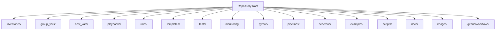
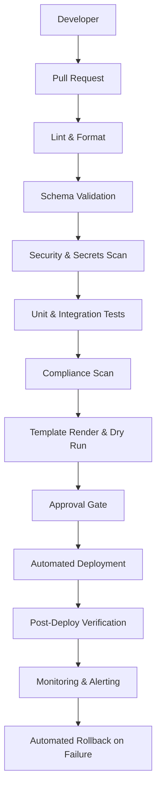
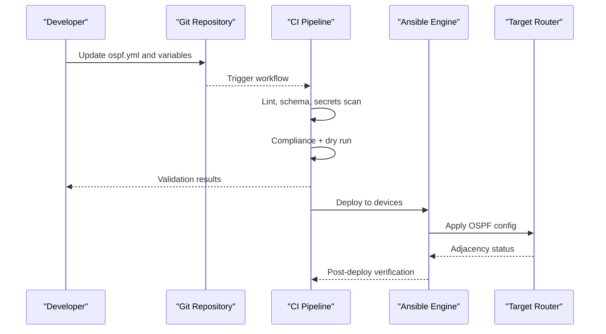
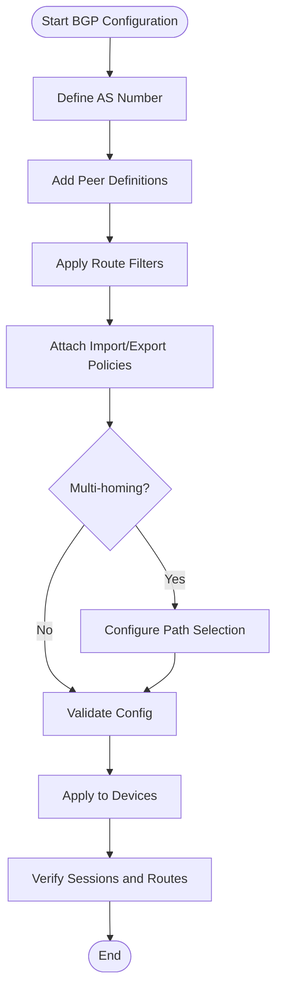
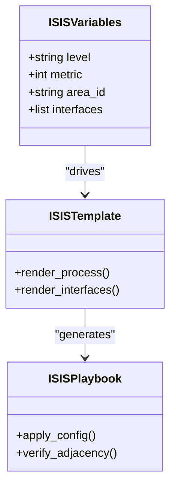
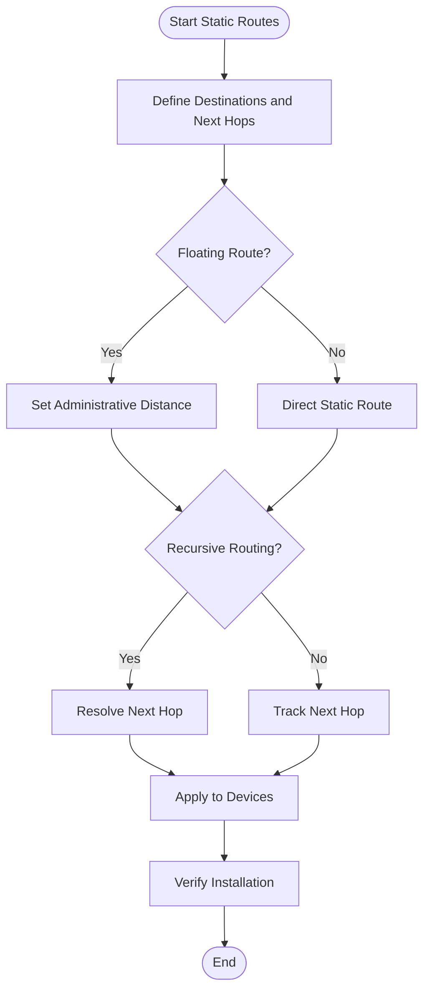
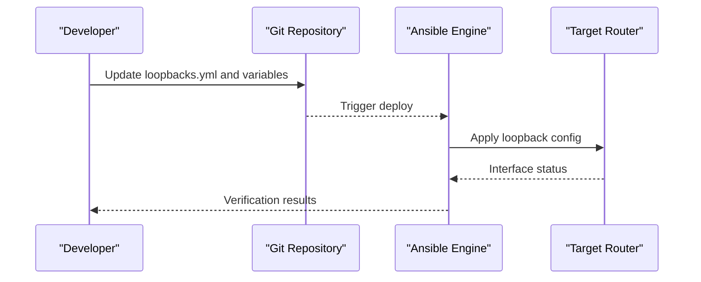
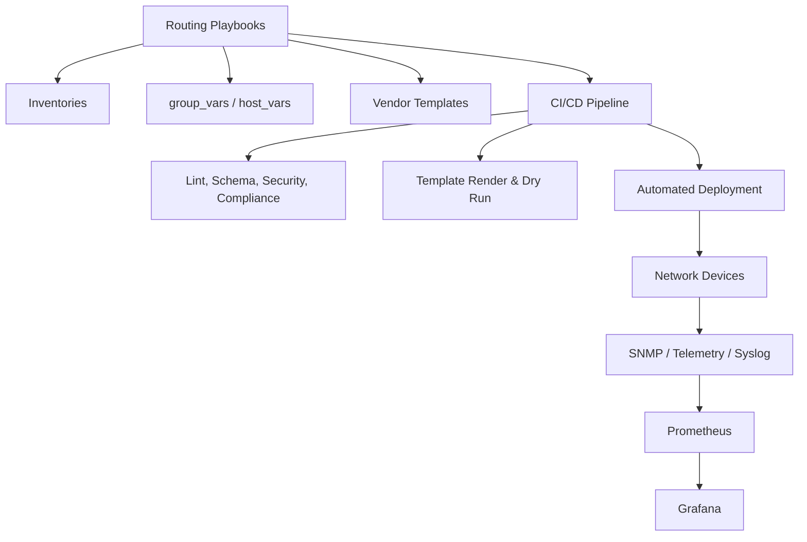

# Layer 3 Routing Protocol Automation

<cite>
**Referenced Files in This Document**
- [README.md](file://README.md)
</cite>

## Table of Contents
1. [Introduction](#introduction)
2. [Project Structure](#project-structure)
3. [Core Components](#core-components)
4. [Architecture Overview](#architecture-overview)
5. [Detailed Component Analysis](#detailed-component-analysis)
6. [Dependency Analysis](#dependency-analysis)
7. [Performance Considerations](#performance-considerations)
8. [Troubleshooting Guide](#troubleshooting-guide)
9. [Conclusion](#conclusion)
10. [Appendices](#appendices)

## Introduction
This document provides a comprehensive guide to automating Layer 3 routing protocols across OSPF, BGP, IS-IS, and static routing using the repository’s automation framework. It focuses on how the platform organizes routing playbooks, variables, templates, and validation to deliver vendor-agnostic, GitOps-driven deployments. The content is designed for both network engineers and automation practitioners, with progressive complexity layers and practical guidance grounded in the repository’s documented structure and capabilities.

## Project Structure
The repository follows a modular, GitOps-oriented layout that separates inventories, variables, playbooks, roles, templates, tests, and monitoring. Routing protocol automation is organized under playbooks and supported by Jinja2 templates per vendor platform. The README outlines the directory hierarchy and playbook catalog, including routing-specific entries.

**Diagram sources**
- [README.md:103-180](file://README.md#L103-L180)

**Section sources**
- [README.md:103-180](file://README.md#L103-L180)

## Core Components
Routing automation components are defined through playbooks, structured data (variables), and vendor-specific templates. The repository documents the following routing-related playbooks:
- ospf.yml: Configure OSPF routing
- bgp.yml: Configure BGP peering and policies
- isis.yml: Configure IS-IS routing
- static_routes.yml: Manage static routes
- loopbacks.yml: Configure loopback interfaces

These playbooks operate within an inventory model that groups devices by environment, role, region, and vendor, enabling consistent application of routing configurations across multi-vendor platforms.

**Section sources**
- [README.md:401-410](file://README.md#L401-L410)
- [README.md:284-335](file://README.md#L284-L335)

## Architecture Overview
The automation engine orchestrates configuration generation and deployment via Ansible, leveraging Jinja2 templates and structured variables. The CI/CD pipeline enforces linting, schema validation, security scanning, compliance checks, dry runs, and post-deploy verification. Observability integrates SNMP, telemetry, and syslog into Prometheus/Grafana.

**Diagram sources**
- [README.md:36-50](file://README.md#L36-L50)

## Detailed Component Analysis

### OSPF Automation
OSPF automation covers area design, neighbor relationships, route summarization, and authentication. The platform uses structured variables and Jinja2 templates to generate vendor-specific OSPF configurations. Inventory-based grouping ensures consistent application across core routers and distribution nodes.

Key aspects:
- Area design: Define areas and interface assignments per device role
- Neighbor relationships: Use interface-based OSPF activation and passive settings
- Route summarization: Apply summary addresses at area boundaries or redistribution points
- Authentication: Configure message-digest or key-chain based authentication as supported by the target vendor

Operational flow:
- Variables define OSPF process ID, router ID, areas, and interface mappings
- Template renders OSPF commands per vendor syntax
- Playbook applies configuration and validates adjacency formation

[No sources needed since this diagram shows conceptual workflow, not actual code structure]

**Section sources**
- [README.md:401-410](file://README.md#L401-L410)
- [README.md:103-180](file://README.md#L103-L180)

### BGP Automation
BGP automation includes AS number configuration, peer definitions, route filtering, policy application, and multi-homing scenarios. Structured variables capture peer attributes, address families, and policy references. Templates render vendor-specific BGP constructs.

Key aspects:
- AS number: Global autonomous system assignment
- Peering: Neighbor IP, remote AS, timers, and description
- Route filtering: Prefix-lists, route-maps, and community tagging
- Policy application: Import/export policies per peer or group
- Multi-homing: Multiple upstream peers with path selection and failover

Operational flow:
- Variables define peers, policies, and address families
- Template generates BGP configuration blocks
- Playbook applies changes and verifies session establishment

[No sources needed since this diagram shows conceptual workflow, not actual code structure]

**Section sources**
- [README.md:401-410](file://README.md#L401-L410)
- [README.md:103-180](file://README.md#L103-L180)

### IS-IS Automation
IS-IS automation supports large-scale enterprise networks with level hierarchy and metric tuning. Variables capture level assignments, metrics, and interface parameters. Templates produce vendor-specific IS-IS configuration.

Key aspects:
- Level hierarchy: Level-1 and Level-2 topology design
- Metric tuning: Interface and global metric adjustments
- Area addressing: NSAP or NET configuration
- Redistribution: Interoperability with OSPF/BGP where required

Operational flow:
- Variables define levels, metrics, and area IDs
- Template renders IS-IS process and interface settings
- Playbook deploys and validates adjacency and reachability

[No sources needed since this diagram shows conceptual workflow, not actual code structure]

**Section sources**
- [README.md:401-410](file://README.md#L401-L410)
- [README.md:103-180](file://README.md#L103-L180)

### Static Routes Automation
Static route management includes floating static routes, recursive routing, and next-hop tracking. Variables enumerate destinations, next hops, and administrative distances. Templates generate vendor-specific static route statements.

Key aspects:
- Floating static routes: Higher administrative distance for backup paths
- Recursive routing: Next hop resolution via another route
- Next-hop tracking: Track object or IP SLA integration for dynamic failover

Operational flow:
- Variables define route entries and tracking objects
- Template renders static route commands
- Playbook applies and verifies route installation

[No sources needed since this diagram shows conceptual workflow, not actual code structure]

**Section sources**
- [README.md:401-410](file://README.md#L401-L410)
- [README.md:103-180](file://README.md#L103-L180)

### Loopback Interfaces Automation
Loopback interfaces provide stable router IDs and management access. Variables define loopback IPs and descriptions. Templates generate loopback interface configurations per vendor.

Key aspects:
- Stable router ID: Use loopback address as OSPF/BGP router ID
- Management access: Enable SSH/SNMP over loopback
- Consistency: Ensure unique loopback prefixes per device

Operational flow:
- Variables list loopback interfaces and addresses
- Template renders interface configuration
- Playbook applies and verifies reachability

[No sources needed since this diagram shows conceptual workflow, not actual code structure]

**Section sources**
- [README.md:401-410](file://README.md#L401-L410)
- [README.md:103-180](file://README.md#L103-L180)

## Dependency Analysis
Routing playbooks depend on inventories, variables, and templates. The CI/CD pipeline enforces quality gates before deployment. Observability integrates with devices via SNMP, telemetry, and syslog.

**Diagram sources**
- [README.md:103-180](file://README.md#L103-L180)
- [README.md:36-50](file://README.md#L36-L50)
- [README.md:587-604](file://README.md#L587-L604)

**Section sources**
- [README.md:103-180](file://README.md#L103-L180)
- [README.md:36-50](file://README.md#L36-L50)
- [README.md:587-604](file://README.md#L587-L604)

## Performance Considerations
- Convergence optimization: Tune OSPF timers, BGP keepalives, and IS-IS hello intervals via variables; apply conservative defaults in staging before production rollout
- Template efficiency: Minimize conditional branches in Jinja2 templates to reduce rendering time
- Parallel deployment: Leverage Ansible parallelism for bulk updates while respecting change windows
- Validation early: Use dry runs and schema checks to prevent costly rollback cycles

[No sources needed since this section provides general guidance]

## Troubleshooting Guide
Common issues and resolutions:
- Connection timeouts: Verify SSH reachability and credentials
- Template rendering errors: Inspect Jinja2 syntax and variable completeness
- Compliance failures: Review policy violations and running config diffs
- CI pipeline failures: Check workflow logs for actionable messages
- Vault authentication failures: Validate OIDC tokens or AppRole credentials
- Molecule test failures: Ensure container runtime availability
- Batfish analysis errors: Validate snapshots and model coverage

**Section sources**
- [README.md:674-685](file://README.md#L674-L685)

## Conclusion
The repository provides a robust foundation for automating Layer 3 routing protocols across multiple vendors. By organizing routing playbooks, variables, and templates within a GitOps workflow, teams can achieve consistent, compliant, and observable deployments. The documented architecture and playbook catalogue enable scalable automation of OSPF, BGP, IS-IS, static routes, and loopback interfaces, with integrated testing, compliance, and monitoring.

[No sources needed since this section summarizes without analyzing specific files]

## Appendices
- Quick start commands and bootstrap steps are provided in the repository documentation
- Inventory examples illustrate device grouping by environment, role, region, and vendor
- Monitoring dashboards cover network health, automation metrics, and compliance overview

**Section sources**
- [README.md:229-280](file://README.md#L229-L280)
- [README.md:284-335](file://README.md#L284-L335)
- [README.md:606-616](file://README.md#L606-L616)