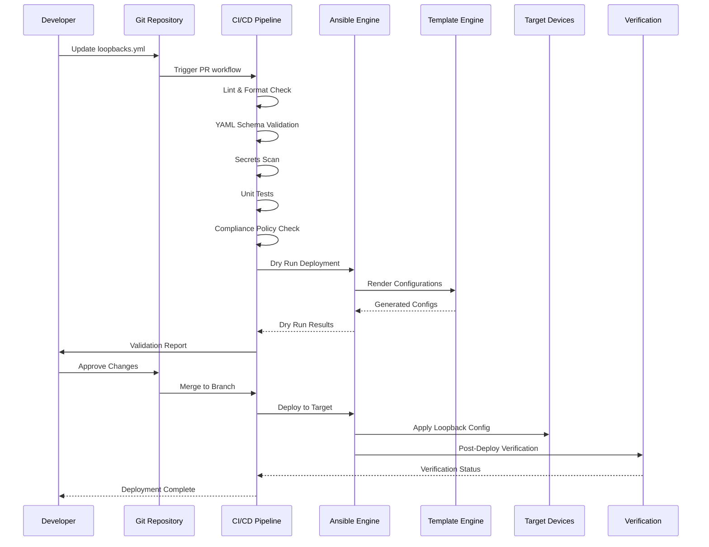
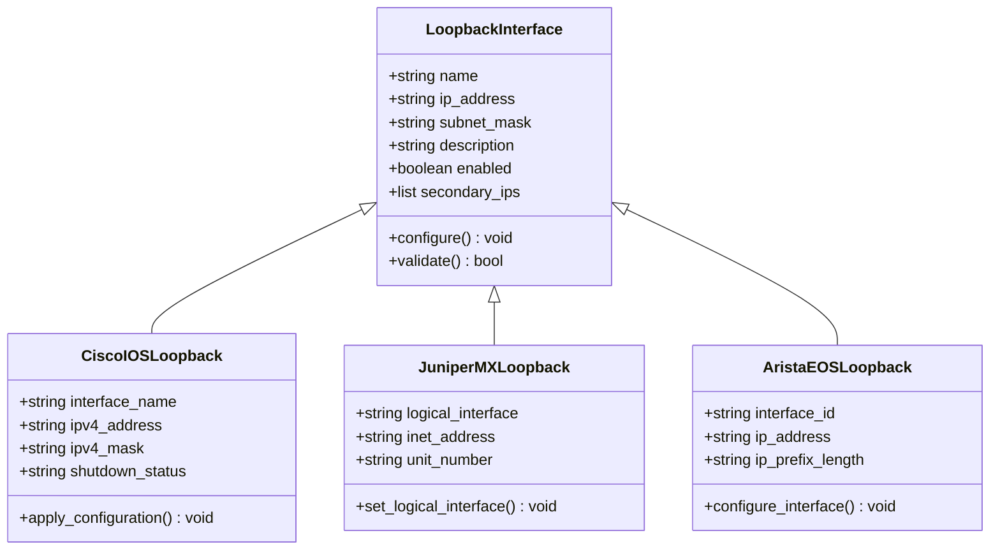
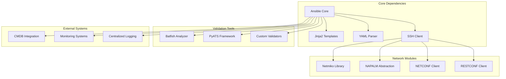

# Loopback Interface Configuration

<cite>
**Referenced Files in This Document**
- [README.md](file://README.md)
</cite>

## Table of Contents
1. [Introduction](#introduction)
2. [Project Structure](#project-structure)
3. [Core Components](#core-components)
4. [Architecture Overview](#architecture-overview)
5. [Detailed Component Analysis](#detailed-component-analysis)
6. [Dependency Analysis](#dependency-analysis)
7. [Performance Considerations](#performance-considerations)
8. [Troubleshooting Guide](#troubleshooting-guide)
9. [Conclusion](#conclusion)
10. [Appendices](#appendices)

## Introduction

This document provides comprehensive guidance for automating loopback interface configuration using the Enterprise Network Automation Platform's loopbacks.yml playbook. Loopback interfaces serve as critical infrastructure components in enterprise networks, providing stable router IDs, management access points, and reliable endpoints for routing protocols.

The platform supports vendor-agnostic loopback configuration across multiple vendors including Cisco IOS/IOS-XE/NX-OS, Juniper SRX/MX, Arista EOS, Palo Alto, Fortinet, Check Point, F5, pfSense, and OPNsense devices.

## Project Structure

The network automation platform follows a modular architecture with dedicated directories for playbooks, templates, roles, and vendor-specific configurations. The loopback interface automation leverages the following key structural components:

```mermaid
graph TB
subgraph "Automation Framework"
Playbooks[Playbooks Directory]
Templates[Templates Directory]
Roles[Roles Directory]
Variables[Variables Directory]
end
subgraph "Loopback Implementation"
LoopbackPlaybook[loopbacks.yml]
VendorTemplates[Vendor-Specific Templates]
GroupVars[group_vars/]
HostVars[host_vars/]
end
subgraph "Target Devices"
Routers[Routers]
Switches[Switches]
Firewalls[Firewalls]
LoadBalancers[Load Balancers]
end
Playbooks --> LoopbackPlaybook
Templates --> VendorTemplates
Variables --> GroupVars
Variables --> HostVars
LoopbackPlaybook --> VendorTemplates
LoopbackPlaybook --> GroupVars
LoopbackPlaybook --> HostVars
VendorTemplates --> Routers
VendorTemplates --> Switches
VendorTemplates --> Firewalls
VendorTemplates --> LoadBalancers
```

**Diagram sources**
- [README.md:103-180](file://README.md#L103-L180)

**Section sources**
- [README.md:103-180](file://README.md#L103-L180)

## Core Components

The loopback interface automation system consists of several interconnected components that work together to provide consistent, scalable loopback configuration across diverse network environments.

### Playbook Architecture

The loopbacks.yml playbook serves as the central orchestration component, coordinating loopback interface creation and management across all supported device types. It integrates with the broader automation framework to ensure consistency and compliance.

### Template System

Vendor-specific Jinja2 templates handle the syntax differences between platforms while maintaining consistent configuration semantics. The template system supports:

- Cisco IOS/IOS-XE/NX-OS loopback configuration
- Juniper SRX/MX logical interface definitions  
- Arista EOS loopback interface setup
- Firewall-specific loopback implementations
- Cloud networking virtual interfaces

### Variable Management

Structured data management through group_vars and host_vars ensures consistent IP address allocation, naming conventions, and policy enforcement across the network fabric.

**Section sources**
- [README.md:112-128](file://README.md#L112-L128)
- [README.md:438-456](file://README.md#L438-L456)

## Architecture Overview

The loopback interface automation follows a GitOps-driven architecture with comprehensive validation, testing, and deployment workflows.

**Diagram sources**
- [README.md:479-501](file://README.md#L479-L501)

The architecture ensures that loopback configurations undergo rigorous validation before deployment, maintaining network stability and preventing configuration drift.

## Detailed Component Analysis

### Loopback Interface Creation Workflow

The loopback interface creation process follows a systematic approach that ensures consistency and reliability across all network devices.

#### Primary Loopback Configuration

Primary loopback interfaces typically serve as the main router ID and management endpoint. The automation handles:

- Automatic interface numbering based on device role and location
- Subnet planning and IP address allocation
- Descriptive naming conventions
- Administrative tagging for inventory management

#### Secondary Loopback Interfaces

Secondary loopback interfaces provide additional endpoints for specific services or redundancy scenarios:

- Service-specific loopbacks for BGP peering
- Management plane isolation
- Testing and validation endpoints
- High availability failover addresses

#### Vendor-Specific Implementation Patterns

Different vendors implement loopback interfaces with varying syntax and capabilities:

**Diagram sources**
- [README.md:203-226](file://README.md#L203-L226)

**Section sources**
- [README.md:203-226](file://README.md#L203-L226)

### Integration with Routing Protocols

Loopback interfaces integrate seamlessly with routing protocols to provide stable endpoints and improve network resilience.

#### OSPF Integration

Loopback interfaces serve as optimal OSPF router IDs and can be advertised into the OSPF domain:

- Stable router ID assignment independent of physical interface status
- Optimized SPF calculation by advertising loopback networks
- Consistent neighbor relationships during topology changes

#### BGP Integration

BGP uses loopback interfaces for peering sessions to maintain session stability:

- Source address configuration for BGP neighbors
- Multi-hop peering support using loopback addresses
- Graceful restart and route reflection scenarios

#### IS-IS Integration

IS-IS leverages loopback interfaces for system ID assignment and circuit-level reachability.

### High Availability Considerations

Loopback interfaces play a crucial role in high availability architectures:

#### VRRP/HSRP Integration

Virtual Router Redundancy Protocol (VRRP) and Hot Standby Router Protocol (HSRP) use loopback interfaces as virtual IP addresses:

- Failover scenarios where loopback remains reachable
- Load balancing across multiple routers
- Seamless traffic redirection during failures

#### Redundancy Scenarios

Multiple loopback interfaces provide redundancy for different services:

- Primary and backup management endpoints
- Service-specific failover addresses
- Testing and maintenance isolation

**Section sources**
- [README.md:411-416](file://README.md#L411-L416)

### Data Center Fabric Implementation

In modern data center fabrics, loopback interfaces serve multiple critical functions:

#### Spine-Leaf Architecture

Spine switches use loopback interfaces for:

- EVPN control plane endpoints
- VXLAN tunnel termination points
- Management and monitoring access

#### Leaf Switch Configuration

Leaf switches configure loopbacks for:

- Server-facing service endpoints
- Storage network integration
- Application workload addressing

### WAN Edge Router Implementation

WAN edge routers leverage loopback interfaces for:

- Site-to-site VPN termination points
- MPLS label distribution protocol (LDP) router IDs
- Traffic engineering endpoints
- Management plane isolation from customer traffic

### Cloud Interconnect Scenarios

Cloud connectivity scenarios utilize loopback interfaces for:

- Virtual private cloud (VPC) interconnect endpoints
- ExpressRoute/Direct Connect peering addresses
- Cloud gateway management interfaces
- Hybrid cloud routing stability

## Dependency Analysis

The loopback interface automation system has well-defined dependencies within the broader automation framework.

**Diagram sources**
- [README.md:184-199](file://README.md#L184-L199)

**Section sources**
- [README.md:184-199](file://README.md#L184-L199)

## Performance Considerations

Optimizing loopback interface automation requires careful consideration of performance implications at scale.

### Batch Processing Strategies

For large-scale deployments, the automation framework implements:

- Parallel device processing with configurable concurrency limits
- Connection pooling to reduce authentication overhead
- Incremental configuration updates to minimize device load
- Intelligent retry mechanisms for transient failures

### Memory and Resource Management

Efficient resource utilization patterns include:

- Streaming configuration generation instead of bulk loading
- Lazy evaluation of complex template logic
- Memory-efficient data structure handling
- Garbage collection optimization for long-running processes

### Network Bandwidth Optimization

Minimizing network impact during configuration deployment:

- Compression of configuration payloads
- Selective configuration application based on change detection
- Off-peak scheduling for large-scale operations
- Bandwidth throttling for sensitive network segments

## Troubleshooting Guide

Effective troubleshooting of loopback interface automation requires systematic approaches to common issues.

### Common Configuration Issues

| Issue Category | Symptoms | Resolution Approach |
|---|---|---|
| IP Address Conflicts | Duplicate IP detected, routing loops | Validate IP allocation strategy, check for overlapping subnets |
| Interface Naming Inconsistencies | Template rendering errors, missing interfaces | Review naming conventions, verify variable mapping |
| Vendor Compatibility Issues | Syntax errors, unsupported commands | Check vendor-specific template versions, validate platform support |
| Connectivity Problems | Device unreachable, timeout errors | Verify network reachability, check firewall rules, validate credentials |
| Routing Advertisement Issues | Missing routes, protocol instability | Review routing protocol configuration, check advertisement policies |

### Debugging Techniques

The automation framework provides comprehensive debugging capabilities:

- Detailed logging with configurable verbosity levels
- Configuration diff analysis showing exact changes applied
- Real-time execution monitoring with progress tracking
- Error context preservation for root cause analysis

### Validation and Testing

Pre-deployment validation includes:

- Syntax validation against vendor-specific grammars
- Semantic validation using network simulation tools
- Compliance checking against organizational policies
- Impact analysis for potential side effects

**Section sources**
- [README.md:674-685](file://README.md#L674-L685)

## Conclusion

Loopback interface automation represents a foundational capability in modern network automation platforms. The Enterprise Network Automation Platform provides a robust, scalable solution for managing loopback interfaces across diverse vendor ecosystems while maintaining consistency, reliability, and operational efficiency.

Key benefits include:

- **Consistency**: Standardized configuration patterns across all devices
- **Scalability**: Efficient processing of large device fleets
- **Reliability**: Comprehensive validation and error handling
- **Maintainability**: Clear separation of concerns and modular design
- **Compliance**: Automated policy enforcement and audit trails

The platform's GitOps approach ensures that loopback configurations remain versioned, auditable, and reproducible, supporting enterprise-grade operational requirements.

## Appendices

### Best Practices Summary

#### Subnet Planning
- Use /32 addresses for router IDs
- Allocate contiguous blocks per site or function
- Implement hierarchical addressing schemes
- Reserve address ranges for future expansion

#### Naming Conventions
- Include device type, location, and function in descriptions
- Use consistent formatting across all interfaces
- Maintain descriptive comments for administrative clarity
- Follow organizational standards for interface identification

#### Security Considerations
- Restrict management access to authorized networks only
- Implement ACLs on loopback interfaces for security
- Use separate loopbacks for different security domains
- Monitor and log access to management interfaces

#### Operational Excellence
- Regular audits of loopback usage and utilization
- Automated health checks for loopback reachability
- Integration with monitoring and alerting systems
- Documentation of all loopback assignments and purposes