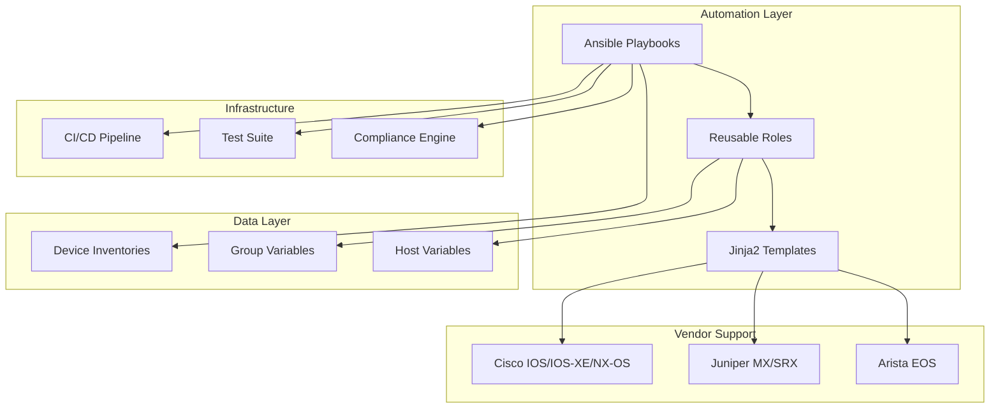
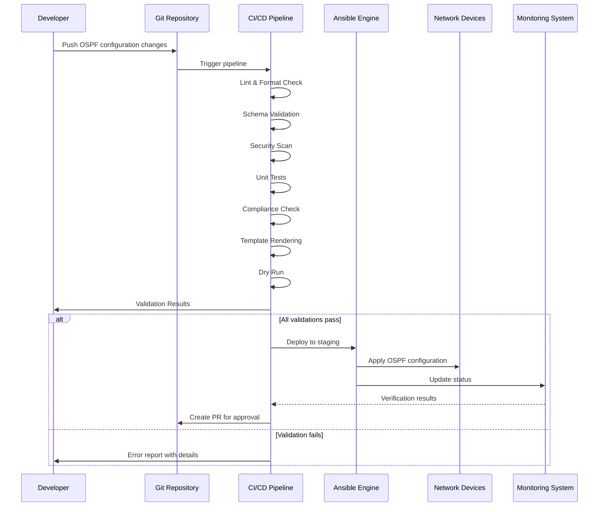
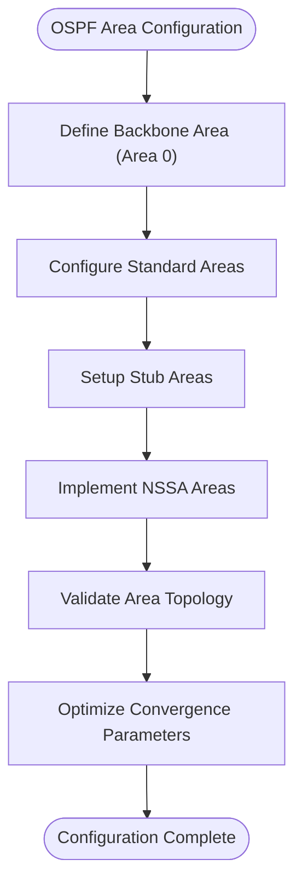
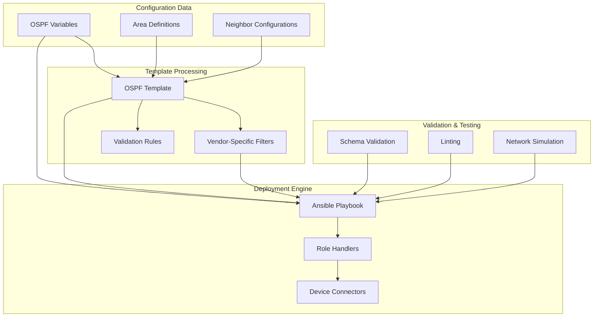

# OSPF Routing Protocol Configuration

<cite>
**Referenced Files in This Document**
- [README.md](file://README.md)
</cite>

## Table of Contents
1. [Introduction](#introduction)
2. [Project Structure](#project-structure)
3. [Core Components](#core-components)
4. [Architecture Overview](#architecture-overview)
5. [Detailed Component Analysis](#detailed-component-analysis)
6. [Dependency Analysis](#dependency-analysis)
7. [Performance Considerations](#performance-considerations)
8. [Troubleshooting Guide](#troubleshooting-guide)
9. [Conclusion](#conclusion)
10. [Appendices](#appendices)

## Introduction

This document provides comprehensive guidance for automating OSPF (Open Shortest Path First) routing protocol configuration using the enterprise network automation platform. The platform supports multi-vendor environments including Cisco IOS/IOS-XE/NX-OS, Juniper MX/SRX, and Arista EOS devices through Ansible playbooks and Jinja2 templates.

The OSPF automation framework enables consistent configuration management across large-scale enterprise networks, supporting advanced features such as multi-area design, route summarization, authentication methods, and vendor-specific optimizations.

## Project Structure

The network automation platform follows a modular architecture designed for enterprise-scale deployments:



**Diagram sources**
- [README.md:103-180](file://README.md#L103-L180)

The OSPF configuration is managed through the `ospf.yml` playbook, which integrates with the broader automation ecosystem including inventory management, template rendering, and compliance validation.

**Section sources**
- [README.md:103-180](file://README.md#L103-L180)
- [README.md:371-437](file://README.md#L371-L437)

## Core Components

### OSPF Automation Framework

The OSPF automation system consists of several key components working together to provide comprehensive routing protocol management:

#### Playbook Architecture
The `ospf.yml` playbook serves as the primary entry point for OSPF configuration deployment, orchestrating multiple roles and tasks to ensure consistent configuration across heterogeneous device fleets.

#### Template System
Jinja2 templates provide vendor-specific OSPF configuration generation, supporting syntax variations across Cisco, Juniper, and Arista platforms while maintaining configuration consistency.

#### Inventory Management
Structured inventory data defines device topology, area assignments, and OSPF parameters, enabling automated multi-area OSPF deployment.

#### Validation and Testing
Pre-deployment validation ensures configuration correctness through schema validation, linting, and simulation testing before production deployment.

**Section sources**
- [README.md:371-437](file://README.md#L371-L437)
- [README.md:438-456](file://README.md#L438-L456)

## Architecture Overview

The OSPF automation platform implements a GitOps-driven workflow with comprehensive validation and compliance enforcement:



**Diagram sources**
- [README.md:479-514](file://README.md#L479-L514)

The architecture supports automated rollback mechanisms, ensuring network stability during OSPF configuration changes.

**Section sources**
- [README.md:479-514](file://README.md#L479-L514)

## Detailed Component Analysis

### OSPF Area Design Patterns

The automation platform supports comprehensive OSPF area design patterns through structured variable definitions and template rendering:

#### Backbone Area (Area 0) Configuration
The backbone area serves as the central transit area connecting all other OSPF areas. The automation framework ensures proper backbone area configuration across core routers.

#### Standard Areas Implementation
Standard areas provide full OSPF functionality with complete LSDB synchronization. The platform automates standard area deployment with optimal convergence settings.

#### Stub Area Configuration
Stub areas reduce LSDB size by filtering external routes. The automation system configures stub areas with appropriate default route injection and area boundary optimization.

#### NSSA (Not-So-Stubby Area) Deployment
NSSA areas allow limited external route injection while maintaining stub characteristics. The framework handles NSSA configuration with proper translation boundaries.



**Diagram sources**
- [README.md:371-437](file://README.md#L371-L437)

### Neighbor Relationship Establishment

The automation framework manages OSPF neighbor relationships through precise hello/dead interval configuration and authentication setup:

#### Hello and Dead Interval Tuning
Optimized hello and dead intervals ensure rapid adjacency formation while maintaining network stability. The platform calculates appropriate intervals based on interface types and network scale.

#### Authentication Methods
Support for both MD5 and SHA authentication methods ensures secure OSPF neighbor establishment across different vendor platforms and security requirements.

#### Passive Interface Configuration
Passive interfaces prevent unnecessary OSPF adjacencies while still advertising connected networks, optimizing resource utilization on edge interfaces.

**Section sources**
- [README.md:371-437](file://README.md#L371-L437)

### Route Summarization and Metric Optimization

Advanced route summarization and metric tuning capabilities enable optimal OSPF performance:

#### Area Boundary Summarization
Automatic route summarization at area boundaries reduces LSDB size and improves convergence times. The platform identifies optimal summary points based on network topology.

#### ASBR Configuration
Automated ASBR (Autonomous System Boundary Router) configuration enables seamless integration between OSPF and external routing protocols.

#### Cost Calculation Strategies
Intelligent cost calculation based on interface bandwidth and administrative preferences ensures optimal path selection across diverse network topologies.

**Section sources**
- [README.md:371-437](file://README.md#L371-L437)

### Multi-Vendor Support

The platform provides comprehensive vendor-specific OSPF configuration support:

#### Cisco IOS/IOS-XE/NX-OS
Native support for Cisco platform-specific OSPF features including interface-based configuration, area authentication, and advanced optimization parameters.

#### Juniper MX/SRX
Juniper-specific OSPF configuration through structured configuration statements, supporting both traditional and modern Junos syntax patterns.

#### Arista EOS
Arista EOS OSPF automation with eAPI integration, supporting both CLI and programmatic configuration approaches.

**Section sources**
- [README.md:203-227](file://README.md#L203-L227)

## Dependency Analysis

The OSPF automation system maintains clear dependency relationships between components:



**Diagram sources**
- [README.md:103-180](file://README.md#L103-L180)

The dependency structure ensures loose coupling between components while maintaining strong validation and testing capabilities.

**Section sources**
- [README.md:103-180](file://README.md#L103-L180)

## Performance Considerations

The OSPF automation platform incorporates several performance optimization strategies:

### Convergence Optimization
- **Hello/Dead Interval Tuning**: Automated calculation of optimal timing parameters based on network scale and interface types
- **LSDB Optimization**: Intelligent summarization and filtering to minimize Link State Database size
- **Process Priority**: Optimized OSPF process scheduling for high-performance platforms

### Resource Utilization
- **Memory Management**: Efficient template rendering and configuration generation to minimize memory footprint
- **Parallel Processing**: Concurrent device configuration updates where supported by vendor APIs
- **Connection Pooling**: Reuse of SSH/NETCONF connections to reduce overhead

### Scalability Features
- **Incremental Updates**: Only modified configurations are applied to devices
- **Batch Operations**: Grouped configuration changes to minimize device reloads
- **Staged Rollouts**: Phased deployment across device groups to manage risk

## Troubleshooting Guide

The platform provides comprehensive troubleshooting capabilities for OSPF-related issues:

### Adjacency Issues
Common adjacency problems and their automated resolution:
- **Hello/Dead Mismatch**: Automatic detection and correction of timing parameter mismatches
- **Authentication Failures**: Credential validation and rotation for MD5/SHA authentication
- **Area ID Conflicts**: Detection and remediation of inconsistent area configurations

### Route Propagation Problems
Systematic approach to diagnosing route distribution issues:
- **LSDB Synchronization**: Automated verification of Link State Database consistency
- **Route Filtering**: Detection of unintended route suppression or leakage
- **Summarization Issues**: Identification of suboptimal summarization points

### Convergence Delays
Performance-oriented troubleshooting for slow convergence:
- **Timer Analysis**: Automated analysis of OSPF timer effectiveness
- **Resource Contention**: Detection of CPU/memory constraints affecting OSPF processing
- **Topology Changes**: Monitoring and analysis of frequent topology modifications

### Platform-Specific Issues
Vendor-specific troubleshooting guidance:
- **Cisco Platforms**: IOS/IOS-XE/NX-OS specific OSPF feature compatibility
- **Juniper Platforms**: Junos-specific OSPF implementation differences
- **Arista Platforms**: EOS-specific OSPF behavior variations

**Section sources**
- [README.md:674-685](file://README.md#L674-L685)

## Conclusion

The OSPF routing protocol automation framework provides a comprehensive solution for managing complex multi-vendor network environments. Through its modular architecture, robust validation processes, and extensive vendor support, the platform enables reliable and scalable OSPF deployment across enterprise networks.

Key benefits include:
- **Consistency**: Automated enforcement of OSPF best practices across all devices
- **Scalability**: Support for thousands of devices with minimal operational overhead
- **Reliability**: Comprehensive validation and rollback mechanisms ensure network stability
- **Flexibility**: Extensible architecture supporting new vendors and OSPF features

The platform's GitOps approach ensures that all OSPF configurations are version-controlled, auditable, and reproducible, meeting the stringent requirements of enterprise network operations.

## Appendices

### Quick Reference Commands

For immediate access to common OSPF automation tasks:

```bash
# Deploy OSPF configuration to lab environment
ansible-playbook playbooks/ospf.yml -i inventories/lab/hosts.yml

# Generate OSPF configuration without applying
ansible-playbook playbooks/ospf.yml -i inventories/staging/hosts.yml --check --diff

# Validate OSPF configuration against compliance policies
python -m python.compliance --inventory inventories/production/hosts.yml --check ospf

# Backup current OSPF configuration
ansible-playbook playbooks/backup.yml -l <device-group> --tags ospf
```

### Variable Reference

Key variables used in OSPF automation:

| Variable | Description | Example Value |
|----------|-------------|---------------|
| `ospf_process_id` | OSPF process identifier | `1` |
| `ospf_router_id` | Router ID for OSPF process | `10.0.0.1` |
| `ospf_areas` | Area definitions and parameters | `{area_id: 0, type: backbone}` |
| `ospf_interfaces` | Interfaces participating in OSPF | `{interface: eth0, area: 0}` |
| `ospf_authentication` | Authentication method and keys | `{method: md5, key: secret}` |
| `ospf_summarization` | Route summarization rules | `{prefix: 10.0.0.0/8, area: 0}` |

**Section sources**
- [README.md:371-437](file://README.md#L371-L437)