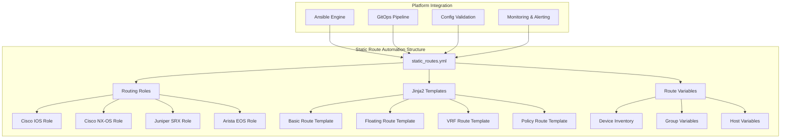
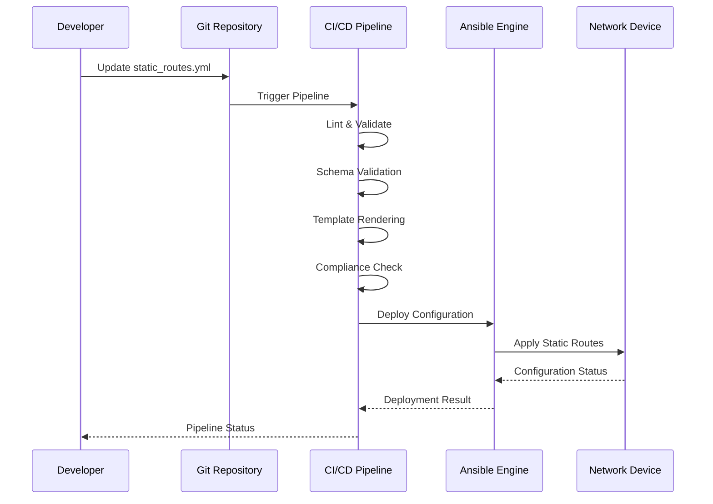
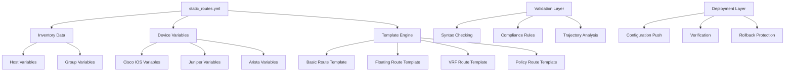

# Static Route Management

<cite>
**Referenced Files in This Document**
- [README.md](file://README.md)
</cite>

## Table of Contents
1. [Introduction](#introduction)
2. [Project Structure](#project-structure)
3. [Core Components](#core-components)
4. [Architecture Overview](#architecture-overview)
5. [Detailed Component Analysis](#detailed-component-analysis)
6. [Dependency Analysis](#dependency-analysis)
7. [Performance Considerations](#performance-considerations)
8. [Troubleshooting Guide](#troubleshooting-guide)
9. [Conclusion](#conclusion)
10. [Appendices](#appendices)

## Introduction

This document provides comprehensive guidance for implementing static route automation within the Enterprise Network Automation Platform. The platform supports advanced static routing scenarios including basic next-hop configuration, floating static routes with administrative distance, recursive routing with tracked objects, policy-based routing integration, VRF-aware routing, and multi-vendor support.

The static route management capability is implemented through the `static_routes.yml` playbook, which leverages the platform's modular architecture, Jinja2 templating engine, and vendor-agnostic design principles to generate and deploy consistent routing configurations across diverse network environments.

## Project Structure

The static route automation follows the platform's established directory structure and organizational patterns:

**Diagram sources**
- [README.md:103-180](file://README.md#L103-L180)
- [README.md:401-410](file://README.md#L401-L410)

**Section sources**
- [README.md:103-180](file://README.md#L103-L180)
- [README.md:401-410](file://README.md#L401-L410)

## Core Components

The static route automation system comprises several key components that work together to provide comprehensive routing management:

### Playbook Architecture
The `static_routes.yml` playbook serves as the primary orchestration point, coordinating between inventory data, device-specific variables, and vendor templates to generate appropriate routing configurations.

### Template System
Jinja2 templates provide vendor-specific syntax while maintaining a unified interface for route definition. Templates handle differences in command syntax, parameter ordering, and feature availability across platforms.

### Variable Management
Structured data in YAML format defines route parameters including destination networks, next-hop addresses, exit interfaces, administrative distances, and tracking object associations.

### Multi-Vendor Support
The system supports multiple vendors including Cisco IOS/IOS-XE/NX-OS, Juniper SRX/MX, Arista EOS, Palo Alto, Fortinet, and others through dedicated role implementations.

**Section sources**
- [README.md:116-128](file://README.md#L116-L128)
- [README.md:203-227](file://README.md#L203-L227)

## Architecture Overview

The static route automation follows a layered architecture that separates concerns between configuration generation, validation, and deployment:

**Diagram sources**
- [README.md:479-501](file://README.md#L479-L501)
- [README.md:619-638](file://README.md#L619-L638)

The architecture ensures that static route changes undergo comprehensive validation before deployment, including syntax checking, compliance verification, and dry-run testing against target devices.

## Detailed Component Analysis

### Basic Static Route Configuration

Basic static routes provide simple connectivity by specifying destination networks and next-hop addresses or exit interfaces. The automation handles both direct and indirect next-hop specifications.

#### Next-Hop Based Routing
Next-hop based routing specifies the IP address of the adjacent router that should receive traffic destined for the specified network. This approach is commonly used in hub-and-spoke topologies where all traffic flows through central aggregation points.

#### Exit Interface Based Routing
Exit interface based routing specifies the local interface through which traffic should be forwarded. This method is typically used when the next-hop address is directly reachable via broadcast media like Ethernet segments.

#### Administrative Distance Configuration
Administrative distance controls route preference when multiple routing protocols provide paths to the same destination. Lower values indicate higher preference, allowing administrators to implement failover scenarios and traffic engineering policies.

### Floating Static Routes

Floating static routes provide redundancy and automatic failover by configuring backup routes with higher administrative distances. These routes remain inactive until the primary route becomes unavailable.

#### Failover Scenarios
Floating routes enable seamless failover between primary and backup paths without manual intervention. When the primary route fails, the floating route automatically becomes active, maintaining network connectivity.

#### Tracking Object Integration
Advanced floating routes integrate with tracking objects to monitor link health and path availability. This enables more sophisticated failover logic based on actual network conditions rather than simple reachability checks.

### Recursive Routing with Tracked Objects

Recursive routing allows static routes to reference other routes for next-hop resolution. Combined with tracking objects, this creates dynamic routing behavior that responds to network topology changes.

#### Link Monitoring
Tracking objects continuously monitor the status of specific interfaces, IP SLA probes, or BGP sessions. Static routes can be configured to depend on these tracking objects, enabling intelligent failover based on real-time network conditions.

#### Dynamic Next-Hop Resolution
When combined with dynamic routing protocols, static routes can leverage learned routes for next-hop resolution while maintaining administrative control over route selection and policy enforcement.

### Policy-Based Routing Integration

Policy-based routing (PBR) enables traffic forwarding decisions based on criteria beyond destination IP addresses, such as source address, protocol type, packet size, or application characteristics.

#### Route Maps for Conditional Forwarding
Route maps provide conditional logic for traffic classification and policy application. They can match specific traffic patterns and apply different forwarding behaviors, including alternate next-hops or exit interfaces.

#### Traffic Engineering
PBR enables sophisticated traffic engineering scenarios such as load balancing across multiple paths, traffic shaping based on application requirements, and selective routing for specific user groups or applications.

### VRF-Aware Static Routing

Virtual Routing and Forwarding (VRF) provides network isolation by maintaining separate routing tables within a single physical device. VRF-aware static routing enables multi-tenant environments and service provider scenarios.

#### Multi-Tenant Isolation
Each VRF maintains independent routing information, preventing traffic leakage between tenants while sharing the same physical infrastructure. Static routes can be configured per VRF to provide tenant-specific connectivity.

#### Service Provider Scenarios
Service providers use VRFs to isolate customer traffic and provide dedicated routing paths. Static routes within VRFs enable precise control over customer connectivity and interconnection points.

### Hub-and-Spoke Topology Implementation

Hub-and-spoke topologies centralize routing at a hub location with spoke sites connecting through the hub. Static routes efficiently manage this topology by providing predictable traffic flow and simplified troubleshooting.

#### Centralized Control
The hub router maintains complete visibility into spoke connectivity and can implement centralized policies for traffic filtering, QoS, and security inspection.

#### Simplified Management
Spoke sites require minimal configuration, typically just a default route pointing to the hub. This reduces operational complexity and minimizes the potential for configuration errors at edge locations.

### Backup Path Configuration with Tracking

Backup paths provide redundancy for critical network connections. Advanced tracking mechanisms ensure that failover occurs only when necessary, preventing unnecessary route flapping and maintaining network stability.

#### Health Monitoring Integration
Integration with IP SLA and other monitoring tools provides accurate detection of path failures, enabling faster convergence and improved network resilience.

#### Graceful Failover
Properly configured backup paths provide seamless failover without disrupting ongoing traffic sessions, maintaining service continuity during network events.

### Integration with Dynamic Routing Protocols

Static routes can complement dynamic routing protocols by providing explicit control over specific traffic flows or serving as fallback paths when dynamic routes become unavailable.

#### Redistribution Strategies
Carefully planned redistribution between static and dynamic routing protocols prevents routing loops and ensures optimal path selection across the network.

#### Route Tagging for Traffic Engineering
Route tags enable policy-based manipulation of routes during redistribution, allowing for sophisticated traffic engineering and path selection strategies.

**Section sources**
- [README.md:401-410](file://README.md#L401-L410)
- [README.md:116-128](file://README.md#L116-L128)

## Dependency Analysis

The static route automation system has well-defined dependencies and relationships between components:

**Diagram sources**
- [README.md:103-180](file://README.md#L103-L180)
- [README.md:479-501](file://README.md#L479-L501)

The dependency structure ensures loose coupling between components while maintaining clear interfaces for configuration generation, validation, and deployment operations.

**Section sources**
- [README.md:103-180](file://README.md#L103-L180)

## Performance Considerations

Static route automation should consider several performance factors to ensure efficient operation across large-scale deployments:

### Configuration Generation Efficiency
Template rendering and configuration generation should be optimized for batch processing across multiple devices. Parallel execution and incremental updates minimize deployment time and reduce the risk of configuration drift.

### Memory and Resource Usage
Large numbers of static routes can impact device memory usage and CPU utilization. Proper route summarization and careful planning of route hierarchy helps maintain optimal device performance.

### Convergence Time Optimization
Floating routes and tracking objects should be tuned for appropriate convergence times that balance rapid failover with network stability. Excessive sensitivity can cause route flapping, while insufficient sensitivity delays recovery from failures.

### Monitoring and Observability
Comprehensive monitoring of static route effectiveness, path utilization, and failure rates provides valuable insights for capacity planning and optimization.

## Troubleshooting Guide

Common issues and their resolutions when working with static route automation:

### Route Reachability Issues
Verify next-hop reachability and interface status when static routes appear configured but traffic cannot flow. Check for proper ARP resolution, interface configuration, and intermediate device connectivity.

### Path Selection Problems
Investigate administrative distance conflicts and route precedence when unexpected paths are selected. Ensure that floating routes have appropriate distance values and that tracking objects correctly reflect path availability.

### VRF Configuration Errors
Validate VRF definitions and route table assignments when routes don't appear in expected routing instances. Confirm that VRF-aware static routes are properly associated with their intended routing contexts.

### Template Rendering Failures
Review variable definitions and template syntax when configuration generation fails. Check for missing required parameters, incorrect data types, or vendor-specific compatibility issues.

### Deployment Conflicts
Resolve configuration conflicts when automated changes clash with manual modifications. Use version control and change management processes to maintain configuration consistency across the network.

**Section sources**
- [README.md:674-685](file://README.md#L674-L685)

## Conclusion

Static route automation within the Enterprise Network Automation Platform provides a robust foundation for managing complex routing scenarios across multi-vendor environments. The modular architecture, comprehensive validation framework, and extensive vendor support enable organizations to implement sophisticated routing strategies while maintaining operational efficiency and network reliability.

The platform's GitOps approach ensures that all static route changes undergo thorough review and testing before deployment, reducing the risk of configuration errors and improving overall network stability. Integration with monitoring and compliance systems provides continuous assurance that routing configurations meet organizational standards and security requirements.

By leveraging the documented patterns and best practices, network teams can effectively automate static route management while maintaining the flexibility needed to adapt to evolving network requirements and business objectives.

## Appendices

### Vendor-Specific Syntax Variations

Different vendors implement static routing with varying syntax and feature sets. The platform's template system abstracts these differences while preserving vendor-specific optimizations and capabilities.

### Best Practices for Large-Scale Deployments

Organizations managing thousands of devices should implement hierarchical route structures, standardized naming conventions, and comprehensive documentation to maintain operational clarity and reduce configuration complexity.

### Security Considerations

Static route automation should incorporate security controls including access restrictions, audit logging, and change approval workflows to prevent unauthorized modifications and maintain network integrity.