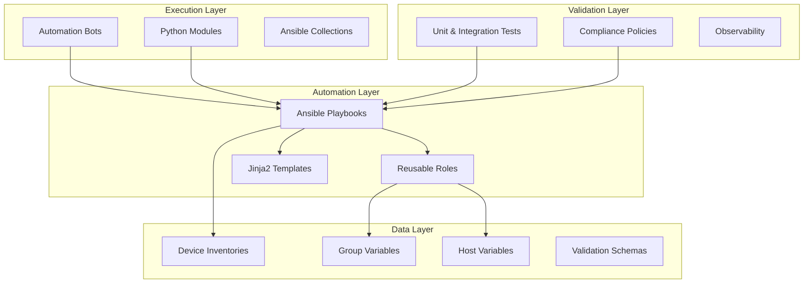
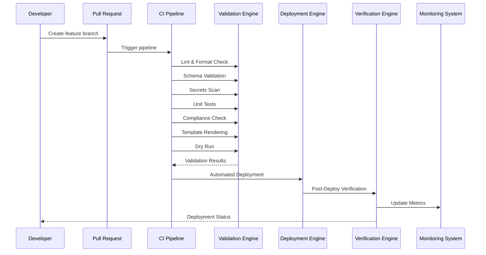
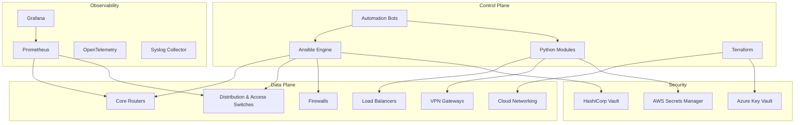
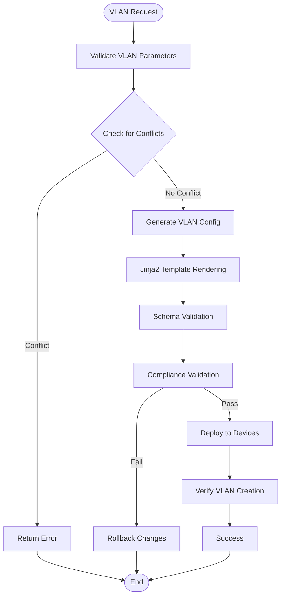
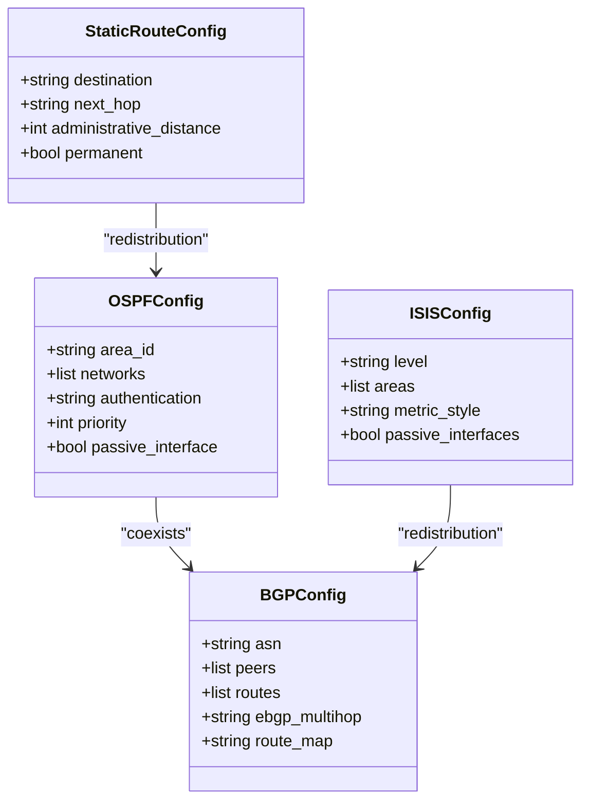
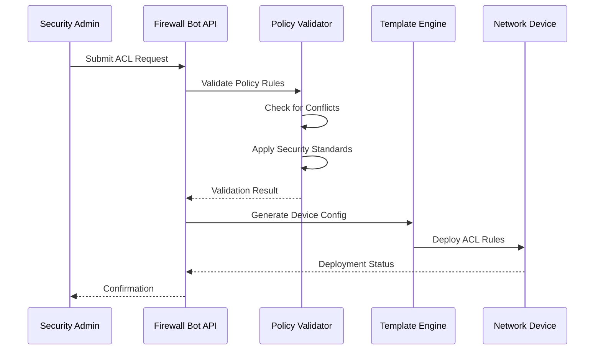
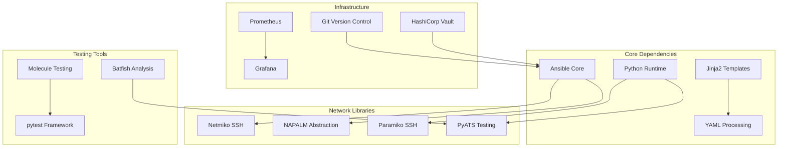

# Network Services Automation

<cite>
**Referenced Files in This Document**
- [README.md](file://README.md)
</cite>

## Table of Contents
1. [Introduction](#introduction)
2. [Project Structure](#project-structure)
3. [Core Components](#core-components)
4. [Architecture Overview](#architecture-overview)
5. [Detailed Component Analysis](#detailed-component-analysis)
6. [Dependency Analysis](#dependency-analysis)
7. [Performance Considerations](#performance-considerations)
8. [Troubleshooting Guide](#troubleshooting-guide)
9. [Conclusion](#conclusion)
10. [Appendices](#appendices)

## Introduction

This document provides comprehensive coverage of network services automation across Layer 2, Layer 3, security, and performance domains using an enterprise-grade network automation platform. The platform implements Infrastructure as Code (IaC), GitOps practices, and automated compliance enforcement to manage thousands of network devices across multi-vendor environments.

The automation platform supports vendor-agnostic configuration management through Ansible playbooks, Jinja2 templates, and Python modules, enabling consistent deployment of VLAN provisioning, routing protocols, security policies, and performance optimization across Cisco, Juniper, Arista, Palo Alto, Fortinet, and other vendors.

## Project Structure

The network automation platform follows a modular architecture with clear separation of concerns:



**Diagram sources**
- [README.md:103-180](file://README.md#L103-L180)

**Section sources**
- [README.md:103-180](file://README.md#L103-L180)

## Core Components

### Network Service Automation Framework

The platform provides comprehensive automation capabilities organized into specialized domains:

#### Layer 2 Services
- **VLAN Provisioning**: Automated creation and modification of VLANs across switch fabrics
- **Trunk Configuration**: Standardized trunk interface setup with VLAN tagging policies
- **LACP/Port-Channel Setup**: Link aggregation configuration for high availability
- **Spanning Tree Optimization**: STP tuning and loop prevention mechanisms

#### Layer 3 Services  
- **Routing Protocol Automation**: OSPF, BGP, and IS-IS configuration management
- **Static Route Management**: Dynamic static route deployment and maintenance
- **Loopback Interface Deployment**: Consistent loopback address allocation and configuration

#### Security Services
- **ACL Management**: Access control list creation, modification, and validation
- **NAT Configuration**: Network Address Translation rule deployment
- **VPN Setup**: Site-to-site and remote-access VPN automation
- **Firewall Rule Deployment**: Policy-based firewall configuration management

#### Performance Optimization
- **QoS Policy Application**: Quality of Service policy enforcement
- **Traffic Shaping**: Bandwidth management and traffic prioritization
- **Monitoring Agent Deployment**: Telemetry and observability infrastructure

#### High Availability
- **VRRP Configuration**: Virtual Router Redundancy Protocol setup
- **HSRP Implementation**: Hot Standby Router Protocol deployment

**Section sources**
- [README.md:388-416](file://README.md#L388-L416)

## Architecture Overview

The network automation platform implements a comprehensive GitOps workflow with multiple validation stages:



**Diagram sources**
- [README.md:36-50](file://README.md#L36-L50)

### Automation Engine Architecture

The platform's automation engine coordinates multiple components:



**Diagram sources**
- [README.md:54-99](file://README.md#L54-L99)

## Detailed Component Analysis

### Layer 2 Services Automation

#### VLAN Provisioning Workflow

The VLAN automation system provides standardized VLAN lifecycle management:



**Diagram sources**
- [README.md:390-392](file://README.md#L390-L392)

#### Trunk Configuration Management

Trunk interfaces are configured with standardized parameters including VLAN allow lists, native VLAN settings, and encapsulation types. The automation ensures consistency across device types and enforces security policies.

#### LACP/Port-Channel Setup

Link aggregation is automated through LACP configuration templates that handle:
- Port-channel interface creation
- Member interface assignment
- Load balancing algorithms
- Failure detection and recovery

#### Spanning Tree Optimization

STP optimization includes:
- Root bridge election policies
- Port cost adjustments
- BPDU guard and root guard implementation
- Rapid STP configuration

**Section sources**
- [README.md:390-394](file://README.md#L390-L394)

### Layer 3 Services Automation

#### Routing Protocol Configuration

The platform automates complex routing protocol deployments:



**Diagram sources**
- [README.md:403-409](file://README.md#L403-L409)

#### Loopback Interface Deployment

Loopback interfaces provide stable router IDs and management endpoints. The automation ensures:
- Sequential IP address allocation
- Consistent naming conventions
- Proper subnet planning
- Interface status monitoring

**Section sources**
- [README.md:403-409](file://README.md#L403-L409)

### Security Services Automation

#### ACL Management System

Access Control Lists are managed through a centralized policy engine:



**Diagram sources**
- [README.md:466-476](file://README.md#L466-L476)

#### NAT Configuration Management

Network Address Translation rules are automated with support for:
- Static NAT mappings
- Dynamic PAT configurations
- NAT overload scenarios
- Rule dependency management

#### VPN Setup Automation

The platform supports both site-to-site and remote-access VPN configurations:
- IKE phase 1 and 2 parameter management
- Tunnel interface configuration
- Route propagation
- Health monitoring

#### Firewall Rule Deployment

Firewall automation includes:
- Rule ordering and precedence
- Shadow rule detection
- Unused rule identification
- Change impact analysis

**Section sources**
- [README.md:396-399](file://README.md#L396-L399)

### Performance Optimization

#### QoS Policy Application

Quality of Service policies are applied consistently across the network fabric:
- Traffic classification and marking
- Queue management configuration
- Policing and shaping policies
- Priority queuing setup

#### Traffic Shaping

Bandwidth management automation includes:
- Rate limiting policies
- Traffic prioritization
- Congestion avoidance mechanisms
- Performance monitoring integration

#### Monitoring Agent Deployment

Observability infrastructure deployment covers:
- SNMPv3 configuration
- Telemetry streaming setup
- Syslog forwarding
- Performance metrics collection

**Section sources**
- [README.md:395](file://README.md#L395)

### High Availability Configuration

#### VRRP Implementation

Virtual Router Redundancy Protocol automation ensures:
- Master/backup election policies
- Preemption configuration
- Tracking object integration
- Failover testing

#### HSRP Deployment

Hot Standby Router Protocol setup includes:
- Active/standby pair configuration
- Authentication mechanisms
- Version compatibility
- State synchronization

**Section sources**
- [README.md:413-416](file://README.md#L413-L416)

## Dependency Analysis

The automation platform maintains clear dependency relationships between components:



**Diagram sources**
- [README.md:184-199](file://README.md#L184-L199)

### Technology Stack Dependencies

| Component | Primary Dependencies | Purpose |
|-----------|---------------------|---------|
| Ansible Engine | Netmiko, NAPALM, Paramiko | Device communication and configuration |
| Python Modules | Custom libraries, REST APIs | Advanced automation logic |
| Template Engine | Jinja2, YAML | Configuration generation |
| Testing Framework | pytest, Molecule, Batfish | Validation and quality assurance |
| Monitoring Stack | Prometheus, Grafana, OpenTelemetry | Observability and alerting |
| Secrets Management | HashiCorp Vault, AWS/Azure KMS | Secure credential handling |

**Section sources**
- [README.md:184-199](file://README.md#L184-L199)

## Performance Considerations

### Scalability Architecture

The platform is designed for enterprise-scale operations:

- **Parallel Execution**: Concurrent device configuration updates
- **Connection Pooling**: Efficient SSH/NETCONF connection management
- **Template Caching**: Optimized template rendering performance
- **Incremental Updates**: Minimal configuration changes only

### Resource Optimization

Key performance optimizations include:
- **Memory Management**: Streaming configuration processing
- **CPU Efficiency**: Asynchronous task execution
- **Network Bandwidth**: Compression and batching of operations
- **Storage Efficiency**: Delta-based backup storage

### Monitoring and Alerting

Comprehensive observability includes:
- **Pipeline Metrics**: Job success rates and execution times
- **Device Health**: Real-time connectivity and performance monitoring
- **Configuration Drift**: Automated drift detection and reporting
- **Compliance Scoring**: Continuous compliance assessment

## Troubleshooting Guide

### Common Issues and Resolutions

| Issue Category | Symptoms | Resolution Steps |
|---------------|----------|------------------|
| **Connection Issues** | Ansible timeout errors | Verify SSH reachability and credentials |
| **Template Errors** | Jinja2 rendering failures | Check template syntax and variable definitions |
| **Compliance Failures** | Policy violation reports | Review compliance policies and device configuration |
| **Deployment Failures** | Configuration rollback triggers | Analyze dry-run output and error logs |
| **Secrets Access** | Vault authentication failures | Verify OIDC tokens or AppRole credentials |
| **Test Failures** | Molecule or unit test errors | Check Docker/Podman availability and test data |

### Debugging Procedures

1. **Enable Debug Logging**: Use `--debug` flag for detailed execution traces
2. **Dry-Run Validation**: Execute playbooks with `--check --diff` flags
3. **Template Rendering**: Test Jinja2 templates independently
4. **Schema Validation**: Verify data against defined schemas
5. **Compliance Analysis**: Review policy violation details
6. **Network Connectivity**: Test device reachability manually

**Section sources**
- [README.md:674-685](file://README.md#L674-L685)

## Conclusion

This network automation platform provides a comprehensive solution for enterprise network services automation across all major networking domains. The platform's modular architecture, GitOps workflow, and multi-vendor support enable consistent, compliant, and scalable network operations.

Key benefits include:
- **Vendor Agnostic**: Support for Cisco, Juniper, Arista, Palo Alto, and other vendors
- **Automated Compliance**: Continuous policy enforcement and validation
- **High Availability**: Robust failover and rollback mechanisms
- **Scalable Operations**: Enterprise-grade performance and reliability
- **Comprehensive Monitoring**: Full observability and alerting capabilities

The platform successfully addresses the complexity of modern network operations while maintaining security, compliance, and operational excellence standards required by Fortune 100 enterprises.

## Appendices

### Quick Reference Commands

#### Basic Operations
```bash
# Initial environment setup
python scripts/validate_environment.py

# Run compliance scan
ansible-playbook playbooks/compliance_scan.yml -i inventories/lab/hosts.yml --check --diff

# Generate device configuration
python -m python.config_gen --device core-rtr-01 --output ./output/

# Execute unit tests
pytest tests/unit/ -v
```

#### Network Service Operations
```bash
# VLAN provisioning
ansible-playbook playbooks/vlan.yml -i inventories/production/hosts.yml

# Routing protocol deployment
ansible-playbook playbooks/ospf.yml -i inventories/staging/hosts.yml

# Security policy application
ansible-playbook playbooks/acl.yml -i inventories/production/hosts.yml

# Performance optimization
ansible-playbook playbooks/qos.yml -i inventories/distribution/hosts.yml
```

**Section sources**
- [README.md:264-280](file://README.md#L264-L280)