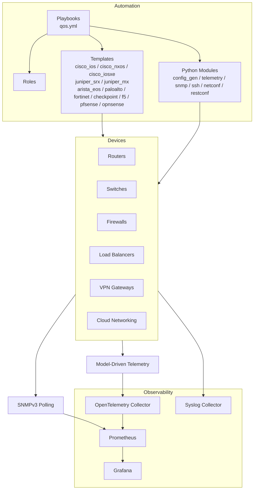
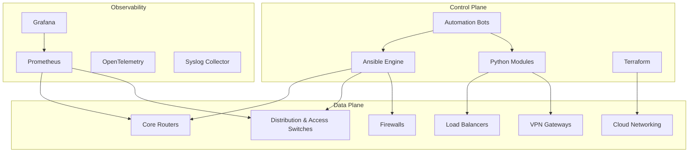
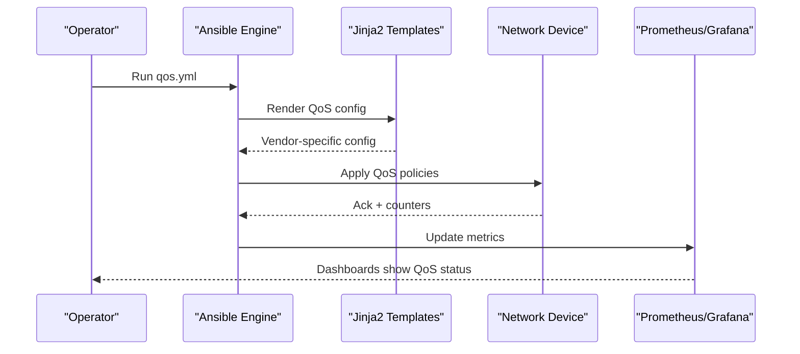
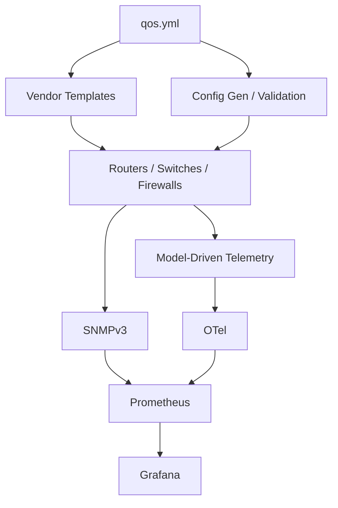
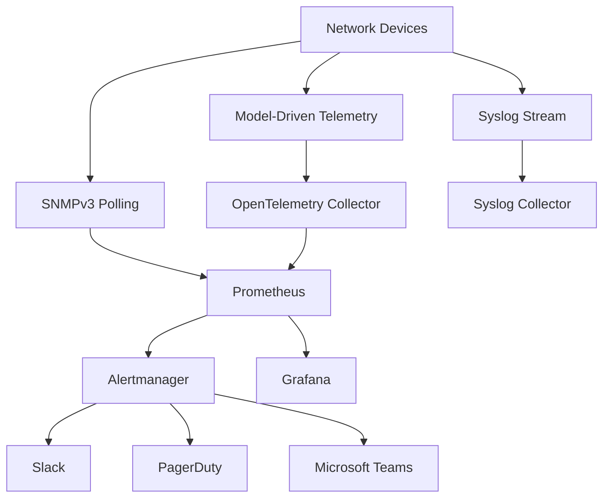

# Performance and QoS Automation

<cite>
**Referenced Files in This Document**
- [README.md](file://README.md)
</cite>

## Table of Contents
1. [Introduction](#introduction)
2. [Project Structure](#project-structure)
3. [Core Components](#core-components)
4. [Architecture Overview](#architecture-overview)
5. [Detailed Component Analysis](#detailed-component-analysis)
6. [Dependency Analysis](#dependency-analysis)
7. [Performance Considerations](#performance-considerations)
8. [Troubleshooting Guide](#troubleshooting-guide)
9. [Conclusion](#conclusion)
10. [Appendices](#appendices)

## Introduction
This document provides a comprehensive guide to performance optimization and Quality of Service (QoS) automation within the Enterprise Network Automation Platform. It focuses on:
- Traffic classification using class-maps, match criteria, and policy mapping strategies
- Queue management with priority queuing, weighted fair queuing, and custom traffic shaping policies
- Bandwidth allocation mechanisms including guarantees, policing, and rate limiting
- Monitoring agent deployment for performance metrics collection and baseline establishment
- Traffic engineering features such as MPLS TE, SD-WAN policies, and application-aware routing
- Practical examples using the qos.yml playbook with vendor-specific QoS implementations for Cisco, Juniper, Arista, and other platforms
- Performance benchmarking, capacity planning guidelines, and troubleshooting QoS-related issues
- Monitoring integration with Prometheus and Grafana dashboards for real-time performance visibility

The platform is designed for enterprise-scale, multi-vendor environments and follows Infrastructure as Code, GitOps, and DevSecOps principles.

## Project Structure
The repository organizes automation artifacts across inventories, playbooks, roles, templates, Python modules, monitoring, and tests. Key areas relevant to QoS and performance include:
- Playbooks for network services, including QoS policy application
- Templates per vendor for generating device-specific configurations
- Python modules for configuration generation, telemetry, validation, and compliance
- Monitoring stack definitions for Prometheus, Grafana, and OpenTelemetry
- CI/CD workflows that validate templates and enforce compliance before deployment

**Diagram sources**
- [README.md:103-180](file://README.md#L103-L180)
- [README.md:184-200](file://README.md#L184-L200)
- [README.md:583-618](file://README.md#L583-L618)

**Section sources**
- [README.md:103-180](file://README.md#L103-L180)
- [README.md:184-200](file://README.md#L184-L200)

## Core Components
- QoS Playbook: The qos.yml playbook applies QoS policies across devices. It integrates with Jinja2 templates and structured data to generate vendor-specific configurations.
- Vendor Templates: Per-platform templates under templates/cisco_ios, cisco_nxos, cisco_iosxe, juniper_srx, juniper_mx, arista_eos, paloalto, fortinet, checkpoint, f5, pfsense, opnsense enable consistent QoS implementation across vendors.
- Configuration Generation: python/config_gen renders Jinja2 templates from structured inputs, ensuring deterministic and validated outputs.
- Telemetry and Monitoring: python/telemetry collects model-driven telemetry; SNMPv3 polling via python/snmp feeds Prometheus; Alertmanager routes alerts; Grafana visualizes metrics.
- Compliance and Validation: Pre-deployment checks ensure QoS policies meet organizational standards and do not introduce regressions.

**Section sources**
- [README.md:371-436](file://README.md#L371-L436)
- [README.md:116-128](file://README.md#L116-L128)
- [README.md:438-456](file://README.md#L438-L456)
- [README.md:583-618](file://README.md#L583-L618)

## Architecture Overview
The automation engine orchestrates QoS policy deployment across routers, switches, firewalls, load balancers, VPN gateways, and cloud networking components. Observability is achieved through SNMPv3 polling and model-driven telemetry, ingested by Prometheus and visualized in Grafana.

**Diagram sources**
- [README.md:52-99](file://README.md#L52-L99)

## Detailed Component Analysis

### QoS Policy Application Workflow
The qos.yml playbook drives the end-to-end flow for applying QoS policies:
- Input: Structured QoS definitions (class-maps, match criteria, policy-maps, queue settings, bandwidth allocations)
- Rendering: Jinja2 templates generate vendor-specific commands
- Deployment: Ansible pushes configurations to target devices
- Verification: Post-deploy checks validate policy presence and counters
- Monitoring: Metrics are collected via SNMP/telemetry and exposed to Prometheus/Grafana

[No sources needed since this diagram shows conceptual workflow, not actual code structure]

### Traffic Classification and Match Criteria
- Class-maps define traffic classes based on ACLs, DSCP, CoS, protocol/port, or application identifiers
- Match criteria can be combined with logical operators (any/all) to refine classification
- Policy maps bind class-maps to actions (queue assignment, policing, shaping, marking)

Implementation guidance:
- Use structured variables to define classes and matches consistently across environments
- Validate match rules against Batfish to avoid unintended permit/deny behavior
- Ensure class precedence aligns with business priorities

**Section sources**
- [README.md:116-128](file://README.md#L116-L128)
- [README.md:438-456](file://README.md#L438-L456)

### Queue Management and Shaping Policies
- Priority Queuing: Assign high-priority queues to latency-sensitive traffic (e.g., voice/video)
- Weighted Fair Queuing: Distribute bandwidth fairly among classes based on weights
- Custom Shaping: Smooth bursty traffic flows to adhere to contracted rates

Operational considerations:
- Tune queue depths and thresholds to prevent tail-drop and bufferbloat
- Use shaping at edge interfaces to conform to upstream provider limits
- Monitor queue utilization and drop counters to detect congestion early

**Section sources**
- [README.md:116-128](file://README.md#L116-L128)
- [README.md:438-456](file://README.md#L438-L456)

### Bandwidth Allocation Mechanisms
- Guarantees: Reserve minimum bandwidth for critical applications
- Policing: Enforce maximum rates and drop/mark excess traffic
- Rate Limiting: Control aggregate or per-class throughput

Best practices:
- Align guarantees with SLAs and capacity plans
- Combine policing with marking to signal downstream treatment
- Avoid overcommitting bandwidth to prevent contention

**Section sources**
- [README.md:116-128](file://README.md#L116-L128)
- [README.md:438-456](file://README.md#L438-L456)

### Monitoring Agent Deployment and Baselines
- Deploy monitoring agents to collect CPU, memory, interface utilization, queue statistics, and telemetry streams
- Establish baselines during normal operations to detect anomalies
- Integrate with Prometheus and Grafana for real-time visibility and alerting

Deployment steps:
- Use monitoring_agents.yml to provision collectors and configure endpoints
- Enable SNMPv3 polling and model-driven telemetry where supported
- Create Grafana dashboards for QoS metrics (queue depth, drops, policing hits)

**Section sources**
- [README.md:434-436](file://README.md#L434-L436)
- [README.md:583-618](file://README.md#L583-L618)

### Traffic Engineering Features
- MPLS TE: Configure tunnels and constraints to optimize path selection and resource usage
- SD-WAN Policies: Apply application-aware routing and dynamic path selection
- Application-Aware Routing: Route traffic based on application characteristics and SLA requirements

Integration points:
- Leverage templates for vendor-specific TE and SD-WAN constructs
- Validate policies with Batfish and integration tests
- Monitor tunnel health and application performance via telemetry

**Section sources**
- [README.md:116-128](file://README.md#L116-L128)
- [README.md:438-456](file://README.md#L438-L456)

### Practical Examples Using qos.yml
- Cisco IOS/IOS-XE/NX-OS: Define class-maps, policy-maps, and queue assignments; apply to interfaces
- Juniper SRX/MX: Configure policers, schedulers, forwarding classes, and scheduling policies
- Arista EOS: Implement class-based queuing, policing, and shaping via eAPI/NETCONF
- Other Platforms: Palo Alto, Fortinet, Check Point, F5, pfSense, OPNsense have vendor-specific equivalents for classification, policing, and shaping

Execution:
- Run qos.yml with environment inventory to deploy policies
- Use --check and --diff to preview changes
- Verify counters and dashboards post-deploy

**Section sources**
- [README.md:371-436](file://README.md#L371-L436)
- [README.md:116-128](file://README.md#L116-L128)

### Performance Benchmarking and Capacity Planning
- Benchmarking: Use locust and custom scripts to measure API and bot endpoint performance; assess device processing impact under QoS load
- Capacity Planning: Analyze historical telemetry to forecast bandwidth needs and adjust guarantees/shaping accordingly
- Stress Testing: Simulate peak traffic patterns to validate queue sizing and drop behavior

Guidelines:
- Establish KPIs for latency, jitter, packet loss, and throughput
- Plan headroom for growth and failover scenarios
- Continuously refine policies based on observed performance

**Section sources**
- [README.md:517-544](file://README.md#L517-L544)
- [README.md:583-618](file://README.md#L583-L618)

### Troubleshooting QoS Issues
Common diagnostics:
- Verify class-match accuracy and policy attachment points
- Inspect queue utilization and drop counters for congestion indicators
- Review policing/rate-limiting logs and counters for misclassification
- Correlate telemetry with application performance to identify bottlenecks

Resolution steps:
- Adjust class precedence and match criteria
- Rebalance queue weights and thresholds
- Recalibrate policing and shaping parameters
- Validate template rendering and diff against expected output

**Section sources**
- [README.md:674-685](file://README.md#L674-L685)
- [README.md:583-618](file://README.md#L583-L618)

## Dependency Analysis
The QoS automation depends on:
- Ansible for orchestration and device connectivity
- Jinja2 templates for vendor-specific configuration generation
- Python modules for telemetry, validation, and compliance
- Prometheus and Grafana for observability and alerting
- CI/CD pipelines for validation and safe deployment

**Diagram sources**
- [README.md:103-180](file://README.md#L103-L180)
- [README.md:583-618](file://README.md#L583-L618)

**Section sources**
- [README.md:103-180](file://README.md#L103-L180)
- [README.md:583-618](file://README.md#L583-L618)

## Performance Considerations
- Optimize template rendering to minimize overhead during large-scale deployments
- Use parallel execution judiciously to balance speed and device stability
- Monitor CPU and memory on control plane nodes to avoid bottlenecks
- Tune polling intervals and telemetry sampling rates to reduce collector load
- Implement backoff and retry logic for resilient device interactions

[No sources needed since this section provides general guidance]

## Troubleshooting Guide
- Connection timeouts: Verify SSH reachability and credentials
- Template errors: Debug Jinja2 syntax and variable resolution
- Compliance failures: Review policy violations and device diffs
- CI pipeline failures: Inspect GitHub Actions logs for actionable messages
- Vault authentication issues: Confirm OIDC tokens or AppRole credentials
- Molecule test failures: Ensure Docker/Podman availability and correct molecule.yml
- Batfish analysis errors: Validate snapshots and configuration consistency

**Section sources**
- [README.md:674-685](file://README.md#L674-L685)

## Conclusion
The Enterprise Network Automation Platform enables robust, scalable QoS automation across multi-vendor environments. By leveraging structured data, Jinja2 templates, and a comprehensive monitoring stack, organizations can implement precise traffic classification, effective queue management, and reliable bandwidth allocation. Continuous benchmarking, capacity planning, and observability ensure sustained performance and rapid issue resolution.

[No sources needed since this section summarizes without analyzing specific files]

## Appendices

### Monitoring Integration with Prometheus and Grafana
- Collect metrics via SNMPv3 polling and model-driven telemetry
- Ingest into Prometheus and visualize in Grafana dashboards
- Configure Alertmanager for notifications to Slack, PagerDuty, Teams

**Diagram sources**
- [README.md:583-618](file://README.md#L583-L618)