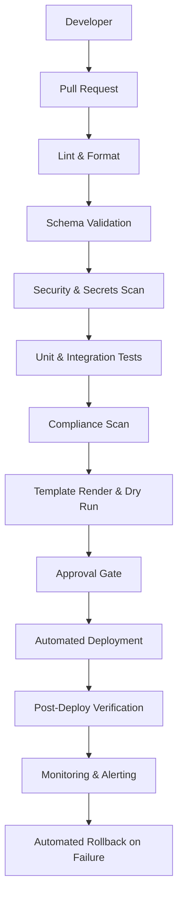
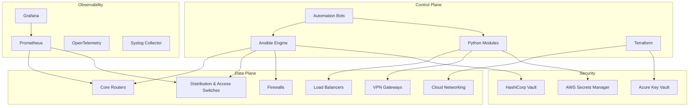
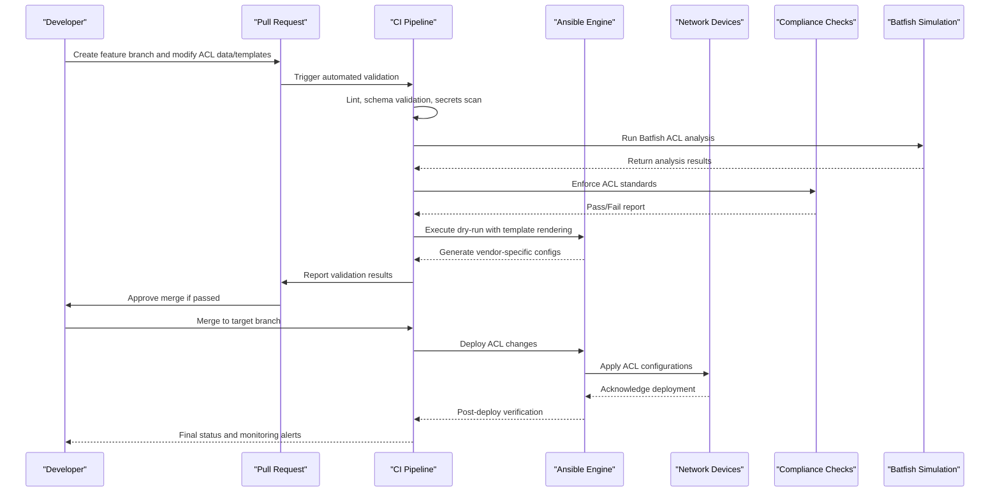
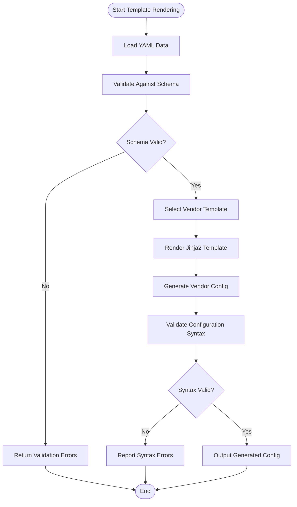
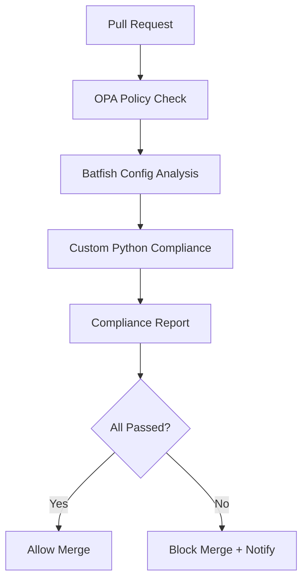
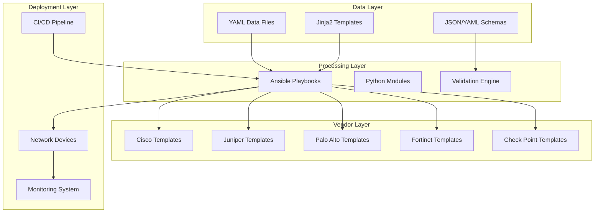

# Access Control Lists (ACLs)

<cite>
**Referenced Files in This Document**
- [README.md](file://README.md)
</cite>

## Table of Contents
1. [Introduction](#introduction)
2. [Project Structure](#project-structure)
3. [Core Components](#core-components)
4. [Architecture Overview](#architecture-overview)
5. [Detailed Component Analysis](#detailed-component-analysis)
6. [Dependency Analysis](#dependency-analysis)
7. [Performance Considerations](#performance-considerations)
8. [Troubleshooting Guide](#troubleshooting-guide)
9. [Conclusion](#conclusion)
10. [Appendices](#appendices)

## Introduction
This document provides comprehensive guidance for automating Access Control Lists (ACLs) across multi-vendor environments using the Enterprise Network Automation Platform. It covers standard and extended ACL management, named vs numbered ACLs, permit/deny statements, sequence numbers, implicit deny behavior, placement strategies, vendor-specific implementations (Cisco IOS/IOS-XE/NX-OS, Juniper SRX/MX, Palo Alto PAN-OS, Fortinet FortiOS, Check Point Gaia), practical examples with structured data inputs and template rendering, optimization techniques, compliance validation, performance impact analysis, and troubleshooting.

The platform follows Infrastructure as Code and GitOps principles: all configurations are generated from Jinja2 templates and structured YAML data, validated by CI/CD pipelines, and deployed via Ansible playbooks to supported vendors.

## Project Structure
The repository is a modular, Git-driven automation platform that supports multiple vendors and network domains. The ACL automation workflow integrates with the broader automation engine, compliance checks, and observability stack.



**Diagram sources**
- [README.md:36-50](file://README.md#L36-L50)

**Section sources**
- [README.md:103-180](file://README.md#L103-L180)

## Core Components
The platform’s ACL automation relies on several core components:

- Playbook orchestration: An Ansible playbook manages ACL lifecycle operations across devices.
- Template rendering: Jinja2 templates generate vendor-specific ACL configurations from structured YAML data.
- Compliance enforcement: Automated checks ensure default deny policies, explicit allow statements, and unused rule detection.
- Simulation and validation: Batfish performs ACL analysis during CI/CD to detect issues before deployment.
- Vendor support: Cisco IOS/IOS-XE/NX-OS, Juniper SRX/MX, Palo Alto PAN-OS, Fortinet FortiOS, and Check Point Gaia are supported.

Key references:
- ACL playbook entry point: acl.yml
- Firewall rules playbook: firewall_rules.yml
- Compliance policy: ACL Standards (default deny, explicit allow only)
- Unused object detection: Detect and flag unused ACLs, rules, objects
- Network simulation: Batfish ACL, routing, firewall rule analysis

**Section sources**
- [README.md:395-399](file://README.md#L395-L399)
- [README.md:563-566](file://README.md#L563-L566)
- [README.md:524-526](file://README.md#L524-L526)

## Architecture Overview
The ACL automation architecture integrates structured data, templates, and vendor-specific outputs within a GitOps pipeline.



**Diagram sources**
- [README.md:54-99](file://README.md#L54-L99)

## Detailed Component Analysis

### ACL Management Workflow
The ACL automation workflow uses an Ansible playbook to manage access control lists across devices. The process includes data ingestion, template rendering, validation, and deployment.



**Diagram sources**
- [README.md:36-50](file://README.md#L36-L50)
- [README.md:479-501](file://README.md#L479-L501)

**Section sources**
- [README.md:395-399](file://README.md#L395-L399)
- [README.md:479-501](file://README.md#L479-L501)

### Vendor-Specific Implementations

#### Cisco IOS/IOS-XE/NX-OS
- Standard and extended ACLs support both numbered and named formats
- Sequence numbers enable granular rule insertion and modification
- Implicit deny at the end of each ACL requires explicit permit statements for allowed traffic
- Placement strategies include inbound/outbound interface application and route-map integration

#### Juniper SRX/MX
- Zone-based security policies replace traditional ACLs
- Policy statements define source/destination addresses, applications, and actions
- Default policy denies all traffic unless explicitly permitted
- Rule ordering determines policy evaluation priority

#### Palo Alto PAN-OS
- Security policies use source/destination zones, addresses, applications, and services
- Rule-based evaluation with top-down processing
- Application identification enables granular control beyond IP/port combinations
- Address objects and service groups improve maintainability

#### Fortinet FortiOS
- Firewall policies define source/destination interfaces, addresses, and services
- Policy-based routing can integrate with firewall rules
- Object-oriented approach with address and service groups
- Logging and reporting capabilities for policy effectiveness

#### Check Point Gaia
- Rule base contains access rules with source, destination, service, and action
- Rule numbering allows precise insertion and reordering
- SmartConsole provides GUI management alongside CLI automation
- Layer 7 inspection capabilities through application awareness

**Section sources**
- [README.md:203-217](file://README.md#L203-L217)

### Practical Examples with Structured Data

#### ACL Data Model
Structured YAML data defines ACL rules in a vendor-agnostic format:

```yaml
acl_rules:
  - name: "web_access"
    type: "extended"
    vendor: "cisco_ios"
    rules:
      - sequence: 10
        action: "permit"
        protocol: "tcp"
        source: "192.168.1.0/24"
        destination: "10.0.0.0/24"
        port: "80"
      - sequence: 20
        action: "permit"
        protocol: "tcp"
        source: "192.168.1.0/24"
        destination: "10.0.0.0/24"
        port: "443"
      - sequence: 30
        action: "deny"
        protocol: "ip"
        source: "any"
        destination: "any"
```

#### Template Rendering Process
Jinja2 templates transform structured data into vendor-specific configurations:



**Diagram sources**
- [README.md:184-199](file://README.md#L184-L199)

**Section sources**
- [README.md:184-199](file://README.md#L184-L199)

### ACL Optimization Techniques

#### Rule Ordering Optimization
- Place most frequently matched rules at the beginning of ACLs
- Group related rules together for better cache utilization
- Use specific rules before general rules to minimize matching overhead

#### Statement Consolidation
- Combine similar permit/deny statements where possible
- Use wildcard masks efficiently to reduce rule count
- Leverage named ACLs for better organization and reuse

#### Performance Impact Analysis
- Monitor ACL hit counts to identify unused or rarely used rules
- Analyze CPU utilization during high-traffic periods
- Consider hardware limitations for large ACL deployments

#### Unused Rule Detection
- Regular audits to identify rules with zero hits
- Automated tools to flag potentially redundant rules
- Change management process for rule cleanup

**Section sources**
- [README.md:565-566](file://README.md#L565-L566)

### Compliance Validation

#### Organizational Security Standards
- Default deny policies must be enforced across all ACLs
- Explicit allow statements required for all permitted traffic
- No any-any rules allowed in production environments
- Regular compliance scans to ensure ongoing adherence

#### Compliance Enforcement Flow


**Diagram sources**
- [README.md:570-579](file://README.md#L570-L579)

**Section sources**
- [README.md:563-579](file://README.md#L563-L579)

## Dependency Analysis

### Component Relationships
The ACL automation system has well-defined dependencies between components:



**Diagram sources**
- [README.md:103-180](file://README.md#L103-L180)

**Section sources**
- [README.md:103-180](file://README.md#L103-L180)

## Performance Considerations

### ACL Processing Performance
- Rule order significantly impacts packet processing speed
- Hardware-accelerated platforms may have different performance characteristics
- Large ACLs can consume significant memory resources
- Consider hierarchical ACLs for complex rule sets

### Memory Utilization
- Each ACL consumes device memory proportional to rule count
- Named ACLs may have additional overhead compared to numbered ACLs
- Dynamic updates to ACLs require careful resource planning

### CPU Impact During Updates
- ACL modifications can cause brief CPU spikes during application
- Staged rollouts minimize impact on high-traffic links
- Off-peak deployment windows recommended for large changes

### Monitoring and Metrics
- Track ACL hit rates to identify optimization opportunities
- Monitor device CPU and memory usage during peak traffic
- Establish baselines for normal ACL performance metrics

[No sources needed since this section provides general guidance]

## Troubleshooting Guide

### Common ACL Issues and Resolutions

#### Connection Problems
- **Issue**: Ansible connection timeout when managing devices
- **Resolution**: Verify SSH reachability using ping commands against inventory hosts

#### Template Rendering Errors
- **Issue**: Jinja2 syntax errors during configuration generation
- **Resolution**: Use debug mode to identify template rendering issues and validate YAML structure

#### Compliance Check Failures
- **Issue**: Automated compliance checks blocking deployment
- **Resolution**: Review compliance policies and examine device running configuration differences

#### CI Pipeline Failures
- **Issue**: Automated validation failing in CI/CD pipeline
- **Resolution**: Check GitHub Actions logs for detailed error messages and actionable feedback

#### Vault Authentication Issues
- **Issue**: Unable to retrieve secrets from HashiCorp Vault
- **Resolution**: Verify OIDC token or AppRole credentials and check Vault policy permissions

#### Molecule Test Failures
- **Issue**: Role testing failures in isolated environments
- **Resolution**: Ensure Docker/Podman is running and verify molecule configuration files

#### Batfish Analysis Errors
- **Issue**: Network simulation analysis failures
- **Resolution**: Validate Batfish snapshots and ensure proper configuration formatting

### Debugging Tools and Commands
- Use `ansible-playbook --check --diff` for dry-run validation
- Enable verbose logging with `-v`, `-vv`, or `-vvv` flags
- Test individual roles with Molecule for isolated debugging
- Validate YAML syntax with yamllint before deployment

**Section sources**
- [README.md:674-684](file://README.md#L674-L684)

## Conclusion
The Enterprise Network Automation Platform provides a comprehensive solution for ACL automation across multi-vendor environments. By leveraging Infrastructure as Code principles, GitOps workflows, and automated compliance checks, organizations can maintain consistent, secure, and optimized ACL configurations while reducing manual effort and minimizing risk.

Key benefits include:
- Vendor-agnostic ACL management through structured data and templates
- Automated compliance enforcement ensuring security policy adherence
- Comprehensive testing and validation before deployment
- Multi-vendor support covering major networking platforms
- Integrated monitoring and troubleshooting capabilities

The platform's modular architecture allows for easy extension to new vendors and customization of ACL policies to meet specific organizational requirements.

[No sources needed since this section summarizes without analyzing specific files]

## Appendices

### Quick Reference Commands

#### Running ACL Playbooks
```bash
# Dry-run ACL changes against lab devices
ansible-playbook playbooks/acl.yml -i inventories/lab/hosts.yml --check --diff

# Generate ACL configurations for specific devices
python -m python.config_gen --device <device-name> --output ./output/

# Run unit tests for ACL functionality
pytest tests/unit/ -v
```

#### Testing and Validation
```bash
# Run all test suites
pytest tests/ -v --tb=short

# Run compliance tests specifically
pytest tests/compliance/ -v

# Test specific role with Molecule
cd roles/cisco_ios_baseline
molecule test
```

**Section sources**
- [README.md:264-280](file://README.md#L264-L280)
- [README.md:531-544](file://README.md#L531-L544)