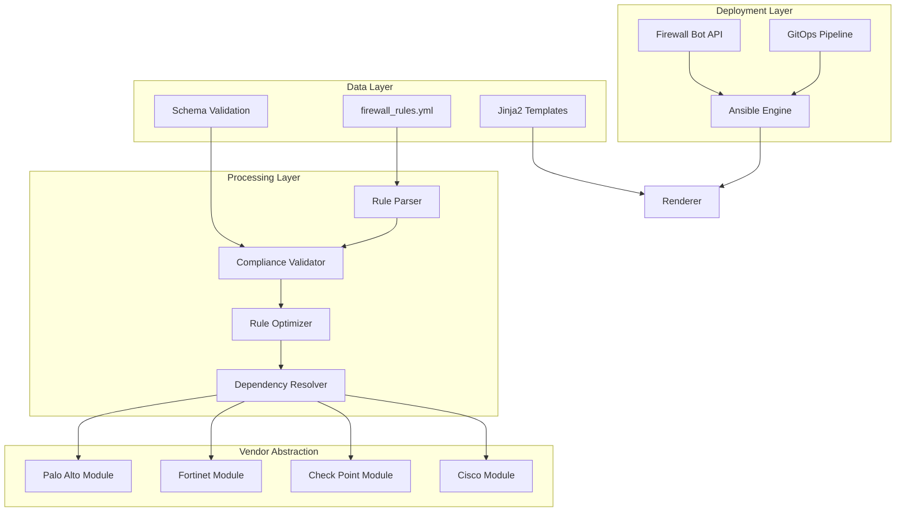
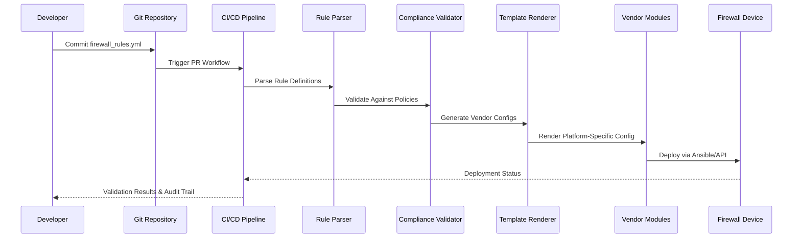
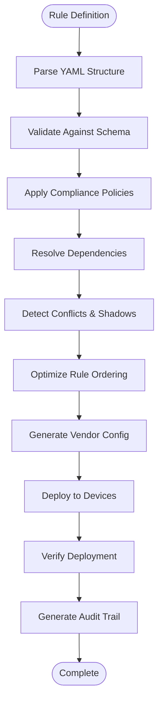
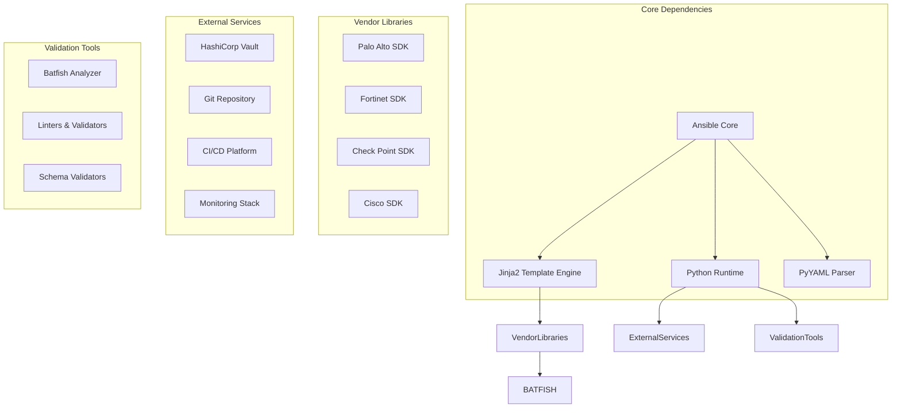

# Firewall Rules Management

<cite>
**Referenced Files in This Document**
- [README.md](file://README.md)
</cite>

## Table of Contents
1. [Introduction](#introduction)
2. [Project Structure](#project-structure)
3. [Core Components](#core-components)
4. [Architecture Overview](#architecture-overview)
5. [Detailed Component Analysis](#detailed-component-analysis)
6. [Dependency Analysis](#dependency-analysis)
7. [Performance Considerations](#performance-considerations)
8. [Troubleshooting Guide](#troubleshooting-guide)
9. [Conclusion](#conclusion)
10. [Appendices](#appendices)

## Introduction

This document provides comprehensive guidance for managing firewall rules across multi-vendor environments using an enterprise-grade network automation platform. The platform supports stateful inspection policies, zone-based security policies, and advanced rule optimization techniques while maintaining vendor-agnostic abstraction through structured data definitions and template-driven configuration generation.

The system enables automated firewall rule lifecycle management including creation, validation, deployment, monitoring, and cleanup across Palo Alto PAN-OS, Fortinet FortiOS, Check Point Gaia, and Cisco Firepower platforms with built-in compliance enforcement and audit trail generation.

## Project Structure

The firewall rules management system is organized within a modular architecture that separates concerns between data definition, template rendering, vendor-specific implementations, and operational workflows.

**Diagram sources**
- [README.md:103-180](file://README.md#L103-L180)
- [README.md:371-435](file://README.md#L371-L435)

**Section sources**
- [README.md:103-180](file://README.md#L103-L180)
- [README.md:371-435](file://README.md#L371-L435)

## Core Components

### Firewall Rule Definition Framework

The platform uses structured YAML definitions to represent firewall rules in a vendor-agnostic format. These definitions capture all essential attributes including source/destination addressing, application identification, user-based policies, time-based scheduling, and action specifications.

Key rule attributes include:
- **Source/Destination Addressing**: Supports IP ranges, FQDNs, dynamic objects, and service groups
- **Application Identification**: Deep packet inspection (DPI) based application classification
- **User-Based Policies**: Integration with authentication systems for identity-aware rules
- **Time-Based Scheduling**: Temporal rule activation based on business requirements
- **Stateful Inspection**: Connection tracking and state management
- **Zone-Based Security**: Policy enforcement at network zone boundaries

### Multi-Vendor Template System

Jinja2 templates provide vendor-specific configuration generation from unified rule definitions. Each vendor platform has dedicated templates that translate abstract rule concepts into native configuration syntax.

### Compliance and Validation Engine

Built-in compliance checks ensure firewall rules meet organizational security policies before deployment. The system performs shadow rule detection, conflict analysis, and unused rule identification to maintain optimal performance and security posture.

**Section sources**
- [README.md:438-456](file://README.md#L438-L456)
- [README.md:548-582](file://README.md#L548-L582)

## Architecture Overview

The firewall rules management architecture follows a layered approach with clear separation between data definition, processing logic, vendor abstraction, and deployment mechanisms.

**Diagram sources**
- [README.md:479-514](file://README.md#L479-L514)
- [README.md:619-638](file://README.md#L619-L638)

## Detailed Component Analysis

### Firewall Rules Playbook Implementation

The `firewall_rules.yml` playbook serves as the primary orchestration mechanism for firewall rule deployment across multiple vendors and environments. It coordinates rule parsing, validation, dependency resolution, and vendor-specific deployment.

#### Rule Creation and Management

The playbook supports comprehensive rule creation with structured definitions:

**Diagram sources**
- [README.md:399](file://README.md#L399)
- [README.md:548-582](file://README.md#L548-L582)

#### Stateful Inspection Policies

The system implements stateful inspection policies that track connection states and automatically allow return traffic. This reduces rule complexity while maintaining security posture by eliminating the need for explicit bidirectional rules.

#### Zone-Based Security Policies

Zone-based security policies enforce traffic flow control at network boundaries. The platform supports complex zone hierarchies with inter-zone policy enforcement and default deny semantics.

#### Rule Optimization Techniques

Advanced optimization algorithms analyze rule sets to eliminate redundancies, resolve conflicts, and optimize ordering for maximum performance. Key optimization strategies include:

- **Shadow Rule Detection**: Identifies rules that will never match due to higher-priority rules
- **Duplicate Rule Elimination**: Removes redundant rules with identical matching criteria
- **Rule Consolidation**: Merges similar rules to reduce rule set size
- **Performance Tuning**: Reorders rules based on hit frequency analysis

**Section sources**
- [README.md:399](file://README.md#L399)
- [README.md:564-566](file://README.md#L564-L566)

### Vendor-Specific Implementations

#### Palo Alto PAN-OS Support

The Palo Alto implementation leverages the PAN-OS REST API for rule management. Key features include:

- **Address Objects**: Dynamic object creation and management
- **Service Objects**: Application and port-based service definitions
- **Security Policies**: Zone-based policy enforcement with application awareness
- **User-ID Integration**: Identity-based policy enforcement
- **Log Forwarding**: Centralized logging and analytics integration

#### Fortinet FortiOS Support

Fortinet support includes comprehensive firewall policy management:

- **Policy Objects**: Flexible address and service group management
- **Application Control**: Deep application identification and control
- **User Authentication**: Integration with FortiAuthenticator and external directories
- **Traffic Shaping**: QoS and bandwidth management per policy
- **Sandbox Integration**: Malware scanning for suspicious traffic

#### Check Point Gaia Support

Check Point implementation provides advanced threat prevention capabilities:

- **SmartConsole Integration**: Automated policy package management
- **Threat Prevention**: Advanced malware and intrusion prevention
- **Identity Awareness**: User and device identity-based policies
- **Session Limiting**: Connection rate limiting and DoS protection
- **Logging and Reporting**: Comprehensive audit trail generation

#### Cisco Firepower Support

Cisco Firepower FMC integration enables centralized policy management:

- **Network Objects**: Hierarchical object organization
- **Access Control Policies**: Stateful inspection with application visibility
- **Intrusion Prevention**: Signature-based and behavioral threat detection
- **URL Filtering**: Web reputation and category-based filtering
- **Malware Scanning**: Cloud-based malware detection and response

**Section sources**
- [README.md:203-227](file://README.md#L203-L227)
- [README.md:464-476](file://README.md#L464-L476)

### Firewall Bot API

The Firewall Bot provides REST API endpoints for programmatic firewall rule management:

| Endpoint | Method | Purpose | Description |
|----------|--------|---------|-------------|
| `/api/v1/firewall/rules` | GET | List Rules | Retrieve all firewall rules with metadata |
| `/api/v1/firewall/rules` | POST | Create Rule | Submit new firewall rule for validation and deployment |
| `/api/v1/firewall/rules/{id}` | PUT | Update Rule | Modify existing firewall rule |
| `/api/v1/firewall/rules/{id}` | DELETE | Delete Rule | Remove firewall rule with dependency check |
| `/api/v1/firewall/rules/validate` | POST | Validate Rules | Pre-deployment validation without changes |
| `/api/v1/firewall/rules/optimize` | POST | Optimize Rules | Analyze and optimize existing rule set |
| `/api/v1/firewall/rules/compliance` | GET | Compliance Report | Generate compliance assessment report |

**Section sources**
- [README.md:464-476](file://README.md#L464-L476)

## Dependency Analysis

The firewall rules management system maintains clear dependency relationships between components while ensuring loose coupling for maintainability and extensibility.

**Diagram sources**
- [README.md:184-200](file://README.md#L184-L200)
- [README.md:438-456](file://README.md#L438-L456)

**Section sources**
- [README.md:184-200](file://README.md#L184-L200)
- [README.md:438-456](file://README.md#L438-L456)

## Performance Considerations

### Rule Ordering Strategies

Optimal rule ordering significantly impacts firewall performance. The platform implements several strategies:

- **Frequency-Based Ordering**: Most frequently matched rules positioned first
- **Specificity Hierarchy**: More specific rules evaluated before general rules
- **Zone Priority**: Critical zone pairs processed earlier
- **Connection State Optimization**: Stateful rules optimized for connection tracking

### Object Grouping Best Practices

Effective object grouping reduces rule complexity and improves manageability:

- **Hierarchical Organization**: Logical grouping by function, location, or business unit
- **Dynamic Objects**: Real-time object updates without rule modification
- **Template-Based Groups**: Automated group creation from inventory data
- **Cross-Reference Management**: Maintain referential integrity across groups

### Hardware Acceleration Features

Modern firewalls offer hardware acceleration capabilities that can be leveraged:

- **TCAM Optimization**: Efficient use of ternary content-addressable memory
- **ASIC Offloading**: Hardware-accelerated packet processing
- **Connection Table Optimization**: Efficient state table management
- **Memory Pool Allocation**: Optimized memory usage for high-throughput scenarios

### Scalability Considerations

For large-scale deployments, consider:

- **Rule Set Partitioning**: Divide rules by function or zone for parallel processing
- **Incremental Updates**: Apply only changed rules rather than full replacement
- **Load Distribution**: Distribute rule processing across multiple devices
- **Caching Strategies**: Cache frequently accessed objects and results

## Troubleshooting Guide

### Common Issues and Resolutions

| Issue Category | Symptom | Resolution |
|----------------|---------|------------|
| **Rule Parsing Errors** | YAML validation failures | Check schema compliance and syntax errors |
| **Template Rendering Issues** | Configuration generation failures | Verify Jinja2 syntax and variable availability |
| **Vendor API Connectivity** | Connection timeouts or authentication failures | Validate credentials and API endpoint accessibility |
| **Rule Conflicts** | Shadow rules or duplicate entries | Use conflict detection tools and review rule ordering |
| **Performance Degradation** | Increased latency or throughput issues | Analyze rule effectiveness and optimize ordering |
| **Compliance Violations** | Policy enforcement failures | Review compliance policies and remediate violations |

### Debugging Techniques

- **Dry Run Mode**: Test rule changes without applying to production
- **Configuration Diff**: Compare generated configurations before deployment
- **Audit Trail Analysis**: Review deployment history and change logs
- **Performance Metrics**: Monitor rule hit rates and processing times
- **Compliance Reports**: Generate detailed violation reports with remediation guidance

### Recovery Procedures

- **Automated Rollback**: Automatic rollback on deployment failure
- **Backup Restoration**: Restore from last known good configuration
- **Partial Rollback**: Selective rollback of specific rule changes
- **Emergency Override**: Temporary bypass procedures for critical issues

**Section sources**
- [README.md:674-685](file://README.md#L674-L685)

## Conclusion

The firewall rules management system provides a comprehensive, enterprise-grade solution for automating firewall policy management across multi-vendor environments. By leveraging structured data definitions, template-driven configuration generation, and robust validation frameworks, the platform ensures consistent, compliant, and optimized firewall rule deployment.

Key benefits include:

- **Vendor Agnostic Abstraction**: Unified rule definitions work across multiple firewall platforms
- **Automated Compliance**: Built-in policy enforcement and audit trail generation
- **Performance Optimization**: Intelligent rule ordering and resource utilization
- **Operational Efficiency**: Reduced manual intervention and faster change cycles
- **Security Posture**: Continuous monitoring and proactive threat mitigation

The system's modular architecture and extensive testing framework ensure reliability and maintainability while supporting future expansion to additional vendors and capabilities.

## Appendices

### A. Supported Firewall Platforms

| Vendor | Platform | Protocol | Version Support |
|--------|----------|----------|-----------------|
| Palo Alto Networks | PAN-OS | SSH, REST API | 9.1+ |
| Fortinet | FortiOS | SSH, REST API | 7.0+ |
| Check Point | Gaia R80.x | SSH, SmartConsole API | R80.40+ |
| Cisco | Firepower/FMC | REST API, SOAP | 6.4+ |

### B. Compliance Policy Examples

- **Default Deny**: All traffic must be explicitly allowed
- **No Any-Any Rules**: Prohibit overly permissive rules
- **Shadow Rule Detection**: Identify and remove ineffective rules
- **Unused Rule Cleanup**: Regular analysis of rule effectiveness
- **Change Approval**: Mandatory approval workflow for production changes

### C. Performance Benchmarks

- **Rule Processing**: < 1ms per rule evaluation
- **Deployment Time**: < 5 minutes for 1000 rules across 10 devices
- **Compliance Scan**: < 2 minutes for complete policy analysis
- **API Response**: < 500ms for standard operations