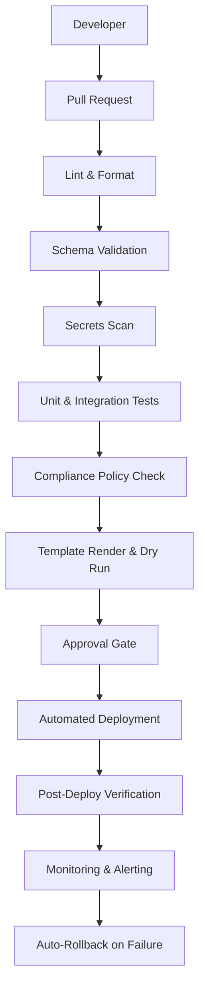
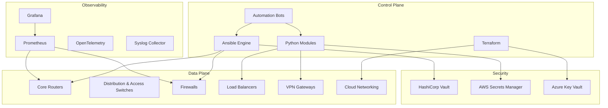
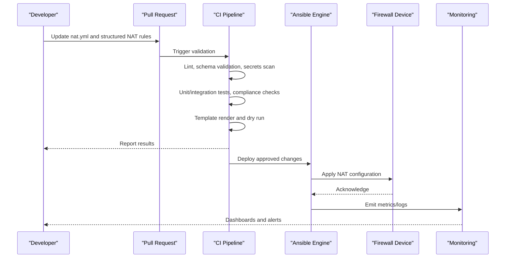
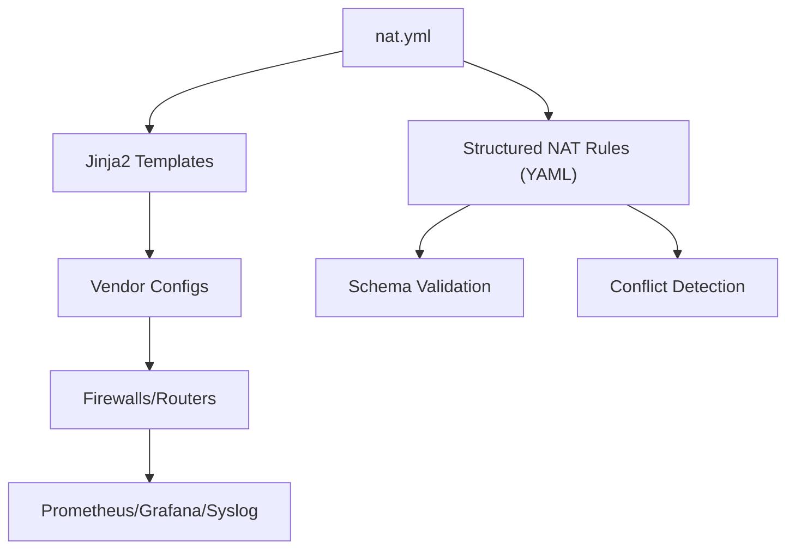

# Network Address Translation (NAT)

<cite>
**Referenced Files in This Document**
- [README.md](file://README.md)
</cite>

## Table of Contents
1. [Introduction](#introduction)
2. [Project Structure](#project-structure)
3. [Core Components](#core-components)
4. [Architecture Overview](#architecture-overview)
5. [Detailed Component Analysis](#detailed-component-analysis)
6. [Dependency Analysis](#dependency-analysis)
7. [Performance Considerations](#performance-considerations)
8. [Troubleshooting Guide](#troubleshooting-guide)
9. [Conclusion](#conclusion)
10. [Appendices](#appendices)

## Introduction
This document provides a comprehensive guide to automating Network Address Translation (NAT) across multi-vendor environments using the Enterprise Network Automation Platform. It covers static NAT, dynamic NAT, PAT (Port Address Translation), and NAT overload scenarios; address pool configuration; interface-based NAT; NAT exemptions; and NAT policy routing. It also includes vendor-specific implementation guidance for Cisco ASA/Firepower, Palo Alto PAN-OS, Fortinet FortiOS, and Check Point Gaia platforms. Practical examples reference the nat.yml playbook with structured NAT rules, template generation, conflict detection, optimization techniques, troubleshooting methodologies, logging and monitoring, and compliance validation.

The platform follows Infrastructure as Code and GitOps principles, generating device configurations from Jinja2 templates driven by structured YAML data, validated through CI/CD pipelines, and deployed via Ansible automation.

## Project Structure
The repository organizes automation artifacts into modular directories: inventories, group_vars, host_vars, playbooks, roles, templates per vendor, Python modules, tests, compliance policies, monitoring, and CI/CD workflows. NAT automation is primarily orchestrated by the nat.yml playbook, which renders vendor-specific templates and applies changes consistently across devices.

**Diagram sources**
- [README.md:36-50](file://README.md#L36-L50)

**Section sources**
- [README.md:103-180](file://README.md#L103-L180)

## Core Components
- Playbook: nat.yml orchestrates NAT rule management across supported vendors.
- Templates: Vendor-specific Jinja2 templates under templates/paloalto, templates/fortinet, templates/checkpoint, and related Cisco template directories generate device-native NAT configurations.
- Structured Data: YAML variables define NAT rules, pools, interfaces, and policies.
- Validation: Schemas and Batfish analysis ensure correctness before deployment.
- Compliance: Policies enforce security best practices and prevent unsafe NAT patterns.

Key references:
- The nat.yml playbook is listed among network services playbooks.
- Template directories include cisco_ios, paloalto, fortinet, checkpoint, etc.
- Supported vendors include Cisco, Palo Alto, Fortinet, and Check Point.

**Section sources**
- [README.md:388-399](file://README.md#L388-L399)
- [README.md:116-128](file://README.md#L116-L128)
- [README.md:203-217](file://README.md#L203-L217)

## Architecture Overview
The NAT automation architecture integrates structured data, templating, validation, and deployment within a GitOps pipeline. The control plane uses Ansible and Python modules to render vendor-specific NAT configurations and apply them to firewalls and routers. Observability collects telemetry and logs for monitoring translation statistics and performance.

**Diagram sources**
- [README.md:54-99](file://README.md#L54-L99)

## Detailed Component Analysis

### NAT Rule Management with nat.yml
The nat.yml playbook manages NAT rules across devices. It reads structured NAT definitions, validates them against schemas, renders vendor-specific templates, and applies changes with dry-run and rollback capabilities.

[No sources needed since this diagram shows conceptual workflow, not actual code structure]

**Section sources**
- [README.md:388-399](file://README.md#L388-L399)

### Static NAT
Static NAT maps a private IP to a public IP one-to-one. Use structured NAT rules to define source/destination addresses and translated addresses. Templates generate device-native static NAT entries.

- Address Pool: Not required for pure static mapping; use explicit public IP assignment.
- Interface-Based NAT: Bind static NAT to ingress/egress interfaces as required by vendor semantics.
- Exemptions: Define exempted traffic that bypasses NAT where necessary.
- Policy Routing: Combine NAT with policy routing to direct specific flows.

Vendor considerations:
- Cisco ASA/Firepower: Configure static mappings with access-lists and interface bindings.
- Palo Alto PAN-OS: Use Source NAT rules with destination objects and service definitions.
- Fortinet FortiOS: Create SNAT policies with source/destination addresses and ports.
- Check Point Gaia: Define static NAT rules in the firewall policy base.

**Section sources**
- [README.md:116-128](file://README.md#L116-L128)
- [README.md:203-217](file://README.md#L203-L217)

### Dynamic NAT
Dynamic NAT assigns public IPs from a pool to internal hosts on demand. Define address pools and match criteria in structured data; templates render dynamic NAT rules.

- Address Pool Configuration: Specify ranges or lists of public IPs available for allocation.
- Interface-Based NAT: Attach dynamic NAT to egress interfaces.
- Exemptions: Exclude sensitive traffic from NAT using exemption rules.
- Policy Routing: Route exempted or prioritized traffic accordingly.

Vendor considerations:
- Cisco ASA/Firepower: Configure NAT pools and dynamic NAT rules bound to interfaces.
- Palo Alto PAN-OS: Use Destination NAT with address pools and zone-based matching.
- Fortinet FortiOS: Define IP pools and SNAT policies referencing the pool.
- Check Point Gaia: Create dynamic NAT rules referencing address sets.

**Section sources**
- [README.md:116-128](file://README.md#L116-L128)
- [README.md:203-217](file://README.md#L203-L217)

### PAT (Port Address Translation)
PAT enables multiple internal hosts to share fewer public IPs by translating source ports. Configure port allocation strategies and reuse policies in structured data.

- Port Allocation Strategies: Choose between sequential allocation, randomization, or hash-based distribution to optimize utilization.
- Address Reuse: Enable aggressive reuse when safe to maximize pool efficiency.
- Performance Tuning: Adjust session timeouts and connection limits to balance throughput and resource usage.

Vendor considerations:
- Cisco ASA/Firepower: Configure PAT with interface overload or pool-based port translation.
- Palo Alto PAN-OS: Use Source NAT with port range settings and overload behavior.
- Fortinet FortiOS: Configure SNAT with port translation options and pool sizing.
- Check Point Gaia: Define PAT rules with port ranges and overload parameters.

**Section sources**
- [README.md:116-128](file://README.md#L116-L128)
- [README.md:203-217](file://README.md#L203-L217)

### NAT Overload
NAT overload is synonymous with PAT in many contexts; it allows many internal addresses to be translated to fewer external addresses using port multiplexing.

- Optimization Techniques:
  - Address reuse: Reduce churn by reusing existing translations when possible.
  - Port allocation strategies: Minimize conflicts and improve cache hit rates.
  - Session tuning: Align timeouts with application behavior to avoid premature teardown.
- Monitoring: Track translation table size, hits/misses, and port exhaustion events.

Vendor considerations:
- Cisco ASA/Firepower: Enable overload on NAT rules or interface-level PAT.
- Palo Alto PAN-OS: Configure Source NAT with overload and pool sharing.
- Fortinet FortiOS: Set SNAT policies to overload and tune pool sizes.
- Check Point Gaia: Apply overload semantics in NAT rulesets.

**Section sources**
- [README.md:116-128](file://README.md#L116-L128)
- [README.md:203-217](file://README.md#L203-L217)

### Address Pool Configuration
Define address pools in structured data for dynamic NAT and PAT. Pools can be global or interface-scoped. Ensure no overlap between pools and reserved addresses.

- Pool Types: Range-based, list-based, or dynamically allocated depending on vendor support.
- Pool Management: Centralize pool definitions in group_vars/host_vars for consistency.
- Conflict Detection: Validate pools against existing allocations and reservations.

Vendor considerations:
- Cisco ASA/Firepower: Define NAT pools and bind to rules/interfaces.
- Palo Alto PAN-OS: Use address groups and pools in NAT rules.
- Fortinet FortiOS: Create IP pools referenced by SNAT policies.
- Check Point Gaia: Define address sets used in NAT rules.

**Section sources**
- [README.md:116-128](file://README.md#L116-L128)
- [README.md:203-217](file://README.md#L203-L217)

### Interface-Based NAT
Bind NAT rules to specific interfaces to control directionality and scope. This ensures NAT applies only to traffic entering or leaving designated zones.

- Ingress vs Egress: Configure NAT based on ingress interface for source translation and egress interface for destination translation.
- Zone Binding: Associate interfaces with security zones for consistent policy enforcement.
- Exemptions: Allow exempted traffic to bypass NAT at the interface level.

Vendor considerations:
- Cisco ASA/Firepower: Use interface ACLs and NAT statements tied to interfaces.
- Palo Alto PAN-OS: Match traffic by ingress/egress zones and interfaces.
- Fortinet FortiOS: Bind SNAT/DNAT policies to ingress/egress interfaces.
- Check Point Gaia: Apply NAT rules scoped to interfaces/zones.

**Section sources**
- [README.md:116-128](file://README.md#L116-L128)
- [README.md:203-217](file://README.md#L203-L217)

### NAT Exemptions
Exempt specific traffic from NAT to preserve original addressing for internal routing or inspection.

- Exemption Criteria: Match by source/destination networks, protocols, or applications.
- Priority: Ensure exemption rules are evaluated before general NAT rules.
- Documentation: Maintain clear rationale for exemptions in structured data.

Vendor considerations:
- Cisco ASA/Firepower: Configure NAT exemptions using access-lists and no-nat statements.
- Palo Alto PAN-OS: Add exemption rules above general NAT rules.
- Fortinet FortiOS: Place exemption policies before SNAT policies.
- Check Point Gaia: Insert exemption rules earlier in the rulebase.

**Section sources**
- [README.md:116-128](file://README.md#L116-L128)
- [README.md:203-217](file://README.md#L203-L217)

### NAT Policy Routing
Combine NAT with policy routing to steer specific flows through designated paths or next-hops while applying translation.

- Policy Matching: Use ACLs or application identifiers to select traffic.
- Routing Actions: Direct matched traffic to specific interfaces or gateways.
- NAT Interaction: Ensure NAT rules align with policy routing decisions.

Vendor considerations:
- Cisco ASA/Firepower: Use route-maps and policy-based NAT.
- Palo Alto PAN-OS: Leverage policy-based routing with NAT rules.
- Fortinet FortiOS: Implement SD-WAN or policy routes alongside SNAT.
- Check Point Gaia: Use policy routing features integrated with NAT.

**Section sources**
- [README.md:116-128](file://README.md#L116-L128)
- [README.md:203-217](file://README.md#L203-L217)

### Vendor-Specific Implementations

#### Cisco ASA/Firepower
- Static NAT: Map private IPs to public IPs with interface binding.
- Dynamic NAT/PAT: Configure NAT pools and overload behavior.
- Exemptions: Use no-nat statements and ACLs.
- Policy Routing: Integrate route-maps with NAT.

**Section sources**
- [README.md:203-217](file://README.md#L203-L217)
- [README.md:116-128](file://README.md#L116-L128)

#### Palo Alto PAN-OS
- Source NAT: Define rules with address objects, services, and zones.
- Overload: Enable port translation and pool sharing.
- Exemptions: Place exemption rules above general NAT rules.
- Policy Routing: Combine with policy-based routing actions.

**Section sources**
- [README.md:203-217](file://README.md#L203-L217)
- [README.md:116-128](file://README.md#L116-L128)

#### Fortinet FortiOS
- SNAT Policies: Configure IP pools and translate source addresses.
- Overload: Tune pool sizes and port allocation strategies.
- Exemptions: Order policies to prioritize exemptions.
- Policy Routing: Use SD-WAN or policy routes with SNAT.

**Section sources**
- [README.md:203-217](file://README.md#L203-L217)
- [README.md:116-128](file://README.md#L116-L128)

#### Check Point Gaia
- NAT Rules: Define static/dynamic NAT in the firewall policy base.
- Overload: Apply port translation and address reuse.
- Exemptions: Insert exemption rules early in the rulebase.
- Policy Routing: Integrate with gateway routing policies.

**Section sources**
- [README.md:203-217](file://README.md#L203-L217)
- [README.md:116-128](file://README.md#L116-L128)

### Practical Examples Using nat.yml
- Structured NAT Rules: Define NAT entries in YAML with fields for type (static/dynamic/PAT), source/destination, pools, interfaces, and policies.
- Template Generation: Jinja2 templates consume structured data to produce vendor-specific configurations.
- Conflict Detection: Pre-deployment checks identify overlapping rules, duplicate mappings, and invalid pool assignments.

Execution flow:
- Update nat.yml and associated variables.
- Run CI validation (lint, schema, tests, compliance).
- Render templates and perform dry-run.
- Approve and deploy changes.
- Verify post-deploy and monitor metrics.

**Section sources**
- [README.md:388-399](file://README.md#L388-L399)
- [README.md:116-128](file://README.md#L116-L128)

### NAT Optimization Techniques
- Address Reuse: Enable reuse policies to reduce translation churn and improve cache efficiency.
- Port Allocation Strategies: Select allocation algorithms that minimize collisions and maximize utilization.
- Performance Tuning: Adjust session timeouts, connection limits, and buffer sizes based on workload characteristics.
- Monitoring: Track translation table utilization, misses, and errors to inform tuning.

**Section sources**
- [README.md:583-616](file://README.md#L583-L616)

### Troubleshooting Methodologies
- Connectivity Checks: Validate SSH reachability and device status.
- Template Rendering: Inspect rendered configs for syntax and semantic issues.
- Compliance Failures: Review policy violations and remediate deviations.
- CI Pipeline Issues: Analyze GitHub Actions logs for actionable errors.
- Secrets Backend: Confirm authentication and access to Vault or other secret managers.
- Simulation Tools: Use Batfish snapshots to validate NAT rule interactions.

**Section sources**
- [README.md:674-685](file://README.md#L674-L685)

### Logging Configuration and Monitoring NAT Statistics
- Logging: Configure syslog destinations and enable NAT event logging on devices.
- Telemetry: Collect model-driven telemetry for real-time insights.
- Metrics: Export NAT counters to Prometheus and visualize in Grafana.
- Alerts: Set thresholds for translation table saturation and error rates.

**Section sources**
- [README.md:583-616](file://README.md#L583-L616)

### Compliance Validation for NAT Policy Enforcement
- Security Best Practices: Enforce default deny, explicit allow, and no any-any NAT rules.
- Shadow/Duplicate Detection: Identify redundant or conflicting NAT entries.
- Unused Objects: Flag unused NAT rules and objects for cleanup.
- Automated Checks: Integrate OPA/Batfish policies and custom Python checks into CI/CD.

**Section sources**
- [README.md:552-579](file://README.md#L552-L579)

## Dependency Analysis
NAT automation depends on structured data, templates, validation tools, and deployment mechanisms. The following diagram illustrates key dependencies:

[No sources needed since this diagram shows conceptual relationships, not actual code structure]

**Section sources**
- [README.md:388-399](file://README.md#L388-L399)
- [README.md:116-128](file://README.md#L116-L128)

## Performance Considerations
- Optimize NAT tables by enabling address reuse and appropriate port allocation strategies.
- Tune session timeouts to match application lifecycles and reduce unnecessary teardowns.
- Monitor translation statistics and adjust pool sizes to prevent exhaustion.
- Use policy routing to minimize NAT processing for exempted or high-priority traffic.

[No sources needed since this section provides general guidance]

## Troubleshooting Guide
- Connection Issues: Verify SSH reachability and credentials.
- Template Errors: Debug Jinja2 rendering and variable definitions.
- Compliance Violations: Review policy reports and fix deviations.
- CI Failures: Inspect pipeline logs for lint, test, and validation failures.
- Secrets Problems: Confirm OIDC/AppRole credentials and Vault policies.
- Simulation Errors: Validate Batfish snapshots and rule interactions.

**Section sources**
- [README.md:674-685](file://README.md#L674-L685)

## Conclusion
The Enterprise Network Automation Platform provides a robust, vendor-agnostic approach to NAT automation. By leveraging structured data, Jinja2 templates, and a GitOps-driven CI/CD pipeline, organizations can consistently manage static NAT, dynamic NAT, PAT, and NAT overload across Cisco ASA/Firepower, Palo Alto PAN-OS, Fortinet FortiOS, and Check Point Gaia. With built-in validation, compliance enforcement, observability, and troubleshooting utilities, the platform ensures secure, efficient, and maintainable NAT operations at enterprise scale.

[No sources needed since this section summarizes without analyzing specific files]

## Appendices

### Appendix A: Example Workflow Steps
- Author NAT rules in structured YAML.
- Commit changes and open a pull request.
- CI runs lint, schema validation, tests, compliance checks, and template dry-run.
- Approve changes and trigger deployment.
- Post-deploy verification and monitoring confirm successful NAT application.

[No sources needed since this section provides general guidance]