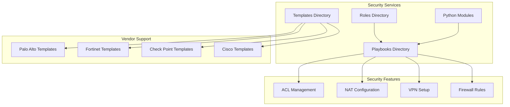
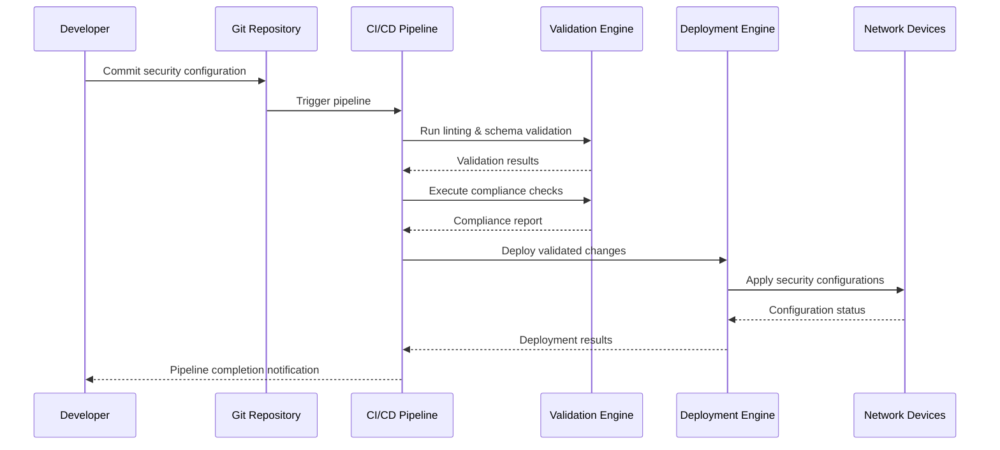
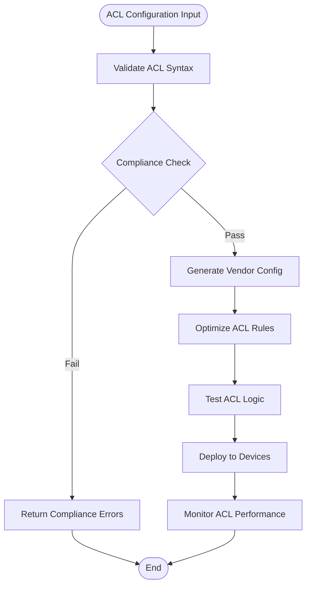
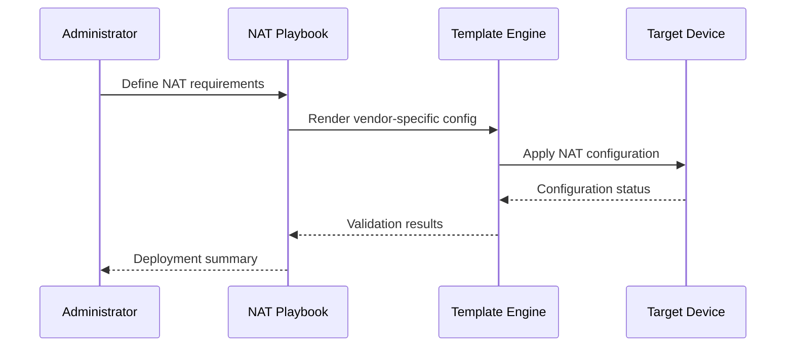
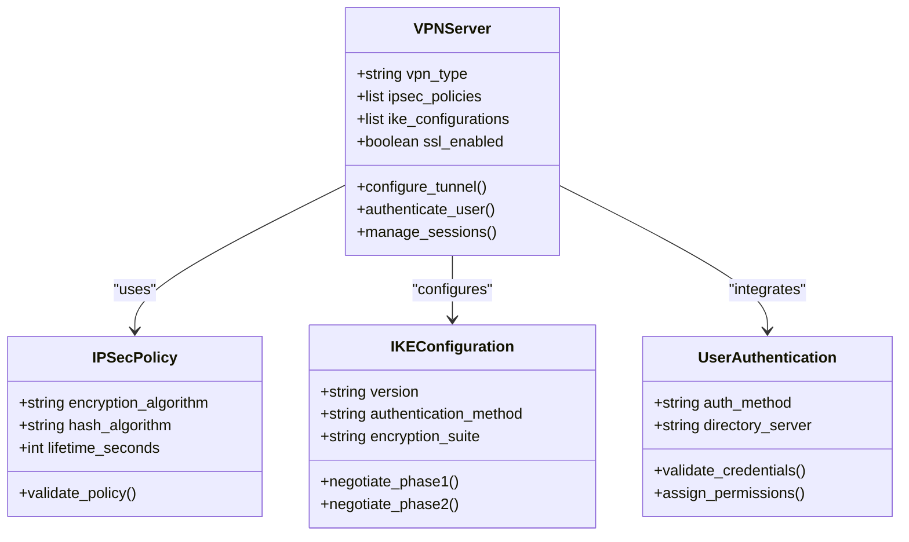
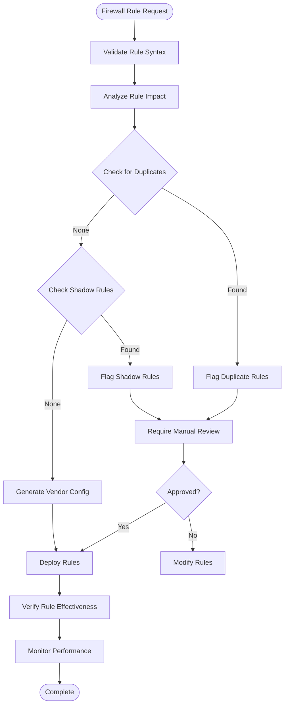
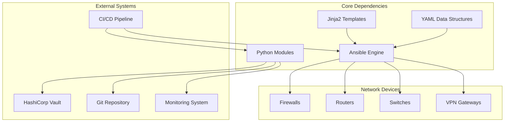

# Security Services Automation

<cite>
**Referenced Files in This Document**
- [README.md](file://README.md)
</cite>

## Table of Contents
1. [Introduction](#introduction)
2. [Project Structure](#project-structure)
3. [Core Components](#core-components)
4. [Architecture Overview](#architecture-overview)
5. [Detailed Component Analysis](#detailed-component-analysis)
6. [Dependency Analysis](#dependency-analysis)
7. [Performance Considerations](#performance-considerations)
8. [Troubleshooting Guide](#troubleshooting-guide)
9. [Conclusion](#conclusion)

## Introduction

This document provides comprehensive coverage of security service automation capabilities within the Enterprise Network Automation Platform. The platform enables automated management of critical security services including Access Control Lists (ACLs), Network Address Translation (NAT), Virtual Private Networks (VPN), and firewall rule deployment across multi-vendor environments.

The platform supports enterprise-scale operations with vendor-agnostic automation for Palo Alto, Fortinet, Check Point, Cisco ASA/Firepower, and other major networking vendors. All security configurations are managed through Infrastructure as Code principles with GitOps workflows, ensuring consistency, compliance, and auditability.

## Project Structure

The security automation platform follows a modular architecture organized around Ansible playbooks, Jinja2 templates, and Python modules. The key directories supporting security services include:

**Diagram sources**
- [README.md:103-180](file://README.md#L103-L180)

**Section sources**
- [README.md:103-180](file://README.md#L103-L180)

## Core Components

The security automation platform provides four primary components for managing network security services:

### Access Control List Management
The `acl.yml` playbook manages access control lists with support for both numbered and named ACLs, permit/deny statements, and optimization techniques. The system enforces default deny policies and explicit allow rules as part of compliance requirements.

### NAT Configuration
The `nat.yml` playbook handles Network Address Translation including static NAT, dynamic NAT, PAT (Port Address Translation), and NAT overload scenarios. It supports vendor-specific implementations while maintaining consistent configuration patterns.

### VPN Implementation
The `vpn.yml` playbook configures both site-to-site and remote-access VPNs. Site-to-site tunnels use IPSec policies with IKE configuration and tunnel interfaces. Remote-access VPNs provide SSL/TLS termination with user authentication and split tunneling capabilities.

### Firewall Rule Deployment
The `firewall_rules.yml` playbook deploys stateful inspection rules with zone-based policies and rule optimization. It includes compliance validation to prevent any-any rules and detect shadow or duplicate entries.

**Section sources**
- [README.md:388-399](file://README.md#L388-L399)

## Architecture Overview

The security automation architecture follows a GitOps model where all security configurations are defined as code and deployed through automated pipelines with comprehensive validation and compliance checks.

**Diagram sources**
- [README.md:36-50](file://README.md#L36-L50)

The platform integrates multiple security layers including secrets management, policy enforcement, and continuous monitoring to ensure secure and compliant operations.

**Section sources**
- [README.md:36-50](file://README.md#L36-L50)

## Detailed Component Analysis

### Access Control List Management

The ACL management system provides comprehensive control over network traffic filtering with vendor-agnostic configuration generation.

#### Key Features
- **Named vs Numbered ACLs**: Support for both naming conventions based on vendor capabilities
- **Permit/Deny Statements**: Explicit traffic control with default deny policies
- **ACL Optimization**: Automatic detection of redundant rules and optimization opportunities
- **Compliance Enforcement**: Validation against organizational security policies

#### Vendor-Specific Implementations
The system generates vendor-specific configurations for:
- **Palo Alto**: Zone-based policies with address objects and service definitions
- **Fortinet**: Policy-based routing with address groups and service objects
- **Check Point**: Rule base management with object-oriented approach
- **Cisco ASA/Firepower**: Context-aware security policies with object groups

**Diagram sources**
- [README.md:552-566](file://README.md#L552-L566)

**Section sources**
- [README.md:396](file://README.md#L396)
- [README.md:552-566](file://README.md#L552-L566)

### NAT Configuration Management

The NAT configuration system handles complex address translation scenarios with automatic optimization and validation.

#### Supported NAT Types
- **Static NAT**: One-to-one address mapping for servers and services
- **Dynamic NAT**: Pool-based address allocation for internal hosts
- **PAT (Port Address Translation)**: Many-to-one translation using port numbers
- **NAT Overload**: Advanced overload scenarios with load balancing

#### Configuration Workflow

**Diagram sources**
- [README.md:397](file://README.md#L397)

**Section sources**
- [README.md:397](file://README.md#L397)

### VPN Implementation

The VPN automation supports both site-to-site and remote-access scenarios with comprehensive security policies.

#### Site-to-Site VPN Configuration
- **IPSec Policies**: Automated policy negotiation and encryption settings
- **IKE Configuration**: Phase 1 and Phase 2 parameter management
- **Tunnel Interfaces**: Dynamic tunnel creation and maintenance
- **Route Propagation**: Automatic route advertisement and learning

#### Remote-Access VPN Setup
- **SSL/TLS Termination**: Certificate management and protocol negotiation
- **User Authentication**: Integration with AAA servers and directory services
- **Split Tunneling**: Granular traffic routing policies
- **Session Management**: Connection limits and resource allocation

**Diagram sources**
- [README.md:398](file://README.md#L398)

**Section sources**
- [README.md:398](file://README.md#L398)

### Firewall Rule Deployment

The firewall automation provides comprehensive rule management with stateful inspection and zone-based security policies.

#### Stateful Inspection
- **Connection Tracking**: Automatic state table management
- **Protocol Awareness**: Deep packet inspection for application protocols
- **State Synchronization**: High availability state sharing between devices

#### Zone-Based Policies
- **Trust Levels**: Hierarchical security zones with inter-zone policies
- **Traffic Flow Control**: Directional traffic filtering between zones
- **Service Definitions**: Application-aware traffic classification

#### Rule Optimization
- **Duplicate Detection**: Identification of redundant firewall rules
- **Shadow Rule Analysis**: Detection of rules that never match due to higher-priority rules
- **Unused Rule Cleanup**: Automated identification of unused security rules

**Diagram sources**
- [README.md:564-566](file://README.md#L564-L566)

**Section sources**
- [README.md:399](file://README.md#L399)
- [README.md:564-566](file://README.md#L564-L566)

## Dependency Analysis

The security automation platform has well-defined dependencies between components and external systems.

**Diagram sources**
- [README.md:54-99](file://README.md#L54-L99)

**Section sources**
- [README.md:54-99](file://README.md#L54-L99)

## Performance Considerations

The security automation platform is designed for high-performance operations at enterprise scale:

### Scalability Features
- **Parallel Execution**: Concurrent device configuration updates
- **Batch Processing**: Efficient handling of large rule sets
- **Incremental Updates**: Only changed configurations are applied
- **Connection Pooling**: Optimized device connectivity management

### Optimization Techniques
- **Rule Consolidation**: Automatic merging of similar security rules
- **Template Caching**: Reuse of rendered configuration templates
- **Intelligent Rollback**: Fast recovery from failed deployments
- **Resource Monitoring**: Real-time performance metrics collection

### Compliance and Audit
- **Change Tracking**: Complete audit trail of all security changes
- **Policy Enforcement**: Automated compliance validation
- **Risk Assessment**: Pre-deployment risk analysis
- **Reporting**: Comprehensive security posture reports

## Troubleshooting Guide

Common issues and their resolutions in security service automation:

### Configuration Issues
- **Template Rendering Errors**: Validate Jinja2 syntax and variable definitions
- **Vendor Compatibility**: Ensure proper vendor-specific template selection
- **Syntax Validation**: Use pre-commit hooks and CI validation

### Connectivity Problems
- **Device Reachability**: Verify SSH/API connectivity to target devices
- **Authentication Failures**: Check credentials in secrets management
- **Timeout Issues**: Adjust connection timeouts for large configurations

### Performance Bottlenecks
- **Concurrent Operations**: Tune parallel execution limits
- **Memory Usage**: Monitor memory consumption during large deployments
- **Network Latency**: Optimize batch sizes for WAN connections

**Section sources**
- [README.md:674-685](file://README.md#L674-L685)

## Conclusion

The Enterprise Network Automation Platform provides comprehensive security service automation capabilities that enable organizations to manage complex security infrastructure at scale. The platform's vendor-agnostic approach, combined with robust GitOps workflows and comprehensive compliance enforcement, ensures secure, consistent, and auditable security operations.

Key benefits include:
- **Consistency**: Elimination of manual configuration errors
- **Scalability**: Support for thousands of devices across multiple vendors
- **Compliance**: Automated policy enforcement and audit trails
- **Efficiency**: Rapid deployment of security changes with rollback capabilities
- **Visibility**: Comprehensive monitoring and reporting capabilities

The platform's modular architecture allows for easy extension to new vendors and security technologies while maintaining backward compatibility and operational stability.