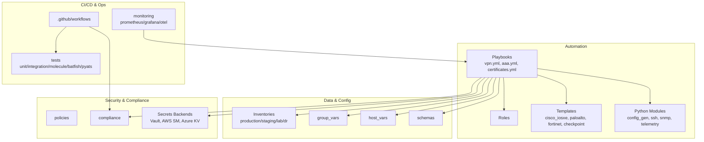
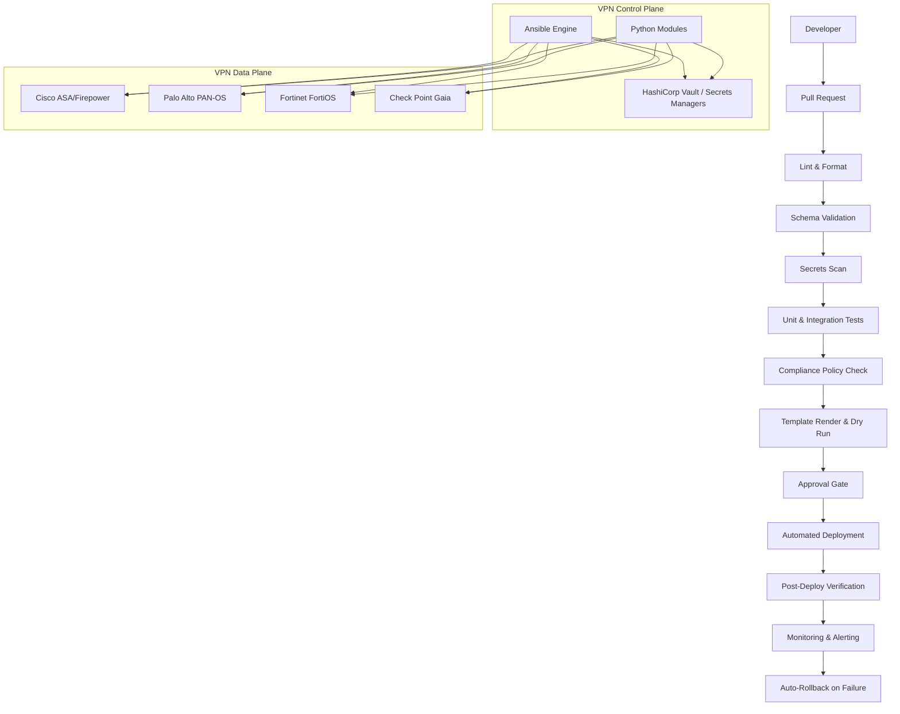
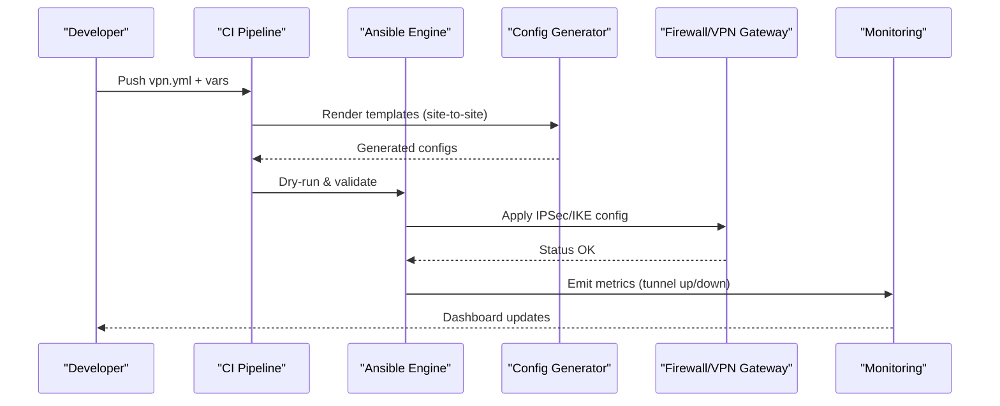
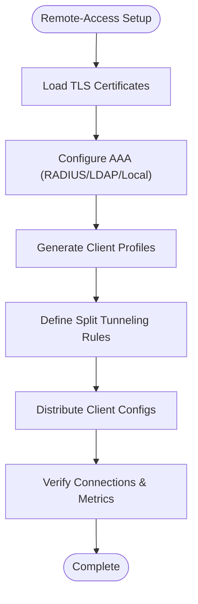
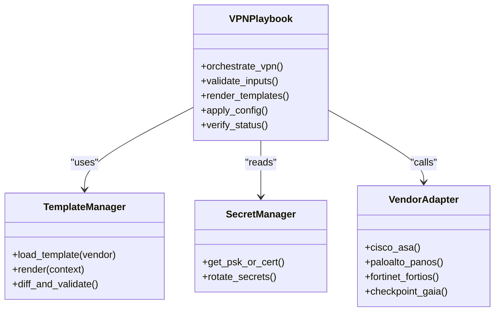
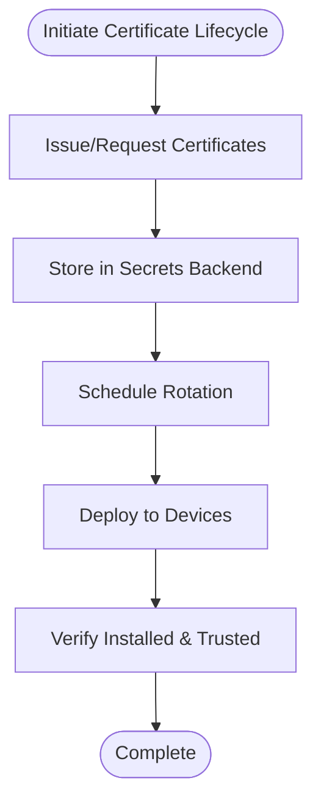
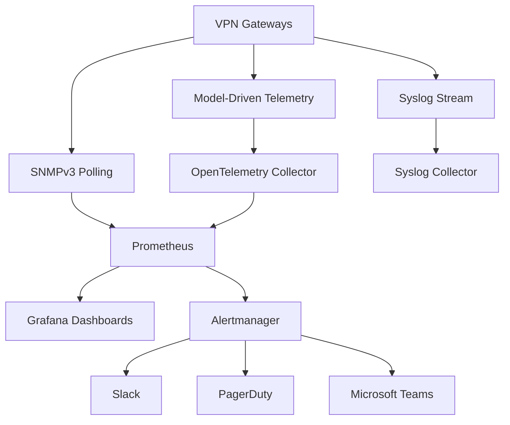
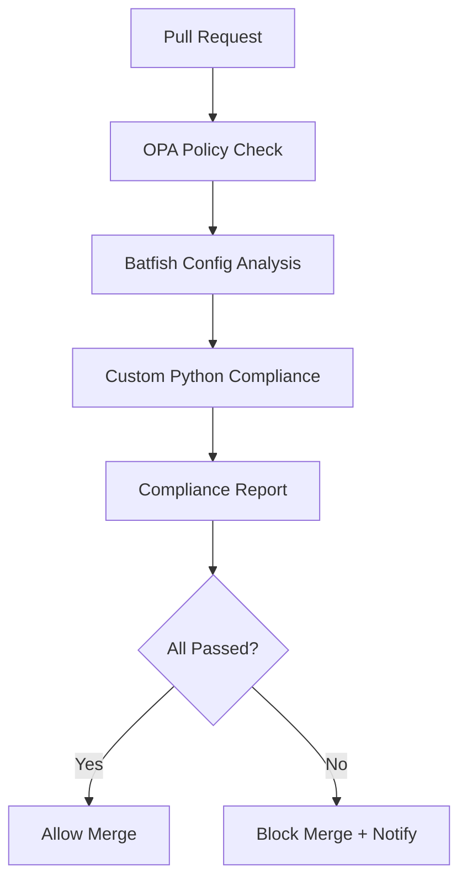
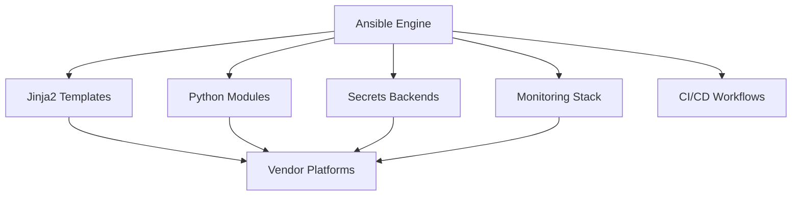

# VPN Automation

<cite>
**Referenced Files in This Document**
- [README.md](file://README.md)
</cite>

## Table of Contents
1. [Introduction](#introduction)
2. [Project Structure](#project-structure)
3. [Core Components](#core-components)
4. [Architecture Overview](#architecture-overview)
5. [Detailed Component Analysis](#detailed-component-analysis)
6. [Dependency Analysis](#dependency-analysis)
7. [Performance Considerations](#performance-considerations)
8. [Troubleshooting Guide](#troubleshooting-guide)
9. [Conclusion](#conclusion)
10. [Appendices](#appendices)

## Introduction
This document describes end-to-end VPN automation for site-to-site and remote-access scenarios across multi-vendor environments. It covers IPSec/IKE configuration, tunnel interface management, SSL/TLS termination, user authentication methods (RADIUS, LDAP, local), split tunneling, client configuration distribution, vendor-specific implementations (Cisco ASA/Firepower, Palo Alto PAN-OS, Fortinet FortiOS, Check Point Gaia), structured playbook-driven provisioning with vpn.yml, certificate management, monitoring, troubleshooting, performance optimization, security hardening, and compliance validation.

The platform follows Infrastructure as Code and GitOps principles: all configurations are generated from Jinja2 templates and structured data, validated through CI/CD, deployed via Ansible, and verified post-deploy. Secrets are never committed and are managed through secure backends.

[No sources needed since this section summarizes without analyzing specific files]

## Project Structure
The repository is organized to support enterprise-scale network automation with modular playbooks, per-vendor templates, Python modules, and observability tooling. Key directories include inventories, group_vars/host_vars, playbooks, roles, templates (per vendor), python modules, bots, tests, compliance, pipelines, monitoring, terraform, schemas, examples, scripts, docs, images, and GitHub Actions workflows.

**Diagram sources**
- [README.md:103-180](file://README.md#L103-L180)
- [README.md:371-435](file://README.md#L371-L435)

**Section sources**
- [README.md:103-180](file://README.md#L103-L180)
- [README.md:371-435](file://README.md#L371-L435)

## Core Components
- VPN Playbook: vpn.yml orchestrates site-to-site and remote-access VPN deployments across multiple vendors.
- Templates: Per-vendor Jinja2 templates under templates/cisco_iosxe, templates/paloalto, templates/fortinet, templates/checkpoint render device-specific IPSec/IKE, SSL/TLS, and tunnel interfaces.
- Structured Variables: group_vars and host_vars define VPN parameters (tunnels, peers, IKE policies, crypto profiles, auth methods, split tunneling).
- Certificates: certificates.yml manages TLS certificates and PKI integration for SSL/TLS termination and IKEv2 EAP.
- Authentication: aaa.yml configures RADIUS/LDAP/local users and AAA policies for remote access.
- Monitoring: Prometheus/Grafana dashboards and OpenTelemetry collectors collect VPN metrics (tunnel status, bandwidth, session counts).
- Compliance: Automated checks enforce approved ciphers, policy defaults, and audit trails.

**Section sources**
- [README.md:371-435](file://README.md#L371-L435)
- [README.md:103-180](file://README.md#L103-L180)

## Architecture Overview
VPN automation integrates with the broader automation engine, secrets backends, and observability stack.

**Diagram sources**
- [README.md:34-99](file://README.md#L34-L99)
- [README.md:339-368](file://README.md#L339-L368)

## Detailed Component Analysis

### Site-to-Site VPN Tunnels (IPSec + IKE)
- Objective: Automate creation of IPSec tunnels with IKE Phase 1/2 policies, transform sets, crypto maps/profiles, and tunnel interfaces.
- Inputs: Structured variables for peer addresses, pre-shared keys or certificates, IKE proposals, encryption/AES-GCM, hashing, DH groups, lifetime, DPD, and route-based vs policy-based selection.
- Outputs: Vendor-specific IPSec/IKE configuration rendered by templates; tunnel interfaces configured with IP pools or static routes.
- Validation: Pre-deployment syntax and semantic checks; post-deploy verification of tunnel state and traffic flow.

**Diagram sources**
- [README.md:371-435](file://README.md#L371-L435)
- [README.md:479-514](file://README.md#L479-L514)

**Section sources**
- [README.md:371-435](file://README.md#L371-L435)

### Remote-Access VPN (SSL/TLS Termination + User Auth)
- Objective: Provision SSL/TLS termination points, configure user authentication (RADIUS, LDAP, local), enable split tunneling, and distribute client configurations.
- Inputs: Certificate references, AAA servers, user groups, split-tunnel ACLs, DNS/WINS settings, client profile templates.
- Outputs: SSL VPN gateway config, AAA policies, client profiles, and downloadable connection packages.
- Security: Enforce approved cipher suites, MFA where applicable, least privilege split tunneling.

**Diagram sources**
- [README.md:371-435](file://README.md#L371-L435)

**Section sources**
- [README.md:371-435](file://README.md#L371-L435)

### Vendor-Specific Implementations
- Cisco ASA/Firepower: Route-based and policy-based IPSec, IKEv2 with EAP, SSL VPN AnyConnect profiles, group policies, and split tunneling ACLs.
- Palo Alto PAN-OS: GlobalProtect gateways, IKE/IPsec profiles, SSL forward proxy if required, user-ID integration, and split tunneling via address objects.
- Fortinet FortiOS: IPsec phase1/phase2, SSL VPN portal/server, user groups, split tunneling via firewall policies, and client auto-config.
- Check Point Gaia: IPsec domain-based or policy-based, SSL Network Extender, user database integration, and split tunneling via routing rules.

**Diagram sources**
- [README.md:103-180](file://README.md#L103-L180)
- [README.md:371-435](file://README.md#L371-L435)

**Section sources**
- [README.md:103-180](file://README.md#L103-L180)
- [README.md:371-435](file://README.md#L371-L435)

### Structured Parameters and vpn.yml Playbook
- Purpose: Centralized orchestration for VPN lifecycle using structured YAML inputs.
- Typical parameters:
  - Tunnels: name, type (site-to-site/remote-access), endpoints, mode (route/policy), interfaces.
  - IKE: version (v1/v2), proposals (encryption, hash, DH group), lifetimes, key exchange method (PSK/cert).
  - IPSec: transform sets, PFS, DPD, logging.
  - Remote Access: SSL termination cert, AAA servers, user groups, split tunnel ACLs, DNS/WINS, client profiles.
  - Certificates: CA chain, leaf certs, rotation schedule.
- Execution: ansible-playbook playbooks/vpn.yml -i inventories/<env>/hosts.yml --check --diff for dry-run; remove flags to apply.

**Section sources**
- [README.md:371-435](file://README.md#L371-L435)

### Certificate Management and Key Exchange
- Objectives: Manage TLS certificates for SSL/TLS termination and IKEv2 EAP; rotate securely; integrate with PKI.
- Methods: Use certificates.yml to deploy certs; secrets stored in HashiCorp Vault/AWS Secrets Manager/Azure Key Vault; ACME/Vault PKI for issuance and renewal.
- Key Exchange: Support PSK and certificate-based IKEv2; enforce approved algorithms and minimum key lengths.

**Diagram sources**
- [README.md:339-368](file://README.md#L339-L368)
- [README.md:371-435](file://README.md#L371-L435)

**Section sources**
- [README.md:339-368](file://README.md#L339-L368)
- [README.md:371-435](file://README.md#L371-L435)

### VPN Monitoring: Tunnel Status, Bandwidth, Connection Metrics
- Metrics: Tunnel up/down state, bytes in/out, session count, rekey events, DPD failures, CPU/memory utilization on VPN gateways.
- Collection: SNMPv3 polling, model-driven telemetry streaming, syslog event ingestion.
- Visualization: Grafana dashboards for real-time visibility; alerting via Alertmanager to Slack/PagerDuty/Teams.
- Integration: Prometheus scrapers and OpenTelemetry collectors configured in monitoring/.

**Diagram sources**
- [README.md:583-604](file://README.md#L583-L604)

**Section sources**
- [README.md:583-604](file://README.md#L583-L604)

### Troubleshooting Methodologies
- Connectivity: Validate SSH reachability and API connectivity; use ping and port checks against devices.
- Template Issues: Debug Jinja2 rendering with debug flags; inspect diffs between desired and running config.
- Compliance Failures: Review compliance policies and device running config diff; remediate violations before deployment.
- CI Failures: Inspect GitHub Actions logs; most failures include actionable messages.
- Secrets: Verify OIDC token or AppRole credentials; check Vault policies and path permissions.
- Simulation: Use Batfish snapshots to analyze ACL/routing/firewall rule implications prior to deployment.

**Section sources**
- [README.md:674-685](file://README.md#L674-L685)

### Performance Optimization
- Bulk Operations: Use parallel execution and optimized inventory scoping to reduce deployment time.
- Incremental Changes: Prefer targeted role execution and minimal diffs to limit disruption.
- Telemetry Sampling: Adjust telemetry intervals to balance fidelity and overhead.
- Caching: Cache template renders and secret lookups during large runs.
- QoS: Apply QoS policies to prioritize control-plane traffic (IKE/IPsec, SSL handshake) over bulk data.

[No sources needed since this section provides general guidance]

### Security Hardening Practices
- Approved Ciphers: Enforce strong encryption and hashing; disable legacy algorithms.
- Password Policy: Enforce complexity, length, and rotation; integrate with PAM/Vault.
- Logging: Enable verbose logging for VPN sessions and control-plane events.
- Least Privilege: Restrict split tunneling to necessary networks; default deny.
- Audit Trails: Ensure all changes are tracked in Git with approvals and timestamps.

**Section sources**
- [README.md:552-579](file://README.md#L552-L579)

### Compliance Validation and Audit Trail Requirements
- Checks: SSH-only, NTP, AAA enabled, SNMPv3, approved ciphers, approved firmware, password policy, ACL standards, firewall rules, unused objects.
- Flow: OPA policy checks, Batfish analysis, custom Python compliance, report generation, merge gating.
- Audit: All changes recorded in Git; CI/CD artifacts preserved; compliance reports attached to releases.

**Diagram sources**
- [README.md:568-579](file://README.md#L568-L579)

**Section sources**
- [README.md:552-579](file://README.md#L552-L579)

## Dependency Analysis
VPN automation depends on:
- Ansible Engine and Python Modules for orchestration and device interaction.
- Jinja2 Templates for per-vendor configuration generation.
- Secrets Backends for secure credential and certificate management.
- Monitoring Stack for observability and alerting.
- CI/CD Workflows for validation, approval, and deployment.

**Diagram sources**
- [README.md:34-99](file://README.md#L34-L99)
- [README.md:103-180](file://README.md#L103-L180)

**Section sources**
- [README.md:34-99](file://README.md#L34-L99)
- [README.md:103-180](file://README.md#L103-L180)

## Performance Considerations
- Optimize inventory scoping and parallelism to reduce run times.
- Use incremental deployments and targeted roles to minimize change impact.
- Tune telemetry sampling and SNMP polling intervals based on environment scale.
- Leverage caching for templates and secrets to accelerate repeated runs.
- Apply QoS to protect control-plane traffic during high-load periods.

[No sources needed since this section provides general guidance]

## Troubleshooting Guide
- Ansible connection timeout: Verify SSH reachability and credentials.
- Template rendering error: Use debug flags to inspect Jinja2 context and output.
- Compliance check failure: Review policy definitions and device config diffs.
- CI pipeline failure: Examine workflow logs for actionable errors.
- Vault authentication failure: Confirm OIDC/AppRole credentials and policies.
- Molecule test failure: Ensure container runtime is available and configured.
- Batfish analysis error: Validate snapshot contents and model coverage.

**Section sources**
- [README.md:674-685](file://README.md#L674-L685)

## Conclusion
This VPN automation framework enables consistent, secure, and observable deployment of site-to-site and remote-access VPNs across Cisco, Palo Alto, Fortinet, and Check Point platforms. By leveraging structured parameters, vendor-specific templates, robust secrets management, and integrated monitoring and compliance, organizations can achieve reliable VPN operations at enterprise scale.

[No sources needed since this section summarizes without analyzing specific files]

## Appendices

### Example Playbook Invocation Paths
- vpn.yml: Orchestrates site-to-site and remote-access VPN deployments.
- aaa.yml: Configures AAA (RADIUS/LDAP/local) for remote access.
- certificates.yml: Manages TLS certificates and PKI integration.

**Section sources**
- [README.md:371-435](file://README.md#L371-L435)

### Supported Vendors and Protocols
- Cisco IOS/IOS-XE/NX-OS: SSH, NETCONF, RESTCONF.
- Palo Alto PAN-OS: SSH, API.
- Fortinet FortiOS: SSH, API.
- Check Point Gaia: SSH, API.

**Section sources**
- [README.md:203-226](file://README.md#L203-L226)