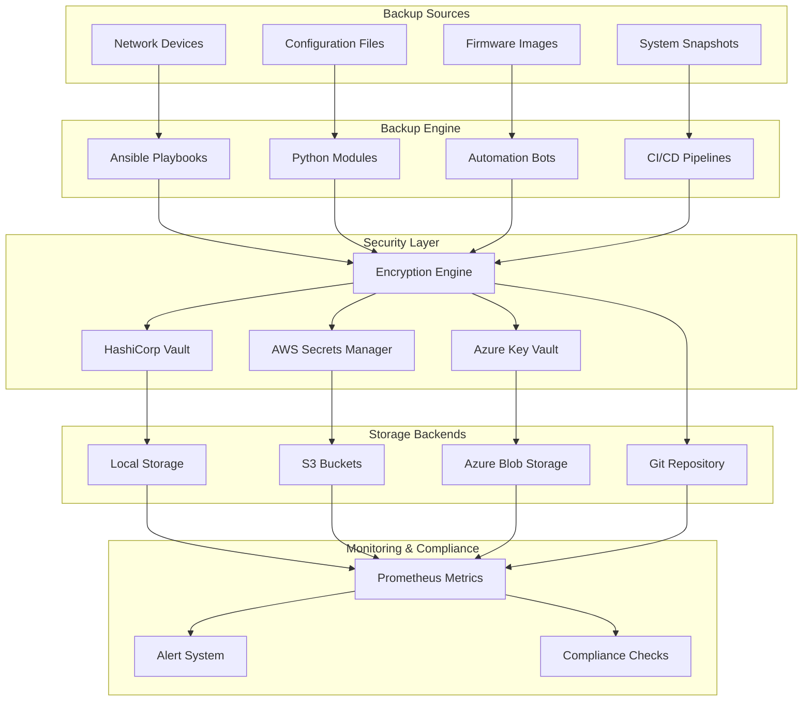
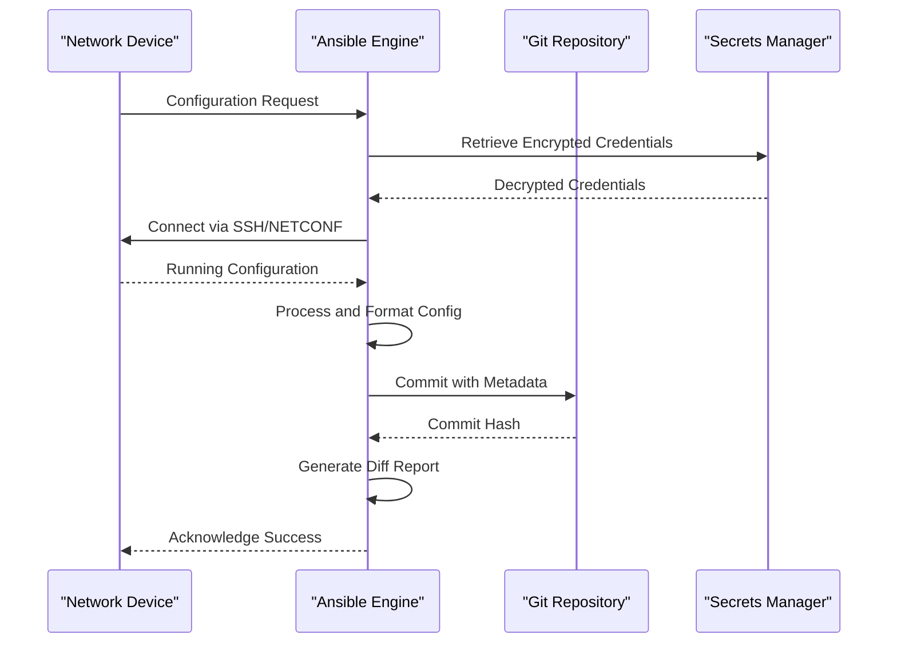
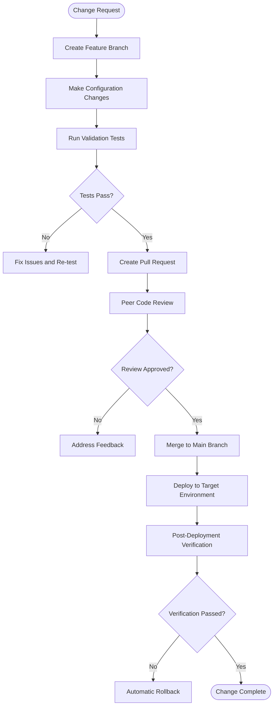
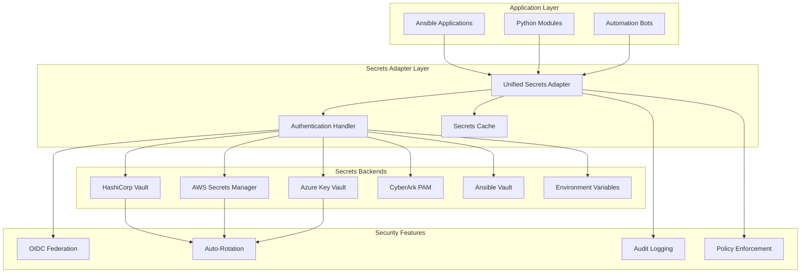
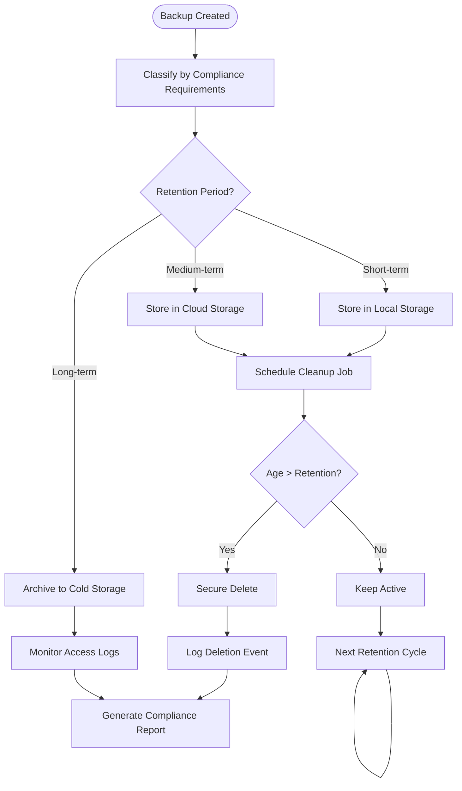
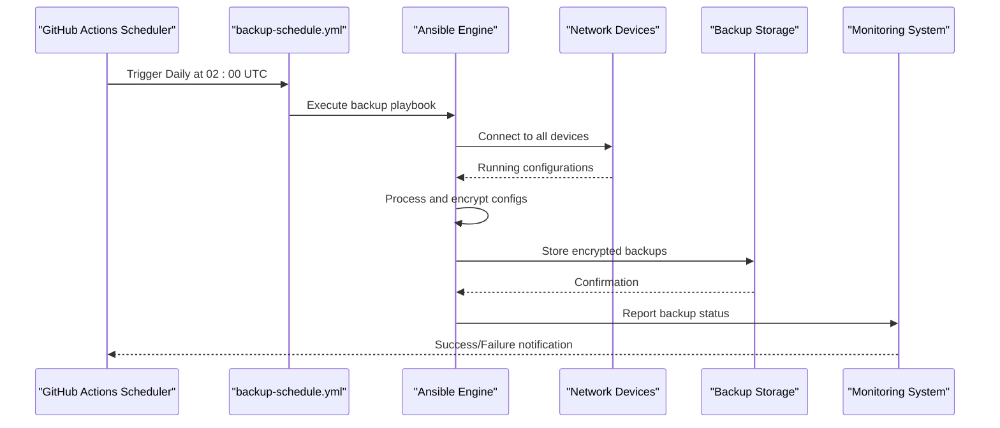
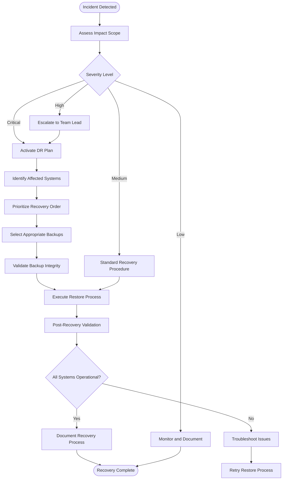
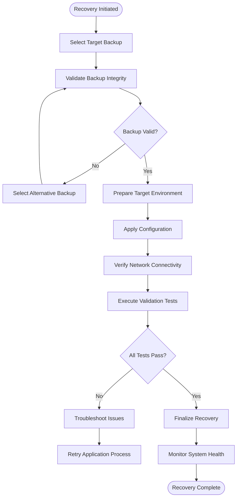
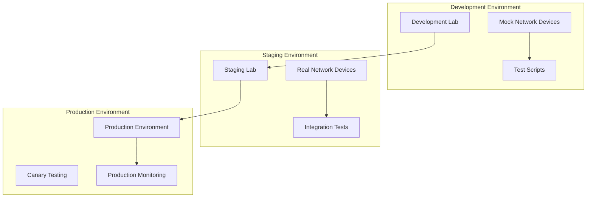

# Backup and Recovery

<cite>
**Referenced Files in This Document**
- [README.md](file://README.md)
</cite>

## Table of Contents
1. [Introduction](#introduction)
2. [Backup Architecture Overview](#backup-architecture-overview)
3. [Automated Backup Strategies](#automated-backup-strategies)
4. [Configuration Management and Versioning](#configuration-management-and-versioning)
5. [Encryption and Security](#encryption-and-security)
6. [Storage Locations and Retention Policies](#storage-locations-and-retention-policies)
7. [Backup Scheduling and Automation](#backup-scheduling-and-automation)
8. [Disaster Recovery Procedures](#disaster-recovery-procedures)
9. [Manual Backup Operations](#manual-backup-operations)
10. [Bulk Backup Operations](#bulk-backup-operations)
11. [Recovery Workflows](#recovery-workflows)
12. [Backup Validation and Integrity Checks](#backup-validation-and-integrity-checks)
13. [Testing and Verification](#testing-and-verification)
14. [Troubleshooting Guide](#troubleshooting-guide)
15. [Conclusion](#conclusion)

## Introduction

This document provides comprehensive guidance for backup and recovery procedures within the Enterprise Network Automation Platform. The platform implements a robust, multi-layered backup strategy that ensures configuration integrity, supports disaster recovery, and maintains compliance requirements across thousands of network devices in multi-vendor, multi-region environments.

The backup system integrates seamlessly with GitOps workflows, CI/CD pipelines, and automation bots to provide automated, secure, and verifiable backup operations for running configurations, firmware images, and critical system snapshots.

## Backup Architecture Overview

The backup architecture follows a layered approach with multiple storage backends, encryption mechanisms, and automated scheduling:



**Diagram sources**
- [README.md:52-99](file://README.md#L52-L99)
- [README.md:339-368](file://README.md#L339-L368)

## Automated Backup Strategies

### Configuration Snapshots

The platform implements comprehensive configuration snapshot management through multiple strategies:

#### Running Configuration Backups
- **Frequency**: Daily automated backups at 02:00 UTC via scheduled CI/CD workflow
- **Scope**: All production, staging, lab, and disaster recovery environments
- **Format**: Vendor-specific native formats with standardized metadata
- **Versioning**: Git integration with commit history and change tracking

#### Configuration Drift Detection
- Automated comparison between current device state and last known good configuration
- Real-time monitoring for unauthorized changes
- Alerting for significant deviations from baseline

#### Golden Configuration Management
- Baseline configurations stored in version control
- Automated drift detection against approved baselines
- Remediation workflows for non-compliant configurations

### Firmware Image Management

Firmware backup and management includes:

- **Image Inventory**: Centralized catalog of all firmware versions across device fleet
- **Checksum Verification**: SHA-256 validation for firmware integrity
- **Version Tracking**: Git-based version control for firmware manifests
- **Rollback Support**: Automated rollback to previous firmware versions on failure

### System State Snapshots

- **Device Inventory**: Serial numbers, hardware models, software versions
- **Network Topology**: CDP/LLDP neighbor discovery and relationship mapping
- **License Information**: License status and expiration tracking
- **Performance Baselines**: CPU, memory, and interface utilization metrics

**Section sources**
- [README.md:418-434](file://README.md#L418-L434)
- [README.md:512](file://README.md#L512)

## Configuration Management and Versioning

### Git Integration Strategy

The platform leverages Git as the single source of truth for all configuration management:



**Diagram sources**
- [README.md:619-638](file://README.md#L619-L638)

### Version Control Best Practices

- **Branching Strategy**: Feature branches for changes, main branch for production
- **Commit Messages**: Conventional commits with descriptive change information
- **Code Review**: Mandatory peer review for all configuration changes
- **Tagging**: Release tags for major configuration milestones
- **Audit Trail**: Complete history of all configuration changes with author attribution

### Change Approval Workflow



**Diagram sources**
- [README.md:619-638](file://README.md#L619-L638)

**Section sources**
- [README.md:619-638](file://README.md#L619-L638)

## Encryption and Security

### Multi-Backend Secret Management

The platform supports multiple secrets backends through a unified adapter layer:



**Diagram sources**
- [README.md:339-368](file://README.md#L339-L368)

### Secret Rotation Policies

| Secret Type | Rotation Interval | Method | Security Level |
|---|---|---|---|
| Device passwords | 90 days | Vault auto-rotation + Ansible push | High |
| API tokens | 30 days | Secrets Manager + Lambda/Function | Medium |
| SSH keys | 90 days | Vault SSH CA with short-lived certs | High |
| TLS certificates | 1 year (auto-renew at 60 days) | ACME / Vault PKI | Critical |
| CI/CD tokens | Ephemeral | OIDC federation (no static secrets) | High |

### Backup Data Encryption

- **At Rest**: AES-256 encryption for all stored backups
- **In Transit**: TLS 1.3 for all data transfers
- **Key Management**: Hardware Security Module (HSM) integration for key protection
- **Access Control**: Role-based access control (RBAC) for backup retrieval

**Section sources**
- [README.md:339-368](file://README.md#L339-L368)

## Storage Locations and Retention Policies

### Multi-Cloud Storage Strategy

The platform supports multiple storage backends for redundancy and compliance:

| Storage Backend | Use Case | Retention Period | Compliance |
|---|---|---|---|
| Local Storage | Development and testing | 30 days | Internal policy |
| AWS S3 | Production backups | 7 years | SOX, PCI-DSS |
| Azure Blob Storage | DR site backups | 10 years | GDPR, HIPAA |
| Git Repository | Configuration versions | Indefinite | Audit trail |
| Off-site Archive | Long-term retention | 25+ years | Legal hold |

### Retention Policy Implementation



### Compliance-Driven Retention

- **Financial Services**: 7-year retention for audit trails
- **Healthcare**: 6-year retention for patient-related configurations
- **Government**: 10-year retention for national security systems
- **GDPR**: Right-to-be-forgotten implementation with data anonymization

**Section sources**
- [README.md:339-368](file://README.md#L339-L368)

## Backup Scheduling and Automation

### CI/CD Pipeline Integration

The backup system integrates with GitHub Actions for automated scheduling:



**Diagram sources**
- [README.md:479-514](file://README.md#L479-L514)

### Scheduled Backup Workflows

| Workflow | Schedule | Scope | Priority |
|---|---|---|---|
| `backup-schedule.yml` | Daily 02:00 UTC | All production devices | High |
| `firmware-backup.yml` | Weekly Sunday 03:00 UTC | All firmware images | Medium |
| `compliance-backup.yml` | Monthly 1st day 04:00 UTC | Full system snapshots | Low |
| `dr-drill.yml` | Quarterly manual trigger | Disaster recovery testing | Medium |

### Bot-API Driven Backups

The Backup Bot provides REST API endpoints for on-demand backup operations:

- **Endpoint**: `/api/v1/backup`
- **Authentication**: OAuth2 with role-based permissions
- **Rate Limiting**: 10 requests per minute per client
- **Audit Logging**: Complete request/response logging

**Section sources**
- [README.md:460-476](file://README.md#L460-L476)
- [README.md:479-514](file://README.md#L479-L514)

## Disaster Recovery Procedures

### Recovery Time Objectives (RTO) and Recovery Point Objectives (RPO)

| Component | RTO | RPO | Recovery Method |
|---|---|---|---|
| Core Routers | 15 minutes | 1 hour | Automated restore from latest backup |
| Distribution Switches | 30 minutes | 4 hours | Semi-automated restore process |
| Access Switches | 1 hour | 24 hours | Manual intervention required |
| Firewalls | 45 minutes | 2 hours | Automated with security validation |
| Load Balancers | 20 minutes | 1 hour | Automated failover and restore |

### Disaster Recovery Scenarios

#### Single Device Failure
1. **Detection**: Automated health monitoring identifies device failure
2. **Assessment**: Determine if configuration or firmware issue
3. **Recovery**: Restore from latest backup or provision replacement
4. **Validation**: Post-recovery health checks and connectivity tests

#### Site-Wide Outage
1. **Activation**: Trigger disaster recovery plan
2. **Prioritization**: Restore critical infrastructure first
3. **Coordination**: Coordinate with cloud providers and ISPs
4. **Verification**: Comprehensive network validation

#### Data Corruption
1. **Identification**: Detect configuration corruption or malware
2. **Isolation**: Quarantine affected devices
3. **Restoration**: Restore from clean backup before corruption
4. **Forensics**: Analyze root cause and implement fixes

### Recovery Workflow



**Section sources**
- [README.md:642-670](file://README.md#L642-L670)

## Manual Backup Operations

### Emergency Backup Triggers

For situations requiring immediate backup beyond scheduled operations:

#### Via Backup Bot API
- **Endpoint**: `POST /api/v1/backup/emergency`
- **Authentication**: Admin-level API key required
- **Scope**: All devices or specific device groups
- **Priority**: Immediate execution with highest priority

#### Via Ansible Command Line
```bash
# Backup all production devices
ansible-playbook playbooks/backup.yml -i inventories/production/hosts.yml --tags emergency

# Backup specific device group
ansible-playbook playbooks/backup.yml -i inventories/production/hosts.yml -l core_routers

# Backup with custom retention
ansible-playbook playbooks/backup.yml -i inventories/production/hosts.yml --extra-vars "retention_days=365"
```

#### Via ChatOps Integration
- **Slack Command**: `/backup emergency --scope production`
- **Microsoft Teams**: `/backup emergency --scope staging`
- **GitHub Actions**: Manual workflow dispatch

### Bulk Backup Operations

#### Fleet-Wide Backup
- **Scope**: All devices across all environments
- **Parallelization**: Concurrent backup operations with rate limiting
- **Reporting**: Real-time progress dashboard and completion reports

#### Targeted Backup Campaigns
- **Pre-Maintenance**: Automatic backup before planned maintenance windows
- **Pre-Upgrade**: Firmware upgrade prerequisites include configuration backup
- **Compliance Audits**: On-demand backups for regulatory compliance

### Backup Validation During Creation

Each backup operation includes immediate validation:
- **File Integrity**: SHA-256 checksum verification
- **Format Validation**: Parse and validate configuration syntax
- **Completeness Check**: Ensure all expected sections are present
- **Size Thresholds**: Flag unusually large or small backups

**Section sources**
- [README.md:460-476](file://README.md#L460-L476)

## Recovery Workflows

### Configuration Recovery

#### Automated Recovery Process
1. **Trigger**: Manual or automated recovery initiation
2. **Selection**: Choose appropriate backup version based on timestamp or criteria
3. **Validation**: Pre-restore validation of backup integrity
4. **Execution**: Apply configuration to target devices
5. **Verification**: Post-restore connectivity and functionality tests

#### Partial Recovery
- **Selective Restoration**: Restore specific configuration sections
- **Incremental Updates**: Apply only changed configuration elements
- **Conflict Resolution**: Handle configuration conflicts during merge

### Firmware Recovery

#### Firmware Rollback
- **Automatic**: Triggered when post-upgrade validation fails
- **Manual**: Operator-initiated rollback to previous stable version
- **Scheduled**: Planned rollback during maintenance windows

#### Multi-Version Support
- **Version History**: Maintain multiple firmware versions per device model
- **Compatibility Matrix**: Track firmware compatibility with device models
- **Dependency Management**: Handle interdependent firmware components

### Disaster Recovery Execution

#### Phase 1: Assessment and Planning
- **Impact Analysis**: Determine scope of data loss and system impact
- **Resource Availability**: Verify backup availability and system readiness
- **Communication Plan**: Notify stakeholders and coordinate response team

#### Phase 2: Recovery Execution
- **Priority-Based Restoration**: Restore critical systems first
- **Data Consistency**: Ensure consistent state across distributed systems
- **Security Validation**: Verify restored configurations meet security standards

#### Phase 3: Validation and Testing
- **Functional Testing**: Verify all services and applications
- **Performance Testing**: Ensure restored systems meet performance requirements
- **Security Testing**: Validate security controls and access controls

### Recovery Verification



**Section sources**
- [README.md:642-670](file://README.md#L642-L670)

## Backup Validation and Integrity Checks

### Automated Validation Framework

The platform implements comprehensive validation at multiple stages:

#### Pre-Backup Validation
- **Device Reachability**: Verify network connectivity to target devices
- **Permission Checks**: Confirm administrative access credentials
- **Disk Space**: Ensure sufficient storage space for backup files
- **Capacity Planning**: Validate backup size estimates

#### Post-Backup Validation
- **File Integrity**: SHA-256 checksum verification
- **Format Validation**: Parse and validate configuration syntax
- **Completeness Check**: Ensure all expected configuration sections present
- **Size Validation**: Compare backup sizes against historical patterns

#### Periodic Integrity Checks
- **Weekly Deep Scan**: Comprehensive validation of all backup archives
- **Monthly Restore Test**: Actual restore test to verify recoverability
- **Quarterly DR Drill**: Full disaster recovery simulation

### Integrity Check Methods

| Check Type | Frequency | Method | Tools Used |
|---|---|---|---|
| File Integrity | Every backup | SHA-256 checksum | OpenSSL, Python hashlib |
| Syntax Validation | Every backup | Configuration parser | Vendor-specific parsers |
| Completeness | Every backup | Schema validation | JSON/YAML schema validators |
| Performance Baseline | Weekly | Metric comparison | Prometheus, Grafana |
| Restore Test | Monthly | Live restore test | Automated testing framework |

### Validation Reporting

- **Real-time Dashboard**: Current backup health and status
- **Historical Trends**: Backup success rates and performance metrics
- **Compliance Reports**: Regulatory compliance documentation
- **Alerting**: Automated notifications for validation failures

**Section sources**
- [README.md:517-544](file://README.md#L517-L544)

## Testing and Verification

### Backup Testing Strategy

#### Unit Testing
- **Component Testing**: Individual backup module testing
- **Mock Testing**: Simulated device responses for testing
- **Edge Cases**: Error handling and failure scenarios

#### Integration Testing
- **End-to-End Testing**: Complete backup workflow validation
- **Multi-Environment Testing**: Cross-environment compatibility
- **Load Testing**: Performance under high-volume scenarios

#### Disaster Recovery Testing
- **Tabletop Exercises**: Scenario-based planning sessions
- **Technical Drills**: Hands-on recovery practice
- **Full-Scale Simulation**: Complete environment restoration

### Testing Environments



### Performance Benchmarks

- **Backup Speed**: Target < 5 minutes per device for standard configurations
- **Storage Efficiency**: Compression ratio targets of 10:1 for text configurations
- **Recovery Time**: RTO targets vary by system criticality
- **Concurrent Operations**: Support for parallel backup operations

**Section sources**
- [README.md:517-544](file://README.md#L517-L544)

## Troubleshooting Guide

### Common Backup Issues

| Issue | Symptoms | Resolution |
|---|---|---|
| Connection Timeout | Backup jobs hang indefinitely | Verify network connectivity and firewall rules |
| Authentication Failure | Permission denied errors | Check credential rotation and access policies |
| Storage Full | Backup write failures | Clean up old backups or expand storage capacity |
| Configuration Parse Errors | Invalid format warnings | Review device configuration syntax and vendor updates |
| Performance Degradation | Slow backup completion | Optimize parallel processing and network bandwidth |

### Diagnostic Tools

#### Log Analysis
- **Backup Logs**: Detailed execution logs with timestamps
- **Error Reports**: Structured error reporting with stack traces
- **Performance Metrics**: Resource utilization and timing data

#### Health Checks
- **Connectivity Tests**: Automated device reachability checks
- **Storage Health**: Disk space and I/O performance monitoring
- **Service Status**: Backup service health and dependency checks

### Recovery Procedures

#### Failed Backup Recovery
1. **Analyze Logs**: Review backup job logs for error details
2. **Check Dependencies**: Verify all required services are operational
3. **Retry Operation**: Attempt backup with increased timeout settings
4. **Manual Intervention**: Execute manual backup if automation fails

#### Corrupted Backup Recovery
1. **Identify Corruption**: Use integrity checks to locate corrupted files
2. **Find Alternative**: Locate recent valid backup copies
3. **Validate Alternative**: Verify integrity of alternative backup
4. **Restore from Alternative**: Execute recovery using verified backup

**Section sources**
- [README.md:674-684](file://README.md#L674-L684)

## Conclusion

The Enterprise Network Automation Platform provides a comprehensive, enterprise-grade backup and recovery solution that addresses the complex needs of modern network infrastructure. Through its multi-layered approach combining automated scheduling, robust encryption, multiple storage backends, and rigorous validation processes, the platform ensures business continuity and regulatory compliance.

Key strengths of the backup system include:

- **Comprehensive Coverage**: Supports all major network vendors and platforms
- **Automated Operations**: Reduces human error through intelligent automation
- **Security First**: Implements defense-in-depth with multiple encryption layers
- **Compliance Ready**: Built-in support for regulatory requirements
- **Scalable Architecture**: Handles thousands of devices across global deployments
- **Operational Excellence**: Extensive monitoring, alerting, and troubleshooting capabilities

The platform's integration with GitOps workflows, CI/CD pipelines, and automation bots creates a seamless experience for network operators while maintaining the highest standards of security and reliability. Regular testing and validation ensure that backup and recovery procedures remain effective and reliable over time.

For organizations seeking to implement similar backup and recovery capabilities, this platform serves as both a reference architecture and a production-ready solution that can be adapted to specific organizational requirements and compliance frameworks.