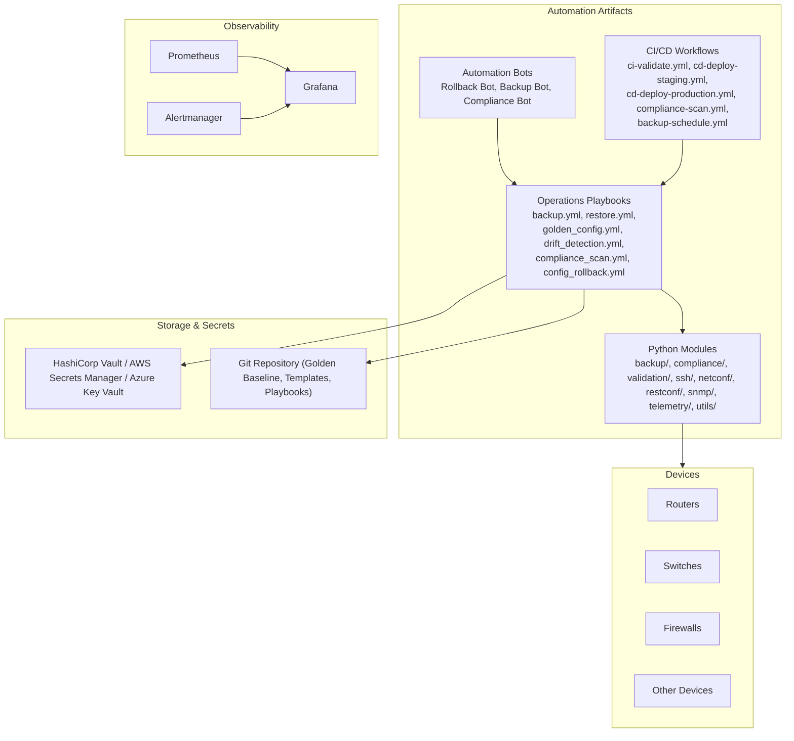
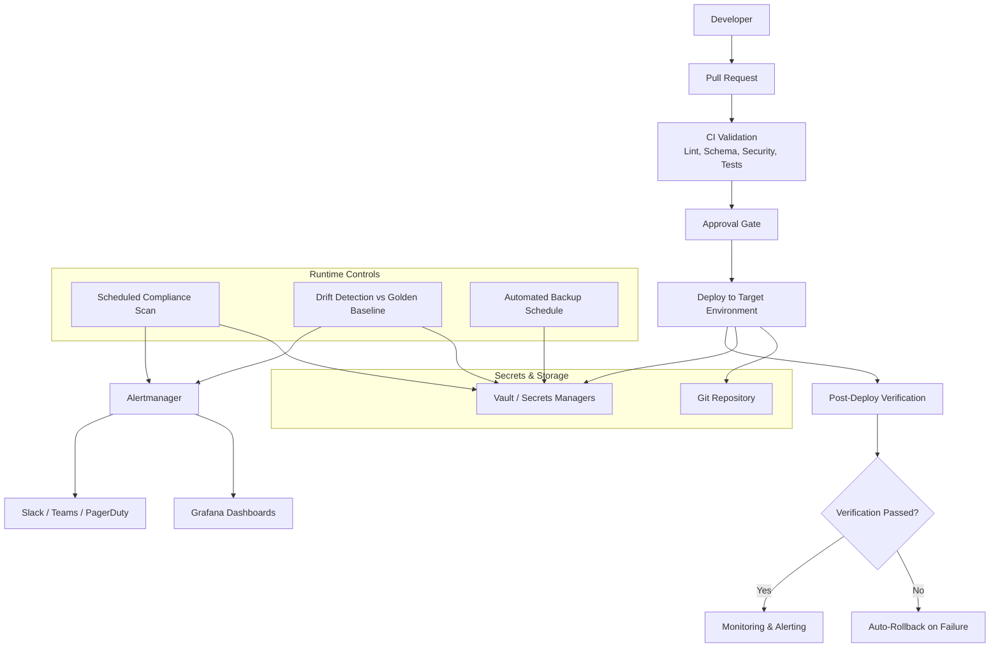
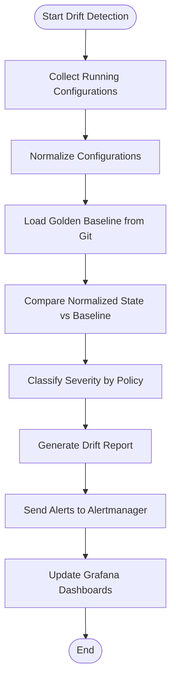
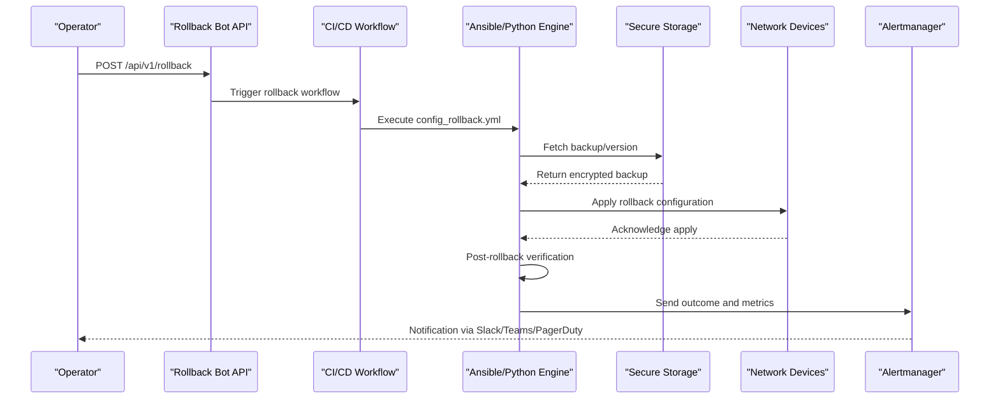
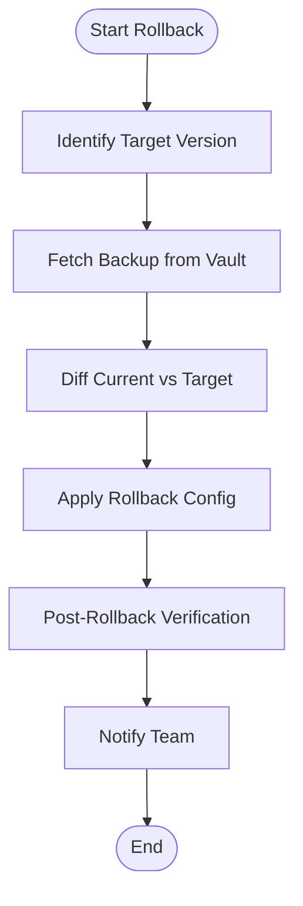
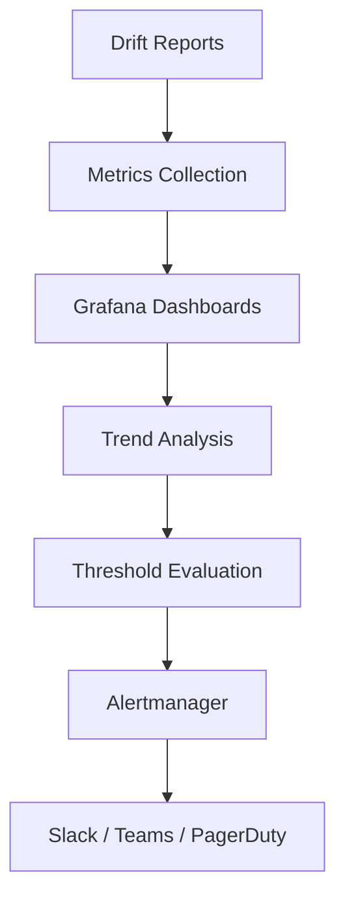
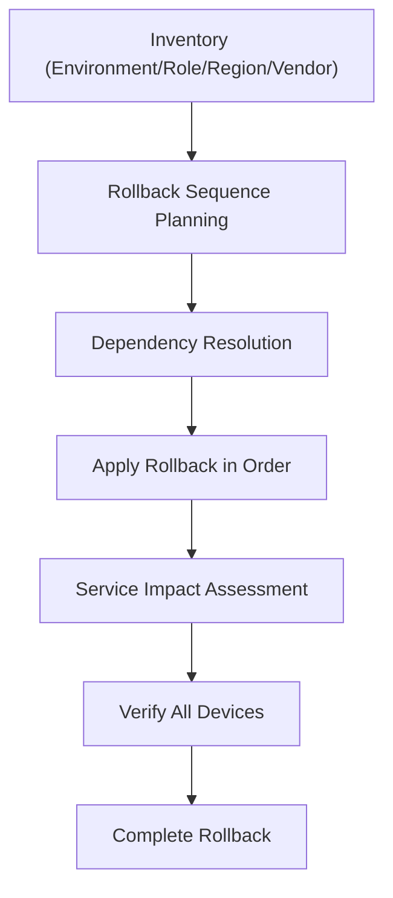
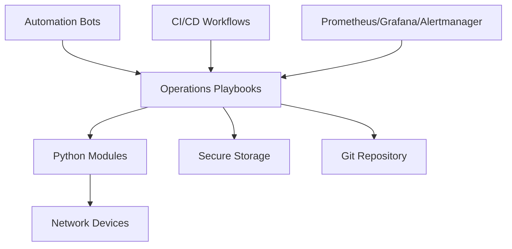

# Configuration Rollback

<cite>
**Referenced Files in This Document**
- [README.md](file://README.md)
</cite>

## Table of Contents
1. [Introduction](#introduction)
2. [Project Structure](#project-structure)
3. [Core Components](#core-components)
4. [Architecture Overview](#architecture-overview)
5. [Detailed Component Analysis](#detailed-component-analysis)
6. [Dependency Analysis](#dependency-analysis)
7. [Performance Considerations](#performance-considerations)
8. [Troubleshooting Guide](#troubleshooting-guide)
9. [Conclusion](#conclusion)
10. [Appendices](#appendices)

## Introduction
This document explains configuration rollback procedures and drift detection mechanisms for the Enterprise Network Automation Platform. It covers:
- Golden configuration baseline concept
- Drift detection algorithms comparing Git state against running configurations
- Automated remediation workflows
- Rollback triggers (manual via bots, automated critical violations, scheduled compliance scans)
- The end-to-end rollback process (identify target versions, fetch backups from secure storage, apply configurations, post-rollback verification)
- Drift reporting, trend analysis, and alerting for changes outside approved baselines
- Multi-device rollback coordination, dependency management, and service impact assessment during rollback operations

The content is derived from the repository’s architecture, workflows, and operational playbooks described in the project documentation.

## Project Structure
The platform organizes automation artifacts across inventories, roles, templates, Python modules, bots, tests, CI/CD pipelines, monitoring, and secrets backends. Key areas relevant to rollback and drift detection include:
- Operations playbooks for backup, restore, golden config application, drift detection, and compliance scanning
- Python modules for backup management, compliance engine, validation, and device connectivity
- Bots exposing REST APIs for manual rollback requests and scheduling
- CI/CD workflows that integrate rollback on failure and scheduled compliance scans
- Monitoring dashboards and alerting for drift and compliance status

**Diagram sources**
- [README.md:103-180](file://README.md#L103-L180)
- [README.md:438-459](file://README.md#L438-L459)
- [README.md:460-476](file://README.md#L460-L476)
- [README.md:479-514](file://README.md#L479-L514)
- [README.md:583-616](file://README.md#L583-L616)

**Section sources**
- [README.md:103-180](file://README.md#L103-L180)
- [README.md:438-459](file://README.md#L438-L459)
- [README.md:460-476](file://README.md#L460-L476)
- [README.md:479-514](file://README.md#L479-L514)
- [README.md:583-616](file://README.md#L583-L616)

## Core Components
- Operations Playbooks
  - backup.yml: Captures running configurations with versioning and encryption
  - restore.yml: Restores a selected backup to devices
  - golden_config.yml: Applies the approved golden baseline to devices
  - drift_detection.yml: Compares running configs against the golden baseline and reports differences
  - compliance_scan.yml: Runs policy checks and generates violation reports
  - config_rollback.yml: Executes rollback to a specified or last known good configuration
- Python Modules
  - backup/: Backup management with versioning and encryption
  - compliance/: Pluggable rule sets for policy enforcement
  - validation/: Pre-deployment syntax and semantic validation
  - ssh/, netconf/, restconf/, snmp/, telemetry/: Device connectivity and data collection
  - utils/: Logging, retry, concurrency, diff, bulk operations
- Automation Bots
  - Rollback Bot (/api/v1/rollback): One-click rollback to last known good config
  - Backup Bot (/api/v1/backup): Trigger and schedule backups
  - Compliance Bot (/api/v1/compliance): Run compliance scans and report violations
- CI/CD Workflows
  - ci-validate.yml: Lint, test, scan, validate
  - cd-deploy-staging.yml: Deploy to staging with dry run
  - cd-deploy-production.yml: Deploy to production with approval gate
  - compliance-scan.yml: Scheduled daily full compliance audit
  - backup-schedule.yml: Daily automated configuration backup at 02:00 UTC
  - Post-validation auto-rollback on deployment failures

**Section sources**
- [README.md:418-435](file://README.md#L418-L435)
- [README.md:438-459](file://README.md#L438-L459)
- [README.md:460-476](file://README.md#L460-L476)
- [README.md:479-514](file://README.md#L479-L514)

## Architecture Overview
The platform enforces configuration integrity through a combination of GitOps, automated compliance, and robust rollback capabilities. The control plane orchestrates device interactions using Ansible and Python modules, while observability and alerting provide feedback loops for drift and compliance.

**Diagram sources**
- [README.md:34-50](file://README.md#L34-L50)
- [README.md:479-514](file://README.md#L479-L514)
- [README.md:583-616](file://README.md#L583-L616)

## Detailed Component Analysis

### Golden Configuration Baseline Concept
- Purpose: Establish an approved, versioned baseline representing the desired state for devices.
- Implementation:
  - Golden configuration is applied via the golden_config playbook.
  - Golden Config Tests compare current device states against the approved baseline as part of CI and scheduled runs.
- Benefits:
  - Ensures consistency across multi-vendor environments.
  - Provides a reference point for drift detection and compliance enforcement.

**Section sources**
- [README.md:418-435](file://README.md#L418-L435)
- [README.md:517-544](file://README.md#L517-L544)

### Drift Detection Algorithms
- Inputs:
  - Running configuration collected from devices via SSH, NETCONF, RESTCONF, SNMP, or telemetry.
  - Golden baseline stored in Git and referenced by drift_detection.yml.
- Process:
  - Collect current device state.
  - Normalize and parse configurations into structured representations.
  - Compare normalized structures against the golden baseline to identify deviations.
  - Classify drift severity based on compliance policies and predefined rules.
- Outputs:
  - Drift reports detailing differences and severity.
  - Alerts routed to Alertmanager and dashboards in Grafana.
  - Integration points for automated remediation or manual review.

**Diagram sources**
- [README.md:418-435](file://README.md#L418-L435)
- [README.md:438-459](file://README.md#L438-L459)
- [README.md:583-616](file://README.md#L583-L616)

**Section sources**
- [README.md:418-435](file://README.md#L418-L435)
- [README.md:438-459](file://README.md#L438-L459)
- [README.md:583-616](file://README.md#L583-L616)

### Automated Remediation Workflows
- Triggers:
  - Manual requests via Rollback Bot endpoints.
  - Automated detection of critical violations by compliance scans.
  - Scheduled compliance scans and drift detection jobs.
- Actions:
  - For critical violations, initiate rollback to last known good configuration.
  - Apply golden baseline where appropriate to re-establish desired state.
  - Notify teams and update dashboards with remediation outcomes.

**Diagram sources**
- [README.md:460-476](file://README.md#L460-L476)
- [README.md:418-435](file://README.md#L418-L435)
- [README.md:479-514](file://README.md#L479-L514)
- [README.md:583-616](file://README.md#L583-L616)

**Section sources**
- [README.md:460-476](file://README.md#L460-L476)
- [README.md:418-435](file://README.md#L418-L435)
- [README.md:479-514](file://README.md#L479-L514)
- [README.md:583-616](file://README.md#L583-L616)

### Rollback Triggers
- Manual Requests via Bots:
  - Rollback Bot endpoint /api/v1/rollback supports one-click rollback to last known good configuration.
- Automated Detection of Critical Violations:
  - Compliance scans enforce policies; critical violations trigger remediation including rollback.
- Scheduled Compliance Scans:
  - compliance-scan.yml runs daily to audit configurations and detect drift or policy violations.

**Section sources**
- [README.md:460-476](file://README.md#L460-L476)
- [README.md:479-514](file://README.md#L479-L514)
- [README.md:548-579](file://README.md#L548-L579)

### Rollback Process
- Identify Target Version:
  - Determine the desired rollback target (last known good or specific version).
- Fetch Backups from Secure Storage:
  - Retrieve encrypted backups from HashiCorp Vault or configured secrets managers.
- Apply Configurations:
  - Use config_rollback.yml to push the target configuration to devices.
- Post-Rollback Verification:
  - Validate device health, connectivity, and compliance after applying rollback.
- Notifications:
  - Update alerts and dashboards with results.

**Diagram sources**
- [README.md:660-670](file://README.md#L660-L670)
- [README.md:418-435](file://README.md#L418-L435)
- [README.md:583-616](file://README.md#L583-L616)

**Section sources**
- [README.md:660-670](file://README.md#L660-L670)
- [README.md:418-435](file://README.md#L418-L435)
- [README.md:583-616](file://README.md#L583-L616)

### Drift Reporting, Trend Analysis, and Alerting
- Drift Reporting:
  - Generate detailed reports of deviations from the golden baseline.
- Trend Analysis:
  - Track drift counts and severity over time via Grafana dashboards.
- Alerting:
  - Route alerts to Slack, Teams, and PagerDuty through Alertmanager when drift or compliance violations exceed thresholds.

**Diagram sources**
- [README.md:583-616](file://README.md#L583-L616)

**Section sources**
- [README.md:583-616](file://README.md#L583-L616)

### Multi-Device Rollback Coordination
- Inventory-Based Orchestration:
  - Use inventories organized by environment, role, region, and vendor to coordinate rollbacks across large fleets.
- Dependency Management:
  - Respect device dependencies (e.g., core routers before distribution switches) during rollback sequences.
- Service Impact Assessment:
  - Perform pre-checks and post-verifications to assess and mitigate service impact during rollback operations.

**Diagram sources**
- [README.md:284-336](file://README.md#L284-L336)
- [README.md:418-435](file://README.md#L418-L435)

**Section sources**
- [README.md:284-336](file://README.md#L284-L336)
- [README.md:418-435](file://README.md#L418-L435)

## Dependency Analysis
Key dependencies between components involved in rollback and drift detection:
- Playbooks depend on Python modules for device connectivity, backup management, and compliance checks.
- Bots orchestrate playbooks via API calls and ChatOps integrations.
- CI/CD workflows integrate rollback on failure and schedule compliance scans and backups.
- Observability components consume metrics and logs to drive dashboards and alerts.

**Diagram sources**
- [README.md:438-459](file://README.md#L438-L459)
- [README.md:460-476](file://README.md#L460-L476)
- [README.md:479-514](file://README.md#L479-L514)
- [README.md:583-616](file://README.md#L583-L616)

**Section sources**
- [README.md:438-459](file://README.md#L438-L459)
- [README.md:460-476](file://README.md#L460-L476)
- [README.md:479-514](file://README.md#L479-L514)
- [README.md:583-616](file://README.md#L583-L616)

## Performance Considerations
- Concurrency and Bulk Operations:
  - Leverage Python utils for concurrency and bulk operations to scale rollback and drift detection across thousands of devices.
- Retry and Resilience:
  - Utilize retry mechanisms in SSH and other connectivity modules to handle transient failures.
- Efficient Comparisons:
  - Normalize configurations prior to comparison to reduce computational overhead and improve accuracy.
- Scheduling:
  - Stagger scheduled compliance scans and backups to avoid peak-time resource contention.

[No sources needed since this section provides general guidance]

## Troubleshooting Guide
Common issues and resolutions related to rollback and drift detection:
- Ansible connection timeout:
  - Verify SSH reachability using inventory-based ping commands.
- Template rendering errors:
  - Check Jinja2 syntax and debug configuration generation for specific devices.
- Compliance check failures:
  - Review compliance policies and device running configuration diffs.
- CI pipeline failures:
  - Inspect GitHub Actions logs for actionable error messages.
- Vault authentication failures:
  - Verify OIDC tokens or AppRole credentials and check Vault policies.
- Molecule test failures:
  - Ensure Docker/Podman is running and validate molecule configuration.
- Batfish analysis errors:
  - Validate snapshots used for network simulation and policy analysis.

**Section sources**
- [README.md:674-685](file://README.md#L674-L685)

## Conclusion
The platform implements comprehensive configuration rollback and drift detection mechanisms grounded in GitOps, automated compliance, and robust observability. Golden baselines ensure consistent desired states, while drift detection and compliance scans proactively identify deviations. Automated and manual rollback triggers enable rapid remediation, supported by secure storage, multi-device orchestration, and thorough verification. Continuous monitoring and alerting provide visibility and responsiveness to maintain network integrity at enterprise scale.

[No sources needed since this section summarizes without analyzing specific files]

## Appendices

### API Endpoints for Rollback and Related Operations
- Rollback Bot:
  - Endpoint: /api/v1/rollback
  - Purpose: One-click rollback to last known good configuration
- Backup Bot:
  - Endpoint: /api/v1/backup
  - Purpose: Trigger and schedule device backups
- Compliance Bot:
  - Endpoint: /api/v1/compliance
  - Purpose: Run compliance scans and report violations

**Section sources**
- [README.md:460-476](file://README.md#L460-L476)