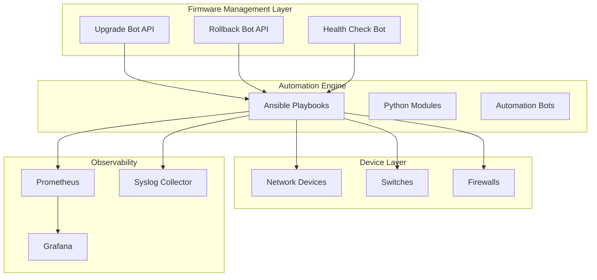
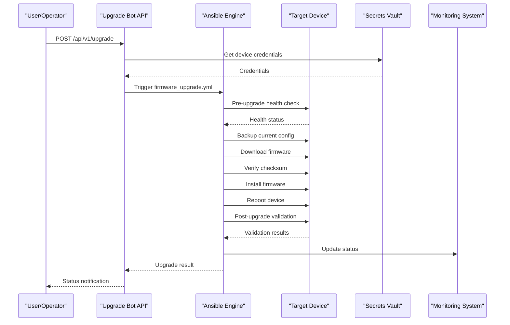
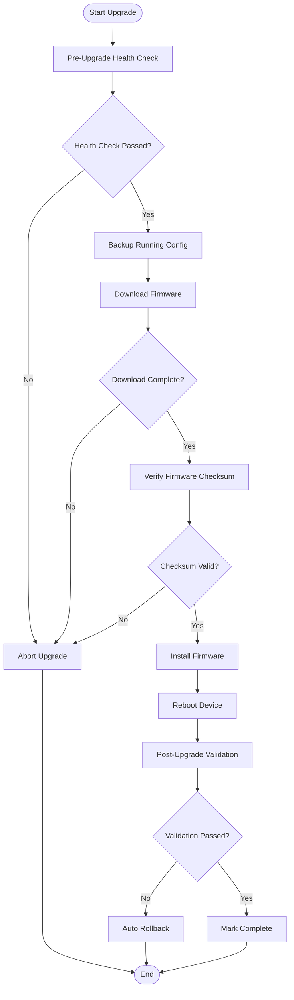
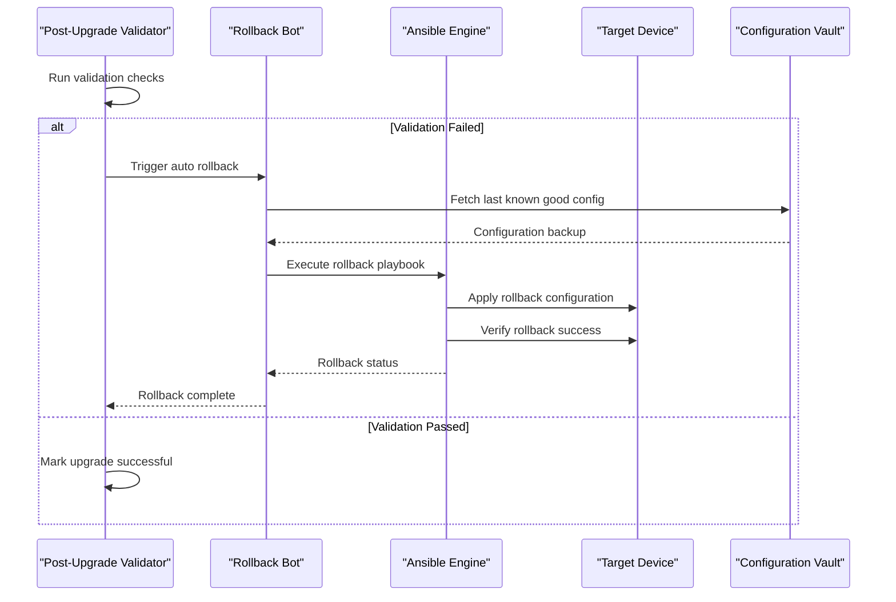
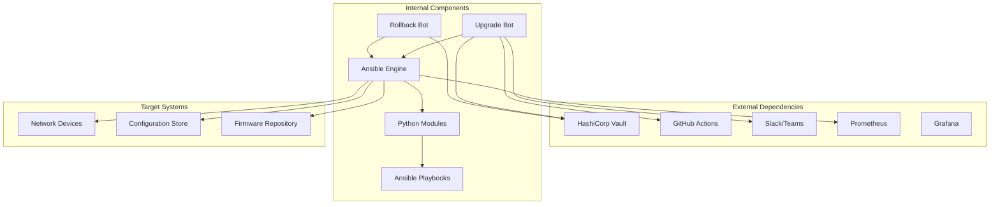

# Firmware Management

<cite>
**Referenced Files in This Document**
- [README.md](file://README.md)
</cite>

## Table of Contents
1. [Introduction](#introduction)
2. [Project Structure](#project-structure)
3. [Core Components](#core-components)
4. [Architecture Overview](#architecture-overview)
5. [Detailed Component Analysis](#detailed-component-analysis)
6. [Dependency Analysis](#dependency-analysis)
7. [Performance Considerations](#performance-considerations)
8. [Troubleshooting Guide](#troubleshooting-guide)
9. [Conclusion](#conclusion)
10. [Appendices](#appendices)

## Introduction

This document provides comprehensive guidance for managing firmware lifecycle operations within the Enterprise Network Automation Platform. It covers upgrade procedures, rollback mechanisms, compliance enforcement, automated workflows, monitoring, and operational best practices. The platform supports multi-vendor environments with GitOps-driven automation, CI/CD integration, and robust observability.

## Project Structure

The firmware management system is implemented across multiple layers:

- **Playbooks**: Ansible-based automation for device operations
- **Bots**: REST APIs and ChatOps integrations for self-service operations  
- **CI/CD Pipelines**: GitHub Actions workflows for orchestrated upgrades
- **Monitoring**: Prometheus, Grafana, and OpenTelemetry for observability
- **Compliance**: Policy enforcement and audit trails



**Diagram sources**
- [README.md:36-99](file://README.md#L36-L99)
- [README.md:460-476](file://README.md#L460-L476)

**Section sources**
- [README.md:103-180](file://README.md#L103-L180)
- [README.md:36-99](file://README.md#L36-L99)

## Core Components

### Firmware Upgrade Playbook
The `firmware_upgrade.yml` playbook orchestrates complete firmware upgrade operations with comprehensive pre and post checks.

### Firmware Rollback Playbook  
The `firmware_rollback.yml` playbook handles automatic and manual rollback scenarios when upgrades fail validation.

### Configuration Rollback Playbook
The `config_rollback.yml` playbook reverts devices to last known good configurations using backup data.

### Automation Bots
- **Upgrade Bot**: `/api/v1/upgrade` - Orchestrates firmware upgrades with rollback capabilities
- **Rollback Bot**: `/api/v1/rollback` - Provides one-click rollback functionality
- **Health Bot**: `/api/v1/health` - Performs comprehensive health assessments

**Section sources**
- [README.md:420-435](file://README.md#L420-L435)
- [README.md:460-476](file://README.md#L460-L476)

## Architecture Overview

The firmware management architecture follows a layered approach with clear separation of concerns:



**Diagram sources**
- [README.md:642-658](file://README.md#L642-L658)
- [README.md:460-476](file://README.md#L460-L476)

## Detailed Component Analysis

### Firmware Upgrade Workflow

The firmware upgrade process implements a comprehensive staged approach with multiple safety gates:



**Diagram sources**
- [README.md:642-658](file://README.md#L642-L658)

### Rollback Mechanisms

The system implements multiple rollback strategies based on failure scenarios:

#### Automatic Rollback Triggers
- Post-upgrade validation failures
- Health check failures after reboot
- Service connectivity issues
- Performance degradation detection

#### Manual Rollback Procedures
- One-click rollback via Rollback Bot API
- Configuration revert to last known good state
- Emergency rollback during critical incidents



**Diagram sources**
- [README.md:660-670](file://README.md#L660-L670)

### Compliance Enforcement

Firmware management integrates with the platform's compliance framework:

#### Pre-Upgrade Compliance Checks
- Approved firmware version validation
- Vendor compatibility matrix verification
- Security policy compliance
- License validation

#### Runtime Compliance Monitoring
- Continuous policy enforcement
- Automated violation detection
- Audit trail generation
- Compliance reporting

**Section sources**
- [README.md:548-580](file://README.md#L548-L580)
- [README.md:420-435](file://README.md#L420-L435)

### Monitoring and Observability

The firmware management system provides comprehensive monitoring capabilities:

#### Real-time Monitoring
- Upgrade progress tracking
- Device health metrics during upgrade
- Performance impact assessment
- Error rate monitoring

#### Alerting and Notifications
- Slack/Teams integration for status updates
- PagerDuty integration for critical failures
- Email notifications for completion/failure
- Dashboard visualization via Grafana

#### Audit Trail Generation
- Complete upgrade history logging
- Change tracking with user attribution
- Compliance audit reports
- Rollback event documentation

**Section sources**
- [README.md:583-616](file://README.md#L583-L616)

## Dependency Analysis

The firmware management system has well-defined dependencies between components:



**Diagram sources**
- [README.md:36-99](file://README.md#L36-L99)
- [README.md:460-476](file://README.md#L460-L476)

**Section sources**
- [README.md:36-99](file://README.md#L36-L99)
- [README.md:460-476](file://README.md#L460-L476)

## Performance Considerations

### Upgrade Execution Optimization
- Parallel execution controls for multi-device deployments
- Staged rollouts to minimize blast radius
- Resource utilization monitoring during upgrades
- Connection pooling and retry logic optimization

### Rollback Performance
- Optimized configuration diff algorithms
- Incremental rollback for large configurations
- Concurrent rollback execution where safe
- Performance impact assessment during rollback

### Monitoring Overhead
- Lightweight health checks to minimize device impact
- Asynchronous metric collection
- Efficient alerting thresholds to prevent alert storms
- Dashboard performance optimization

## Troubleshooting Guide

### Common Upgrade Issues

| Issue | Symptoms | Resolution |
|-------|----------|------------|
| Connection Timeout | Ansible connection failures during upgrade | Verify SSH reachability: `ansible all -m ping -i inventories/lab/hosts.yml` |
| Firmware Download Failure | Incomplete or corrupted firmware files | Check network connectivity and storage space on target devices |
| Checksum Verification Failure | Integrity check errors | Re-download firmware from vendor repository and verify source integrity |
| Post-Upgrade Validation Failure | Services not starting or degraded performance | Review device logs and run diagnostic commands |
| Rollback Failure | Unable to revert to previous configuration | Check vault access and configuration backup integrity |

### Diagnostic Commands

```bash
# Test device connectivity
ansible all -m ping -i inventories/lab/hosts.yml

# Check device health status
python -m python.config_gen --debug --device <device-name>

# Review compliance violations
python -m python.compliance --inventory inventories/lab/hosts.yml

# Validate environment setup
python scripts/validate_environment.py
```

**Section sources**
- [README.md:674-685](file://README.md#L674-L685)

## Conclusion

The Enterprise Network Automation Platform provides a comprehensive, production-grade solution for firmware lifecycle management. Key strengths include:

- **Automated Workflows**: End-to-end automation from trigger to completion
- **Robust Safety Mechanisms**: Multiple validation gates and automatic rollback
- **Comprehensive Monitoring**: Real-time visibility into upgrade operations
- **Compliance Integration**: Built-in policy enforcement and audit trails
- **Multi-Vendor Support**: Unified interface across different network platforms

The system follows GitOps principles with full traceability, making it suitable for enterprise environments requiring strict change management and compliance requirements.

## Appendices

### Supported Vendors and Platforms

The platform supports firmware management across major networking vendors including Cisco (IOS, IOS-XE, NX-OS), Juniper (SRX, MX), Arista (EOS), Palo Alto (PAN-OS), Fortinet (FortiOS), and others. Each vendor implementation includes vendor-specific upgrade procedures and compatibility matrices.

### API Reference

Key endpoints for firmware management:
- `POST /api/v1/upgrade` - Initiate firmware upgrade workflow
- `POST /api/v1/rollback` - Trigger rollback procedure  
- `GET /api/v1/health` - Check device health status
- `GET /api/v1/compliance` - Run compliance scans

**Section sources**
- [README.md:203-226](file://README.md#L203-L226)
- [README.md:460-476](file://README.md#L460-L476)