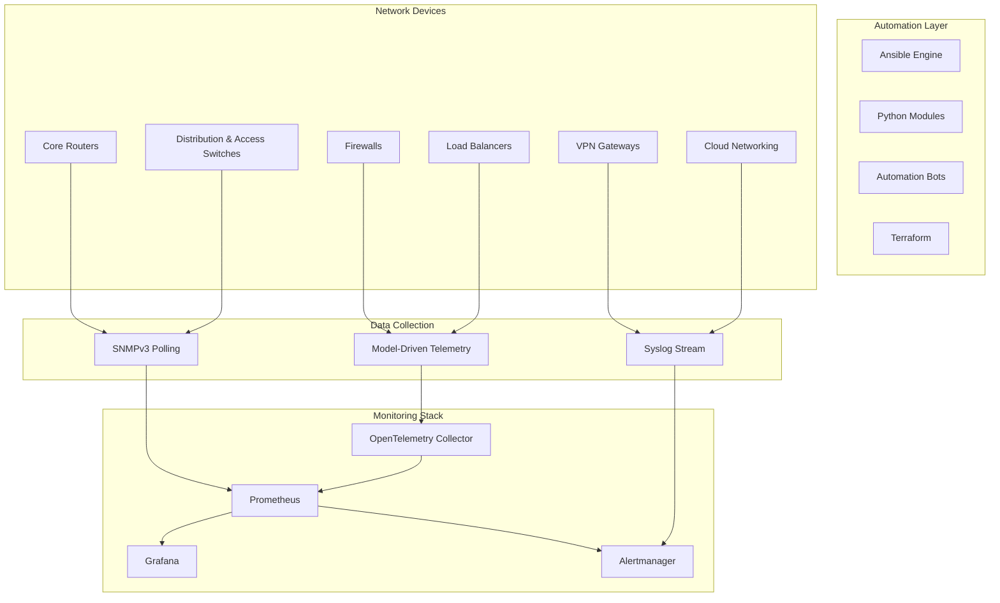
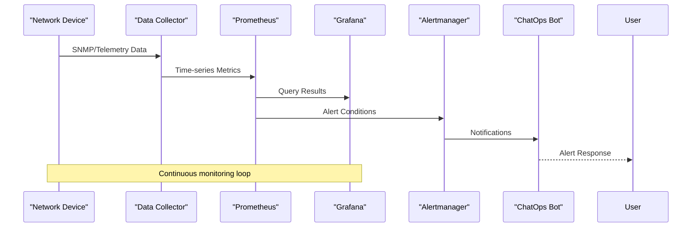
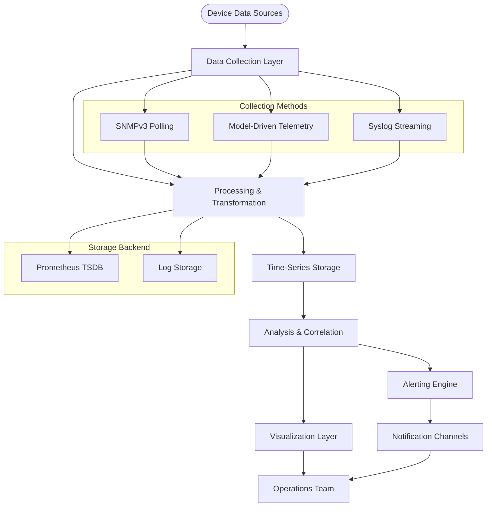
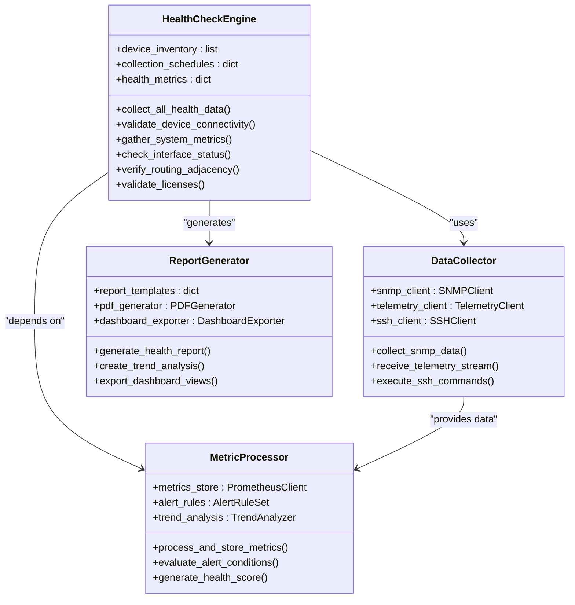
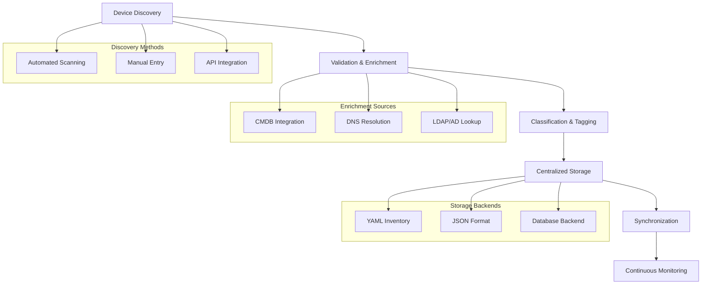
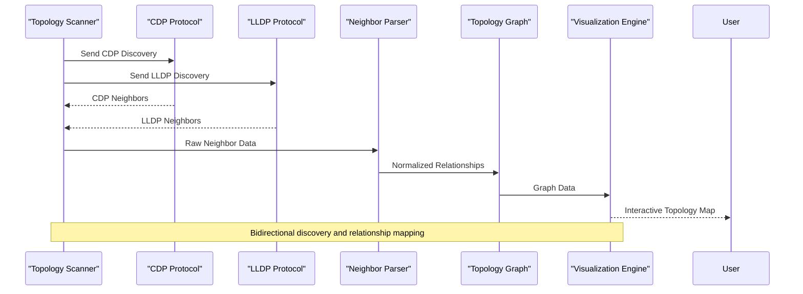
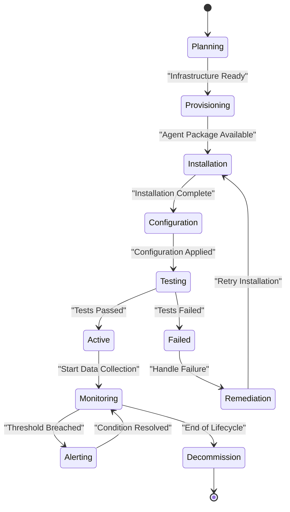
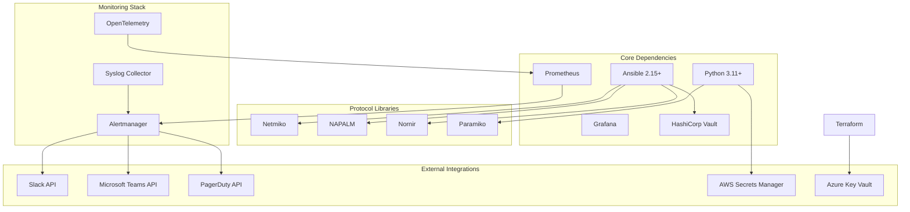
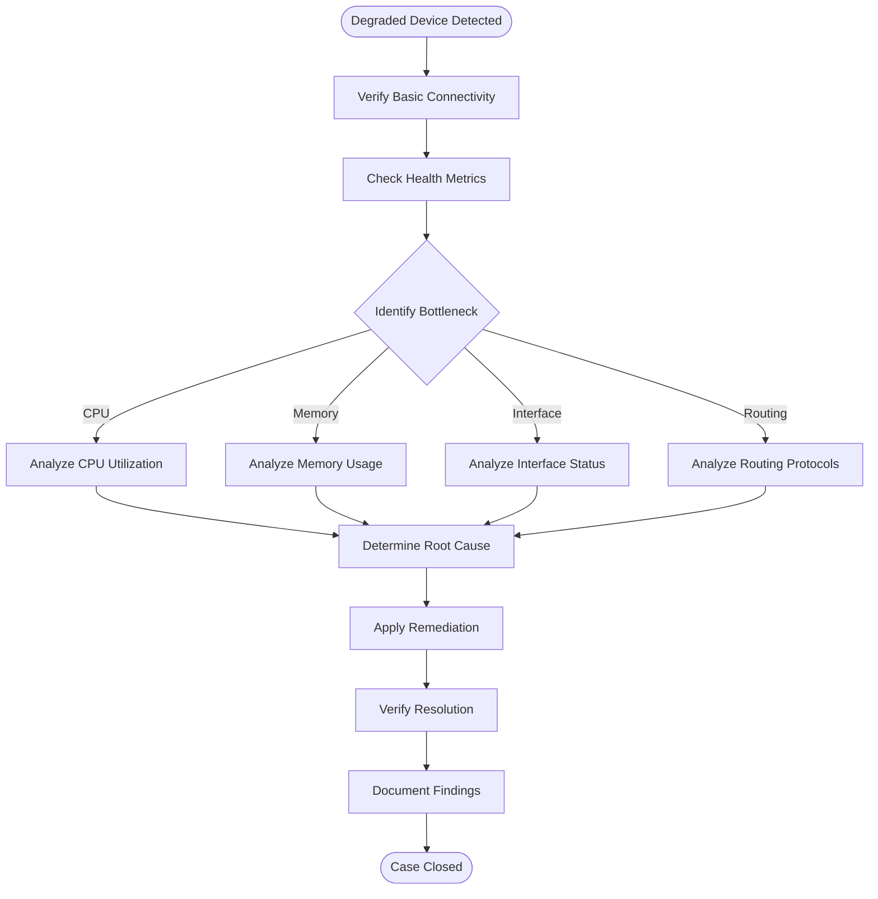

# Health Monitoring and Assessments

<cite>
**Referenced Files in This Document**
- [README.md](file://README.md)
</cite>

## Table of Contents
1. [Introduction](#introduction)
2. [Project Structure](#project-structure)
3. [Core Components](#core-components)
4. [Architecture Overview](#architecture-overview)
5. [Detailed Component Analysis](#detailed-component-analysis)
6. [Dependency Analysis](#dependency-analysis)
7. [Performance Considerations](#performance-considerations)
8. [Troubleshooting Guide](#troubleshooting-guide)
9. [Conclusion](#conclusion)

## Introduction

This document provides comprehensive documentation for health monitoring and assessment procedures within the Enterprise Network Automation Platform. The platform implements a production-grade, vendor-agnostic approach to network automation that includes automated health check collection, inventory management, neighbor discovery, and comprehensive monitoring capabilities.

The system supports multi-vendor environments including Cisco, Juniper, Arista, Palo Alto, Fortinet, Check Point, F5, pfSense, and OPNsense devices across on-premises and cloud networking components. It follows Infrastructure as Code principles with GitOps workflows, ensuring all configurations, policies, templates, tests, pipelines, dashboards, and bots are stored in version control.

## Project Structure

The platform is organized into modular directories supporting different aspects of network automation:

**Diagram sources**
- [README.md:583-604](file://README.md#L583-L604)

**Section sources**
- [README.md:103-180](file://README.md#L103-L180)

## Core Components

### Automated Health Check Collection

The platform implements comprehensive health monitoring through multiple data collection mechanisms:

#### CPU Utilization Monitoring
- SNMP-based polling for CPU utilization metrics
- Model-driven telemetry streaming for real-time CPU performance data
- Integration with Prometheus for metric storage and querying

#### Memory Usage Tracking
- SNMP interface statistics for memory consumption monitoring
- Telemetry-based memory usage collection from device hardware modules
- Historical trend analysis for capacity planning

#### Interface Status Monitoring
- Real-time interface up/down status tracking
- Error rate monitoring and bandwidth utilization metrics
- Link quality assessment and degradation detection

#### Routing Protocol Adjacency
- OSPF, BGP, and IS-IS neighbor state monitoring
- Protocol-specific health indicators and adjacency validation
- Automatic alerting for routing protocol failures

#### License Validation
- Automated license compliance checking across device fleet
- License expiration monitoring and renewal alerts
- Feature availability verification based on installed licenses

### Inventory Collection Processes

The platform maintains comprehensive device inventory through automated collection:

#### Serial Number Management
- Hardware serial number discovery and validation
- Asset tracking and lifecycle management integration
- Device identification and correlation across systems

#### Software Version Tracking
- Operating system version enumeration and validation
- Firmware level monitoring and upgrade readiness assessment
- Version compatibility matrix enforcement

#### Hardware Module Discovery
- Physical module inventory and status monitoring
- Port density and capacity utilization tracking
- Hardware redundancy and failover capability assessment

#### Capacity Metrics Collection
- Processing power utilization trends
- Memory pool allocation and fragmentation analysis
- Storage capacity monitoring for logs and configurations

### Neighbor Discovery and Topology Mapping

#### CDP/LLDP Protocol Support
- Automatic neighbor discovery using Cisco Discovery Protocol (CDP)
- Link Layer Discovery Protocol (LLDP) support for multi-vendor environments
- Topology mapping and relationship visualization

#### Network Topology Visualization
- Dynamic topology generation from discovered relationships
- Redundancy path analysis and single points of failure identification
- Impact analysis for planned maintenance activities

### Monitoring Agent Deployment

#### Prometheus Integration
- Exporter deployment for device-specific metrics
- Custom metrics collection for proprietary device features
- Metric labeling and tagging for granular querying

#### OpenTelemetry Collector
- Standardized telemetry data collection and transformation
- Multi-format export support for various backends
- Distributed tracing capabilities for complex operations

#### Alertmanager Configuration
- Intelligent alert routing and deduplication
- Escalation policies and notification channels
- Alert grouping and suppression rules

### Grafana Dashboard Configuration

#### Network Health Dashboard
- Real-time device status overview
- Performance metrics trending and threshold visualization
- Geographic distribution of network assets

#### Automation Metrics Dashboard
- Job execution success/failure rates
- Configuration drift detection and remediation tracking
- API endpoint performance and error rates

#### Compliance Overview Dashboard
- Policy violation tracking by severity
- Remediation progress monitoring
- Audit trail and compliance reporting

### Alerting Rules and Notifications

#### Multi-Channel Notification
- Slack and Microsoft Teams integration for immediate alerts
- PagerDuty escalation for critical infrastructure issues
- Email notifications for audit and reporting purposes

#### Intelligent Alert Management
- Alert correlation and root cause analysis
- Maintenance window awareness and alert suppression
- Performance baseline deviation detection

## Architecture Overview

The monitoring architecture follows a layered approach with clear separation of concerns:

**Diagram sources**
- [README.md:583-604](file://README.md#L583-L604)

### Data Flow Architecture

**Diagram sources**
- [README.md:583-604](file://README.md#L583-L604)

## Detailed Component Analysis

### Health Check Collection Pipeline

The health check collection process follows a systematic approach to ensure comprehensive coverage:

**Diagram sources**
- [README.md:438-456](file://README.md#L438-L456)
- [README.md:430-434](file://README.md#L430-L434)

### Inventory Management System

The inventory system provides comprehensive device management capabilities:

**Diagram sources**
- [README.md:284-335](file://README.md#L284-L335)

### Neighbor Discovery and Topology Mapping

The neighbor discovery system leverages industry-standard protocols for comprehensive network mapping:

**Diagram sources**
- [README.md:432](file://README.md#L432)

### Monitoring Agent Deployment Strategy

The platform implements a flexible monitoring agent deployment model:

**Diagram sources**
- [README.md:434](file://README.md#L434)

## Dependency Analysis

The monitoring system has well-defined dependencies between components:

**Diagram sources**
- [README.md:184-199](file://README.md#L184-L199)
- [README.md:583-604](file://README.md#L583-L604)

**Section sources**
- [README.md:184-199](file://README.md#L184-L199)

## Performance Considerations

### Scalability Architecture

The platform is designed for enterprise-scale deployments supporting thousands of network devices:

#### Horizontal Scaling
- Distributed data collection agents
- Load-balanced API endpoints
- Sharded time-series database storage
- Stateless processing workers

#### Resource Optimization
- Efficient SNMP polling strategies
- Batched telemetry data processing
- Intelligent metric retention policies
- Compressed log storage

#### High Availability
- Multi-region monitoring infrastructure
- Failover data collectors
- Redundant storage backends
- Graceful degradation under load

### Monitoring Best Practices

#### Metric Collection Strategies
- Adaptive polling intervals based on device type
- Event-driven telemetry for critical metrics
- Delta-based updates to reduce bandwidth
- Intelligent sampling for high-frequency data

#### Alert Management
- Hierarchical alerting with suppression rules
- Correlation engine for related events
- Maintenance window awareness
- Performance baseline deviation detection

## Troubleshooting Guide

### Common Issues and Resolutions

| Issue Category | Symptoms | Diagnostic Steps | Resolution |
|---|---|---|---|
| **Connection Issues** | Device unreachable, timeout errors | Verify SSH reachability, check firewall rules | `ansible all -m ping -i inventories/lab/hosts.yml` |
| **Data Collection Failures** | Missing metrics, incomplete reports | Check collector logs, validate credentials | Review SNMP community strings, telemetry configuration |
| **Performance Bottlenecks** | Slow queries, delayed alerts | Monitor resource utilization, analyze query patterns | Optimize Prometheus queries, scale collectors |
| **Alert Storms** | Excessive notifications, alert fatigue | Review alert rules, check for correlated events | Implement alert suppression, adjust thresholds |
| **Dashboard Issues** | Empty graphs, missing data | Verify data source connectivity, check metric names | Validate Prometheus targets, review Grafana panels |

### Diagnostic Workflows

#### Degraded Device Investigation

**Diagram sources**
- [README.md:674-685](file://README.md#L674-L685)

#### Performance Bottleneck Identification

Key performance indicators to monitor:
- Query response times exceeding SLA thresholds
- Collector resource utilization above 80%
- Metric ingestion latency greater than polling interval
- Alert processing delays during peak loads

#### Connectivity Issue Resolution

Systematic troubleshooting approach:
1. Verify network connectivity between collectors and devices
2. Validate authentication credentials and permissions
3. Check protocol compatibility and feature support
4. Review firewall rules and security policies
5. Analyze packet captures for protocol-level issues

## Conclusion

The Enterprise Network Automation Platform provides a comprehensive health monitoring and assessment solution that addresses the complex requirements of modern network operations. The platform's modular architecture, multi-vendor support, and GitOps workflow ensure scalability, reliability, and maintainability at enterprise scale.

Key strengths include:
- **Comprehensive Coverage**: Full-stack monitoring from device hardware to application layer
- **Vendor Agnostic**: Support for major networking vendors and platforms
- **Automated Operations**: Self-healing capabilities and intelligent remediation
- **Scalable Architecture**: Designed for thousands of devices across multiple regions
- **Security First**: Zero-trust architecture with comprehensive secrets management

The platform successfully bridges the gap between traditional network monitoring and modern DevOps practices, providing operators with the tools needed to maintain high availability and performance in complex, multi-vendor environments.