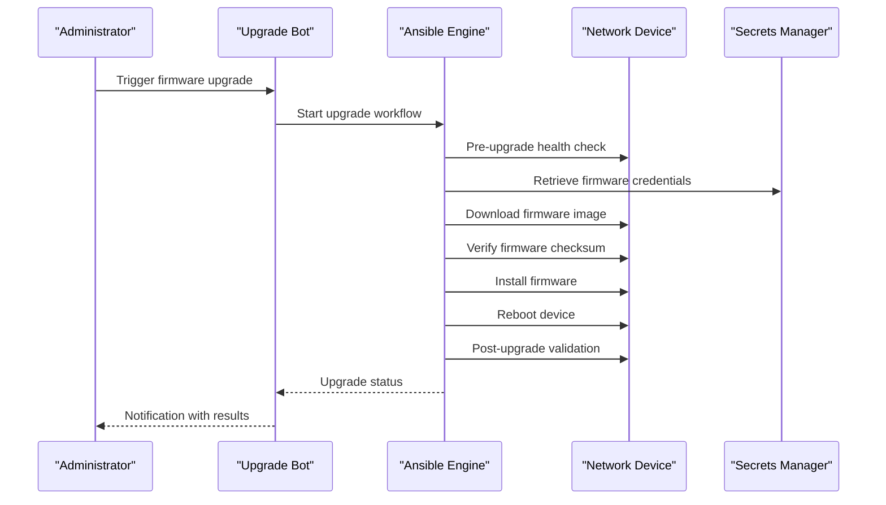
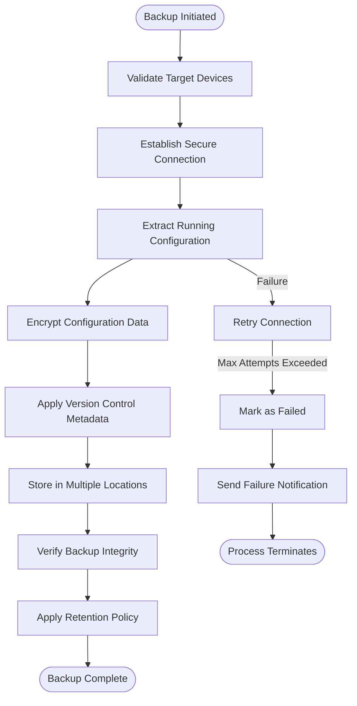
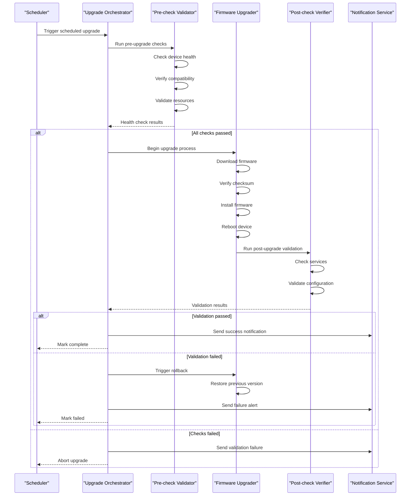
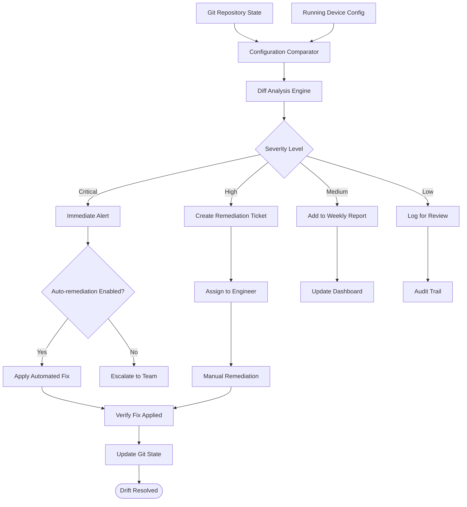
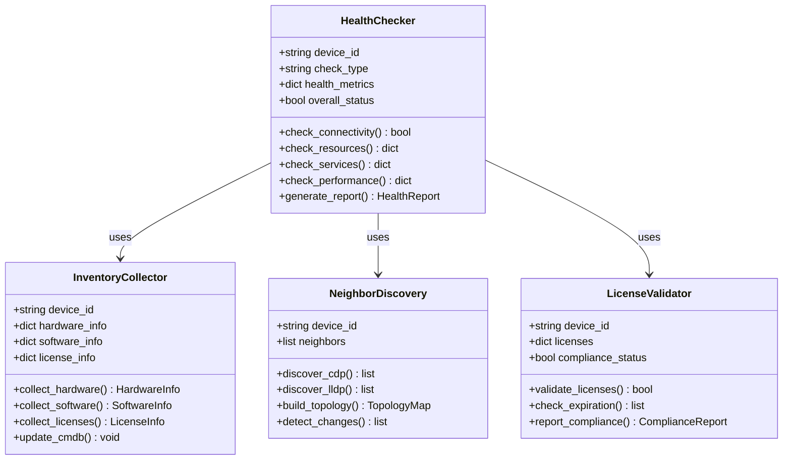

# Operational Procedures

<cite>
**Referenced Files in This Document**
- [README.md](file://README.md)
</cite>

## Table of Contents
1. [Introduction](#introduction)
2. [Project Structure](#project-structure)
3. [Core Components](#core-components)
4. [Architecture Overview](#architecture-overview)
5. [Detailed Component Analysis](#detailed-component-analysis)
6. [Dependency Analysis](#dependency-analysis)
7. [Performance Considerations](#performance-considerations)
8. [Troubleshooting Guide](#troubleshooting-guide)
9. [Conclusion](#conclusion)
10. [Appendices](#appendices)

## Introduction

This document provides comprehensive operational procedures for the Enterprise Network Automation Platform, covering backup and recovery, firmware management, configuration rollbacks, drift detection, and health assessments. The platform is designed as a production-grade, vendor-agnostic solution for managing thousands of network devices across multi-vendor, multi-region environments using Infrastructure as Code, GitOps, CI/CD, compliance enforcement, observability, and security principles.

The platform implements automated backup strategies with versioning, encryption, and retention policies; firmware upgrade procedures with pre-upgrade health checks, checksum verification, rollback triggers, and post-upgrade validation; configuration rollback mechanisms to last known good states and golden configuration application; drift detection workflows comparing Git state against running configurations; compliance scanning procedures; remediation automation; health check automation; inventory collection; neighbor discovery; license validation; and monitoring agent deployment.

## Project Structure

The platform follows a modular architecture organized by functionality:

```mermaid
graph TB
subgraph "Operations Layer"
Playbooks[Ansible Playbooks]
Bots[Automation Bots]
Scripts[Utility Scripts]
end
subgraph "Core Modules"
Backup[Backup Management]
Compliance[Compliance Engine]
ConfigGen[Configuration Generation]
Validation[Validation Suite]
Utils[Utilities]
end
subgraph "Infrastructure"
Inventories[Device Inventories]
Templates[Jinja2 Templates]
GroupVars[Group Variables]
HostVars[Host Variables]
end
subgraph "Monitoring & Security"
Monitoring[Prometheus/Grafana]
Secrets[Secrets Management]
Policies[OPA/Sentinel Policies]
end
Playbooks --> Core Modules
Bots --> Core Modules
Scripts --> Core Modules
Core Modules --> Infrastructure
Core Modules --> Monitoring
Core Modules --> Secrets
Core Modules --> Policies
```

**Diagram sources**
- [README.md:103-180](file://README.md#L103-L180)

**Section sources**
- [README.md:103-180](file://README.md#L103-L180)

## Core Components

### Backup and Recovery System

The platform implements comprehensive backup and recovery capabilities through dedicated playbooks and Python modules:

#### Automated Backup Strategies
- **Versioning**: All backups are versioned with timestamps and change identifiers
- **Encryption**: Backups are encrypted using AES-256 before storage
- **Retention Policies**: Configurable retention periods (default 90 days) with automatic cleanup
- **Storage Locations**: Multi-tier storage including local, cloud, and offsite locations
- **Incremental Backups**: Support for incremental backup operations to reduce storage overhead

#### Backup Operations
- **Scheduled Backups**: Daily automated backups at 02:00 UTC via GitHub Actions
- **On-Demand Backups**: Manual trigger through API endpoints or ChatOps commands
- **Pre-Change Backups**: Automatic backup creation before any configuration changes
- **Post-Change Verification**: Backup integrity validation after completion

### Firmware Management

The firmware management system provides safe and controlled device firmware lifecycle management:

#### Pre-Upgrade Health Checks
- Device connectivity verification
- Resource utilization assessment (CPU, memory, disk space)
- Current firmware version validation
- Compatibility matrix verification
- Dependency checking for related components

#### Upgrade Process Flow


#### Rollback Triggers
- Failed health checks during upgrade
- Checksum verification failures
- Post-upgrade validation failures
- Timeout exceeded during reboot
- Service availability issues detected

### Configuration Rollback Mechanisms

#### Last Known Good State Recovery
- **Automated Snapshots**: Continuous configuration snapshots stored in version control
- **Golden Configuration Application**: Baseline configuration templates for standardization
- **Point-in-Time Recovery**: Ability to restore to any previous configuration state
- **Selective Rollback**: Granular rollback of specific configuration sections

#### Golden Configuration Management
- **Template-Based**: Jinja2 templates ensure consistent baseline configurations
- **Vendor-Specific**: Separate templates for each supported vendor/platform
- **Environment-Aware**: Different baselines for production, staging, and lab environments
- **Compliance-Driven**: Golden configs enforce security and operational standards

### Drift Detection Workflows

#### Git vs Running Configuration Comparison
- **Continuous Monitoring**: Automated comparison between Git-stored configurations and running device configurations
- **Real-time Alerts**: Immediate notification when drift is detected
- **Impact Assessment**: Analysis of potential impact from configuration differences
- **Remediation Automation**: Optional automatic remediation for non-critical drift

#### Compliance Scanning Procedures
- **Policy Enforcement**: OPA and custom policy checks run continuously
- **Security Audits**: Regular scans for security vulnerabilities and misconfigurations
- **Standards Compliance**: Verification against industry standards and internal policies
- **Reporting**: Comprehensive reports with severity levels and remediation guidance

### Health Assessment Automation

#### Comprehensive Health Checks
- **Connectivity Tests**: SSH, NETCONF, RESTCONF, SNMP reachability
- **Resource Monitoring**: CPU, memory, disk utilization thresholds
- **Service Availability**: Critical service status verification
- **Performance Metrics**: Interface statistics, routing table health, protocol status

#### Inventory Collection
- **Device Information**: Serial numbers, model numbers, software versions
- **Hardware Details**: Module inventory, port status, power supply status
- **License Information**: License keys, expiration dates, feature entitlements
- **Topology Discovery**: CDP/LLDP neighbor discovery and relationship mapping

#### Monitoring Agent Deployment
- **Automated Installation**: Zero-touch deployment of monitoring agents
- **Configuration Management**: Centralized agent configuration via Ansible
- **Health Monitoring**: Agent health and performance tracking
- **Log Aggregation**: Centralized log collection and analysis

**Section sources**
- [README.md:418-434](file://README.md#L418-L434)
- [README.md:438-456](file://README.md#L438-L456)
- [README.md:460-476](file://README.md#L460-L476)

## Architecture Overview

The operational architecture integrates multiple systems to provide comprehensive network automation capabilities:

```mermaid
graph TB
subgraph "Control Plane"
Ansible[Ansible Engine]
Python[Python Automation Modules]
Bots[Automation Bots API]
Terraform[Terraform IaC]
end
subgraph "Data Plane"
Routers[Core Routers]
Switches[Distribution & Access Switches]
Firewalls[Firewalls]
LoadBalancers[Load Balancers]
VPN[VPN Gateways]
Cloud[Cloud Networking]
end
subgraph "Operational Systems"
Backup[Backup System]
Compliance[Compliance Engine]
Monitoring[Monitoring Stack]
Secrets[Secrets Management]
VersionControl[Git Repository]
end
subgraph "CI/CD Pipeline"
GitHubActions[GitHub Actions]
Linting[Linting & Validation]
Testing[Test Suites]
Approval[Approval Gates]
end
Ansible --> Data Plane
Python --> Data Plane
Bots --> Ansible
Terraform --> Cloud
Backup --> VersionControl
Compliance --> VersionControl
Monitoring --> Data Plane
Secrets --> Ansible
GitHubActions --> Ansible
Linting --> GitHubActions
Testing --> GitHubActions
Approval --> GitHubActions
```

**Diagram sources**
- [README.md:52-99](file://README.md#L52-L99)
- [README.md:583-604](file://README.md#L583-L604)

## Detailed Component Analysis

### Backup and Recovery Component

The backup system provides enterprise-grade data protection with comprehensive features:

#### Backup Workflow Implementation


#### Key Features
- **Multi-format Support**: Native formats for each vendor platform
- **Compression**: LZ4 compression for efficient storage
- **Deduplication**: Block-level deduplication across similar configurations
- **Audit Trail**: Complete audit logging for compliance requirements
- **Disaster Recovery**: Cross-region replication for disaster recovery scenarios

**Section sources**
- [README.md:421-423](file://README.md#L421-L423)
- [README.md:452](file://README.md#L452)

### Firmware Management Component

The firmware management component ensures safe and reliable device upgrades:

#### Upgrade Orchestration


#### Rollback Mechanisms
- **Automatic Rollback**: Triggered on validation failures
- **Manual Override**: Administrator intervention capability
- **Partial Rollback**: Selective rollback of failed components
- **Rollback Validation**: Verification of successful rollback completion

**Section sources**
- [README.md:423-425](file://README.md#L423-L425)
- [README.md:644-670](file://README.md#L644-L670)

### Configuration Management Component

The configuration management system provides comprehensive configuration lifecycle management:

#### Drift Detection Implementation


#### Golden Configuration Application
- **Template Rendering**: Jinja2-based template processing with environment variables
- **Syntax Validation**: Pre-deployment syntax checking for all platforms
- **Semantic Validation**: Business logic validation against compliance rules
- **Dry-run Mode**: Preview changes without applying them
- **Rollback Capability**: Instant rollback to previous working configuration

**Section sources**
- [README.md:426-428](file://README.md#L426-L428)

### Health Assessment Component

The health assessment system provides comprehensive device and infrastructure monitoring:

#### Health Check Automation


#### Monitoring Agent Deployment
- **Zero-touch Provisioning**: Automated agent installation and configuration
- **Centralized Management**: Single pane of glass for all monitoring agents
- **Health Monitoring**: Agent health and performance metrics collection
- **Log Aggregation**: Centralized log collection and analysis pipeline
- **Alert Integration**: Real-time alerts to multiple notification channels

**Section sources**
- [README.md:429-434](file://README.md#L429-L434)

## Dependency Analysis

The operational components have well-defined dependencies and relationships:

```mermaid
graph TB
subgraph "Core Dependencies"
AnsibleCore[Ansible Core]
PythonRuntime[Python Runtime]
GitSystem[Git Version Control]
SecretsMgr[Secrets Manager]
end
subgraph "External Integrations"
Vault[HashiCorp Vault]
AWS[AWS Secrets Manager]
Azure[Azure Key Vault]
CyberArk[CyberArk PAM]
end
subgraph "Monitoring Stack"
Prometheus[Prometheus]
Grafana[Grafana]
OpenTelemetry[OpenTelemetry]
Syslog[Syslog Collector]
end
subgraph "CI/CD Tools"
GitHubActions[GitHub Actions]
pytest[pytest Framework]
Molecule[Molecule Testing]
Batfish[Batfish Analysis]
end
AnsibleCore --> External Integrations
PythonRuntime --> External Integrations
GitSystem --> Core Dependencies
SecretsMgr --> External Integrations
Monitoring Stack --> External Integrations
CI/CD Tools --> Core Dependencies
```

**Diagram sources**
- [README.md:184-199](file://README.md#L184-L199)
- [README.md:339-357](file://README.md#L339-L357)

**Section sources**
- [README.md:184-199](file://README.md#L184-L199)

## Performance Considerations

### Scalability Architecture
- **Parallel Processing**: Concurrent execution across multiple devices and regions
- **Connection Pooling**: Efficient connection management for high-throughput operations
- **Caching Strategy**: Intelligent caching of device responses and configuration data
- **Resource Optimization**: Memory and CPU usage optimization for large-scale deployments

### Backup Performance Optimization
- **Incremental Backups**: Only changed configuration blocks are backed up
- **Compression**: Advanced compression algorithms reduce storage requirements
- **Deduplication**: Eliminates redundant configuration data across devices
- **Staged Upload**: Background upload with resume capability for large backups

### Monitoring Performance
- **Efficient Polling**: Optimized polling intervals based on device criticality
- **Metric Filtering**: Intelligent metric selection to reduce storage overhead
- **Aggregation**: Pre-aggregated metrics for historical analysis
- **Alert Throttling**: Prevents alert storms during widespread outages

## Troubleshooting Guide

### Common Operational Issues

#### Backup Failures
- **Connection Timeouts**: Verify network connectivity and firewall rules
- **Authentication Failures**: Check credential rotation and secrets manager access
- **Storage Issues**: Validate backup destination availability and permissions
- **Permission Errors**: Ensure proper access rights for backup operations

#### Firmware Upgrade Problems
- **Download Failures**: Verify firmware source accessibility and network connectivity
- **Checksum Mismatches**: Re-download firmware and verify source integrity
- **Installation Errors**: Check device resource availability and compatibility
- **Rollback Failures**: Investigate rollback mechanism and manual intervention required

#### Configuration Drift Issues
- **Detection Delays**: Verify drift detection schedule and monitoring agent health
- **False Positives**: Review drift detection thresholds and exclusion rules
- **Remediation Failures**: Check automation permissions and dependency availability
- **Conflict Resolution**: Manual review required for conflicting configuration changes

#### Health Check Failures
- **Agent Connectivity**: Verify monitoring agent installation and communication
- **Metric Collection**: Check agent configuration and target device accessibility
- **Alert Thresholds**: Review alerting rules and threshold configurations
- **Dashboard Issues**: Validate dashboard permissions and data source connectivity

### Diagnostic Commands and Tools

#### Network Connectivity Diagnostics
```bash
# Test Ansible connectivity
ansible all -m ping -i inventories/lab/hosts.yml

# Check device reachability
python -m python.ssh --device <device_name> --command "show version"

# Validate SSH configuration
ssh -v admin@<device_ip>
```

#### Backup System Diagnostics
```bash
# Check backup status
curl -X GET http://localhost:8080/api/v1/backup/status

# List recent backups
curl -X GET http://localhost:8080/api/v1/backup/history

# Verify backup integrity
curl -X POST http://localhost:8080/api/v1/backup/verify --data '{"backup_id": "<id>"}'
```

#### Health Check Diagnostics
```bash
# Run comprehensive health check
ansible-playbook playbooks/health_check.yml -i inventories/production/hosts.yml

# Check specific device health
python -m python.health --device <device_name> --verbose

# View monitoring agent status
curl -X GET http://localhost:9090/api/v1/targets
```

**Section sources**
- [README.md:674-685](file://README.md#L674-L685)

## Conclusion

The Enterprise Network Automation Platform provides a comprehensive operational framework for managing large-scale network infrastructure. The platform's modular architecture, combined with automated backup and recovery, firmware management, configuration rollback, drift detection, and health assessment capabilities, ensures reliable and secure network operations at enterprise scale.

Key operational strengths include:
- **Automated Backup Strategies**: Versioned, encrypted backups with configurable retention policies
- **Safe Firmware Management**: Pre-upgrade health checks, checksum verification, and automatic rollback
- **Configuration Governance**: Golden configuration application and comprehensive drift detection
- **Proactive Monitoring**: Health check automation, inventory collection, and real-time alerting
- **Compliance Enforcement**: Continuous compliance scanning with automated remediation

The platform's GitOps approach ensures full traceability and reproducibility of all operational changes, while the extensive automation capabilities reduce operational overhead and minimize human error in critical network operations.

## Appendices

### Quick Reference Commands

#### Backup Operations
```bash
# Trigger immediate backup
ansible-playbook playbooks/backup.yml -i inventories/production/hosts.yml

# Restore from specific backup
ansible-playbook playbooks/restore.yml -i inventories/production/hosts.yml --extra-vars "backup_date=2024-01-15"

# Schedule recurring backups
crontab -e
# Add: 0 2 * * * ansible-playbook playbooks/backup.yml -i inventories/production/hosts.yml
```

#### Firmware Management
```bash
# Check current firmware versions
ansible-playbook playbooks/inventory_collection.yml -i inventories/production/hosts.yml

# Upgrade firmware on specific device
ansible-playbook playbooks/firmware_upgrade.yml -i inventories/production/hosts.yml -l <device_name>

# Rollback firmware on failed upgrade
ansible-playbook playbooks/firmware_rollback.yml -i inventories/production/hosts.yml -l <device_name>
```

#### Configuration Management
```bash
# Detect configuration drift
ansible-playbook playbooks/drift_detection.yml -i inventories/production/hosts.yml

# Apply golden configuration
ansible-playbook playbooks/golden_config.yml -i inventories/production/hosts.yml

# Rollback to last known good configuration
ansible-playbook playbooks/config_rollback.yml -i inventories/production/hosts.yml
```

#### Health and Monitoring
```bash
# Run comprehensive health check
ansible-playbook playbooks/health_check.yml -i inventories/production/hosts.yml

# Collect device inventory
ansible-playbook playbooks/inventory_collection.yml -i inventories/production/hosts.yml

# Discover network topology
ansible-playbook playbooks/neighbor_discovery.yml -i inventories/production/hosts.yml

# Validate license compliance
ansible-playbook playbooks/license_validation.yml -i inventories/production/hosts.yml
```

### Environment Variables and Configuration

#### Required Environment Variables
- `VAULT_ADDR`: HashiCorp Vault server address
- `VAULT_TOKEN`: Vault authentication token
- `BACKUP_STORAGE_PATH`: Primary backup storage location
- `MONITORING_ENDPOINT`: Prometheus endpoint URL
- `ALERTMANAGER_URL`: Alertmanager webhook URL

#### Configuration File Locations
- `/etc/network-automation/ansible.cfg`: Ansible configuration
- `/etc/network-automation/secrets.yaml`: Encrypted secrets file
- `/etc/network-automation/monitoring.yaml`: Monitoring configuration
- `/etc/network-automation/policies.yaml`: Compliance policy definitions