# AWS Networking

<cite>
**Referenced Files in This Document**
- [README.md](file://README.md)
</cite>

## Table of Contents
1. [Introduction](#introduction)
2. [Project Structure](#project-structure)
3. [Core Components](#core-components)
4. [Architecture Overview](#architecture-overview)
5. [Detailed Component Analysis](#detailed-component-analysis)
6. [Dependency Analysis](#dependency-analysis)
7. [Performance Considerations](#performance-considerations)
8. [Troubleshooting Guide](#troubleshooting-guide)
9. [Conclusion](#conclusion)
10. [Appendices](#appendices)

## Introduction

This document provides comprehensive guidance for implementing AWS networking automation within the Enterprise Network Automation Platform. The platform follows Infrastructure as Code (IaC) principles using Terraform to manage cloud networking resources including VPCs, subnets, route tables, security groups, Transit Gateway, and NAT Gateways.

The Enterprise Network Automation Platform is designed as a production-grade, vendor-agnostic solution that manages thousands of network devices across multi-vendor, multi-region environments. It demonstrates how Fortune 100 organizations automate the full lifecycle of routers, switches, firewalls, load balancers, VPN gateways, and cloud networking components.

## Project Structure

The platform follows a modular architecture with clear separation between different cloud providers and networking components:

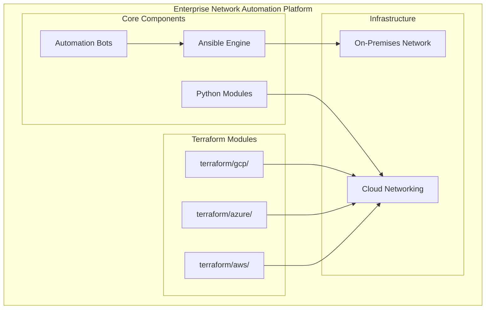

**Diagram sources**
- [README.md:165-180](file://README.md#L165-L180)
- [README.md:54-99](file://README.md#L54-L99)

The project structure includes dedicated directories for each cloud provider's Terraform modules, enabling multi-cloud networking strategies while maintaining consistent automation patterns.

**Section sources**
- [README.md:165-180](file://README.md#L165-L180)

## Core Components

### Terraform AWS Module Architecture

The AWS networking module under `terraform/aws/` implements a comprehensive set of infrastructure components:

#### Primary Networking Resources
- **VPC Management**: Virtual Private Cloud creation with custom CIDR blocks and tags
- **Subnet Configuration**: Public, private, and database subnets with availability zone distribution
- **Route Tables**: Custom routing policies with dynamic route propagation
- **Security Groups**: Dynamic rule management with automated compliance checks
- **Transit Gateway**: Centralized hub-and-spoke connectivity model
- **NAT Gateways**: Outbound internet access for private subnets

#### Integration Patterns

The platform integrates on-premises network automation with AWS cloud services through several key patterns:

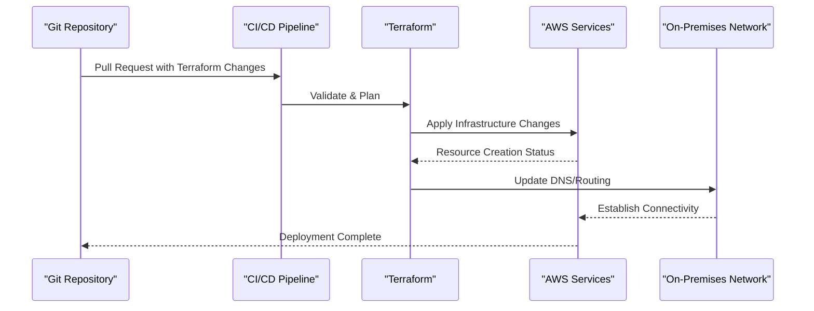

**Diagram sources**
- [README.md:36-50](file://README.md#L36-L50)

**Section sources**
- [README.md:219-226](file://README.md#L219-L226)

## Architecture Overview

### Hybrid Cloud Connectivity

The platform supports multiple hybrid cloud connectivity options:

#### Direct Connect Integration
- Dedicated network connections between on-premises data centers and AWS
- High-throughput, low-latency connectivity for large data transfers
- BGP peering for dynamic routing advertisement

#### VPN Connectivity
- Site-to-site VPN tunnels for backup connectivity
- IPsec encryption for secure data transmission
- Automatic failover between Direct Connect and VPN

#### Cross-Account Networking
- AWS Organization service control policies (SCPs)
- Shared VPC implementation for centralized network management
- IAM roles and policies for least-privilege access

#### Multi-Region Deployment
- Active-active or active-passive architectures
- Global Accelerator for optimized traffic routing
- Route 53 health checks and failover routing

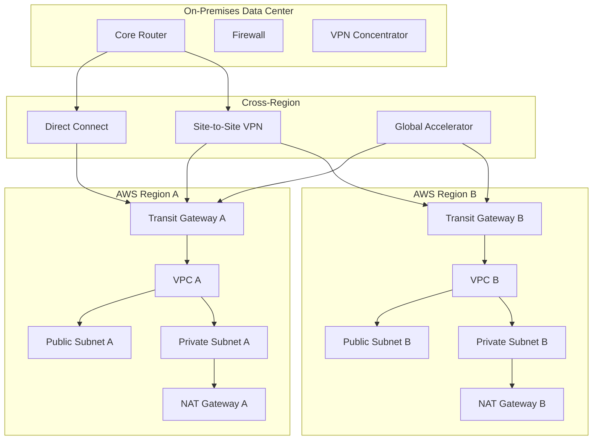

**Diagram sources**
- [README.md:54-99](file://README.md#L54-L99)

## Detailed Component Analysis

### VPC and Subnet Management

#### VPC Design Patterns
- **CIDR Block Allocation**: Hierarchical addressing scheme supporting up to 65,534 hosts per subnet
- **Availability Zone Distribution**: Multi-AZ deployment for high availability
- **Tagging Strategy**: Consistent tagging for cost allocation and resource management

#### Subnet Architecture
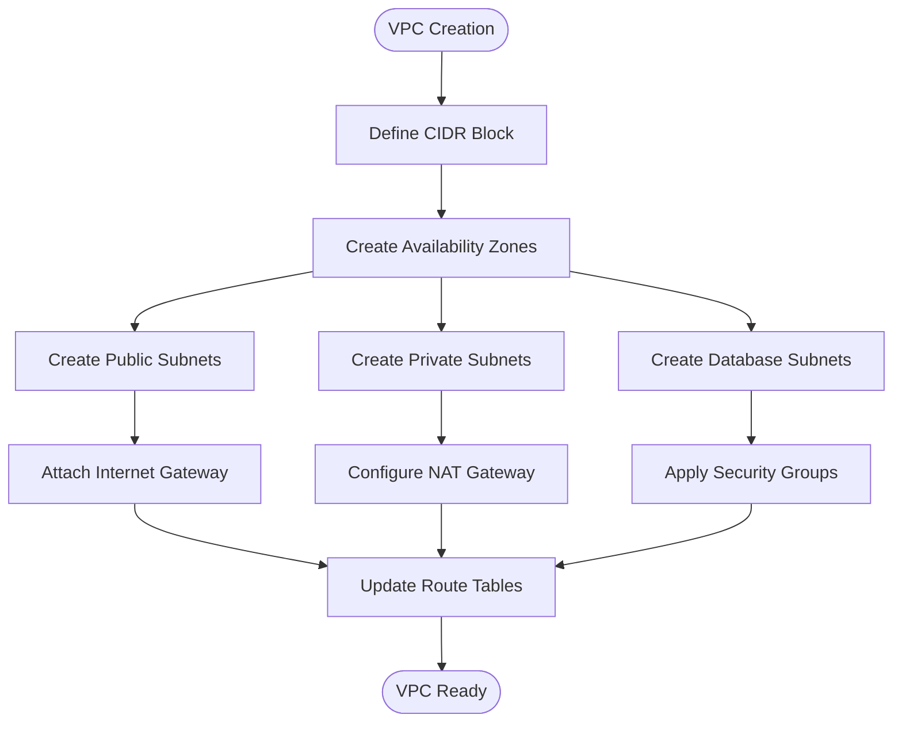

**Diagram sources**
- [README.md:219-226](file://README.md#L219-L226)

### Security Group Automation

#### Dynamic Rule Management
Security groups are managed through automated processes that respond to changing requirements:

| Rule Type | Source | Destination | Protocol | Port | Purpose |
|-----------|--------|-------------|----------|------|---------|
| Inbound SSH | Bastion Host SG | Target SG | TCP | 22 | Administrative Access |
| Inbound HTTPS | Load Balancer SG | Application SG | TCP | 443 | Web Traffic |
| Outbound API | Application SG | External API | TCP | 443 | API Communication |
| Inbound Database | App SG | DB SG | TCP | 3306 | Database Access |

#### Compliance Enforcement
Automated compliance checks ensure security group rules meet organizational standards:

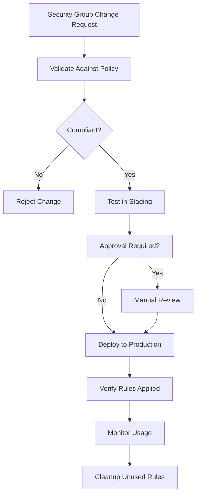

### Transit Gateway Implementation

#### Hub-and-Spoke Topology
The Transit Gateway serves as the central hub connecting multiple VPCs and on-premises networks:

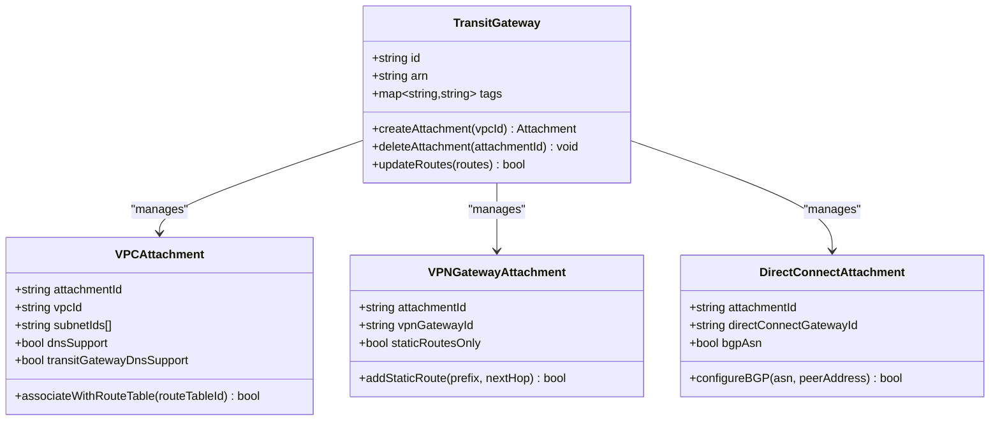

**Diagram sources**
- [README.md:219-226](file://README.md#L219-L226)

### NAT Gateway Configuration

#### Cost Optimization Strategies
NAT Gateways provide outbound internet access for private subnets while maintaining security:

| Strategy | Description | Cost Impact |
|----------|-------------|-------------|
| Right-sizing | Match NAT Gateway size to actual bandwidth needs | Up to 40% savings |
| Auto-scaling | Scale NAT Gateways based on traffic patterns | Optimizes costs during peak/off-peak |
| Consolidation | Use fewer NAT Gateways with higher capacity | Reduces per-hour charges |
| Monitoring | Track usage and adjust sizing regularly | Prevents over-provisioning |

#### Performance Optimization
- **Placement**: Distribute NAT Gateways across availability zones
- **Monitoring**: Set up CloudWatch alarms for bandwidth utilization
- **Scaling**: Plan for traffic growth and burst scenarios

## Dependency Analysis

### Module Dependencies

The Terraform AWS modules follow a hierarchical dependency structure:

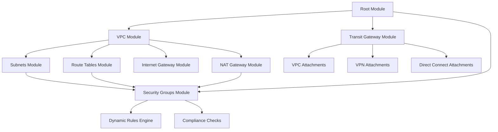

**Diagram sources**
- [README.md:165-180](file://README.md#L165-L180)

### Integration Points

#### On-Premises Integration
The platform bridges on-premises and cloud networking through:

1. **Configuration Synchronization**: Ansible playbooks update on-premises routing when cloud topology changes
2. **DNS Integration**: Automated DNS record updates for cloud resources
3. **Monitoring Integration**: Unified monitoring across on-premises and cloud assets
4. **Secret Management**: HashiCorp Vault integration for credential management

#### CI/CD Pipeline Integration
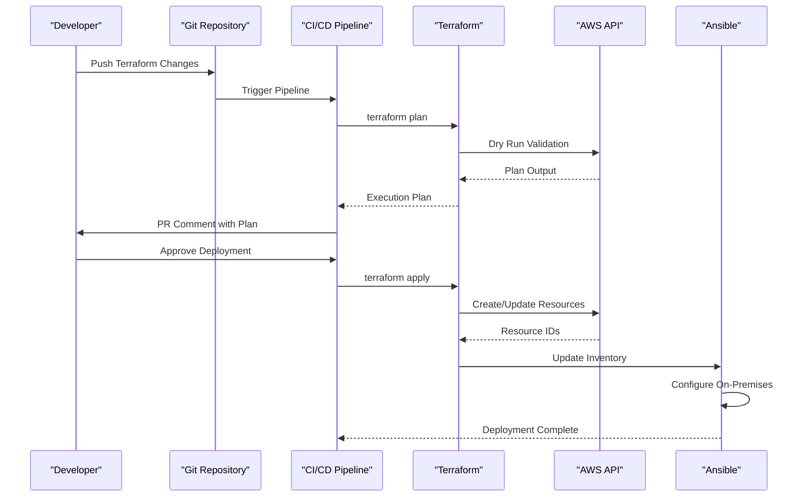

**Diagram sources**
- [README.md:483-501](file://README.md#L483-L501)

**Section sources**
- [README.md:165-180](file://README.md#L165-L180)
- [README.md:483-501](file://README.md#L483-L501)

## Performance Considerations

### Network Performance Optimization

#### Bandwidth Planning
- **Capacity Planning**: Size network components based on peak traffic plus 30% headroom
- **Traffic Shaping**: Implement QoS policies for critical applications
- **Connection Pooling**: Optimize connection reuse for API calls and database queries

#### Latency Reduction
- **Regional Placement**: Deploy resources close to users and dependent services
- **Edge Computing**: Use CloudFront and Lambda@Edge for content delivery
- **Protocol Optimization**: Enable HTTP/2 and keep-alive connections

#### Cost Optimization Techniques

##### Reserved Instances and Savings Plans
- **Compute Savings**: Commit to 1-year or 3-year terms for predictable workloads
- **Savings Plans**: Flexible commitment across instance families and regions
- **Spot Instances**: Use for fault-tolerant, interruptible workloads

##### Storage Optimization
- **Lifecycle Policies**: Automatically transition infrequently accessed data to cheaper tiers
- **Compression**: Enable compression for logs and backups
- **Deduplication**: Implement storage-level deduplication where possible

### Monitoring and Alerting

#### Key Metrics to Track
- **Network Throughput**: Bytes in/out, packet counts, error rates
- **Latency**: Connection establishment time, request/response times
- **Resource Utilization**: CPU, memory, disk I/O, network bandwidth
- **Cost Metrics**: Daily spend, resource utilization efficiency

#### Alerting Strategy
- **Critical Alerts**: Service outages, security breaches, data loss risks
- **Warning Alerts**: Performance degradation, capacity approaching limits
- **Informational Alerts**: Routine maintenance, configuration changes

## Troubleshooting Guide

### Common AWS Networking Issues

#### Connectivity Problems
| Issue | Symptoms | Resolution |
|-------|----------|------------|
| VPC Peering Failure | Routes not propagating, ping timeouts | Check route table associations, security groups, NACLs |
| Transit Gateway Attachment Issues | No traffic flow between VPCs | Verify attachment status, route propagation, policy attachments |
| NAT Gateway Timeouts | Private instances cannot reach internet | Check NAT gateway status, route table entries, security groups |
| Direct Connect Connection Loss | Intermittent connectivity | Verify BGP session, circuit status, router configuration |

#### Security Group Troubleshooting
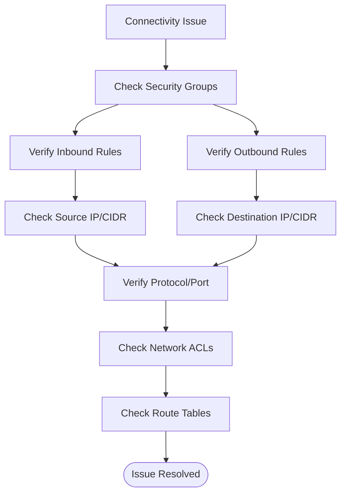

#### IAM Permissions Issues
Common permission errors and their resolutions:

| Error | Cause | Solution |
|-------|-------|----------|
| `UnauthorizedOperation` | Missing permissions | Add required IAM actions to role/policy |
| `AccessDenied` | Insufficient privileges | Grant specific resource permissions |
| `MalformedPolicyDocument` | Invalid JSON syntax | Validate policy syntax and structure |
| `LimitExceeded` | Resource quota reached | Request quota increase or optimize usage |

### Debugging Tools and Commands

#### Terraform Debugging
```bash
# Enable detailed logging
export TF_LOG=DEBUG
export TF_LOG_PATH=terraform.log

# Plan with detailed output
terraform plan -out=tfplan -debug

# Show resource dependencies
terraform graph | dot -Tpng > dependencies.png

# Import existing resources
terraform import aws_vpc.main vpc-12345678
```

#### AWS CLI Troubleshooting
```bash
# Check VPC status
aws ec2 describe-vpcs --vpc-ids vpc-12345678

# Verify route tables
aws ec2 describe-route-tables --filters "Name=vpc-id,Values=vpc-12345678"

# Check security group rules
aws ec2 describe-security-groups --group-ids sg-12345678

# Monitor NAT gateway performance
aws cloudwatch get-metric-statistics \
  --namespace AWS/NATGateway \
  --metric-name BytesInFromDestination \
  --dimensions Name=NatGatewayId,Values=nat-12345678
```

**Section sources**
- [README.md:674-685](file://README.md#L674-L685)

## Conclusion

The Enterprise Network Automation Platform provides a comprehensive foundation for AWS networking automation through Infrastructure as Code principles. The modular architecture enables scalable, repeatable, and auditable network deployments across hybrid cloud environments.

Key benefits include:
- **Consistency**: Standardized networking patterns across all environments
- **Scalability**: Automated provisioning of complex network topologies
- **Security**: Built-in compliance checks and automated security group management
- **Observability**: Comprehensive monitoring and alerting capabilities
- **Cost Optimization**: Intelligent resource sizing and utilization tracking

The platform's integration with CI/CD pipelines ensures that all network changes undergo proper validation, testing, and approval before deployment, reducing operational risk while maintaining development velocity.

## Appendices

### Best Practices Checklist

#### VPC Design
- [ ] Use hierarchical CIDR block allocation
- [ ] Implement multi-AZ deployment
- [ ] Apply consistent tagging strategy
- [ ] Enable VPC Flow Logs for all subnets

#### Security Configuration
- [ ] Follow least-privilege principle for security groups
- [ ] Implement automated compliance checking
- [ ] Regular security group audit and cleanup
- [ ] Enable AWS GuardDuty for threat detection

#### Cost Management
- [ ] Implement resource tagging for cost allocation
- [ ] Set up billing alerts and budgets
- [ ] Regular review of unused resources
- [ ] Optimize NAT Gateway sizing based on usage patterns

#### Monitoring and Operations
- [ ] Configure CloudWatch alarms for critical metrics
- [ ] Implement centralized log collection
- [ ] Set up automated backup and disaster recovery
- [ ] Document runbooks for common operations

### Reference Architecture Diagrams

#### Multi-Region Active-Active Setup
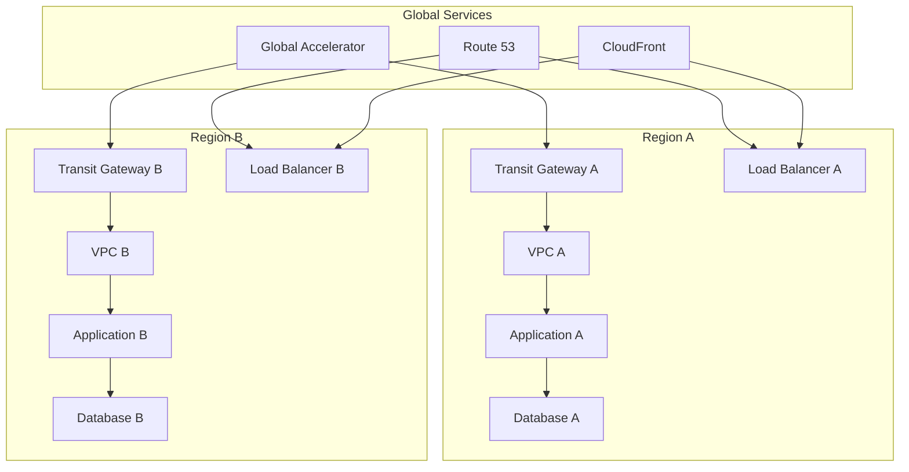

#### Disaster Recovery Architecture
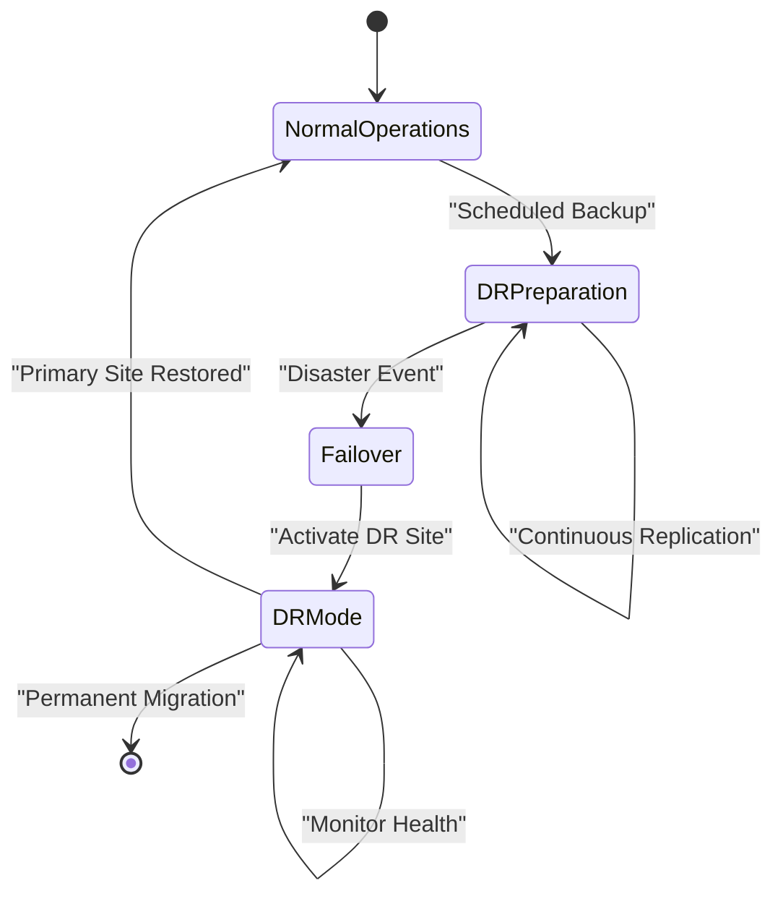