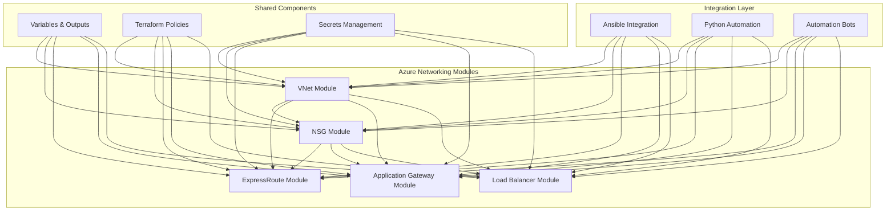
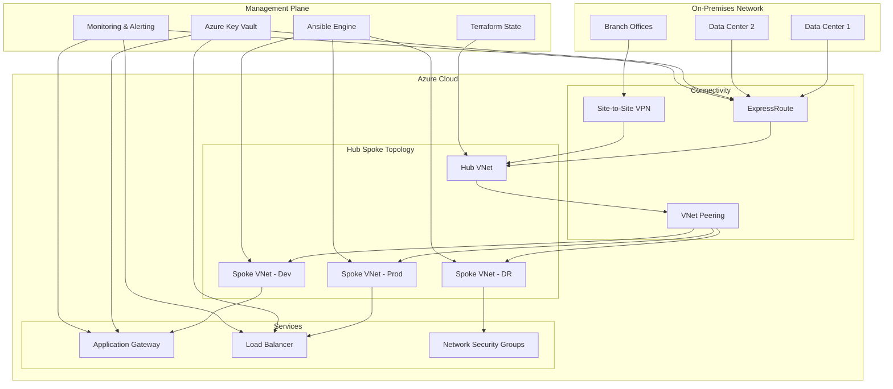
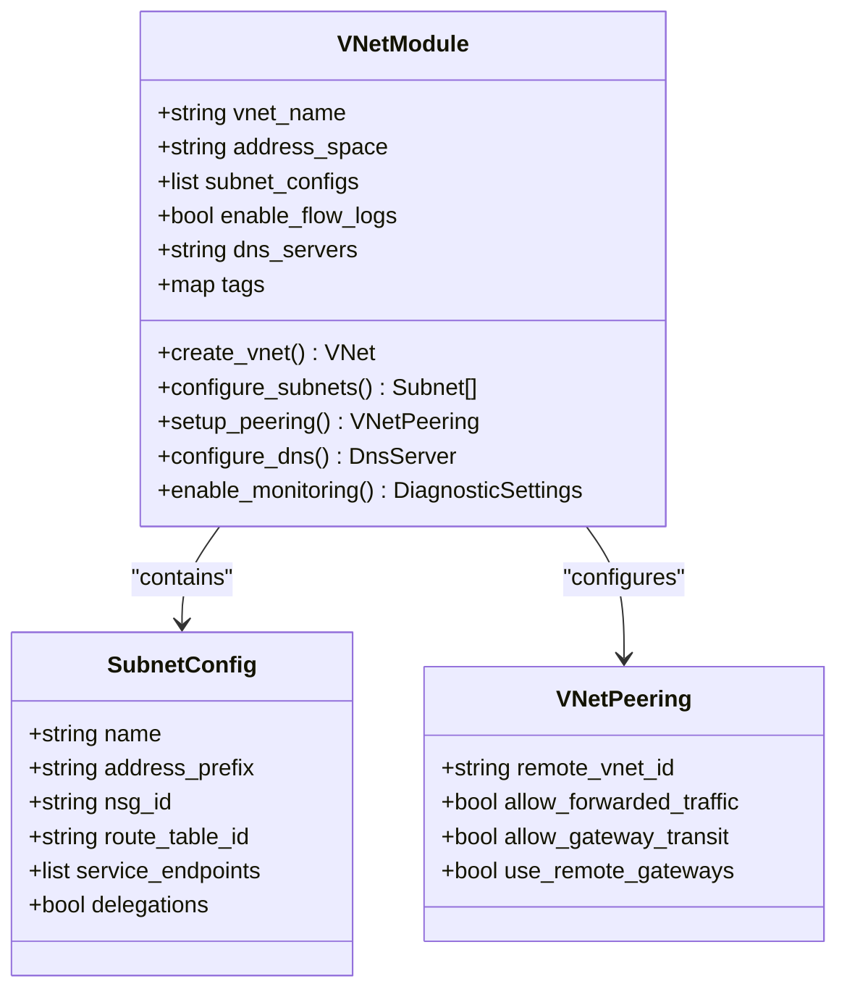
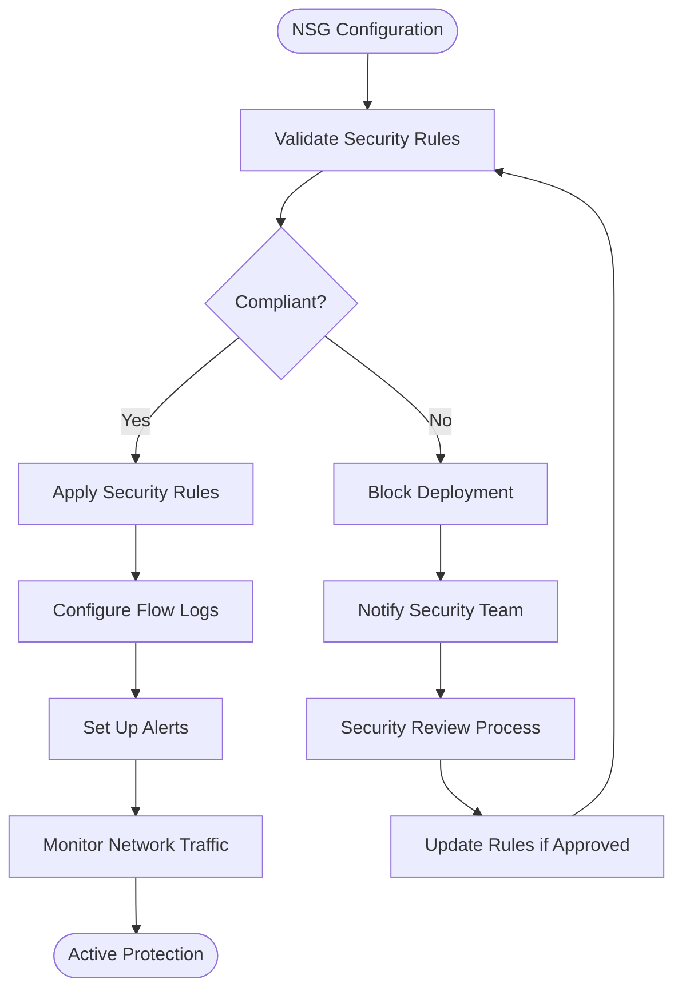
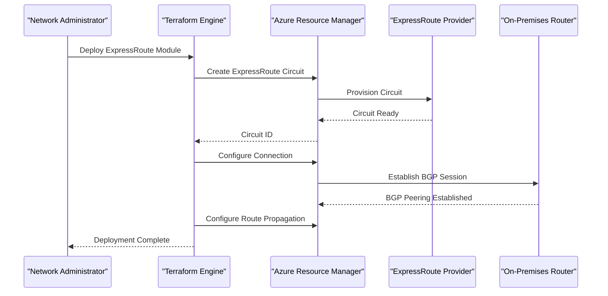
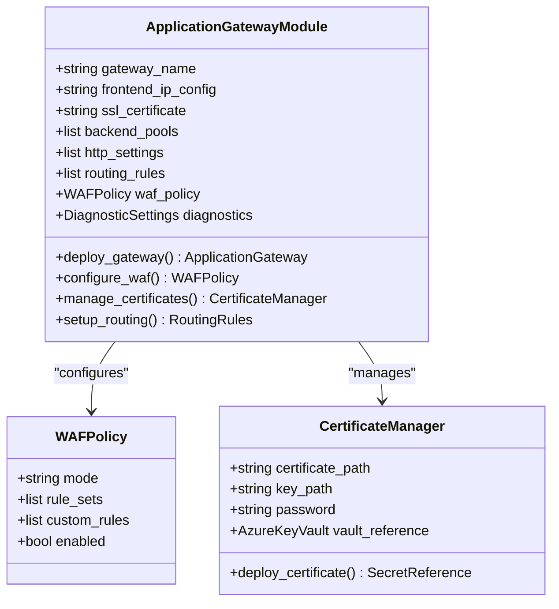
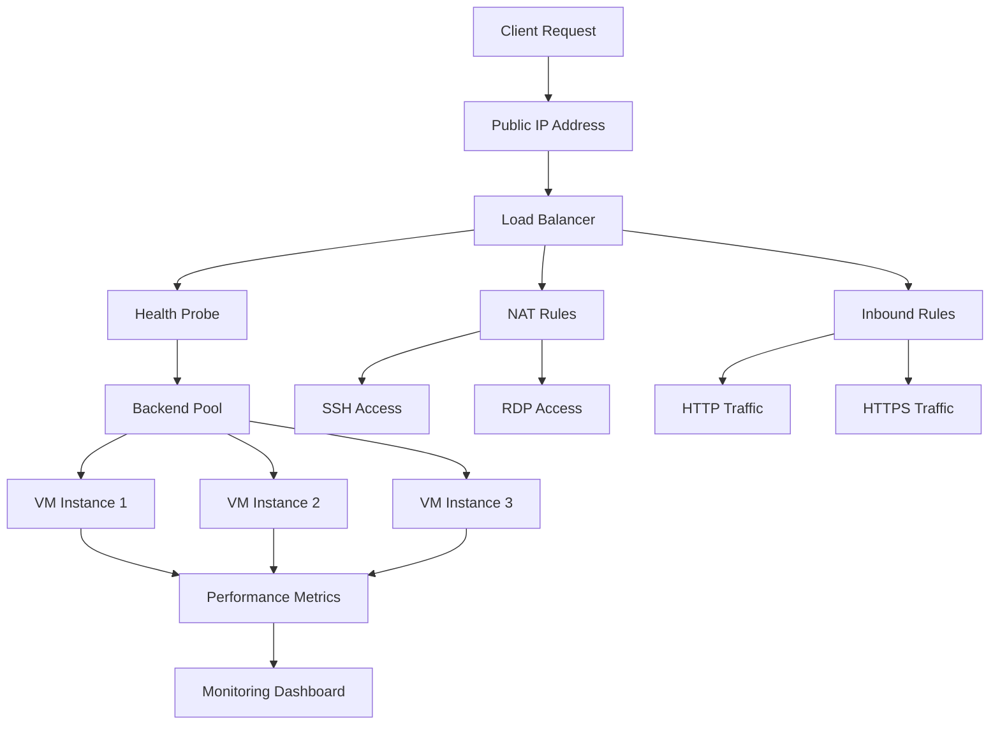
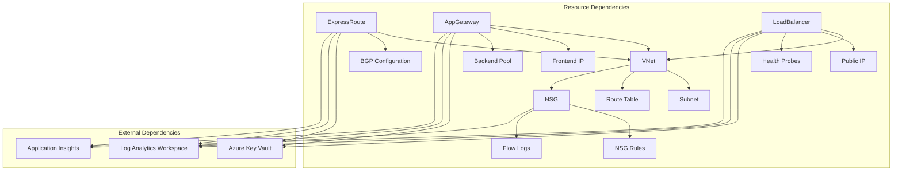

# Azure Networking

<cite>
**Referenced Files in This Document**
- [README.md](file://README.md)
</cite>

## Table of Contents
1. [Introduction](#introduction)
2. [Project Structure](#project-structure)
3. [Core Components](#core-components)
4. [Architecture Overview](#architecture-overview)
5. [Detailed Component Analysis](#detailed-component-analysis)
6. [Dependency Analysis](#dependency-analysis)
7. [Performance Considerations](#performance-considerations)
8. [Troubleshooting Guide](#troubleshooting-guide)
9. [Conclusion](#conclusion)
10. [Appendices](#appendices)

## Introduction

This document provides comprehensive guidance for implementing Azure networking automation within the Enterprise Network Automation Platform. The platform follows Infrastructure as Code (IaC) principles using Terraform modules to manage Azure networking resources including Virtual Networks (VNets), Network Security Groups (NSGs), ExpressRoute connections, Application Gateway instances, and Load Balancers.

The platform emphasizes GitOps workflows, compliance enforcement, and automated deployment pipelines while maintaining security best practices through secrets management and RBAC controls. All networking configurations are version-controlled, validated through CI/CD pipelines, and deployed with automated rollback capabilities.

## Project Structure

The Azure networking components follow a modular Terraform architecture organized under `terraform/azure/` directory structure. Each networking component is implemented as a reusable module with standardized input variables, outputs, and configuration patterns.



**Diagram sources**
- [README.md:165-170](file://README.md#L165-L170)
- [README.md:222-224](file://README.md#L222-L224)

**Section sources**
- [README.md:165-180](file://README.md#L165-L180)
- [README.md:222-226](file://README.md#L222-L226)

## Core Components

The Azure networking implementation consists of five primary Terraform modules, each designed for reusability, maintainability, and compliance enforcement:

### Virtual Network (VNet) Module
- Multi-subnet support with hierarchical naming conventions
- DNS server configuration and integration
- Peering connectivity setup
- Route table association and custom routing
- Monitoring and diagnostic settings

### Network Security Group (NSG) Module
- Rule-based security policy management
- Dynamic IP range support for external services
- Service endpoint integration
- Flow logging and monitoring
- Compliance validation rules

### ExpressRoute Module
- Circuit provisioning and management
- Connection peering configuration
- Route propagation settings
- Bandwidth scaling operations
- Health monitoring and alerting

### Application Gateway Module
- WAF policy configuration
- SSL/TLS certificate management
- Backend pool management
- URL-based routing rules
- Performance optimization settings

### Load Balancer Module
- Internal and public load balancing
- Health probe configuration
- NAT rule management
- Traffic distribution policies
- High availability setup

**Section sources**
- [README.md:222-224](file://README.md#L222-L224)
- [README.md:186-199](file://README.md#L186-L199)

## Architecture Overview

The Azure networking architecture integrates seamlessly with the broader Enterprise Network Automation Platform, providing hybrid cloud connectivity and multi-tenant support.



**Diagram sources**
- [README.md:54-99](file://README.md#L54-L99)
- [README.md:186-199](file://README.md#L186-L199)

## Detailed Component Analysis

### Virtual Network Module Implementation

The VNet module implements enterprise-grade network segmentation with support for complex multi-subnet architectures.



**Diagram sources**
- [README.md:165-170](file://README.md#L165-L170)

#### Key Features:
- **Hierarchical Naming**: Consistent naming conventions across environments
- **Multi-Subnet Support**: Flexible subnet configuration with proper CIDR allocation
- **DNS Integration**: Custom DNS server configuration for internal resolution
- **Peering Management**: Automated VNet peering setup with traffic flow control
- **Monitoring Enablement**: Built-in flow logs and diagnostic settings

### Network Security Group Module

The NSG module provides centralized security policy management with dynamic rule updates and compliance validation.



**Diagram sources**
- [README.md:549-579](file://README.md#L549-L579)

#### Security Features:
- **Rule Validation**: Pre-deployment security policy validation
- **Dynamic IP Ranges**: Support for external service IP ranges
- **Service Endpoints**: Secure access to Azure PaaS services
- **Flow Logging**: Network traffic analysis and threat detection
- **Compliance Checks**: Automated security policy enforcement

### ExpressRoute Connectivity

ExpressRoute implementation provides dedicated high-performance connectivity between on-premises networks and Azure.



**Diagram sources**
- [README.md:222-224](file://README.md#L222-L224)

#### Connectivity Features:
- **Automated Provisioning**: End-to-end circuit lifecycle management
- **BGP Configuration**: Automatic peering setup with route filtering
- **High Availability**: Dual-homed connection support
- **Bandwidth Scaling**: Non-disruptive bandwidth upgrades
- **Health Monitoring**: Circuit status and performance metrics

### Application Gateway Module

The Application Gateway module implements secure web application delivery with advanced traffic management capabilities.



**Diagram sources**
- [README.md:222-224](file://README.md#L222-L224)

#### Web Application Features:
- **WAF Protection**: Web Application Firewall with OWASP rules
- **SSL Termination**: Centralized certificate management
- **URL-Based Routing**: Advanced request routing policies
- **Backend Pool Management**: Dynamic backend scaling
- **Performance Optimization**: HTTP/2 and compression support

### Load Balancer Module

The Load Balancer module provides both internal and public load balancing solutions with health monitoring and traffic distribution.



**Diagram sources**
- [README.md:222-224](file://README.md#L222-L224)

#### Load Balancing Features:
- **Health Probes**: Automatic instance health monitoring
- **NAT Rules**: Direct port forwarding for management access
- **Traffic Distribution**: Round-robin and least-connection algorithms
- **High Availability**: Cross-AZ deployment support
- **Performance Monitoring**: Real-time traffic analytics

## Dependency Analysis

The Azure networking modules have well-defined dependency relationships that ensure proper resource creation order and configuration consistency.



**Diagram sources**
- [README.md:165-170](file://README.md#L165-L170)

### Module Coupling Analysis

| Module | Dependencies | Cohesion | Coupling |
|--------|-------------|----------|----------|
| VNet | None (Foundation) | High | Low |
| NSG | VNet, Log Analytics | Medium | Medium |
| ExpressRoute | VNet, Key Vault, Log Analytics | Medium | Medium |
| Application Gateway | VNet, Key Vault, Log Analytics, Monitor | Medium | High |
| Load Balancer | VNet, Key Vault, Log Analytics, Monitor | Medium | Medium |

**Section sources**
- [README.md:165-170](file://README.md#L165-L170)
- [README.md:222-224](file://README.md#L222-L224)

## Performance Considerations

### High-Throughput Scenarios

For high-throughput networking scenarios, implement the following optimizations:

#### Network Throughput Optimization
- **ExpressRoute Sizing**: Choose appropriate circuit tiers (50Mbps to 10Gbps)
- **Load Balancer SKU**: Use Standard SKU for production workloads
- **Application Gateway V2**: Leverage autoscaling and higher throughput limits
- **VNet Peering**: Optimize cross-region peering for latency-sensitive applications

#### Cost Optimization Strategies
- **Reserved Capacity**: Purchase reserved instances for predictable workloads
- **Spot VMs**: Use spot instances for fault-tolerant batch processing
- **Auto-scaling**: Implement scale-out policies based on demand
- **Right-sizing**: Regularly review and adjust resource allocations

#### Monitoring and Alerting
- **Metrics Collection**: Enable detailed metrics for all networking components
- **Alert Thresholds**: Configure alerts for bandwidth utilization and error rates
- **Performance Baselines**: Establish performance baselines for anomaly detection
- **Capacity Planning**: Monitor growth trends for proactive scaling

## Troubleshooting Guide

### Common Azure Networking Issues

#### Connectivity Problems
- **ExpressRoute Circuit Status**: Verify circuit provisioning state and provider connectivity
- **BGP Peering Issues**: Check BGP session establishment and route advertisement
- **Firewall Rules**: Validate NSG rules and firewall policies blocking traffic
- **DNS Resolution**: Ensure DNS servers are reachable and resolving correctly

#### Performance Issues
- **Bandwidth Utilization**: Monitor ExpressRoute bandwidth usage and upgrade if needed
- **Latency Analysis**: Use Azure Network Watcher to identify latency bottlenecks
- **Packet Loss**: Investigate packet loss patterns and network path issues
- **Connection Limits**: Check connection limits and increase quotas if necessary

#### Security and Compliance
- **RBAC Permissions**: Verify contributor or network contributor roles for deployment
- **Secrets Management**: Ensure Key Vault access policies are properly configured
- **Compliance Violations**: Review compliance check failures and remediate issues
- **Audit Logs**: Analyze activity logs for unauthorized changes

### RBAC Requirements

| Role | Required For | Description |
|------|-------------|-------------|
| Contributor | Full resource management | Create, update, delete all networking resources |
| Network Contributor | Networking-only operations | Manage VNets, NSGs, Load Balancers, etc. |
| Reader | Read-only access | View resource configurations without modifications |
| User Access Administrator | RBAC management | Assign roles and permissions to users/groups |

### Debugging Commands

```bash
# Test ExpressRoute connectivity
az network express-route circuit list --query "[?name=='your-circuit']"

# Check NSG effective security rules
az network nic show-effective-security-rules --nic-name <nic-name> --resource-group <rg-name>

# Monitor Application Gateway health
az network application-gateway show-health --gateway-name <gw-name> --resource-group <rg-name>

# View Load Balancer metrics
az monitor metrics list --resource <lb-id> --metric "OutboundConnections"
```

**Section sources**
- [README.md:674-685](file://README.md#L674-L685)

## Conclusion

The Azure networking implementation within the Enterprise Network Automation Platform provides a comprehensive, scalable, and secure foundation for hybrid cloud connectivity. The modular Terraform architecture ensures consistent deployments, automated compliance checks, and seamless integration with existing network automation workflows.

Key benefits include:
- **Infrastructure as Code**: Version-controlled networking configurations with full audit trails
- **Automated Compliance**: Built-in security policies and compliance validation
- **Scalable Architecture**: Support for enterprise-scale deployments with high availability
- **Cost Optimization**: Intelligent resource sizing and capacity planning
- **Operational Excellence**: Comprehensive monitoring, alerting, and troubleshooting capabilities

The platform's GitOps approach ensures that all networking changes go through proper validation, approval, and deployment processes, maintaining network stability while enabling rapid innovation.

## Appendices

### Quick Reference Commands

#### Terraform Operations
```bash
# Initialize Azure provider
terraform init -backend-config=backend.hcl

# Plan infrastructure changes
terraform plan -var-file=dev.tfvars

# Apply changes with approval workflow
terraform apply -auto-approve

# Destroy resources safely
terraform destroy -target=module.vnet -auto-approve
```

#### Azure CLI Commands
```bash
# Login to Azure
az login --service-principal -u $SP_ID -p $SP_SECRET --tenant $TENANT_ID

# Check resource group existence
az group exists --name <resource-group>

# List all VNets in subscription
az network vnet list --query "[].{Name:name, AddressSpace:addressSpace}"

# Export current configuration
az network vnet show --name <vnet-name> --resource-group <rg-name> --query "{vnet: @}" > vnet-config.json
```

### Best Practices Checklist

- [ ] Use consistent naming conventions across all resources
- [ ] Implement proper tagging strategy for cost allocation
- [ ] Enable diagnostic logging for all critical components
- [ ] Configure appropriate backup and disaster recovery procedures
- [ ] Set up monitoring and alerting for all networking components
- [ ] Implement proper RBAC with least privilege principle
- [ ] Use managed identities instead of service principals where possible
- [ ] Regularly review and optimize resource utilization
- [ ] Maintain separate state files per environment
- [ ] Implement drift detection and automated remediation