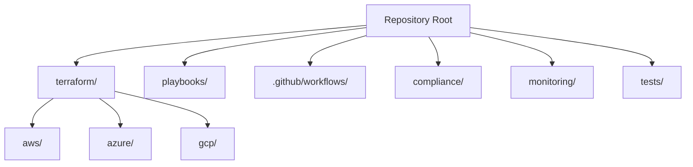
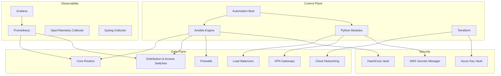
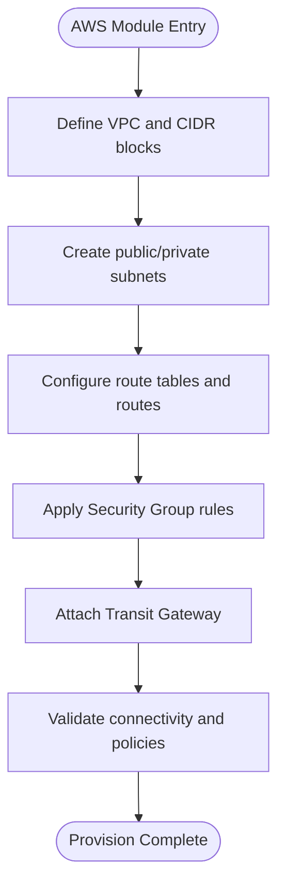
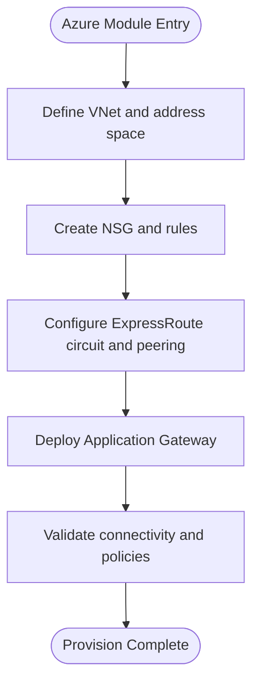
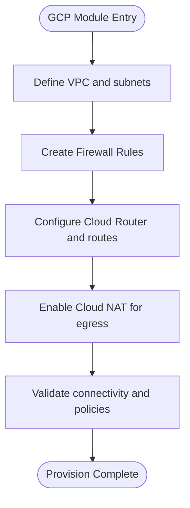
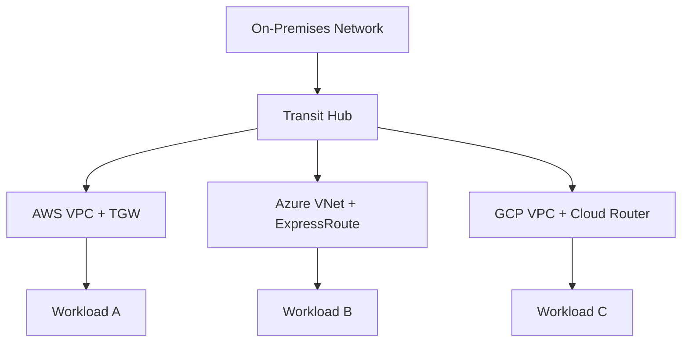
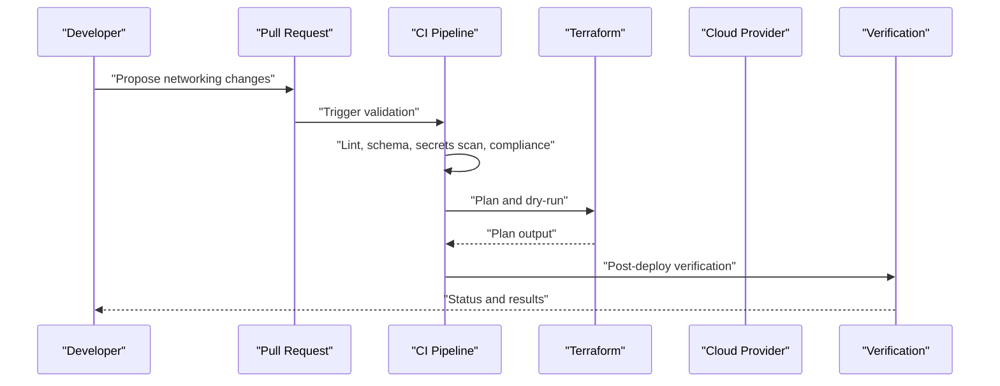
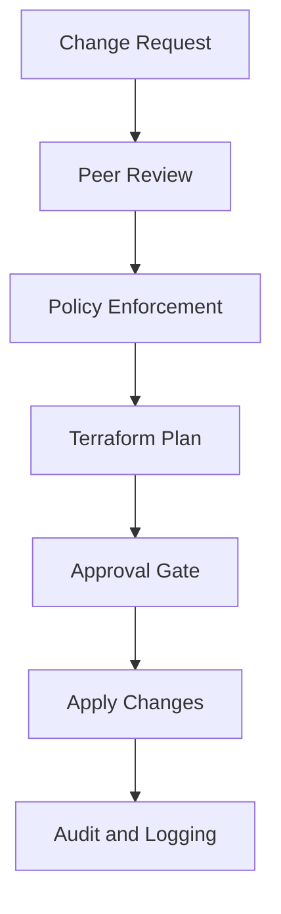
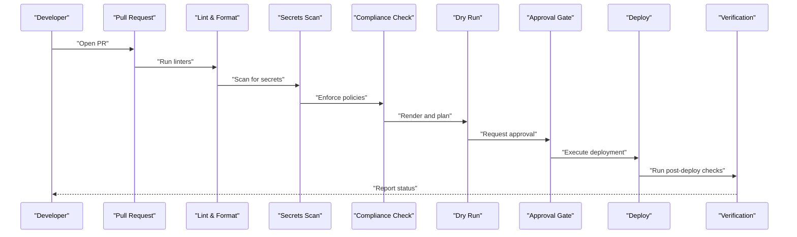
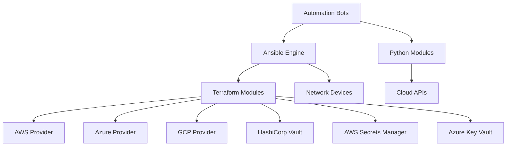

# Cloud Providers

<cite>
**Referenced Files in This Document**
- [README.md](file://README.md)
</cite>

## Table of Contents
1. [Introduction](#introduction)
2. [Project Structure](#project-structure)
3. [Core Components](#core-components)
4. [Architecture Overview](#architecture-overview)
5. [Detailed Component Analysis](#detailed-component-analysis)
6. [Dependency Analysis](#dependency-analysis)
7. [Performance Considerations](#performance-considerations)
8. [Troubleshooting Guide](#troubleshooting-guide)
9. [Conclusion](#conclusion)
10. [Appendices](#appendices)

## Introduction
This document provides comprehensive guidance for cloud provider networking support within the Enterprise Network Automation Platform, focusing on AWS, Azure, and GCP implementations using Terraform modules. It explains integration patterns between on-premises network automation and cloud networking services, hybrid cloud considerations, cross-cloud connectivity, multi-region deployment strategies, cloud-native networking patterns, security group automation, cost optimization techniques, practical IaC examples, drift detection between Git and cloud state, and automated provisioning workflows. The content is derived from the repository’s documented architecture and capabilities.

## Project Structure
The platform organizes cloud networking infrastructure as code under a dedicated directory structure with provider-specific modules:
- terraform/aws/
- terraform/azure/
- terraform/gcp/

These directories encapsulate Terraform modules that provision core networking resources per provider. The broader repository layout includes playbooks, roles, templates, CI/CD pipelines, compliance policies, monitoring, and testing suites that integrate with cloud networking via Terraform.

**Diagram sources**
- [README.md:165-170](file://README.md#L165-L170)

**Section sources**
- [README.md:165-170](file://README.md#L165-L170)

## Core Components
Cloud networking components are implemented through Terraform modules for each major provider:
- AWS: VPC, Subnets, Route Tables, Security Groups, Transit Gateway
- Azure: VNets, NSGs, ExpressRoute, Application Gateway
- GCP: VPC, Firewall Rules, Cloud Router, Cloud NAT

These modules are consumed by the platform’s automation engine (Ansible, Python modules, bots) and orchestrated via CI/CD pipelines to provision and manage cloud networking resources consistently across environments.

**Section sources**
- [README.md:222-225](file://README.md#L222-L225)

## Architecture Overview
The platform integrates on-premises devices and cloud networking into a unified control plane. Terraform provisions cloud networking resources, while Ansible and Python modules automate device configuration and orchestration. Observability and secrets management provide secure, auditable operations.

**Diagram sources**
- [README.md:54-99](file://README.md#L54-L99)

## Detailed Component Analysis

### AWS Networking Module
- Resources: VPC, Subnets, Route Tables, Security Groups, Transit Gateway
- Integration: Provisioned via Terraform; referenced by automation playbooks and bots for consistent policy enforcement and lifecycle management
- Multi-region strategy: Use separate module instances per region with shared Transit Gateway attachments for inter-region connectivity
- Hybrid connectivity: Connect on-premises networks via Direct Connect or Site-to-Site VPN attached to Transit Gateway
- Security automation: Security Group rules managed declaratively; changes enforced through CI/CD and compliance checks
- Cost optimization: Right-size subnets and route tables; leverage Transit Gateway data transfer plans; monitor usage via observability dashboards

[No sources needed since this diagram shows conceptual workflow, not actual code structure]

**Section sources**
- [README.md:222-225](file://README.md#L222-L225)

### Azure Networking Module
- Resources: VNets, NSGs, ExpressRoute, Application Gateway
- Integration: Provisioned via Terraform; integrated with Ansible/Python automation for policy-driven configuration
- Hybrid connectivity: ExpressRoute connects on-premises networks to Azure VNets with private peering and route propagation
- Load balancing and WAF: Application Gateway configured with autoscaling and policy-based routing
- Security automation: NSG rules managed declaratively; change control enforced via CI/CD and compliance scans
- Cost optimization: Optimize gateway SKUs and instance sizes; use traffic manager and regional scaling to minimize costs

[No sources needed since this diagram shows conceptual workflow, not actual code structure]

**Section sources**
- [README.md:222-225](file://README.md#L222-L225)

### GCP Networking Module
- Resources: VPC, Firewall Rules, Cloud Router, Cloud NAT
- Integration: Provisioned via Terraform; coordinated with automation tools for consistent policy application
- Hybrid connectivity: Cloud Interconnect or VPN attached to Cloud Router for on-premises connectivity
- Egress control: Cloud NAT provides outbound internet access for private subnets without public IPs
- Security automation: Firewall Rules managed declaratively; enforced via CI/CD and compliance checks
- Cost optimization: Use regional VPCs where possible; right-size NAT gateways; monitor egress traffic to optimize capacity

[No sources needed since this diagram shows conceptual workflow, not actual code structure]

**Section sources**
- [README.md:222-225](file://README.md#L222-L225)

### Cross-Cloud Connectivity Patterns
- Hub-and-spoke topology: Central hub in one cloud with spokes in other clouds via global transit solutions
- Peering and interconnect: Use provider-specific peering (e.g., VPC peering, VNet peering, VPC network peering) combined with third-party SD-WAN or transit hubs
- DNS and service discovery: Centralized DNS resolution across clouds for consistent service addressing
- Policy synchronization: Maintain consistent firewall and routing policies across clouds using centralized IaC and compliance checks

[No sources needed since this diagram shows conceptual workflow, not actual code structure]

### Multi-Region Deployment Strategies
- Regional isolation: Each region has its own VPC/VNet/VPC with independent subnets and security controls
- Global routing: Use Transit Gateway (AWS), ExpressRoute Global Reach (Azure), or Cloud Interconnect (GCP) for cross-region connectivity
- Data locality: Place workloads close to users and data sources; replicate critical services across regions
- Failover and DR: Automate failover using health checks and DNS-based routing; maintain backups and golden configurations

**Diagram sources**
- [README.md:483-501](file://README.md#L483-L501)

### Security Group Automation
- Declarative rule management: Security groups and NSGs defined in Terraform modules; changes reviewed via pull requests
- Automated enforcement: CI/CD pipelines enforce policy checks before applying changes
- Drift remediation: Scheduled jobs detect deviations and propose corrective actions

[No sources needed since this diagram shows conceptual workflow, not actual code structure]

### Cost Optimization Techniques
- Resource sizing: Right-size gateways, load balancers, and NAT instances based on traffic patterns
- Reserved capacity: Leverage reserved instances and committed use discounts where applicable
- Traffic shaping: Use caching, CDN, and regional placement to reduce cross-region data transfer costs
- Monitoring and alerts: Track resource utilization and set alerts for anomalies

[No sources needed since this section provides general guidance]

### Practical Examples of Infrastructure as Code
- Example workflows: Usage examples and sample workflows are provided under examples/ to demonstrate common scenarios
- Playbook integration: Network service playbooks (e.g., VLAN, ACL, NAT, VPN) coordinate with cloud networking modules for end-to-end automation
- Testing: Unit tests, Molecule role tests, and Batfish simulations validate IaC and configuration changes

**Section sources**
- [README.md:173-174](file://README.md#L173-L174)
- [README.md:388-435](file://README.md#L388-L435)
- [README.md:517-544](file://README.md#L517-L544)

### Drift Detection Between Git and Cloud State
- Configuration drift detection: A dedicated playbook detects differences between baseline configurations and running state
- Remediation workflows: Automated rollback or correction processes restore desired state upon drift detection
- Golden config tests: Custom tests compare current state against approved baselines to ensure consistency

**Section sources**
- [README.md:427-428](file://README.md#L427-L428)
- [README.md:527-528](file://README.md#L527-L528)

### Automated Cloud Network Provisioning Workflows
- CI/CD pipeline: Pull requests trigger linting, schema validation, secrets scanning, compliance checks, and dry runs
- Approval gates: Manual approvals required for production deployments
- Post-deploy verification: Health checks and configuration validation ensure successful provisioning

**Diagram sources**
- [README.md:483-501](file://README.md#L483-L501)

## Dependency Analysis
The platform’s cloud networking modules depend on Terraform providers and integrate with secrets backends and observability systems. The automation engine orchestrates provisioning and configuration changes across on-premises and cloud environments.

**Diagram sources**
- [README.md:54-99](file://README.md#L54-L99)

**Section sources**
- [README.md:54-99](file://README.md#L54-L99)

## Performance Considerations
- Parallel provisioning: Use Terraform parallelism to accelerate resource creation across multiple regions
- Incremental updates: Apply changes incrementally to minimize downtime and risk
- Caching and reuse: Reuse outputs and modules to reduce redundant operations
- Monitoring: Track provisioning times and error rates to identify bottlenecks

[No sources needed since this section provides general guidance]

## Troubleshooting Guide
Common issues and resolutions include:
- Connection timeouts: Verify reachability and credentials for target devices and cloud APIs
- Template rendering errors: Debug Jinja2 syntax and variable mappings
- Compliance check failures: Review policy definitions and device configurations
- CI pipeline failures: Inspect GitHub Actions logs for actionable error messages
- Vault authentication failures: Validate OIDC tokens or AppRole credentials and policies
- Molecule test failures: Ensure Docker/Podman is running and configurations are correct
- Batfish analysis errors: Validate snapshots and model definitions

**Section sources**
- [README.md:674-685](file://README.md#L674-L685)

## Conclusion
The Enterprise Network Automation Platform provides robust, modular cloud networking support across AWS, Azure, and GCP using Terraform. By integrating on-premises automation with cloud services, it enables hybrid cloud networking, cross-cloud connectivity, and multi-region deployments. Security, compliance, and cost optimization are embedded throughout the lifecycle, supported by automated provisioning workflows and drift detection mechanisms.

## Appendices

### Quick Start Commands
- Bootstrap environment and install dependencies
- Run playbooks for initial provisioning and compliance scans
- Execute unit tests and compliance checks locally

**Section sources**
- [README.md:239-280](file://README.md#L239-L280)

### Supported Vendors and Cloud Services
- On-premises vendors: Cisco, Juniper, Arista, Palo Alto, Fortinet, Check Point, F5, pfSense, OPNsense
- Cloud services: AWS VPC, Azure VNets, GCP VPC and associated networking components

**Section sources**
- [README.md:205-226](file://README.md#L205-L226)