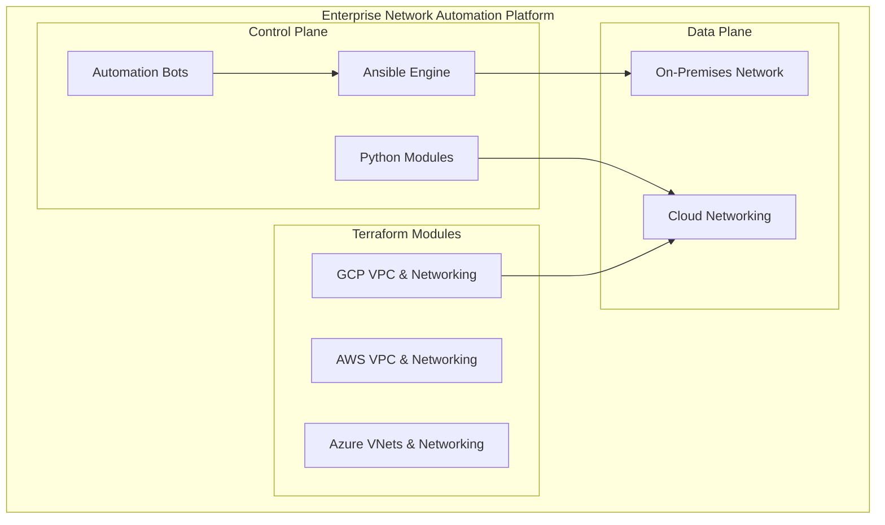
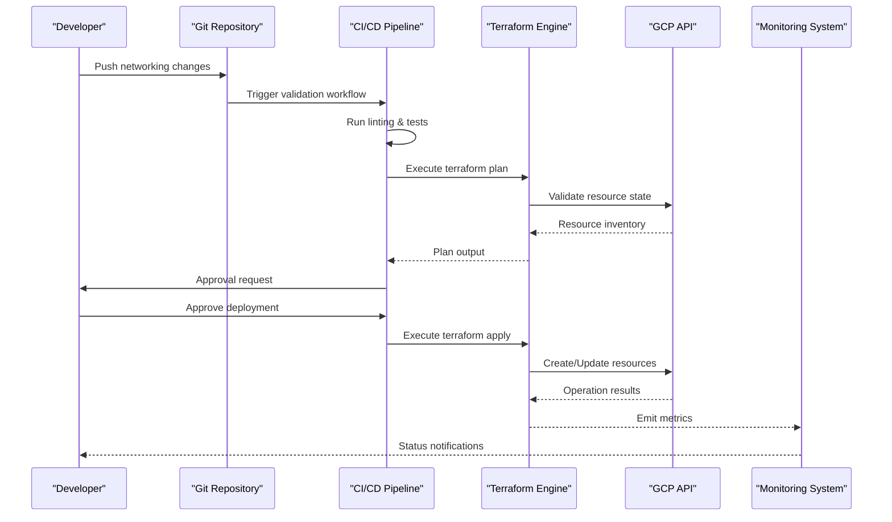
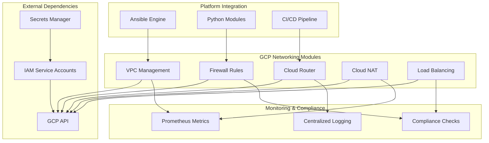

# GCP Networking

<cite>
**Referenced Files in This Document**
- [README.md](file://README.md)
</cite>

## Table of Contents
1. [Introduction](#introduction)
2. [Project Structure](#project-structure)
3. [Core Components](#core-components)
4. [Architecture Overview](#architecture-overview)
5. [Detailed Component Analysis](#detailed-component-analysis)
6. [Dependency Analysis](#dependency-analysis)
7. [Performance Considerations](#performance-considerations)
8. [Troubleshooting Guide](#troubleshooting-guide)
9. [Conclusion](#conclusion)
10. [Appendices](#appendices)

## Introduction

This document provides comprehensive guidance for implementing Google Cloud Platform (GCP) networking automation within the Enterprise Network Automation Platform. The platform follows Infrastructure as Code principles using Terraform to manage GCP networking resources including VPC networks, Firewall Rules, Cloud Router, Cloud NAT, and Global Load Balancing configurations.

The Enterprise Network Automation Platform is designed as a production-grade, vendor-agnostic solution that demonstrates Infrastructure as Code, GitOps, CI/CD, compliance enforcement, observability, and security practices suitable for enterprise-scale network automation across multi-vendor, multi-region environments.

## Project Structure

The GCP networking automation is organized under the `terraform/gcp/` directory structure, following the platform's modular approach to cloud networking infrastructure management.

**Diagram sources**
- [README.md:36-50](file://README.md#L36-L50)
- [README.md:54-99](file://README.md#L54-L99)

The platform architecture supports multi-cloud networking with consistent automation patterns across AWS, Azure, and GCP providers, enabling unified management of hybrid cloud connectivity scenarios.

**Section sources**
- [README.md:103-180](file://README.md#L103-L180)
- [README.md:219-226](file://README.md#L219-L226)

## Core Components

The GCP networking automation components follow the platform's established patterns for Infrastructure as Code management, integrating seamlessly with the broader automation ecosystem.

### Terraform Module Architecture

The GCP networking modules implement a hierarchical structure that promotes reusability and consistency:

- **Base Networking**: Core VPC configuration, subnet definitions, and routing policies
- **Security Layer**: Firewall rules, firewall policies, and access controls
- **Connectivity**: Cloud Interconnect, Cloud VPN, and peering configurations
- **Load Balancing**: Global HTTP(S), TCP, and UDP load balancers
- **NAT Services**: Cloud NAT configuration for outbound connectivity
- **Monitoring**: Logging, metrics, and alerting integration

### Integration Patterns

The platform implements several key integration patterns between on-premises network automation and GCP cloud networking services:

#### Hybrid Cloud Connectivity
- **Cloud Interconnect**: Dedicated connections for high-bandwidth, low-latency requirements
- **Cloud VPN**: IPsec-based connectivity for cost-effective hybrid scenarios
- **BGP Peering**: Dynamic routing between on-premises and cloud networks

#### Multi-Project Networking Strategies
- **Shared VPC**: Centralized network management with project-scoped subnets
- **Network Service Tier**: Optimized routing paths for specific use cases
- **Firewall Policies**: Organization-level policy enforcement across projects

#### Global Load Balancing
- **HTTP(S) Load Balancing**: Application-layer load balancing with SSL termination
- **TCP/UDP Load Balancing**: Transport-layer load balancing for custom protocols
- **Cross-Region Load Balancing**: Traffic distribution across multiple regions

**Section sources**
- [README.md:15-31](file://README.md#L15-L31)
- [README.md:219-226](file://README.md#L219-L226)

## Architecture Overview

The GCP networking automation integrates with the broader Enterprise Network Automation Platform through well-defined interfaces and automation workflows.

**Diagram sources**
- [README.md:36-50](file://README.md#L36-L50)
- [README.md:483-501](file://README.md#L483-L501)

The architecture ensures that all GCP networking changes follow the same rigorous validation, approval, and deployment processes as on-premises network automation, maintaining consistency across hybrid environments.

## Detailed Component Analysis

### VPC Network Management

VPC networks form the foundation of GCP networking automation, providing isolated network environments with configurable routing, firewall policies, and interconnectivity options.

#### Key Implementation Patterns

- **Modular VPC Design**: Hierarchical organization with shared services and application-specific subnets
- **Dynamic Subnet Allocation**: Automated CIDR block assignment based on environment and region requirements
- **Routing Policy Management**: Centralized route table management with conditional route injection
- **Network Tiers**: Performance-optimized routing paths for different workload types

#### Configuration Management

The VPC configuration follows Infrastructure as Code best practices with version-controlled templates, parameterized deployments, and automated drift detection.

**Section sources**
- [README.md:165-169](file://README.md#L165-L169)
- [README.md:224-225](file://README.md#L224-L225)

### Firewall Rules Automation

Firewall rule automation implements dynamic policy management with support for tag-based targeting, time-based rules, and automated compliance checking.

#### Dynamic Tag-Based Security

- **Tag Inheritance**: Automatic propagation of security tags across related resources
- **Policy Templates**: Reusable firewall rule templates for common security patterns
- **Compliance Validation**: Automated checking against organizational security policies
- **Change Tracking**: Audit trail for all firewall rule modifications

#### Rule Optimization

- **Rule Consolidation**: Automated identification and consolidation of redundant rules
- **Shadow Rule Detection**: Identification of rules that never match traffic
- **Performance Analysis**: Monitoring of firewall rule evaluation performance

### Cloud Router and NAT Services

Cloud Router and Cloud NAT provide essential connectivity and address translation services for cloud workloads.

#### Cloud Router Configuration

- **BGP Peering Management**: Automated establishment and monitoring of BGP sessions
- **Route Advertisement**: Conditional route advertisement based on workload availability
- **Health Checking**: Integrated health checks for route optimization
- **Multi-Region Routing**: Cross-region routing policies for disaster recovery

#### Cloud NAT Management

- **Ephemeral IP Pool Management**: Automated allocation and monitoring of NAT IP addresses
- **Bandwidth Scaling**: Dynamic scaling of NAT capacity based on traffic patterns
- **Cost Optimization**: Intelligent NAT configuration for cost-effective outbound connectivity
- **Monitoring Integration**: Comprehensive logging and metrics collection

### Global Load Balancing

Global load balancing provides intelligent traffic distribution across geographically distributed instances with automatic failover capabilities.

#### Load Balancer Types

- **HTTP(S) Load Balancing**: Application-aware load balancing with SSL termination and caching
- **TCP/UDP Load Balancing**: Transport-layer load balancing for custom protocols
- **Internal Load Balancing**: Regional load balancing for internal service communication

#### Advanced Features

- **Traffic Management**: Weighted routing, canary deployments, and A/B testing support
- **Health Monitoring**: Custom health check endpoints with automatic instance removal
- **SSL Certificate Management**: Automated certificate provisioning and renewal
- **DDoS Protection**: Built-in DDoS mitigation and security features

**Section sources**
- [README.md:224-225](file://README.md#L224-L225)

## Dependency Analysis

The GCP networking automation maintains clear dependency boundaries while integrating with the broader platform ecosystem.

**Diagram sources**
- [README.md:54-99](file://README.md#L54-L99)
- [README.md:343-357](file://README.md#L343-L357)

### Component Coupling Analysis

The GCP networking modules exhibit low coupling with external systems while maintaining strong cohesion within the networking domain. Key dependencies include:

- **GCP Provider**: Direct API calls for resource management
- **IAM Service Accounts**: Scoped permissions for least-privilege access
- **Secrets Management**: Secure handling of credentials and sensitive configuration
- **Monitoring Systems**: Metrics export and alerting integration

### Circular Dependency Prevention

The architecture prevents circular dependencies through clear separation of concerns:

- **Configuration Layer**: Pure data structures without execution logic
- **Resource Layer**: State management without business logic
- **Orchestration Layer**: Workflow coordination without resource details

**Section sources**
- [README.md:54-99](file://README.md#L54-L99)
- [README.md:343-357](file://README.md#L343-L357)

## Performance Considerations

Optimizing GCP networking automation for performance-critical applications requires careful consideration of several factors:

### Low-Latency Application Optimization

- **Regional Placement**: Deploying resources in optimal geographic locations
- **Network Tiers**: Using premium network tier for latency-sensitive workloads
- **Connection Pooling**: Efficient connection reuse and management
- **Caching Strategies**: Implementing appropriate caching layers

### Cost Optimization

- **Committed Use Discounts**: Leveraging long-term commitments for significant cost savings
- **Sustained Use Discounts**: Automatic discounts for consistently used resources
- **Resource Rightsizing**: Continuous monitoring and adjustment of resource allocations
- **Idle Resource Detection**: Automated cleanup of unused or underutilized resources

### Scalability Considerations

- **Horizontal Scaling**: Stateless design patterns for easy horizontal expansion
- **Auto-scaling Policies**: Intelligent scaling based on demand patterns
- **Load Distribution**: Even traffic distribution across available instances
- **Capacity Planning**: Proactive capacity management based on growth projections

### Monitoring and Observability

- **Latency Metrics**: End-to-end latency measurement and alerting
- **Throughput Monitoring**: Bandwidth utilization and throughput tracking
- **Error Rate Monitoring**: Connection failures and timeout monitoring
- **Resource Utilization**: CPU, memory, and network interface utilization tracking

## Troubleshooting Guide

Common GCP networking issues and their resolution strategies:

### Connectivity Issues

| Issue | Symptoms | Resolution |
|-------|----------|------------|
| **VPC Peering Failures** | Route lookup failures, connection timeouts | Verify peering status, check firewall rules, validate CIDR overlap |
| **Cloud VPN Tunnel Down** | Intermittent connectivity, tunnel flapping | Check IPsec phase 1/2 status, verify pre-shared keys, monitor MTU settings |
| **Cloud Interconnect Problems** | High packet loss, bandwidth limitations | Verify VLAN attachment status, check partner circuit health, review error counters |

### Firewall Rule Issues

| Issue | Symptoms | Resolution |
|-------|----------|------------|
| **Overly Restrictive Rules** | Legitimate traffic blocked | Review rule priority, check source/destination specifications |
| **Rule Conflicts** | Unpredictable traffic behavior | Analyze rule precedence, identify shadow rules, consolidate overlapping rules |
| **Tag Propagation Delays** | Delayed policy application | Verify tag assignment, check tag-based rule matching, monitor tag sync status |

### Load Balancing Problems

| Issue | Symptoms | Resolution |
|-------|----------|------------|
| **Backend Health Check Failures** | Instances removed from rotation | Verify health check endpoints, check instance accessibility, review health check configuration |
| **Uneven Traffic Distribution** | Hotspots on specific instances | Review session affinity settings, check backend weights, analyze instance capacity |
| **SSL/TLS Issues** | Certificate errors, handshake failures | Verify certificate validity, check cipher suite compatibility, review TLS configuration |

### IAM and Permissions

| Issue | Symptoms | Resolution |
|-------|----------|------------|
| **Service Account Permissions** | API call failures, resource access denied | Review IAM bindings, verify minimum required permissions, check role inheritance |
| **Cross-Project Access** | Shared VPC permission errors | Configure host/project relationships, verify service account roles, check network user permissions |
| **API Quota Exceeded** | Throttled operations, failed deployments | Monitor quota usage, request quota increases, optimize API call patterns |

### Performance Optimization

- **Network Latency**: Use regional endpoints, enable HTTP/2, implement connection pooling
- **Bandwidth Limitations**: Upgrade network tiers, implement compression, optimize payload sizes
- **Connection Limits**: Tune connection pool sizes, implement backpressure mechanisms
- **Memory Usage**: Optimize buffer sizes, implement streaming processing, monitor memory leaks

**Section sources**
- [README.md:674-685](file://README.md#L674-L685)

## Conclusion

The GCP networking automation within the Enterprise Network Automation Platform provides a comprehensive, scalable, and secure approach to managing cloud networking infrastructure. By leveraging Infrastructure as Code principles, GitOps workflows, and automated compliance checking, the platform ensures consistent, reliable, and auditable networking operations across hybrid cloud environments.

Key benefits include:

- **Consistency**: Uniform networking patterns across AWS, Azure, and GCP
- **Automation**: Reduced manual intervention and human error
- **Compliance**: Automated policy enforcement and audit trails
- **Scalability**: Support for enterprise-scale deployments
- **Observability**: Comprehensive monitoring and troubleshooting capabilities

The platform's modular architecture enables incremental adoption, allowing organizations to migrate existing networking infrastructure while maintaining operational continuity and security posture.

## Appendices

### Best Practices Checklist

- **Security**: Implement least-privilege IAM policies, enable encryption at rest and in transit
- **Reliability**: Configure multi-zone deployments, implement proper backup and recovery procedures
- **Performance**: Monitor key metrics, implement auto-scaling, optimize resource allocation
- **Cost Management**: Regular cost reviews, implement budget alerts, optimize resource usage
- **Documentation**: Maintain up-to-date network diagrams, runbooks, and operational procedures

### Migration Strategy

1. **Assessment**: Inventory existing networking infrastructure and dependencies
2. **Planning**: Design target architecture and migration timeline
3. **Pilot**: Implement proof-of-concept with non-critical workloads
4. **Migration**: Execute phased migration with rollback procedures
5. **Validation**: Comprehensive testing and performance verification
6. **Optimization**: Fine-tune configurations based on operational feedback