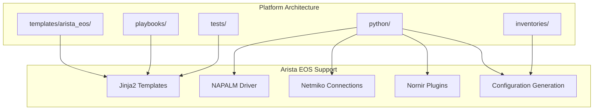
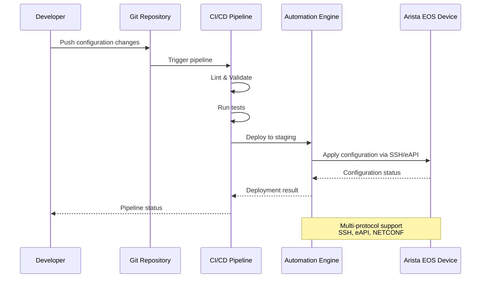
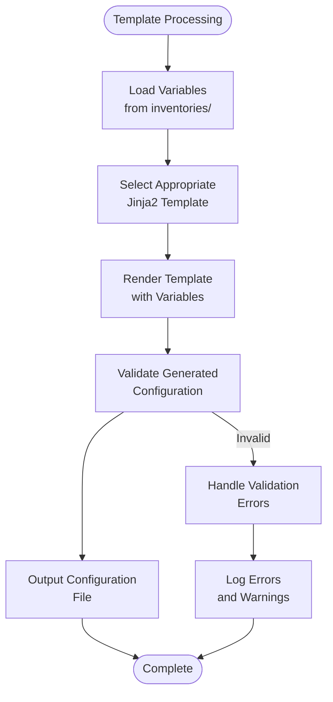
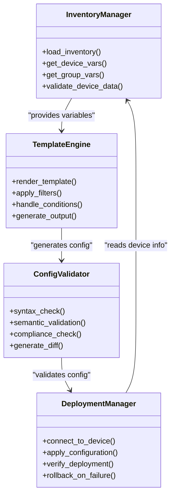
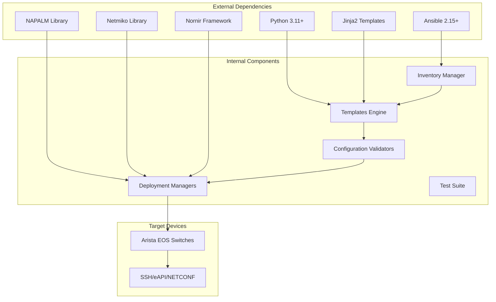

# Arista Platforms (EOS)

<cite>
**Referenced Files in This Document**
- [README.md](file://README.md)
</cite>

## Table of Contents
1. [Introduction](#introduction)
2. [Project Structure](#project-structure)
3. [Core Components](#core-components)
4. [Architecture Overview](#architecture-overview)
5. [Detailed Component Analysis](#detailed-component-analysis)
6. [Dependency Analysis](#dependency-analysis)
7. [Performance Considerations](#performance-considerations)
8. [Troubleshooting Guide](#troubleshooting-guide)
9. [Conclusion](#conclusion)
10. [Appendices](#appendices)

## Introduction

This document provides comprehensive coverage of Arista EOS platform support within the Enterprise Network Automation Platform. The platform is designed as a production-grade, vendor-agnostic network automation solution that manages thousands of network devices across multi-vendor, multi-region environments using Infrastructure as Code, GitOps, CI/CD, compliance enforcement, observability, and security best practices.

Arista EOS switches are fully supported with SSH, eAPI, and NETCONF protocols, leveraging modern automation frameworks including NAPALM, Netmiko, and Nornir for device management. The platform follows a "Network as Code" approach where all configurations are generated from Jinja2 templates combined with structured data, ensuring consistency, version control, and automated validation throughout the deployment lifecycle.

## Project Structure

The Enterprise Network Automation Platform follows a modular architecture with dedicated directories for each vendor's specific implementations. For Arista EOS, the platform provides:



**Diagram sources**
- [README.md:103-180](file://README.md#L103-L180)

The platform organizes Arista-specific configurations under `templates/arista_eos/` directory, containing Jinja2 templates for various network features and services. The Python modules provide abstraction layers for different connection methods and automation frameworks.

**Section sources**
- [README.md:103-180](file://README.md#L103-L180)

## Core Components

### Protocol Support Matrix

The platform supports multiple protocols for Arista EOS devices:

| Protocol | Status | Use Case | Implementation |
|----------|--------|----------|----------------|
| SSH | Supported | CLI-based configuration, troubleshooting | Netmiko connections |
| eAPI | Supported | JSON-RPC API calls, programmatic access | REST API integration |
| NETCONF | Supported | YANG-based configuration, standardized interface | NETCONF client |

### Technology Stack Integration

The platform integrates multiple automation technologies for comprehensive Arista EOS support:

- **NAPALM**: Provides vendor-neutral abstraction layer for device operations
- **Netmiko**: Enables SSH-based CLI automation with retry logic
- **Nornir**: Offers high-performance parallel automation framework
- **Jinja2**: Powers template-based configuration generation
- **Ansible**: Serves as the primary orchestration engine

**Section sources**
- [README.md:184-200](file://README.md#L184-L200)
- [README.md:438-456](file://README.md#L438-L456)

## Architecture Overview

The Arista EOS automation architecture follows a layered approach with clear separation of concerns:



**Diagram sources**
- [README.md:34-50](file://README.md#L34-L50)

The automation engine supports multiple connection methods to Arista EOS devices, allowing flexibility based on device capabilities and operational requirements. The platform implements comprehensive error handling, rollback mechanisms, and verification processes to ensure reliable deployments.

## Detailed Component Analysis

### Template Management System

The platform uses Jinja2 templates organized under `templates/arista_eos/` for generating Arista-specific configurations. This approach enables:

- **Version Control**: All configurations tracked in Git
- **Template Reusability**: Common patterns shared across devices
- **Environment-Specific Customization**: Different configurations per environment
- **Validation**: Pre-deployment syntax and semantic checks

#### Template Organization Pattern



**Diagram sources**
- [README.md:116-128](file://README.md#L116-L128)

### Connection Management

The platform implements multiple connection strategies for Arista EOS devices:

#### SSH Connections via Netmiko
- **Authentication**: Username/password or key-based authentication
- **Session Management**: Persistent connections with automatic reconnection
- **Command Execution**: Bulk command execution with output parsing
- **Error Handling**: Comprehensive timeout and retry logic

#### eAPI JSON-RPC Interface
- **REST API Access**: HTTP/HTTPS-based programmatic interface
- **JSON Format**: Structured request/response format
- **Authentication**: Token-based or username/password authentication
- **Batch Operations**: Multiple commands in single request

#### NETCONF Protocol Support
- **YANG Models**: Standardized data modeling
- **Configuration Management**: CRUD operations on device configuration
- **Capability Negotiation**: Automatic feature detection
- **Streaming Notifications**: Real-time event monitoring

**Section sources**
- [README.md:438-456](file://README.md#L438-L456)

### Configuration Generation Workflow

The platform follows a systematic approach to generate Arista EOS configurations:



**Diagram sources**
- [README.md:284-335](file://README.md#L284-L335)

## Dependency Analysis

The Arista EOS platform has well-defined dependencies between components:



**Diagram sources**
- [README.md:184-200](file://README.md#L184-L200)

The dependency structure ensures loose coupling between components while maintaining clear interfaces for communication. Each component can be tested independently and replaced if needed without affecting the overall system.

**Section sources**
- [README.md:184-200](file://README.md#L184-L200)

## Performance Considerations

The platform is designed for enterprise-scale operations with performance optimization in mind:

### Parallel Processing
- **Concurrent Device Management**: Multiple devices processed simultaneously
- **Connection Pooling**: Efficient reuse of network connections
- **Batch Operations**: Grouped configuration changes to minimize round trips

### Memory Optimization
- **Lazy Loading**: Templates and variables loaded on demand
- **Streaming Processing**: Large configurations processed in chunks
- **Resource Cleanup**: Proper disposal of connections and temporary files

### Scalability Features
- **Horizontal Scaling**: Additional workers can be added for larger deployments
- **Queue-Based Processing**: Asynchronous job processing for long-running tasks
- **Caching**: Intelligent caching of frequently accessed data

## Troubleshooting Guide

### Common Connectivity Issues

| Issue | Symptoms | Resolution |
|-------|----------|------------|
| SSH Connection Timeout | Connection attempts hang or fail | Verify network reachability and SSH service availability |
| Authentication Failure | Invalid credentials errors | Check username/password or SSH key configuration |
| eAPI Not Enabled | HTTP 404 or connection refused | Enable eAPI service on target device |
| NETCONF Session Failed | Capability negotiation errors | Verify NETCONF service and port configuration |

### Template Rendering Problems

| Issue | Symptoms | Resolution |
|-------|----------|------------|
| Template Syntax Error | Jinja2 compilation failure | Validate template syntax and variable references |
| Missing Variables | Undefined variable errors | Ensure all required variables are provided |
| Conditional Logic Error | Incorrect configuration output | Review conditional statements and data structures |

### Deployment Failures

| Issue | Symptoms | Resolution |
|-------|----------|------------|
| Configuration Apply Error | Device rejects configuration | Validate configuration syntax and compatibility |
| Rollback Failure | Unable to restore previous state | Check backup integrity and device accessibility |
| Verification Failure | Post-deployment checks fail | Review device state and expected configuration |

**Section sources**
- [README.md:674-685](file://README.md#L674-L685)

## Conclusion

The Enterprise Network Automation Platform provides comprehensive Arista EOS support through a modern, scalable architecture that leverages industry-standard tools and best practices. The platform's multi-protocol approach ensures compatibility with various EOS versions and deployment scenarios, while the template-driven configuration management enables consistent, auditable, and maintainable network automation.

Key strengths include:
- **Vendor-Agnostic Design**: Consistent automation experience across multiple vendors
- **Comprehensive Testing**: Extensive test coverage ensures reliability
- **Security-First Approach**: Built-in compliance checking and secrets management
- **Observability**: Full visibility into automation operations and device states
- **Scalability**: Designed for enterprise-scale deployments

The platform successfully addresses the challenges of managing large-scale Arista EOS deployments while maintaining the flexibility and control required by enterprise network teams.

## Appendices

### Quick Reference Commands

```bash
# Generate configuration for Arista device
python -m python.config_gen --device arista-switch-01 --output ./output/

# Run compliance scan against Arista devices
ansible-playbook playbooks/compliance_scan.yml -i inventories/lab/hosts.yml

# Test connectivity to Arista devices
ansible all -m ping -i inventories/lab/hosts.yml
```

### Best Practices for Arista EOS Automation

1. **Use Version Control**: Always track configuration changes in Git
2. **Implement Testing**: Validate templates and playbooks before deployment
3. **Follow Security Standards**: Use encrypted secrets and secure authentication
4. **Monitor Deployments**: Track automation success rates and device health
5. **Document Changes**: Maintain clear change records and rollback procedures
6. **Plan for Scale**: Design automation workflows for large device fleets
7. **Ensure Compliance**: Implement automated compliance checking in CI/CD pipelines