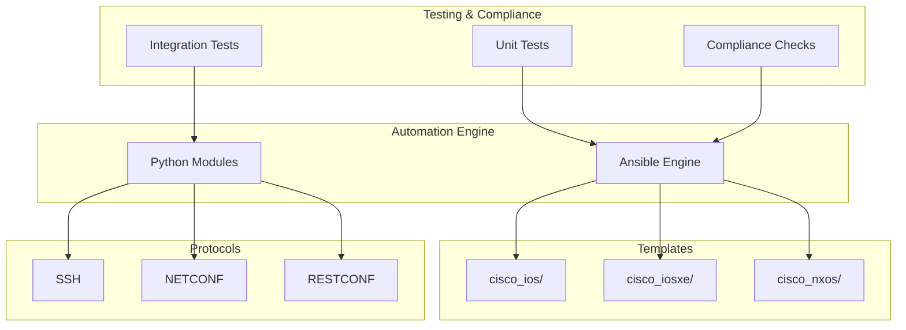
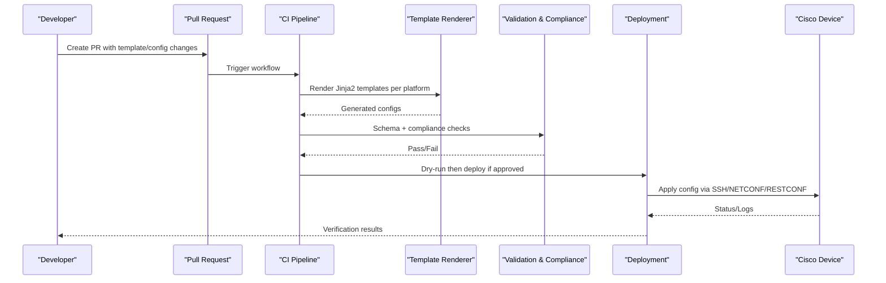
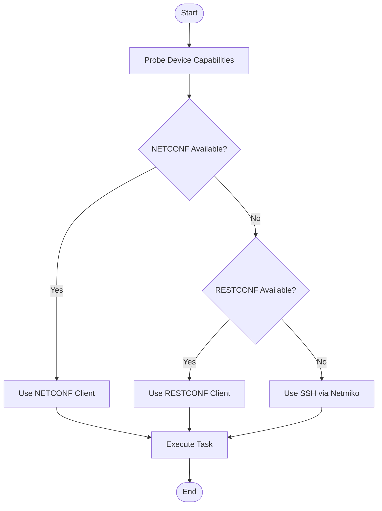
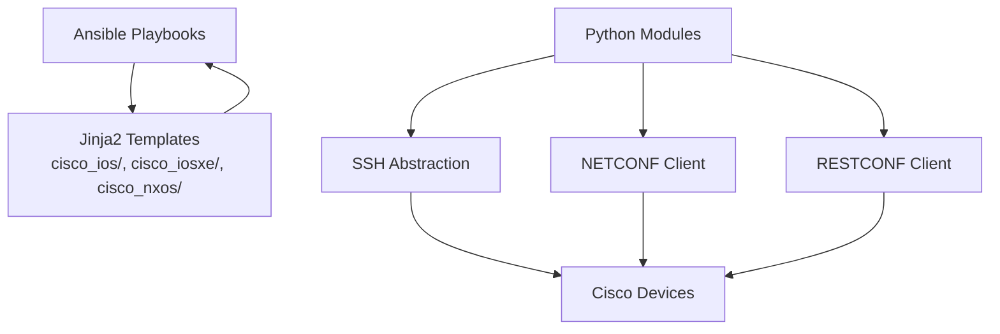

# Cisco Platforms (IOS, IOS-XE, NX-OS)

<cite>
**Referenced Files in This Document**
- [README.md](file://README.md)
</cite>

## Table of Contents
1. [Introduction](#introduction)
2. [Project Structure](#project-structure)
3. [Core Components](#core-components)
4. [Architecture Overview](#architecture-overview)
5. [Detailed Component Analysis](#detailed-component-analysis)
6. [Dependency Analysis](#dependency-analysis)
7. [Performance Considerations](#performance-considerations)
8. [Troubleshooting Guide](#troubleshooting-guide)
9. [Conclusion](#conclusion)
10. [Appendices](#appendices)

## Introduction
This document provides comprehensive guidance for supporting Cisco platforms—IOS, IOS-XE, and NX-OS—within the Enterprise Network Automation Platform. It covers protocol capability matrices, implementation approaches using NAPALM drivers, Netmiko connections, and Nornir plugins, and details how Cisco-specific configurations are managed via Jinja2 templates organized by platform variants. It also explains protocol capability negotiation patterns, feature availability differences across platforms, migration strategies from legacy IOS to modern IOS-XE/NX-OS, practical template development patterns for ACLs, routing protocols, and security policies, device connectivity troubleshooting specific to Cisco platforms, common configuration pitfalls, and best practices for adding new Cisco platform variants within the automation framework.

## Project Structure
The repository organizes vendor-specific Jinja2 templates under a dedicated directory structure. Cisco templates are grouped by platform variant: cisco_ios/, cisco_iosxe/, and cisco_nxos/. The overall architecture includes automation engines (Ansible, Python modules), CI/CD pipelines, testing suites, compliance checks, and observability components.

**Diagram sources**
- [README.md:105-180](file://README.md#L105-L180)
- [README.md:184-200](file://README.md#L184-L200)

**Section sources**
- [README.md:105-180](file://README.md#L105-L180)
- [README.md:184-200](file://README.md#L184-L200)

## Core Components
Cisco platform support is implemented through a combination of automation tools and protocol clients:

- Ansible playbooks orchestrate device lifecycle, network services, routing protocols, high availability, and operations tasks.
- Python modules provide reusable capabilities for inventory management, NETCONF client with capability negotiation, RESTCONF client with YANG model support, SSH abstraction over Netmiko/Paramiko with retry, SNMPv3 polling/traps, telemetry receiver/parser, config generation from structured data, validation, backup, compliance, and utilities.
- Templates under cisco_ios/, cisco_iosxe/, and cisco_nxos/ generate vendor-specific configurations using Jinja2 and YAML structured data.

Key responsibilities:
- Protocol negotiation and selection based on device capabilities.
- Template rendering per platform variant.
- Validation and compliance enforcement before deployment.
- Backup and rollback mechanisms.

**Section sources**
- [README.md:184-200](file://README.md#L184-L200)
- [README.md:438-456](file://README.md#L438-L456)
- [README.md:105-180](file://README.md#L105-L180)

## Architecture Overview
The automation pipeline integrates GitOps, CI/CD, validation, and deployment stages. Cisco devices are managed via SSH, NETCONF, and RESTCONF depending on platform capabilities. Configuration changes are rendered from Jinja2 templates and applied through Ansible or Python modules.

**Diagram sources**
- [README.md:479-514](file://README.md#L479-L514)
- [README.md:184-200](file://README.md#L184-L200)
- [README.md:105-180](file://README.md#L105-L180)

## Detailed Component Analysis

### Protocol Capability Negotiation Patterns
Capability negotiation determines which transport and API methods are available on each device:

- SSH: Universal baseline for CLI-based automation; used by Netmiko/Paramiko abstraction layer.
- NETCONF: Model-driven configuration and state retrieval; supported on IOS-XE and NX-OS where enabled.
- RESTCONF: HTTP-based YANG-driven interface; supported on IOS-XE and NX-OS when configured.

Negotiation flow:
1. Inventory declares device platform and role.
2. Python modules probe device capabilities (e.g., NETCONF/RESTCONF availability).
3. Select optimal transport for task (e.g., NETCONF for structured updates, SSH for CLI-only features).
4. Execute operation with appropriate client and error handling.

**Diagram sources**
- [README.md:438-456](file://README.md#L438-L456)
- [README.md:184-200](file://README.md#L184-L200)

**Section sources**
- [README.md:438-456](file://README.md#L438-L456)
- [README.md:184-200](file://README.md#L184-L200)

### Feature Availability Differences Between Platforms
- IOS: Primarily CLI-driven; limited native NETCONF/RESTCONF support compared to newer platforms.
- IOS-XE: Enhanced model-driven interfaces; supports NETCONF and RESTCONF alongside CLI.
- NX-OS: Strong model-driven support; supports NETCONF and RESTCONF; distinct command syntax and policy models.

Implications:
- Prefer NETCONF/RESTCONF for structured, validated updates where available.
- Fall back to SSH/CLI for features not exposed via YANG or REST APIs.
- Maintain separate template sets per platform to handle syntax and feature differences.

**Section sources**
- [README.md:203-226](file://README.md#L203-L226)
- [README.md:105-180](file://README.md#L105-L180)

### Migration Strategies From Legacy IOS to Modern IOS-XE/NX-OS
- Assess current IOS configurations and identify features that map to IOS-XE/NX-OS equivalents.
- Introduce dual-template strategy: maintain cisco_ios/ for legacy while developing cisco_iosxe/ and cisco_nxos/ templates.
- Gradually migrate workloads:
  - Start with non-disruptive features (NTP, DNS, banners, logging).
  - Migrate routing protocols incrementally with validation and rollback.
  - Adopt model-driven transports (NETCONF/RESTCONF) where possible.
- Use compliance checks and golden configs to ensure parity during transition.

**Section sources**
- [README.md:105-180](file://README.md#L105-L180)
- [README.md:438-456](file://README.md#L438-L456)

### Practical Examples of Template Development Patterns
Patterns for Cisco-specific features:
- ACLs:
  - Define structured ACL entries in YAML.
  - Render ACL blocks per platform variant, accounting for syntax differences between IOS and NX-OS.
- Routing Protocols:
  - Centralize OSPF/BGP parameters in group_vars/host_vars.
  - Generate protocol sections per platform, leveraging shared variables and conditional logic.
- Security Policies:
  - Enforce AAA, SSH hardening, and logging via templates.
  - Ensure compliance checks validate generated outputs.

Best practices:
- Keep templates modular and reusable.
- Use filters and conditionals to handle platform differences.
- Validate templates in CI before deployment.

**Section sources**
- [README.md:105-180](file://README.md#L105-L180)
- [README.md:371-435](file://README.md#L371-L435)

### Device Connectivity Troubleshooting Specific to Cisco Platforms
Common issues and resolutions:
- SSH reachability failures:
  - Verify device IP, firewall rules, and SSH service status.
  - Use ping and SSH tests against target devices.
- NETCONF/RESTCONF misconfiguration:
  - Confirm NETCONF/RESTCONF is enabled and accessible.
  - Validate credentials and TLS settings.
- Template rendering errors:
  - Debug Jinja2 rendering with verbose output.
  - Inspect variable definitions in host_vars/group_vars.
- Compliance check failures:
  - Review running config diffs and policy violations.
  - Adjust templates to meet compliance requirements.

Operational commands referenced:
- Ansible ping test for SSH connectivity.
- Python config generator debug mode for template rendering.

**Section sources**
- [README.md:674-685](file://README.md#L674-L685)
- [README.md:438-456](file://README.md#L438-L456)

### Best Practices for Adding New Cisco Platform Variants
Steps to integrate a new Cisco variant:
- Create a new template directory (e.g., cisco_<variant>/).
- Implement platform-specific templates for core features (ACLs, routing, security).
- Extend inventory schema to recognize the new platform type.
- Add capability probes for NETCONF/RESTCONF if applicable.
- Update CI workflows to render and validate templates for the new variant.
- Include unit and integration tests targeting the new platform.
- Document feature availability and migration notes.

**Section sources**
- [README.md:105-180](file://README.md#L105-L180)
- [README.md:479-514](file://README.md#L479-L514)

## Dependency Analysis
The automation stack depends on Ansible, Python modules, and protocol clients. Cisco platform support relies on template organization and capability negotiation.

**Diagram sources**
- [README.md:105-180](file://README.md#L105-L180)
- [README.md:438-456](file://README.md#L438-L456)

**Section sources**
- [README.md:105-180](file://README.md#L105-L180)
- [README.md:438-456](file://README.md#L438-L456)

## Performance Considerations
- Prefer model-driven transports (NETCONF/RESTCONF) for bulk updates to reduce parsing overhead.
- Batch operations where possible to minimize device interactions.
- Cache capability probes to avoid repeated discovery.
- Optimize template rendering by minimizing complex conditionals and leveraging precomputed variables.

[No sources needed since this section provides general guidance]

## Troubleshooting Guide
- Connection timeouts:
  - Validate SSH reachability using Ansible ping.
- Template rendering errors:
  - Use Python config generator debug mode to inspect rendering issues.
- Compliance failures:
  - Review compliance policies and device config diffs.
- CI pipeline failures:
  - Inspect GitHub Actions logs for actionable errors.
- Vault authentication failures:
  - Verify OIDC tokens or AppRole credentials and Vault policies.
- Molecule test failures:
  - Ensure Docker/Podman is running and check molecule configuration.
- Batfish analysis errors:
  - Validate snapshots and configuration inputs.

**Section sources**
- [README.md:674-685](file://README.md#L674-L685)

## Conclusion
Cisco platform support in the Enterprise Network Automation Platform leverages a robust automation stack combining Ansible, Python modules, and Jinja2 templates organized by platform variants. Protocol capability negotiation ensures optimal transport selection (SSH, NETCONF, RESTCONF), while compliance and validation enforce secure and consistent configurations. By following the outlined patterns and best practices, teams can effectively manage IOS, IOS-XE, and NX-OS devices, migrate from legacy IOS to modern platforms, and extend support to new Cisco variants with confidence.

[No sources needed since this section summarizes without analyzing specific files]

## Appendices

### Protocol Support Matrix for Cisco Platforms
- IOS:
  - SSH: Supported
  - NETCONF: Limited/Conditional
  - RESTCONF: Limited/Conditional
- IOS-XE:
  - SSH: Supported
  - NETCONF: Supported
  - RESTCONF: Supported
- NX-OS:
  - SSH: Supported
  - NETCONF: Supported
  - RESTCONF: Supported

**Section sources**
- [README.md:203-226](file://README.md#L203-L226)
- [README.md:184-200](file://README.md#L184-L200)