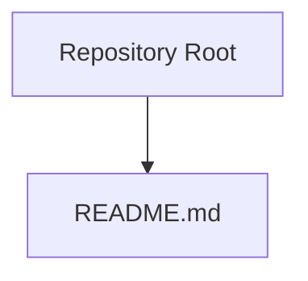
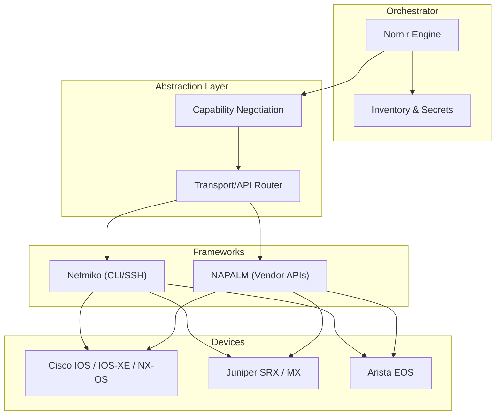
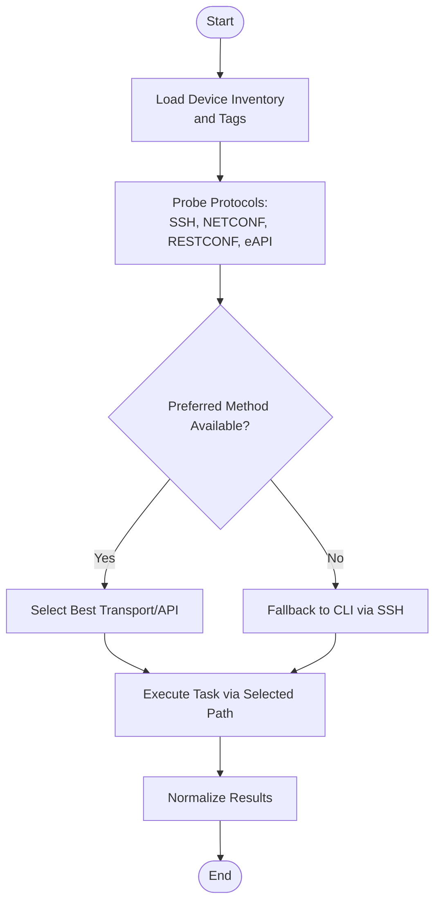
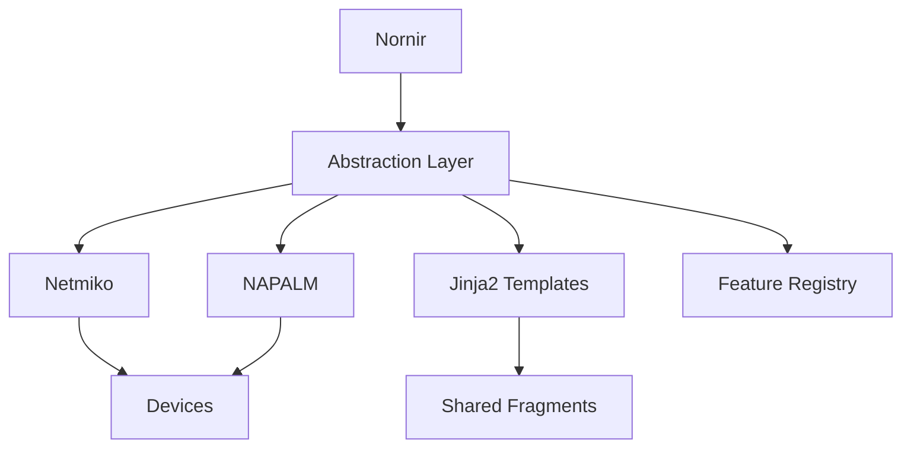
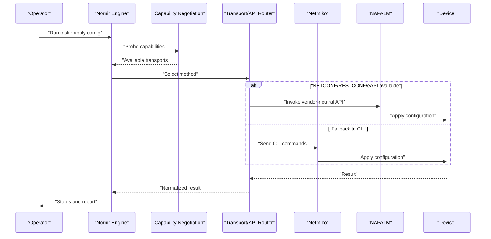

# Core Networking Vendors

<cite>
**Referenced Files in This Document**
- [README.md](file://README.md)
</cite>

## Table of Contents
1. [Introduction](#introduction)
2. [Project Structure](#project-structure)
3. [Core Components](#core-components)
4. [Architecture Overview](#architecture-overview)
5. [Detailed Component Analysis](#detailed-component-analysis)
6. [Dependency Analysis](#dependency-analysis)
7. [Performance Considerations](#performance-considerations)
8. [Troubleshooting Guide](#troubleshooting-guide)
9. [Conclusion](#conclusion)
10. [Appendices](#appendices)

## Introduction
This document defines the core networking vendor support strategy for an Enterprise Network Automation Platform, focusing on Cisco (IOS, IOS-XE, NX-OS), Juniper (SRX, MX), and Arista (EOS). It outlines protocol capability matrices (SSH, NETCONF, RESTCONF, eAPI), multi-vendor abstraction using NAPALM, Netmiko, and Nornir, Jinja2 template organization by vendor/platform, capability negotiation, feature availability matrices, migration strategies between platforms, practical template development patterns, device connectivity troubleshooting, and guidance for adding new platform variants within each vendor family.

## Project Structure
The repository currently contains a top-level README that serves as the project’s entry point. The documentation here provides a reference architecture and implementation plan to be realized in subsequent code modules.

**Diagram sources**
- [README.md](file://README.md)

**Section sources**
- [README.md](file://README.md)

## Core Components
This section describes the conceptual components that will implement multi-vendor network automation across Cisco, Juniper, and Arista devices.

- Vendor Abstraction Layer
  - Purpose: Provide a unified API over multiple vendors and operating systems.
  - Key responsibilities:
    - Protocol selection and capability detection (SSH, NETCONF, RESTCONF, eAPI).
    - Feature availability mapping per platform.
    - Template resolution by vendor/platform.
    - Migration helpers between OS families.

- Transport and Framework Integration
  - Netmiko: CLI-based automation with robust SSH handling and driver matrix.
  - NAPALM: Vendor-neutral configuration and state retrieval APIs.
  - Nornir: Orchestration, inventory management, concurrency, and plugin ecosystem.

- Configuration Templates
  - Jinja2 templates organized by vendor and platform.
  - Shared fragments for common constructs (interfaces, routing, security policies).
  - Version-aware blocks to handle differences across OS releases.

- Capability Negotiation Engine
  - Detects available protocols and features at runtime.
  - Selects optimal transport and API path based on device capabilities.
  - Falls back gracefully when preferred methods are unavailable.

- Inventory and Secrets Management
  - Centralized device inventory with tags, roles, and environment metadata.
  - Secure secrets store integration for credentials and keys.

- Observability and Logging
  - Structured logging for automation tasks.
  - Metrics collection for success rates, latency, and error classification.

[No sources needed since this section provides general guidance]

## Architecture Overview
The following diagram shows how Nornir orchestrates tasks against devices via Netmiko and NAPALM, while a capability negotiation layer selects the best transport and API path.

[No sources needed since this diagram shows conceptual workflow, not actual code structure]

## Detailed Component Analysis

### Protocol Support Matrix
This matrix summarizes typical protocol availability across major platforms. Actual availability depends on device model, software version, and configuration.

- Cisco
  - IOS: SSH; NETCONF limited or unavailable; RESTCONF generally unavailable; eAPI not applicable.
  - IOS-XE: SSH; NETCONF supported; RESTCONF supported; eAPI not applicable.
  - NX-OS: SSH; NETCONF supported; RESTCONF supported; eAPI supported.

- Juniper
  - SRX: SSH; NETCONF supported; RESTCONF supported; eAPI not applicable.
  - MX: SSH; NETCONF supported; RESTCONF supported; eAPI not applicable.

- Arista
  - EOS: SSH; NETCONF supported; RESTCONF supported; eAPI supported.

Notes:
- Prefer NETCONF/RESTCONF where available for structured data and atomic operations.
- Use eAPI on Arista for high-performance JSON-RPC operations.
- Fall back to CLI (Netmiko) when modern transports are disabled or unsupported.

[No sources needed since this section provides general guidance]

### Multi-Vendor Abstraction with NAPALM, Netmiko, and Nornir
- Nornir
  - Manages inventory, concurrency, and task execution.
  - Integrates plugins for discovery, templating, and reporting.

- Netmiko
  - Provides SSH-driven CLI automation with a broad driver matrix.
  - Useful for quick tasks, legacy devices, or when NETCONF/RESTCONF/eAPI are unavailable.

- NAPALM
  - Offers vendor-neutral APIs for get_* and load_replace/load_merge operations.
  - Encapsulates vendor-specific details behind consistent interfaces.

Integration pattern:
- Nornir tasks call into the abstraction layer.
- The abstraction layer negotiates capabilities and routes calls to Netmiko or NAPALM accordingly.
- Results are normalized and returned to callers.

[No sources needed since this section provides general guidance]

### Jinja2 Template Organization by Vendor/Platform
Recommended directory layout:
- templates/cisco/ios/
- templates/cisco/iosxe/
- templates/cisco/nxos/
- templates/juniper/srx/
- templates/juniper/mx/
- templates/arista/eos/
- templates/shared/ (common fragments)

Template development patterns:
- Use conditional blocks for OS/version differences.
- Leverage shared fragments for reusable constructs (e.g., interface definitions, ACLs).
- Maintain a canonical data model for inputs to keep templates portable.
- Validate generated configurations before applying them.

[No sources needed since this section provides general guidance]

### Protocol Capability Negotiation Flow

[No sources needed since this diagram shows conceptual workflow, not actual code structure]

### Feature Availability Matrices
Feature availability varies by platform and release. Maintain a feature registry keyed by vendor/platform/version ranges. Examples include:
- Routing protocols (BGP, OSPF, IS-IS)
- Security policies (ACLs, zone-based firewall, security policies)
- Telemetry and streaming telemetry
- Segment routing and MPLS features
- Virtualization (VRFs, L3VPN, VXLAN/NVO3)

Use the registry to gate template rendering and to inform migration paths.

[No sources needed since this section provides general guidance]

### Migration Strategies Between Platforms
General approach:
- Inventory and assess current state on source platform.
- Map features to target platform equivalents using the feature registry.
- Generate target configuration via Jinja2 templates with version-aware blocks.
- Dry-run validation and staged rollout with rollback plans.
- Post-migration verification using automated checks and telemetry.

Example scenarios:
- Cisco IOS to IOS-XE: Enable NETCONF/RESTCONF, migrate ACLs and route maps, validate BGP/OSPF behavior.
- Juniper SRX to MX: Align policy syntax, adjust zones/interfaces, verify session table behavior.
- Arista EOS upgrades: Preserve eAPI endpoints, validate ACLs and VLANs, ensure telemetry streams remain active.

[No sources needed since this section provides general guidance]

### Practical Template Development Patterns
- Canonical input model: Define a schema for inputs (interfaces, routing, policies) used across all vendor templates.
- Conditional rendering: Use version checks and feature flags to enable/disable blocks.
- Fragment reuse: Split complex configs into small, testable fragments.
- Validation hooks: Integrate dry-run and linting steps before deployment.
- Documentation comments: Keep inline notes explaining vendor-specific nuances.

[No sources needed since this section provides general guidance]

### Device Connectivity Troubleshooting
Common issues and resolutions:
- Authentication failures: Verify credentials, key types, and account privileges.
- Protocol mismatches: Ensure NETCONF/RESTCONF/eAPI are enabled and permitted by ACLs.
- Timeouts and rate limits: Adjust timeouts, throttle requests, and use connection pooling.
- Certificate issues (NETCONF/RESTCONF): Validate CA chains and certificate validity.
- Platform quirks: Confirm driver compatibility and OS-specific behaviors.

Diagnostic checklist:
- Ping/Telnet reachability and port status.
- SSH login with verbose logging.
- NETCONF hello and RPC echo tests.
- RESTCONF GET on well-known URIs.
- eAPI ping and show commands via JSON-RPC.

[No sources needed since this section provides general guidance]

### Adding New Platform Variants Within Each Vendor Family
Steps:
- Identify OS family and variant (e.g., Cisco IOS-XE 16.x vs 17.x).
- Update capability probes to detect new features and versions.
- Add or extend Jinja2 templates under the appropriate vendor/platform directory.
- Extend the feature registry with mappings for the new variant.
- Write unit/integration tests for template rendering and API interactions.
- Document any migration considerations and known limitations.

[No sources needed since this section provides general guidance]

## Dependency Analysis
Conceptual dependency relationships among components:
- Nornir depends on inventory and secrets stores.
- Abstraction layer depends on Netmiko and NAPALM drivers.
- Templates depend on shared fragments and feature registry.
- Devices depend on enabled transports and configured credentials.

[No sources needed since this diagram shows conceptual workflow, not actual code structure]

## Performance Considerations
- Concurrency: Use Nornir’s parallelism judiciously to avoid overwhelming devices.
- Connection reuse: Pool connections where possible (especially for CLI sessions).
- Batch operations: Group changes to minimize round trips.
- Caching: Cache capability results and device facts to reduce probing overhead.
- Backoff and retries: Implement exponential backoff for transient errors.
- Streaming telemetry: Prefer streaming metrics over polling for large-scale monitoring.

[No sources needed since this section provides general guidance]

## Troubleshooting Guide
Systematic approach:
- Isolate scope: Single device vs. group-wide issues.
- Validate inventory and secrets: Ensure correct hostnames, IPs, and credentials.
- Inspect logs: Review structured logs for errors and warnings.
- Reproduce minimally: Run a simple command or GET operation to confirm baseline connectivity.
- Compare baselines: Use diffs between intended and actual states.
- Rollback: Apply safe rollbacks using saved snapshots or previous configurations.

[No sources needed since this section provides general guidance]

## Conclusion
This document establishes a comprehensive strategy for supporting Cisco, Juniper, and Arista platforms within an enterprise automation framework. By combining Nornir orchestration, Netmiko CLI automation, and NAPALM vendor-neutral APIs—augmented with capability negotiation, Jinja2 templates, and a feature registry—the platform can deliver reliable, scalable, and maintainable multi-vendor automation. The provided patterns and checklists facilitate rapid onboarding of new platform variants and smooth migrations across OS families.

[No sources needed since this section summarizes without analyzing specific files]

## Appendices

### Appendix A: Example Workflow Sequence

[No sources needed since this diagram shows conceptual workflow, not actual code structure]