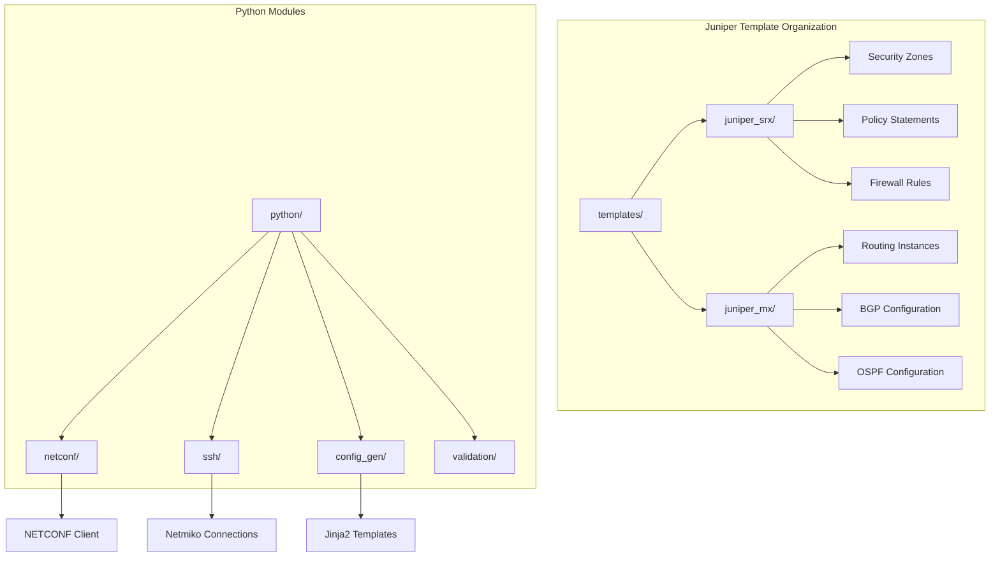
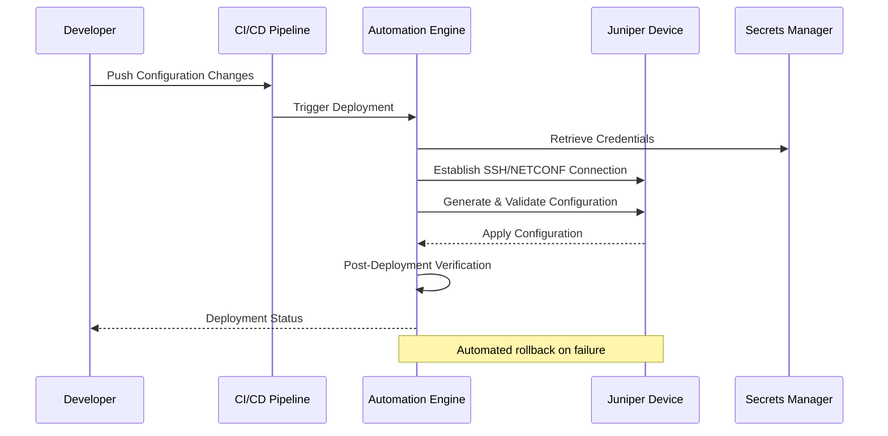
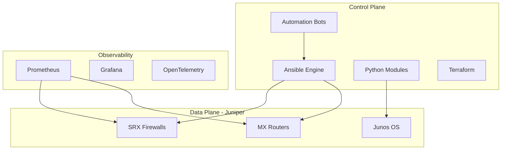
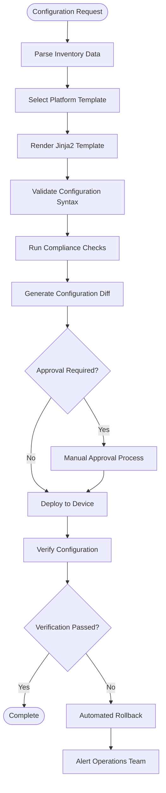
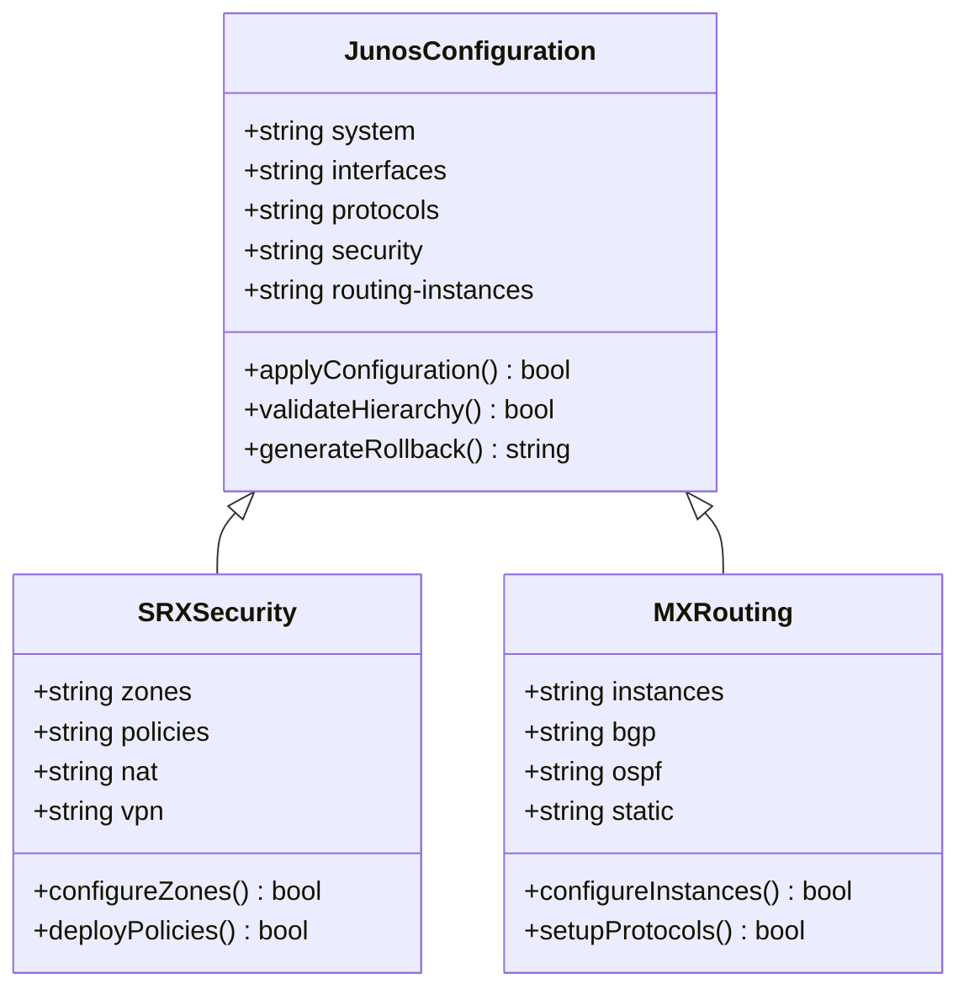
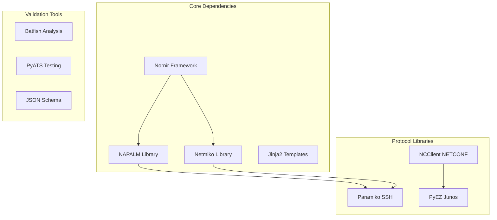

# Juniper Platforms (SRX, MX)

<cite>
**Referenced Files in This Document**
- [README.md](file://README.md)
</cite>

## Table of Contents
1. [Introduction](#introduction)
2. [Project Structure](#project-structure)
3. [Core Components](#core-components)
4. [Architecture Overview](#architecture-overview)
5. [Detailed Component Analysis](#detailed-component-analysis)
6. [Dependency Analysis](#dependency-analysis)
7. [Performance Considerations](#performance-considerations)
8. [Troubleshooting Guide](#troubleshooting-guide)
9. [Conclusion](#conclusion)
10. [Appendices](#appendices)

## Introduction

This document provides comprehensive coverage of Juniper platform support within the Enterprise Network Automation Platform, specifically focusing on SRX and MX series devices. The platform implements a production-grade, vendor-agnostic approach to network automation using Infrastructure as Code principles, GitOps workflows, and modern automation frameworks.

The Enterprise Network Automation Platform supports Juniper SRX firewalls and MX routers through multiple protocol capabilities including SSH and NETCONF, leveraging industry-standard tools like NAPALM, Netmiko, and Nornir for device management. The implementation follows best practices for enterprise-scale network automation with comprehensive testing, compliance enforcement, and observability.

## Project Structure

The platform organizes Juniper-specific configurations through dedicated template directories and Python modules:



**Diagram sources**
- [README.md:116-128](file://README.md#L116-L128)

**Section sources**
- [README.md:103-180](file://README.md#L103-L180)

## Core Components

### Protocol Support Matrix

The platform provides comprehensive protocol support for Juniper platforms:

| Protocol | SRX Series | MX Series | Implementation |
|----------|------------|-----------|----------------|
| SSH | ✅ Supported | ✅ Supported | Netmiko-based connections with retry logic |
| NETCONF | ✅ Supported | ✅ Supported | Native NETCONF client with capability negotiation |
| RESTCONF | ⚠️ Limited | ✅ Supported | YANG model-based configuration |
| SNMPv3 | ✅ Supported | ✅ Supported | Polling and trap handling |

### Technology Stack Integration

The platform integrates multiple automation frameworks:

- **NAPALM**: Vendor abstraction layer for consistent API access
- **Netmiko**: SSH-based device connectivity with Junos driver
- **Nornir**: Multi-threaded automation framework for large-scale deployments
- **Ansible**: Playbook orchestration and configuration management
- **Jinja2**: Template engine for dynamic configuration generation

**Section sources**
- [README.md:184-199](file://README.md#L184-L199)
- [README.md:203-217](file://README.md#L203-L217)

## Architecture Overview

The Juniper platform integration follows a layered architecture pattern:



**Diagram sources**
- [README.md:36-50](file://README.md#L36-L50)

### Control Plane Architecture



**Diagram sources**
- [README.md:54-99](file://README.md#L54-L99)

## Detailed Component Analysis

### Template Management System

The platform organizes Juniper templates by platform type:

#### SRX Firewall Templates (`juniper_srx/`)
- Security zone definitions and interface assignments
- Policy statements and firewall rules
- NAT configurations and security policies
- VPN tunnel configurations
- High availability settings

#### MX Router Templates (`juniper_mx/`)
- Routing instances and VRFs
- BGP and OSPF protocol configurations
- Interface and VLAN configurations
- QoS and traffic shaping policies
- Telemetry and monitoring setup

### Configuration Generation Pipeline



**Diagram sources**
- [README.md:479-501](file://README.md#L479-L501)

### NETCONF/YANG Model Usage

The platform leverages NETCONF for advanced Juniper device management:

- **Capability Negotiation**: Automatic detection of supported NETCONF capabilities
- **YANG Model Integration**: Structured data exchange using standard YANG models
- **Atomic Operations**: Transactional configuration updates with rollback support
- **Streaming Telemetry**: Real-time device state monitoring via NETCONF subscriptions

### Junos Configuration Hierarchy

The platform respects Junos hierarchical configuration structure:



**Diagram sources**
- [README.md:116-128](file://README.md#L116-L128)

### Feature Availability Differences

| Feature Category | SRX Series | MX Series | Notes |
|-----------------|------------|-----------|-------|
| Advanced Routing | Basic | Full | MX supports full routing suite |
| Security Features | Full | Basic | SRX optimized for security functions |
| Performance | Medium | High | MX designed for high-throughput routing |
| Virtualization | Limited | Extensive | MX supports multiple routing instances |
| Telemetry | Basic | Advanced | MX offers comprehensive telemetry options |

## Dependency Analysis

### External Dependencies

The Juniper platform integration relies on several key external libraries:



**Diagram sources**
- [README.md:184-199](file://README.md#L184-L199)

### Module Coupling Analysis

The platform maintains loose coupling between components:

- **Abstraction Layers**: NAPALM provides vendor-neutral APIs
- **Plugin Architecture**: Nornir allows easy addition of new drivers
- **Template Isolation**: Jinja2 templates are independent of connection methods
- **Configuration Validation**: Separate validation pipeline ensures integrity

**Section sources**
- [README.md:438-456](file://README.md#L438-L456)

## Performance Considerations

### Scalability Patterns

The platform implements several performance optimization strategies:

- **Multi-threading**: Nornir's concurrent execution model
- **Connection Pooling**: Reuse SSH/NETCONF connections where possible
- **Batch Operations**: Group related configuration changes
- **Asynchronous Processing**: Non-blocking operations for long-running tasks

### Resource Optimization

- **Memory Management**: Efficient parsing of large configuration files
- **Network Efficiency**: Minimize round-trips during configuration deployment
- **Caching Strategies**: Cache device capabilities and inventory data
- **Retry Logic**: Intelligent retry mechanisms for transient failures

## Troubleshooting Guide

### Common Connectivity Issues

| Issue | Symptoms | Resolution |
|-------|----------|------------|
| SSH Authentication Failure | Connection timeout, authentication errors | Verify credentials in secrets manager, check SSH key permissions |
| NETCONF Capability Mismatch | Protocol negotiation failures | Check device NETCONF support, verify version compatibility |
| Configuration Syntax Errors | Template rendering failures | Use `python -m python.config_gen --debug` for detailed error output |
| Compliance Check Failures | Policy violations detected | Review compliance policies and device configuration |

### Juniper-Specific Troubleshooting

#### SSH Connection Issues
- Verify SSH service is enabled on Juniper devices
- Check user account permissions and role-based access control
- Ensure proper SSH key configuration and host key verification

#### NETCONF Configuration Problems
- Validate NETCONF server configuration on target devices
- Check XML schema validation for NETCONF payloads
- Monitor device logs for NETCONF session errors

#### Template Rendering Errors
- Use debug mode to identify template syntax issues
- Validate variable structures against expected schemas
- Test templates against mock device data before deployment

**Section sources**
- [README.md:674-685](file://README.md#L674-L685)

### Best Practices for Junos Configuration Management

#### Commit and Rollback Strategy
- **Atomic Commits**: Use transactional commits for related configuration changes
- **Automatic Rollback**: Configure automatic rollback on verification failures
- **Change Tracking**: Maintain audit trails for all configuration modifications
- **Staged Deployment**: Implement phased rollouts for critical changes

#### Configuration Validation
- **Pre-deployment Validation**: Run syntax and semantic checks before applying changes
- **Post-deployment Verification**: Validate operational state after configuration application
- **Compliance Enforcement**: Ensure configurations meet organizational standards
- **Drift Detection**: Monitor for unauthorized configuration changes

## Conclusion

The Enterprise Network Automation Platform provides comprehensive support for Juniper SRX and MX series devices through a robust, scalable architecture. The platform leverages industry-standard tools and frameworks while maintaining vendor-agnostic design principles. Key strengths include:

- **Multi-protocol Support**: SSH and NETCONF connectivity with capability negotiation
- **Template-driven Management**: Organized Jinja2 templates for platform-specific features
- **Enterprise-grade Reliability**: Comprehensive testing, validation, and rollback mechanisms
- **Scalable Architecture**: Designed for managing thousands of devices across multi-region environments

The implementation follows modern DevOps practices with GitOps workflows, automated testing, and continuous compliance enforcement, making it suitable for production environments requiring high reliability and security standards.

## Appendices

### Quick Reference Commands

```bash
# Generate configuration for Juniper devices
python -m python.config_gen --device <device-name> --output ./output/

# Run compliance checks
python -m python.compliance --inventory inventories/lab/hosts.yml

# Execute unit tests
pytest tests/unit/ -v

# Validate environment setup
python scripts/validate_environment.py
```

### Platform Compatibility Matrix

| Platform | Minimum Version | Recommended Version | Features |
|----------|----------------|-------------------|----------|
| SRX 200 Series | Junos 15.1 | Junos 20.4+ | Full feature support |
| SRX 400 Series | Junos 15.1 | Junos 20.4+ | Full feature support |
| SRX 5000 Series | Junos 15.1 | Junos 20.4+ | Full feature support |
| MX 480 | Junos 12.3 | Junos 20.4+ | Full feature support |
| MX 960 | Junos 12.3 | Junos 20.4+ | Full feature support |
| MX 240 | Junos 12.3 | Junos 20.4+ | Full feature support |