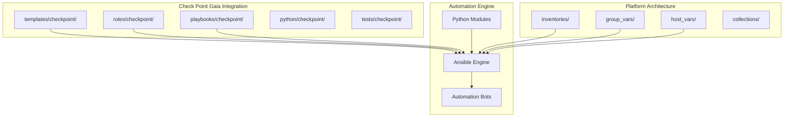
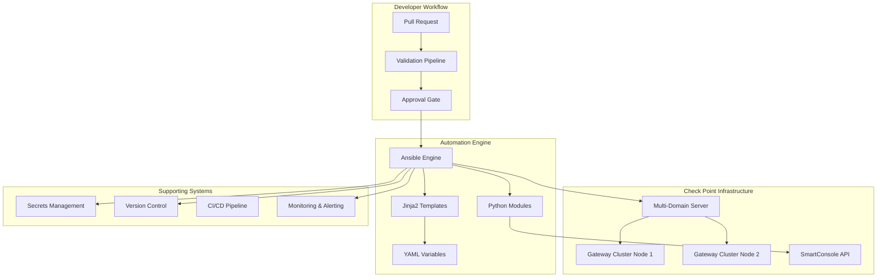
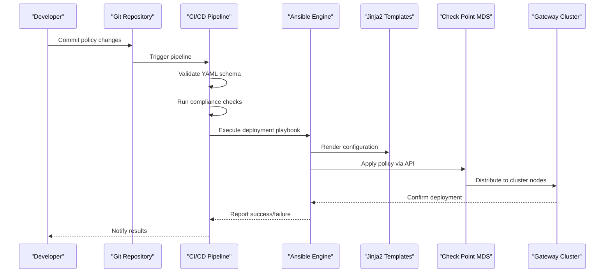
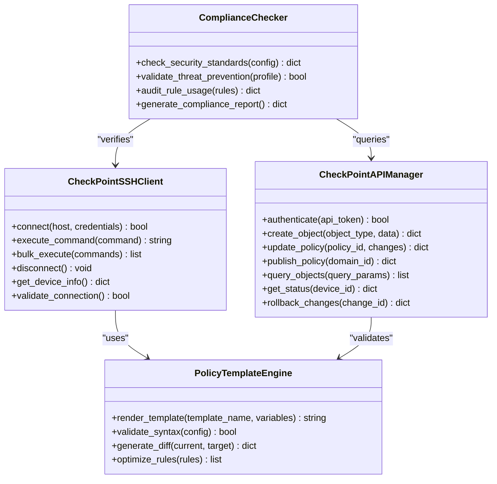
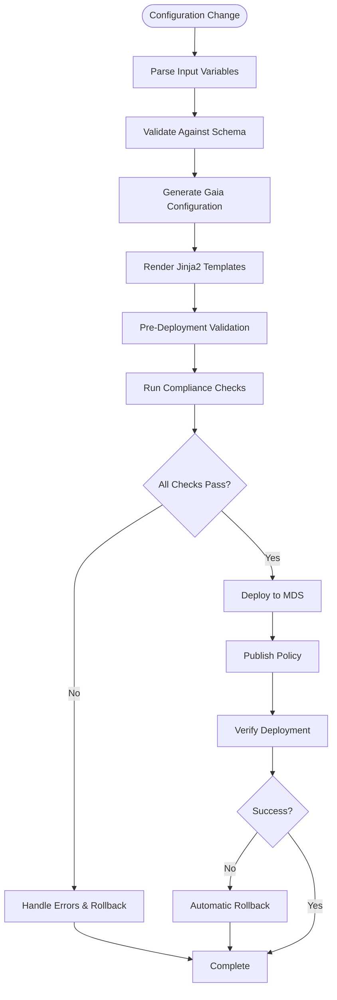
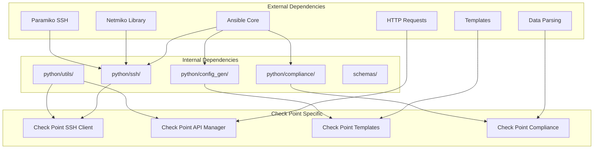

# Check Point (Gaia)

<cite>
**Referenced Files in This Document**
- [README.md](file://README.md)
</cite>

## Table of Contents
1. [Introduction](#introduction)
2. [Project Structure](#project-structure)
3. [Core Components](#core-components)
4. [Architecture Overview](#architecture-overview)
5. [Detailed Component Analysis](#detailed-component-analysis)
6. [Dependency Analysis](#dependency-analysis)
7. [Performance Considerations](#performance-considerations)
8. [Troubleshooting Guide](#troubleshooting-guide)
9. [Conclusion](#conclusion)
10. [Appendices](#appendices)

## Introduction

This document provides comprehensive coverage of Check Point Gaia OS firewall automation support within the Enterprise Network Automation Platform. The platform implements a production-grade, vendor-agnostic approach to managing Check Point firewalls alongside other enterprise networking equipment including Cisco, Juniper, Palo Alto, Fortinet, and cloud providers.

The Check Point Gaia integration leverages the platform's modular architecture to provide automated security policy management, SSH connectivity, SmartConsole API integration, template-based configuration generation, compliance enforcement, and GitOps workflows. This enables enterprises to manage thousands of Check Point firewalls across multi-domain server (MDS) environments with high availability and cluster configurations.

## Project Structure

The Check Point Gaia automation follows the platform's established directory structure pattern, with dedicated directories for templates, roles, playbooks, and Python modules specifically designed for Check Point devices.



**Diagram sources**
- [README.md:103-180](file://README.md#L103-L180)

**Section sources**
- [README.md:103-180](file://README.md#L103-L180)

## Core Components

The Check Point Gaia automation platform consists of several core components that work together to provide comprehensive firewall management capabilities:

### Template System
Jinja2-based templates under `templates/checkpoint/` generate Gaia-specific configurations for security policies, network objects, services, and threat prevention settings. These templates follow the platform's structured data approach using YAML variables.

### Ansible Roles
Reusable Ansible roles under `roles/checkpoint/` encapsulate common operations such as policy deployment, object management, and compliance checks. Each role follows idempotent design principles and includes proper error handling.

### Python Automation Modules
Custom Python modules under `python/checkpoint/` provide specialized functionality for Check Point APIs, SSH automation, and policy validation. These modules integrate with the platform's existing SSH abstraction layer.

### Compliance Framework
Integration with the platform's compliance engine ensures Check Point configurations meet organizational security standards through automated policy checks and remediation workflows.

**Section sources**
- [README.md:115-141](file://README.md#L115-L141)
- [README.md:438-456](file://README.md#L438-L456)

## Architecture Overview

The Check Point Gaia automation architecture integrates seamlessly with the platform's multi-vendor automation framework while providing vendor-specific optimizations for Check Point's object-oriented policy model.



**Diagram sources**
- [README.md:34-99](file://README.md#L34-L99)

The architecture supports both direct SSH connections to individual gateways and centralized management through Multi-Domain Server (MDS) environments, enabling scalable deployment across large enterprise networks.

## Detailed Component Analysis

### Security Policy Automation

The platform implements comprehensive security policy automation for Check Point Gaia, covering all aspects of the object-oriented policy model:

#### Network Objects Management
Automated creation and management of IP addresses, networks, hosts, and address ranges with proper naming conventions and metadata tagging.

#### Services Configuration
Dynamic service object creation including TCP/UDP ports, application signatures, and custom protocol definitions with version control integration.

#### Ruleset Deployment
Intelligent rule deployment with dependency resolution, conflict detection, and optimization recommendations. Supports both manual and automated rule ordering.

#### Threat Prevention Policies
Automated deployment of threat prevention profiles, IPS rules, anti-bot policies, and SSL inspection configurations with compliance validation.



**Diagram sources**
- [README.md:479-514](file://README.md#L479-L514)

### SSH and SmartConsole API Connectivity

The platform provides dual connectivity patterns for Check Point devices:

#### SSH-Based Automation
Direct SSH connections using the platform's Netmiko/Paramiko abstraction layer with retry logic, connection pooling, and session management optimized for Check Point's command-line interface.

#### SmartConsole API Integration
RESTful API access to Check Point's management interfaces for advanced operations including policy publishing, object queries, and real-time status monitoring.



**Diagram sources**
- [README.md:438-456](file://README.md#L438-L456)

### Template Structure for Gaia Configurations

The template system supports complex Check Point deployment scenarios:

#### Multi-Domain Server (MDS) Environments
Templates handle domain-specific configurations, shared objects, and cross-domain policy distribution with proper isolation and access controls.

#### Gateway Clusters
High-availability cluster configurations with automatic failover settings, synchronization parameters, and health check monitoring.

#### High Availability Setups
Comprehensive HA configurations including state synchronization, heartbeat monitoring, and automatic recovery procedures.



**Diagram sources**
- [README.md:479-514](file://README.md#L479-L514)

### Certificate Management for HTTPS Inspection

Automated certificate lifecycle management for SSL/TLS inspection including:
- Certificate generation and signing
- Automatic renewal before expiration
- Distribution to gateway clusters
- Verification and rollback capabilities

### Compliance Checking Against Security Standards

Integration with the platform's compliance engine provides automated checking against Check Point security standards including:
- Default deny policies
- Explicit allow-only rules
- Approved cipher suites
- Logging and audit requirements
- Access control best practices

### Management Server Integration

Seamless integration with Check Point Management Server for:
- Policy versioning and change tracking
- Automated rollback capabilities
- Audit trail maintenance
- Backup and disaster recovery

**Section sources**
- [README.md:115-141](file://README.md#L115-L141)
- [README.md:371-435](file://README.md#L371-L435)
- [README.md:438-456](file://README.md#L438-L456)

## Dependency Analysis

The Check Point Gaia integration maintains loose coupling with the broader platform architecture while leveraging shared infrastructure components.



**Diagram sources**
- [README.md:438-456](file://README.md#L438-L456)

**Section sources**
- [README.md:438-456](file://README.md#L438-L456)

## Performance Considerations

The Check Point Gaia automation is designed for enterprise-scale deployments with performance optimizations including:

- **Connection Pooling**: Reuse SSH connections across multiple operations
- **Parallel Execution**: Concurrent policy deployment across gateway clusters
- **Incremental Updates**: Only deploy changed objects and rules
- **Caching**: Cache device information and API responses
- **Batch Operations**: Group related API calls for efficiency
- **Timeout Management**: Configure appropriate timeouts for large policy sets

## Troubleshooting Guide

Common issues and resolutions for Check Point Gaia automation:

### Connection Issues
- Verify SSH reachability and firewall rules
- Check credential validity and permissions
- Validate API endpoint accessibility
- Review timeout and retry configurations

### Policy Deployment Failures
- Check policy syntax and object references
- Verify domain permissions and access controls
- Review cluster synchronization status
- Examine audit logs for detailed error information

### Compliance Check Failures
- Review specific policy violations
- Check approved baseline configurations
- Validate template variable values
- Ensure proper environment targeting

**Section sources**
- [README.md:674-685](file://README.md#L674-L685)

## Conclusion

The Check Point Gaia automation implementation within the Enterprise Network Automation Platform provides a comprehensive, production-ready solution for managing Check Point firewalls at scale. The platform's modular architecture, combined with Check Point-specific optimizations, enables organizations to automate their entire firewall lifecycle from development through production deployment while maintaining strict compliance and security standards.

Key benefits include:
- **Scalability**: Support for thousands of Check Point devices across MDS environments
- **Reliability**: Robust error handling, rollback capabilities, and verification processes
- **Compliance**: Automated policy enforcement and continuous compliance monitoring
- **Efficiency**: Template-driven automation with intelligent optimization
- **Security**: Secure secret management and audit trail maintenance

## Appendices

### Quick Start Commands

```bash
# Deploy Check Point security policy
ansible-playbook playbooks/checkpoint/deploy_policy.yml \
  -i inventories/production/hosts.yml \
  --extra-vars "@policy_variables.yml"

# Run compliance scan
ansible-playbook playbooks/checkpoint/compliance_scan.yml \
  -i inventories/production/hosts.yml

# Backup current configuration
ansible-playbook playbooks/checkpoint/backup_config.yml \
  -i inventories/production/hosts.yml
```

### Environment Variables

Required environment variables for Check Point automation:
- `CHECKPOINT_API_TOKEN`: SmartConsole API authentication token
- `CHECKPOINT_MDS_HOST`: Multi-Domain Server hostname or IP
- `CHECKPOINT_DOMAIN_ID`: Target domain identifier
- `VAULT_ADDR`: HashiCorp Vault server address
- `VAULT_TOKEN`: Vault authentication token

**Section sources**
- [README.md:229-280](file://README.md#L229-L280)