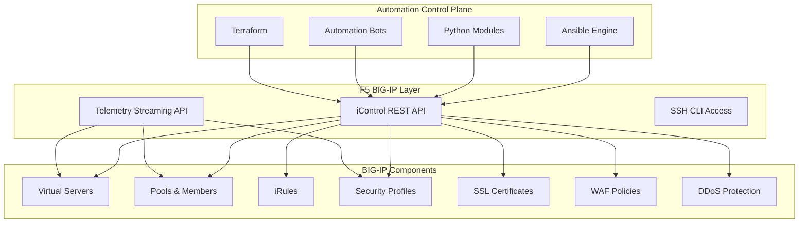
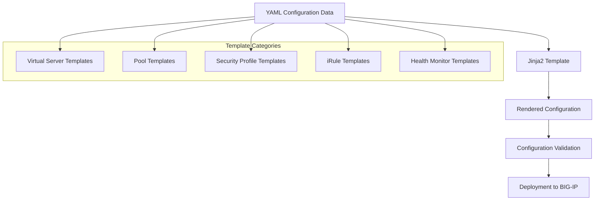
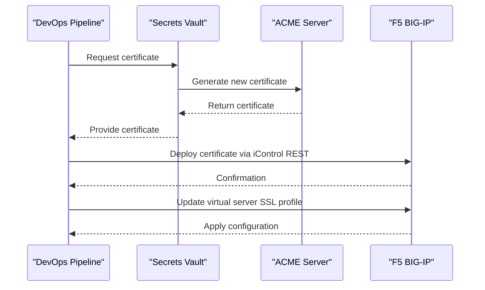
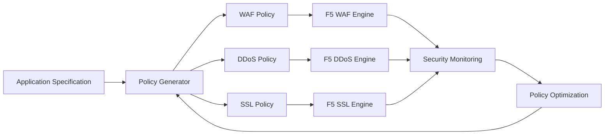
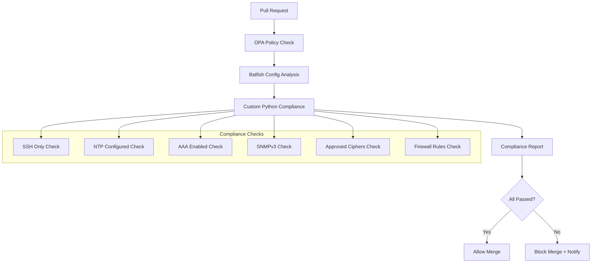
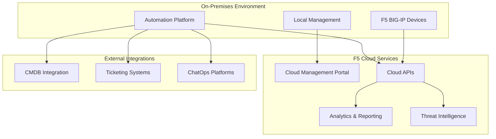
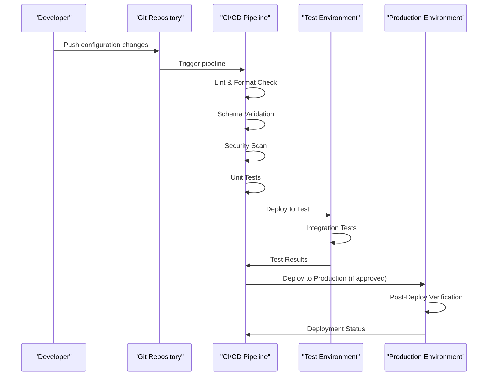
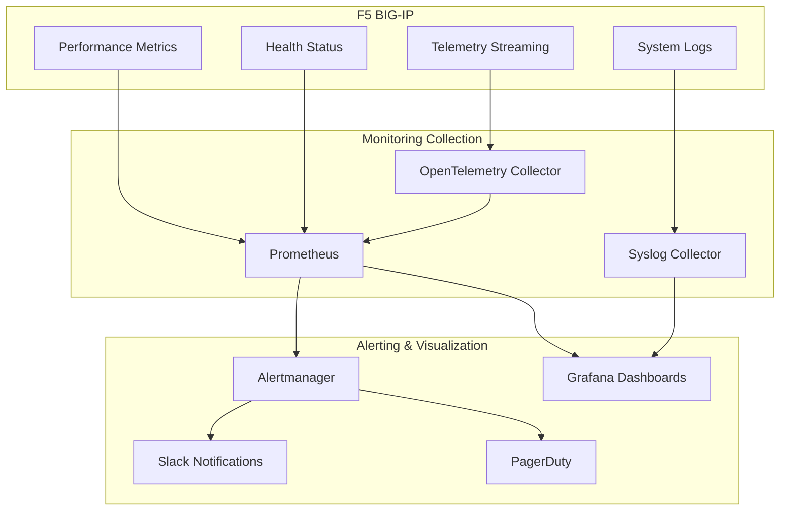

# F5 BIG-IP Load Balancer and Security Appliance Automation

<cite>
**Referenced Files in This Document**
- [README.md](file://README.md)
</cite>

## Table of Contents
1. [Introduction](#introduction)
2. [F5 BIG-IP Integration Overview](#f5-big-ip-integration-overview)
3. [iControl REST API Architecture](#icontrol-rest-api-architecture)
4. [Template Architecture for BIG-IP Configurations](#template-architecture-for-big-ip-configurations)
5. [Automation Patterns for Security and Performance](#automation-patterns-for-security-and-performance)
6. [SSL/TLS Termination Automation](#ssltls-termination-automation)
7. [WAF Policies and DDoS Protection](#waf-policies-and-ddos-protection)
8. [Certificate Management and Deployment](#certificate-management-and-deployment)
9. [Traffic Policy Updates and Compliance Validation](#traffic-policy-updates-and-compliance-validation)
10. [F5 Cloud Services Integration](#f5-cloud-services-integration)
11. [DevOps Pipeline Integration](#devops-pipeline-integration)
12. [Monitoring and Health Checks](#monitoring-and-health-checks)
13. [Troubleshooting Guide](#troubleshooting-guide)
14. [Best Practices and Recommendations](#best-practices-and-recommendations)

## Introduction

This document provides comprehensive guidance for automating F5 BIG-IP load balancer and security appliance management using the Enterprise Network Automation Platform. The platform supports F5 BIG-IP devices through SSH and iControl REST APIs, enabling full lifecycle automation including configuration management, health monitoring, security policy deployment, and compliance validation.

The automation framework follows Infrastructure as Code (IaC) principles, storing all BIG-IP configurations, templates, and policies in Git with automated validation, testing, and deployment through CI/CD pipelines.

## F5 BIG-IP Integration Overview

The Enterprise Network Automation Platform provides comprehensive F5 BIG-IP support as part of its multi-vendor network automation strategy. F5 BIG-IP devices are integrated into the control plane alongside routers, switches, firewalls, and VPN gateways.

### Supported F5 Capabilities

| Capability | Protocol | Status | Description |
|---|---|---|---|
| Configuration Management | iControl REST API | Supported | Full CRUD operations for virtual servers, pools, iRules, and profiles |
| Health Monitoring | iControl REST API | Supported | Real-time health checks and status monitoring |
| Security Policies | iControl REST API | Supported | WAF, DDoS protection, and SSL/TLS policy management |
| Traffic Management | iControl REST API | Supported | Virtual server configuration and traffic routing |
| Certificate Management | iControl REST API | Supported | SSL certificate deployment and rotation |
| Telemetry Streaming | Telemetry Streaming API | Supported | Real-time metrics and performance data collection |

### Integration Architecture

**Diagram sources**
- [README.md:52-99](file://README.md#L52-L99)
- [README.md:203-218](file://README.md#L203-L218)

**Section sources**
- [README.md:52-99](file://README.md#L52-L99)
- [README.md:203-218](file://README.md#L203-L218)

## iControl REST API Architecture

The iControl REST API serves as the primary interface for F5 BIG-IP automation, providing comprehensive access to all device functionality through standardized HTTP endpoints.

### API Authentication and Security

The platform implements secure authentication mechanisms for iControl REST API access:

- **Authentication Methods**: Basic authentication, OAuth 2.0, and certificate-based authentication
- **Secrets Management**: Integration with HashiCorp Vault, AWS Secrets Manager, and Azure Key Vault
- **Session Management**: Automated session handling with retry logic and timeout management
- **Rate Limiting**: Built-in throttling to prevent API overload

### Core API Endpoints

| Endpoint Category | Base Path | Purpose |
|---|---|---|
| System Management | `/mgmt/tm/sys/` | Device configuration and system settings |
| Network Objects | `/mgmt/tm/net/` | VLANs, self-IPs, routes, and interfaces |
| Application Delivery | `/mgmt/tm/ltm/` | Virtual servers, pools, monitors, and profiles |
| Security | `/mgmt/tm/security/` | WAF, DDoS protection, and SSL/TLS policies |
| iRules | `/mgmt/tm/ltm/rule/` | iRule creation and management |
| Templates | `/mgmt/shared/iapp/template/` | iApp template management |

### API Client Implementation

The Python modules provide a robust client layer for iControl REST API interactions:

- **Connection Pooling**: Efficient connection reuse for high-throughput operations
- **Retry Logic**: Automatic retry with exponential backoff for transient failures
- **Error Handling**: Comprehensive error classification and recovery strategies
- **Logging**: Detailed request/response logging for debugging and audit trails

**Section sources**
- [README.md:438-456](file://README.md#L438-L456)

## Template Architecture for BIG-IP Configurations

The platform uses Jinja2 templates combined with structured YAML data to generate consistent and maintainable BIG-IP configurations.

### Template Structure

### Virtual Server Templates

Virtual server templates define the core application delivery configuration:

- **HTTP/HTTPS Virtual Servers**: Standard web application load balancing
- **TCP/UDP Virtual Servers**: Custom protocol load balancing
- **SSL Offloading**: Centralized SSL/TLS termination
- **Content Switching**: Advanced traffic routing based on content inspection

### Pool and Member Templates

Pool templates manage backend server groups and member configuration:

- **Load Balancing Algorithms**: Round-robin, least connections, fastest node
- **Member Health Monitoring**: Integrated health check configuration
- **Weight and Priority**: Dynamic traffic distribution control
- **Persistence Settings**: Session persistence and affinity rules

### Security Profile Templates

Security profile templates provide standardized security configurations:

- **SSL/TLS Profiles**: Cipher suites, protocol versions, and certificate validation
- **Client SSL Profiles**: Client certificate authentication and validation
- **Server SSL Profiles**: Backend server SSL configuration
- **HTTP Profiles**: Request/response modification and optimization

### iRule Templates

iRule templates enable custom traffic manipulation logic:

- **Traffic Routing**: Conditional routing based on headers, URLs, or cookies
- **Request Modification**: Header injection, URL rewriting, and content transformation
- **Security Enforcement**: Rate limiting, IP filtering, and request validation
- **Custom Logging**: Enhanced logging and telemetry collection

**Section sources**
- [README.md:116-128](file://README.md#L116-L128)
- [README.md:438-456](file://README.md#L438-L456)

## Automation Patterns for Security and Performance

The platform implements several automation patterns specifically designed for F5 BIG-IP security and performance optimization.

### Security Baseline Automation

Automated enforcement of security baselines across all BIG-IP deployments:

- **Cipher Suite Standards**: Enforce approved cipher suites and TLS versions
- **Access Control Lists**: Automated ACL generation and validation
- **Security Headers**: Standard HTTP security header injection
- **Rate Limiting**: Consistent rate limiting policies across applications

### Performance Optimization Patterns

Performance-focused automation patterns ensure optimal BIG-IP operation:

- **Connection Pooling**: Optimize connection reuse and resource utilization
- **Compression Settings**: Automated compression configuration based on content type
- **Buffer Tuning**: Dynamic buffer size adjustment based on traffic patterns
- **Keepalive Configuration**: Optimized keepalive settings for different application types

### High Availability Patterns

High availability automation ensures continuous service delivery:

- **Failover Configuration**: Automated failover policy deployment
- **Health Check Optimization**: Intelligent health check interval tuning
- **Traffic Mirroring**: Zero-downtime configuration updates
- **State Synchronization**: Active-active cluster state synchronization

**Section sources**
- [README.md:548-582](file://README.md#L548-L582)

## SSL/TLS Termination Automation

Comprehensive automation for SSL/TLS certificate management and termination configuration.

### Certificate Lifecycle Management

Automated certificate provisioning, renewal, and rotation:

### SSL Profile Automation

Automated SSL profile configuration and optimization:

- **Cipher Suite Management**: Dynamic cipher suite updates based on security requirements
- **Protocol Version Control**: Automated TLS version enforcement
- **Certificate Chain Validation**: Complete certificate chain verification
- **OCSP Stapling**: Automated OCSP responder configuration

### Client Certificate Authentication

Automated client certificate authentication setup:

- **CA Bundle Management**: Centralized CA certificate management
- **Client Certificate Validation**: Automated client certificate verification
- **CN/SAN Mapping**: Subject Name mapping to user identities
- **Revocation Checking**: Automated certificate revocation list updates

**Section sources**
- [README.md:371-386](file://README.md#L371-L386)

## WAF Policies and DDoS Protection

Advanced security automation for Web Application Firewall (WAF) and Distributed Denial of Service (DDoS) protection.

### WAF Policy Automation

Automated WAF policy deployment and management:

- **Policy Generation**: Automated WAF policy creation from application specifications
- **Signature Updates**: Automated signature database updates
- **Learning Mode**: Automated policy learning and optimization
- **Custom Rules**: Programmatic custom rule deployment

### DDoS Protection Configuration

Comprehensive DDoS protection automation:

- **Threshold Management**: Automated threshold adjustment based on traffic patterns
- **Mitigation Strategies**: Dynamic mitigation strategy selection
- **Anomaly Detection**: Automated anomaly detection and response
- **Reporting and Analytics**: Comprehensive DDoS attack reporting

### Security Policy Orchestration

Coordinated security policy deployment across multiple layers:

**Section sources**
- [README.md:552-567](file://README.md#L552-L567)

## Certificate Management and Deployment

Enterprise-grade certificate management with automated deployment to F5 BIG-IP devices.

### Certificate Sources Integration

Integration with multiple certificate authorities and management systems:

- **Internal PKI**: Integration with enterprise PKI infrastructure
- **Cloud PKI**: Support for cloud-based certificate authorities
- **ACME Protocol**: Automated certificate provisioning via ACME
- **Manual Upload**: Support for manual certificate upload workflows

### Certificate Rotation Automation

Automated certificate rotation with zero downtime:

- **Pre-Rotation Validation**: Pre-flight checks before certificate rotation
- **Rolling Updates**: Gradual certificate updates across clusters
- **Fallback Mechanisms**: Automatic rollback on rotation failure
- **Audit Trail**: Complete certificate change audit logging

### Multi-Domain Certificate Management

Support for complex certificate scenarios:

- **SAN Certificates**: Single certificate for multiple domains
- **Wildcard Certificates**: Wildcard certificate management
- **Certificate Chaining**: Complex certificate chain management
- **Key Pair Management**: Separate private key and certificate management

**Section sources**
- [README.md:339-368](file://README.md#L339-L368)

## Traffic Policy Updates and Compliance Validation

Automated traffic policy management with comprehensive compliance validation.

### Traffic Policy Automation

Programmatic traffic policy management:

- **Policy Versioning**: Git-based policy version control
- **A/B Testing**: Automated traffic splitting for policy testing
- **Canary Deployments**: Gradual policy rollout with monitoring
- **Rollback Automation**: Automatic policy rollback on failure detection

### Compliance Validation Framework

Comprehensive compliance checking against F5 security baselines:

### Security Baseline Enforcement

Automated enforcement of security baselines:

- **SSH Hardening**: Automated SSH configuration hardening
- **NTP Synchronization**: Mandatory NTP server configuration
- **AAA Integration**: Required TACACS+/RADIUS configuration
- **SNMP Security**: SNMPv3-only enforcement
- **Cipher Standards**: Approved cipher suite enforcement
- **Firewall Rules**: No any-any rules and shadow rule detection

**Section sources**
- [README.md:548-582](file://README.md#L548-L582)

## F5 Cloud Services Integration

Integration with F5 Cloud Services for enhanced automation and management capabilities.

### Cloud Services Architecture

### Cloud-Based Management Features

- **Centralized Management**: Unified management across distributed BIG-IP deployments
- **Global Traffic Management**: DNS-based global load balancing
- **Cloud Insights**: Advanced analytics and reporting
- **Threat Intelligence**: Automated threat intelligence integration
- **Multi-Tenancy**: Tenant-isolated management and configuration

### Hybrid Cloud Scenarios

Support for hybrid cloud architectures:

- **Cloud Bursting**: Automated cloud bursting when on-premises capacity is exceeded
- **Active-Active Clustering**: Cross-site active-active clustering
- **Data Center Failover**: Automated failover between data centers
- **Cloud-Native Integration**: Kubernetes and container orchestration integration

**Section sources**
- [README.md:52-99](file://README.md#L52-L99)

## DevOps Pipeline Integration

Seamless integration with DevOps pipelines for continuous delivery of BIG-IP configurations.

### CI/CD Pipeline Architecture

### Pipeline Stages

| Stage | Purpose | Tools | Duration |
|---|---|---|---|
| **Lint & Format** | Code style and syntax validation | ansible-lint, yamllint, flake8 | < 2 minutes |
| **Schema Validation** | Configuration schema validation | jsonschema, cerberus | < 1 minute |
| **Security Scan** | Secrets and vulnerability scanning | detect-secrets, bandit, safety | < 3 minutes |
| **Unit Tests** | Component unit testing | pytest | < 5 minutes |
| **Integration Tests** | BIG-IP integration testing | pyATS, NAPALM | < 10 minutes |
| **Compliance Check** | Security baseline validation | Custom Python checks | < 5 minutes |
| **Dry Run** | Configuration dry run | Ansible --check | < 3 minutes |
| **Approval Gate** | Manual approval workflow | GitHub Actions | Variable |
| **Deployment** | Production deployment | Ansible, iControl REST API | Variable |
| **Verification** | Post-deploy validation | Health checks, smoke tests | < 5 minutes |

### GitOps Workflow

End-to-end GitOps workflow for BIG-IP configuration management:

1. **Development**: Developers create feature branches with configuration changes
2. **Validation**: Automated validation runs on pull requests
3. **Testing**: Integration testing against test BIG-IP environments
4. **Approval**: Peer review and automated approval gates
5. **Deployment**: Automated deployment to production
6. **Verification**: Post-deploy health checks and compliance validation
7. **Monitoring**: Continuous monitoring and alerting

**Section sources**
- [README.md:479-515](file://README.md#L479-L515)

## Monitoring and Health Checks

Comprehensive monitoring and health checking for F5 BIG-IP devices.

### Health Check Architecture

### Key Performance Indicators (KPIs)

| KPI Category | Metrics | Threshold |
|---|---|---|
| **Availability** | Uptime, failover events, cluster sync status | > 99.9% uptime |
| **Performance** | CPU usage, memory utilization, connection counts | < 80% utilization |
| **Throughput** | Requests per second, bandwidth utilization | Within capacity limits |
| **Latency** | Response time, queue depth, connection wait times | < 100ms average |
| **Security** | Blocked requests, attack attempts, policy violations | Alert on anomalies |
| **Capacity** | License usage, pool member availability | < 90% capacity |

### Alerting Strategy

Automated alerting based on predefined thresholds and anomaly detection:

- **Critical Alerts**: Immediate notification for service-affecting issues
- **Warning Alerts**: Early warning for potential problems
- **Informational Alerts**: Operational notifications and status updates
- **Compliance Alerts**: Security baseline violation notifications

**Section sources**
- [README.md:583-617](file://README.md#L583-L617)

## Troubleshooting Guide

Common issues and resolution strategies for F5 BIG-IP automation.

### Connection and Authentication Issues

| Issue | Symptoms | Resolution |
|---|---|---|
| **API Connection Timeout** | Connection timeouts when accessing iControl REST API | Verify network connectivity, firewall rules, and API endpoint accessibility |
| **Authentication Failure** | 401 Unauthorized errors | Check credentials, token expiration, and authentication method configuration |
| **Rate Limiting** | 429 Too Many Requests errors | Implement proper retry logic and rate limiting in automation scripts |
| **SSL Certificate Errors** | SSL handshake failures | Verify certificate validity, chain completeness, and trust store configuration |

### Configuration Deployment Issues

| Issue | Symptoms | Resolution |
|---|---|---|
| **Configuration Validation Failures** | Syntax errors during configuration validation | Review configuration syntax and validate against BIG-IP schema |
| **Rollback Failures** | Failed configuration rollback attempts | Ensure backup integrity and verify rollback procedure |
| **Partial Deployment** | Some configurations applied while others failed | Implement atomic deployment with proper transaction handling |
| **Cluster Synchronization Issues** | Configuration not syncing across cluster members | Check cluster health and synchronization status |

### Performance and Resource Issues

| Issue | Symptoms | Resolution |
|---|---|---|
| **High CPU Usage** | Elevated CPU utilization on BIG-IP devices | Review iRule complexity and optimize traffic processing logic |
| **Memory Leaks** | Gradually increasing memory consumption | Monitor memory usage patterns and identify resource-intensive operations |
| **License Exhaustion** | License limit warnings or errors | Review license usage and optimize resource allocation |
| **Disk Space Issues** | Insufficient disk space for logs and backups | Implement log rotation and cleanup policies |

### Monitoring and Observability Issues

| Issue | Symptoms | Resolution |
|---|---|---|
| **Missing Metrics** | Gaps in monitoring data collection | Verify telemetry streaming configuration and collector connectivity |
| **Alert Fatigue** | Excessive non-actionable alerts | Tune alert thresholds and implement alert suppression |
| **Dashboard Performance** | Slow dashboard loading times | Optimize query performance and implement caching strategies |
| **Log Aggregation Issues** | Missing or incomplete log data | Verify syslog configuration and collector health |

**Section sources**
- [README.md:674-685](file://README.md#L674-L685)

## Best Practices and Recommendations

### Security Best Practices

- **Least Privilege Principle**: Grant minimum required permissions for automation accounts
- **Secrets Management**: Never store secrets in code repositories; use dedicated secrets management solutions
- **Network Segmentation**: Isolate BIG-IP management networks from production traffic networks
- **Audit Logging**: Enable comprehensive audit logging for all configuration changes
- **Change Approval**: Implement mandatory change approval workflows for production changes

### Operational Best Practices

- **Configuration Versioning**: Maintain complete configuration history with meaningful commit messages
- **Backup Strategy**: Implement regular automated backups with retention policies
- **Testing Environments**: Maintain separate test environments for configuration validation
- **Documentation**: Keep configuration documentation synchronized with actual deployments
- **Incident Response**: Establish clear incident response procedures for automation failures

### Performance Optimization

- **Connection Pooling**: Use connection pooling for efficient API communication
- **Batch Operations**: Group related configuration changes to minimize API calls
- **Asynchronous Processing**: Implement asynchronous processing for long-running operations
- **Caching**: Cache frequently accessed configuration data to reduce API overhead
- **Monitoring**: Implement comprehensive monitoring for automation performance

### Compliance and Governance

- **Policy as Code**: Define all security policies as code with automated enforcement
- **Regular Audits**: Conduct regular compliance audits against security baselines
- **Change Tracking**: Maintain complete audit trails for all configuration changes
- **Access Reviews**: Regularly review and revoke unnecessary access privileges
- **Training**: Ensure team members are trained on security best practices and compliance requirements

[No sources needed since this section provides general guidance]