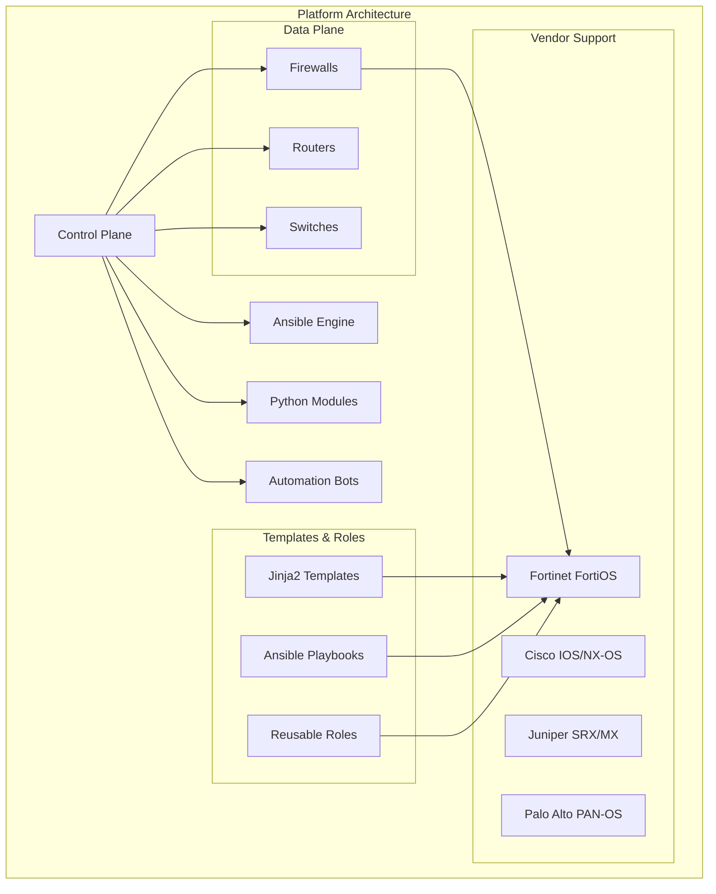
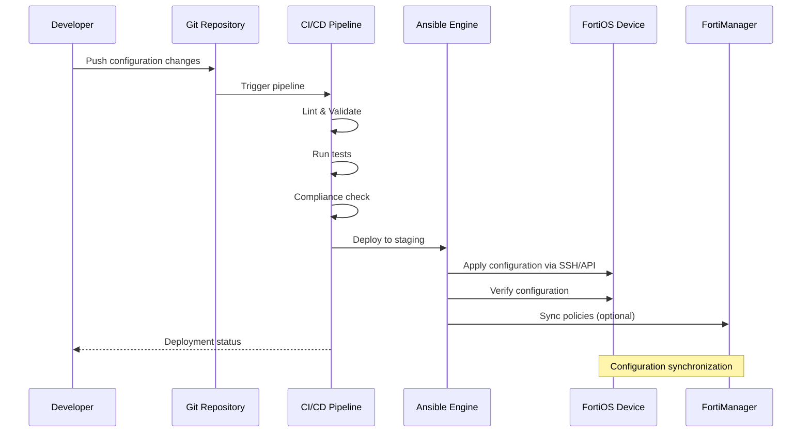
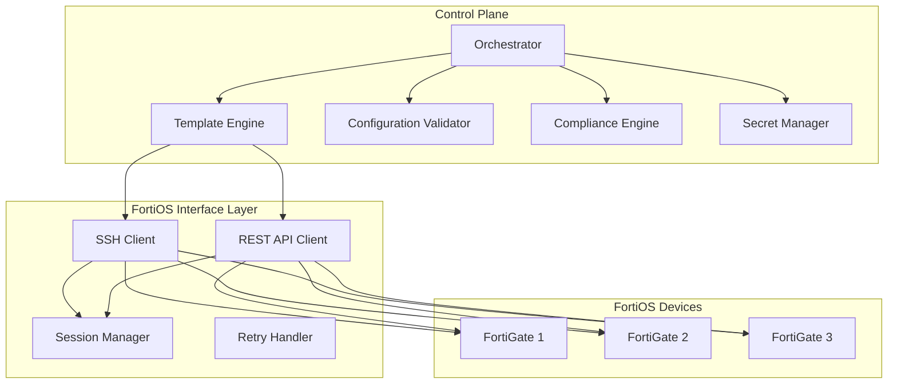
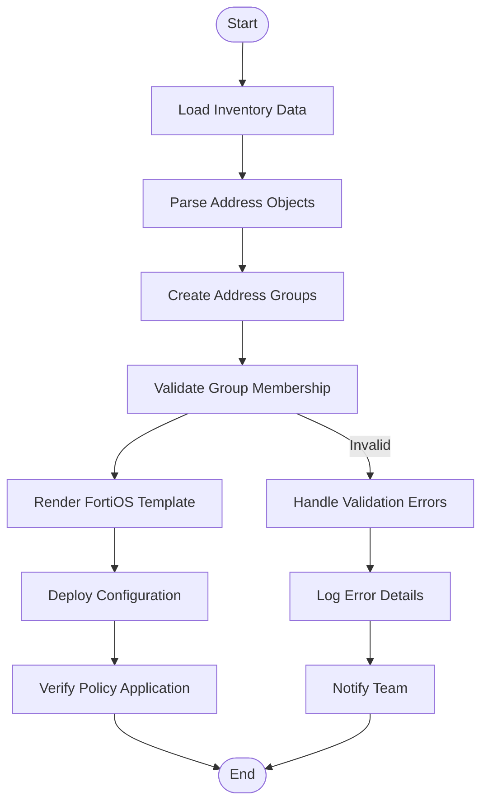
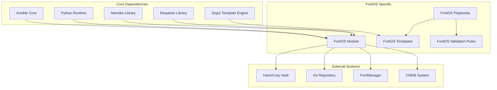

# Fortinet (FortiOS)

<cite>
**Referenced Files in This Document**
- [README.md](file://README.md)
</cite>

## Table of Contents
1. [Introduction](#introduction)
2. [Project Structure](#project-structure)
3. [Core Components](#core-components)
4. [Architecture Overview](#architecture-overview)
5. [Detailed Component Analysis](#detailed-component-analysis)
6. [Dependency Analysis](#dependency-analysis)
7. [Performance Considerations](#performance-considerations)
8. [Troubleshooting Guide](#troubleshooting-guide)
9. [Conclusion](#conclusion)
10. [Appendices](#appendices)

## Introduction

This document provides comprehensive guidance for implementing Fortinet FortiOS firewall automation within the Enterprise Network Automation Platform. The platform supports Fortinet FortiOS devices through SSH and API protocols, enabling automated security policy management, certificate lifecycle operations, compliance validation, and integration with FortiManager for centralized policy management.

The automation framework leverages Infrastructure as Code principles, GitOps workflows, and comprehensive testing strategies to ensure reliable and secure deployment of FortiOS configurations across enterprise environments.

## Project Structure

The Enterprise Network Automation Platform is designed as a modular, vendor-agnostic system that supports multiple networking vendors including Fortinet FortiOS. The platform structure includes dedicated directories for each vendor's templates, playbooks, and automation modules.

**Diagram sources**
- [README.md:36-99](file://README.md#L36-L99)

The platform follows a structured directory organization with dedicated sections for each vendor, including Fortinet support under the `templates/fortinet/` directory structure.

**Section sources**
- [README.md:103-180](file://README.md#L103-L180)

## Core Components

### Fortinet FortiOS Support

The platform provides comprehensive support for Fortinet FortiOS devices through multiple automation interfaces:

#### Protocol Support
- **SSH**: Secure shell connectivity for configuration management
- **API**: REST API access for programmatic device interaction
- **NETCONF**: Network configuration protocol support where available

#### Key Automation Capabilities

| Capability | Description | Implementation Method |
|---|---|---|
| Security Policy Management | Automated creation and modification of firewall policies | Jinja2 templates + Ansible playbooks |
| Address Group Management | Dynamic address group population and maintenance | Structured data + template rendering |
| Service Object Management | Custom service definitions and object groups | Template-based configuration generation |
| SSL/SSH Inspection Profiles | Automated SSL inspection and SSH filtering profiles | Configuration templates with parameterized values |
| Certificate Lifecycle Management | Automated certificate deployment and renewal | Integration with PKI systems |
| SD-WAN Policy Management | Software-defined WAN policy automation | Vendor-specific templates |
| IPS/AV Profile Management | Intrusion prevention and antivirus profile automation | Configuration templates |
| Virtual Domain (VDOM) Management | Multi-domain configuration automation | VDOM-aware templates |

#### Authentication and Session Management

The platform implements robust authentication mechanisms for FortiOS devices:

- **SSH Authentication**: Key-based authentication with short-lived certificates
- **API Authentication**: Token-based authentication with automatic refresh
- **Session Management**: Connection pooling and session recycling
- **Secrets Management**: Integration with HashiCorp Vault and cloud secret managers

**Section sources**
- [README.md:203-227](file://README.md#L203-L227)
- [README.md:438-456](file://README.md#L438-L456)

## Architecture Overview

The Fortinet FortiOS automation architecture follows a layered approach with clear separation of concerns between control plane, data plane, and vendor-specific implementations.

**Diagram sources**
- [README.md:36-50](file://README.md#L36-L50)
- [README.md:479-501](file://README.md#L479-L501)

### Control Plane Architecture

The control plane manages the orchestration of FortiOS automation tasks:

**Diagram sources**
- [README.md:54-99](file://README.md#L54-L99)

## Detailed Component Analysis

### Security Policy Automation

Security policy automation for FortiOS involves managing address groups, service objects, firewall policies, and inspection profiles through automated processes.

#### Address Group Management

Address groups are dynamically populated using structured data from inventory files and external sources like CMDB systems.

**Diagram sources**
- [README.md:479-501](file://README.md#L479-L501)

#### Firewall Policy Automation

Firewall policies are managed through templated configurations that enforce organizational security standards and best practices.

#### SSL/SSH Inspection Profiles

SSL and SSH inspection profiles are automatically configured based on application requirements and security policies.

**Section sources**
- [README.md:371-435](file://README.md#L371-L435)

### SSH and REST API Connectivity

The platform implements robust connectivity patterns for FortiOS devices using both SSH and REST API protocols.

#### SSH Connection Management

SSH connections utilize Netmiko with advanced retry logic, connection pooling, and session management.

#### REST API Integration

REST API connections provide programmatic access to FortiOS features not available through CLI, including advanced policy management and reporting.

#### Authentication Patterns

Authentication follows enterprise security best practices with multi-factor authentication support and credential rotation.

**Section sources**
- [README.md:438-456](file://README.md#L438-L456)

### Template Architecture

The template system uses Jinja2 templates with structured data inputs to generate FortiOS configurations.

#### Virtual Domains (VDOMs)

VDOM templates support multi-tenant deployments with isolated security policies and network segments.

#### SD-WAN Policies

SD-WAN policy templates automate software-defined WAN configuration including path selection and failover rules.

#### IPS/AV Profiles

Intrusion Prevention System and Antivirus profile templates ensure consistent security posture across all FortiGate devices.

**Section sources**
- [README.md:103-180](file://README.md#L103-L180)

### Practical Examples

#### Automated Security Policy Deployment

The platform enables automated deployment of security policies through Git-driven workflows with comprehensive validation and approval processes.

#### Certificate Lifecycle Management

Certificate management integrates with enterprise PKI systems for automated deployment, renewal, and revocation of TLS certificates on FortiGate devices.

#### Compliance Validation

Automated compliance checks validate FortiOS configurations against organizational security baselines and regulatory requirements.

**Section sources**
- [README.md:548-582](file://README.md#L548-L582)

### FortiManager Integration

The platform supports integration with FortiManager for centralized policy management and version control.

#### Centralized Policy Management

Policies defined in the automation platform can be synchronized with FortiManager for centralized administration and monitoring.

#### Version Control Integration

All configuration changes maintain complete audit trails through Git integration with FortiManager versioning.

**Section sources**
- [README.md:619-639](file://README.md#L619-L639)

## Dependency Analysis

The Fortinet FortiOS automation components have well-defined dependencies and relationships within the broader automation platform.

**Diagram sources**
- [README.md:184-200](file://README.md#L184-L200)

### Component Coupling Analysis

The FortiOS automation components demonstrate low coupling with high cohesion, following established design patterns for maintainable automation code.

### External Dependencies

Key external dependencies include:
- **HashiCorp Vault**: Secrets management and credential storage
- **Git**: Version control and change tracking
- **FortiManager**: Centralized policy management (optional)
- **CMDB Systems**: Asset and relationship data integration

**Section sources**
- [README.md:184-200](file://README.md#L184-L200)

## Performance Considerations

### Connection Optimization

The platform implements several performance optimization strategies for FortiOS automation:

- **Connection Pooling**: Reuse SSH and API connections to reduce overhead
- **Parallel Execution**: Concurrent policy deployment across multiple devices
- **Incremental Updates**: Only apply configuration changes rather than full reconfiguration
- **Caching**: Cache device capabilities and feature availability

### Scalability Patterns

The automation platform scales horizontally to manage thousands of FortiGate devices:

- **Distributed Execution**: Parallel processing across multiple worker nodes
- **Batch Processing**: Grouped device updates to minimize disruption
- **Rate Limiting**: Respect FortiOS API rate limits and device capabilities

### Resource Management

Efficient resource utilization through:
- **Memory Management**: Stream processing for large configuration files
- **CPU Optimization**: Efficient template rendering algorithms
- **Network Bandwidth**: Compressed configuration transfers

## Troubleshooting Guide

### Common Issues and Resolutions

| Issue Category | Symptom | Resolution |
|---|---|---|
| **Connectivity** | SSH timeout or connection refused | Verify network reachability and firewall rules |
| **Authentication** | Login failed or invalid credentials | Check credential rotation and vault integration |
| **Template Rendering** | Jinja2 syntax errors | Validate template syntax and variable definitions |
| **Policy Deployment** | Configuration rejected by device | Review FortiOS version compatibility and feature availability |
| **API Errors** | HTTP 4xx/5xx responses | Check API rate limits and endpoint availability |
| **Performance** | Slow deployment times | Optimize parallel execution and connection reuse |

### Debugging Tools

The platform provides comprehensive debugging capabilities:

- **Verbose Logging**: Detailed execution logs with context information
- **Configuration Diff**: Side-by-side comparison of before/after states
- **Connection Tracing**: Network-level troubleshooting for connectivity issues
- **Template Debugging**: Step-by-step template rendering diagnostics

**Section sources**
- [README.md:674-685](file://README.md#L674-L685)

## Conclusion

The Enterprise Network Automation Platform provides comprehensive Fortinet FortiOS automation capabilities through a modular, scalable architecture. The platform supports automated security policy management, certificate lifecycle operations, compliance validation, and integration with FortiManager for centralized administration.

Key benefits include:
- **Consistency**: Enforced security policies across all FortiGate devices
- **Scalability**: Ability to manage thousands of devices efficiently
- **Compliance**: Automated validation against security baselines
- **Auditability**: Complete change tracking and rollback capabilities
- **Integration**: Seamless operation with existing enterprise systems

The platform's vendor-agnostic design ensures that FortiOS automation follows the same patterns and best practices as other supported vendors, providing a unified approach to network automation across heterogeneous environments.

## Appendices

### FortiOS Best Practices

The platform enforces several FortiOS best practices through automated compliance checks:

- **Default Deny Policies**: All traffic must be explicitly allowed
- **Least Privilege Access**: Minimal required permissions for all users
- **Logging and Monitoring**: Comprehensive logging enabled for security events
- **Regular Updates**: Automated firmware and patch management
- **Backup and Recovery**: Regular configuration backups with retention policies

### Integration Patterns

Common integration patterns for FortiOS automation:

- **CMDB Integration**: Synchronize device inventory and relationships
- **Ticketing Systems**: Automated change request workflows
- **Monitoring Systems**: Real-time health and performance monitoring
- **SIEM Integration**: Security event correlation and alerting