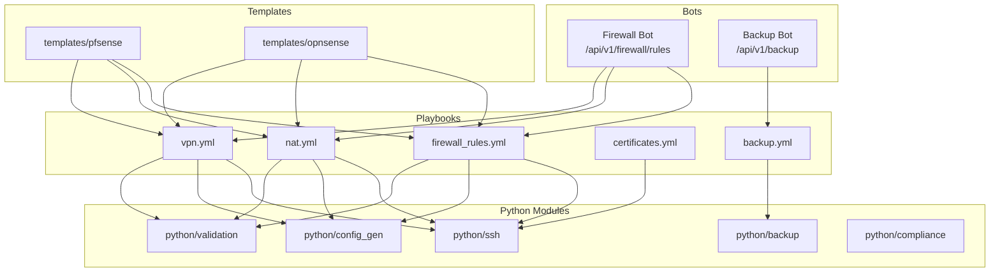
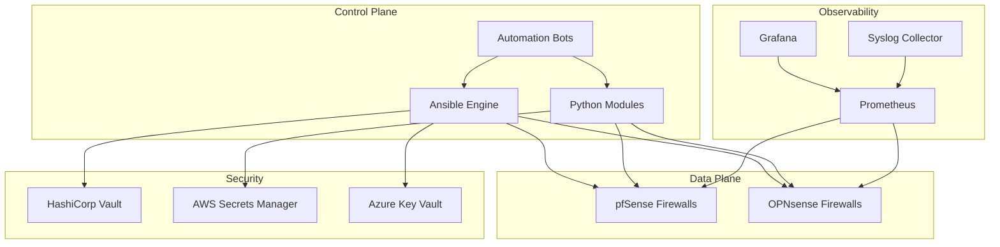
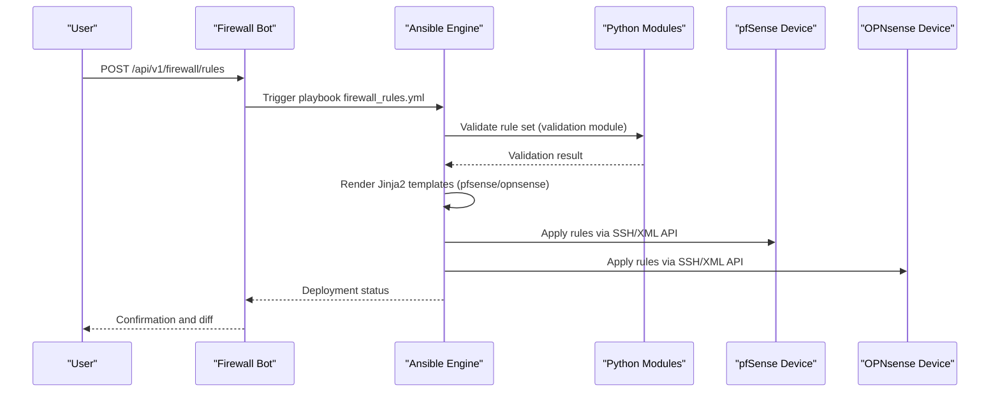
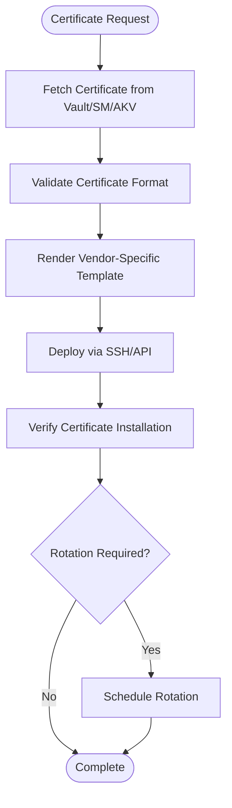
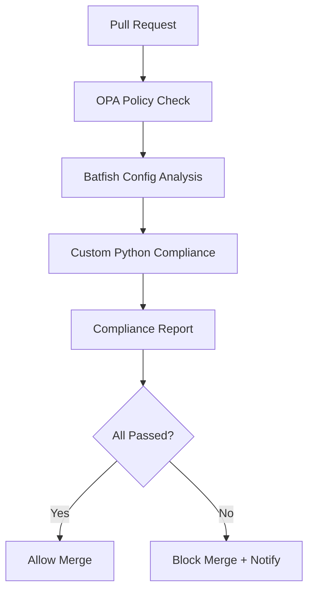
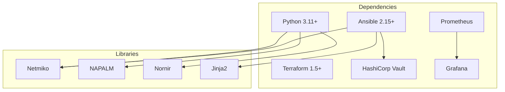

# Open Source Firewalls (pfSense & OPNsense)

<cite>
**Referenced Files in This Document**
- [README.md](file://README.md)
</cite>

## Table of Contents
1. [Introduction](#introduction)
2. [Project Structure](#project-structure)
3. [Core Components](#core-components)
4. [Architecture Overview](#architecture-overview)
5. [Detailed Component Analysis](#detailed-component-analysis)
6. [Dependency Analysis](#dependency-analysis)
7. [Performance Considerations](#performance-considerations)
8. [Troubleshooting Guide](#troubleshooting-guide)
9. [Conclusion](#conclusion)
10. [Appendices](#appendices)

## Introduction
This document provides comprehensive guidance for automating open-source firewalls on FreeBSD-based platforms, specifically pfSense and OPNsense. It focuses on:
- XML API and SSH automation patterns for configuration management
- Template structure for firewall rules, NAT policies, and VPN configurations
- Vendor-specific differences between pfSense and OPNsense
- Automation patterns for package management, system updates, and backup/restore operations
- Practical examples for automated rule deployment, certificate management, and compliance checking against security baselines
- Integration with Ansible modules and custom Python scripts for unified management across both platforms

The repository is a production-grade, vendor-agnostic network automation platform that supports multiple vendors including pfSense and OPNsense. It uses GitOps, Infrastructure as Code, and CI/CD to manage device lifecycles, enforce compliance, and provide observability.

## Project Structure
The repository organizes automation assets by environment, role, and vendor. For FreeBSD-based firewalls, the relevant areas include:
- Templates for pfSense and OPNsense under templates/pfsense and templates/opnsense
- Playbooks for firewall rules, NAT, VPN, certificates, and backups
- Python modules for SSH, config generation, validation, backup, and compliance
- Bots exposing REST APIs for self-service operations such as firewall rule requests and deployments



**Diagram sources**
- [README.md:103-180](file://README.md#L103-L180)
- [README.md:371-436](file://README.md#L371-L436)
- [README.md:438-456](file://README.md#L438-L456)
- [README.md:460-476](file://README.md#L460-L476)

**Section sources**
- [README.md:103-180](file://README.md#L103-L180)
- [README.md:371-436](file://README.md#L371-L436)
- [README.md:438-456](file://README.md#L438-L456)
- [README.md:460-476](file://README.md#L460-L476)

## Core Components
- Firewall Rules Management
  - Playbook: firewall_rules.yml deploys rule sets across devices
  - Templates: Jinja2 templates under pfsense and opnsense directories generate vendor-specific XML or CLI commands
  - Validation: python/validation ensures syntax and semantic correctness before deployment
  - SSH: python/ssh abstracts Netmiko/Paramiko connections with retry logic

- NAT Policies
  - Playbook: nat.yml manages NAT rules
  - Templates: Separate template families for pfSense and OPNsense due to differing XML structures and CLI semantics
  - Validation: python/validation checks for conflicts and shadowing

- VPN Configurations
  - Playbook: vpn.yml handles site-to-site and remote-access VPN
  - Templates: Vendor-specific handling for IKE/IPsec parameters and certificate references
  - Compliance: python/compliance enforces approved ciphers and firmware versions

- Certificates Management
  - Playbook: certificates.yml deploys TLS certificates from secrets backends
  - Secrets: HashiCorp Vault, AWS Secrets Manager, Azure Key Vault integration via adapter layer
  - Rotation: Policy-driven rotation intervals for SSH keys and TLS certificates

- Backup and Restore
  - Playbook: backup.yml performs running configuration backups with versioning and encryption
  - Module: python/backup orchestrates retrieval, storage, and lifecycle management
  - Rollback: Automated rollback using last known good state

- Compliance Checking
  - Engine: python/compliance runs pluggable rule sets
  - Checks: Includes firewall rule analysis (no any-any, shadow/duplicate detection), cipher standards, NTP, AAA, SNMPv3, logging
  - Flow: OPA policy check, Batfish config analysis, custom Python checks, reporting

**Section sources**
- [README.md:371-436](file://README.md#L371-L436)
- [README.md:438-456](file://README.md#L438-L456)
- [README.md:552-579](file://README.md#L552-L579)

## Architecture Overview
The automation architecture integrates control plane components (Ansible, Python modules, bots) with data plane devices (firewalls) and observability/security layers.



**Diagram sources**
- [README.md:52-99](file://README.md#L52-L99)

## Detailed Component Analysis

### Firewall Rule Deployment Workflow
This sequence shows how a firewall rule request flows through validation, template rendering, and deployment.



**Diagram sources**
- [README.md:460-476](file://README.md#L460-L476)
- [README.md:371-436](file://README.md#L371-L436)
- [README.md:438-456](file://README.md#L438-L456)

### Certificate Management Flow
Certificates are retrieved from secure backends and deployed to firewalls with rotation policies.



**Diagram sources**
- [README.md:339-368](file://README.md#L339-L368)
- [README.md:371-436](file://README.md#L371-L436)

### Compliance Checking Process
Compliance is enforced at every stage from pull request to production runtime.



**Diagram sources**
- [README.md:552-579](file://README.md#L552-L579)

### Template Structure for FreeBSD-Based Firewalls
Templates are organized per vendor to handle differences between pfSense and OPNsense:
- pfsense/templates: Generate pfSense-specific XML configuration fragments
- opnsense/templates: Generate OPNsense-specific XML or CLI commands
- Shared variables: group_vars and host_vars define common parameters like interfaces, zones, and policies
- Jinja2 filters: Custom filters handle vendor-specific formatting and escaping

Key considerations:
- XML schema differences between pfSense and OPNsense
- NAT rule syntax variations
- VPN parameter naming and structure differences
- Certificate reference formats

**Section sources**
- [README.md:103-180](file://README.md#L103-L180)
- [README.md:371-436](file://README.md#L371-L436)

### Package Management and System Updates
While specific playbooks for package management are not explicitly listed, the platform supports:
- Firmware upgrade workflows with pre/post checks
- Automated rollback on failure
- Version tracking and approval gates

Recommended approach:
- Use ansible-freebsd or vendor-specific modules for package management
- Implement update policies with maintenance windows
- Integrate with secrets management for authentication

**Section sources**
- [README.md:418-436](file://README.md#L418-L436)

## Dependency Analysis
The automation platform has clear separation between control plane, data plane, and supporting services.



**Diagram sources**
- [README.md:184-199](file://README.md#L184-L199)
- [README.md:339-368](file://README.md#L339-L368)

**Section sources**
- [README.md:184-199](file://README.md#L184-L199)
- [README.md:339-368](file://README.md#L339-L368)

## Performance Considerations
- Parallel execution: Use Ansible forks and Nornir concurrency for bulk operations
- Connection pooling: Implement connection reuse in Python modules
- Template optimization: Cache rendered templates and use efficient Jinja2 filters
- Validation batching: Group validation checks to minimize API calls
- Backup scheduling: Stagger backup jobs to avoid resource contention

## Troubleshooting Guide
Common issues and resolutions:
- Ansible connection timeout: Verify SSH reachability and credentials
- Template rendering errors: Check Jinja2 syntax and variable definitions
- Compliance check failures: Review policy violations and device configuration diffs
- CI pipeline failures: Examine GitHub Actions logs for actionable error messages
- Vault authentication failures: Verify OIDC tokens or AppRole credentials
- Molecule test failures: Ensure Docker/Podman is running and configured correctly

**Section sources**
- [README.md:674-685](file://README.md#L674-L685)

## Conclusion
This platform provides a comprehensive foundation for automating pfSense and OPNsense firewalls through GitOps, Infrastructure as Code, and multi-vendor support. The modular architecture enables scalable management of firewall rules, NAT policies, VPN configurations, and compliance enforcement while maintaining security best practices and operational reliability.

## Appendices

### Quick Start Commands
```bash
# Dry-run compliance scan
ansible-playbook playbooks/compliance_scan.yml -i inventories/lab/hosts.yml --check --diff

# Generate configuration
python -m python.config_gen --device fw-edge-01 --output ./output/

# Run unit tests
pytest tests/unit/ -v

# Run compliance checks locally
python -m python.compliance --inventory inventories/lab/hosts.yml
```

**Section sources**
- [README.md:264-280](file://README.md#L264-L280)