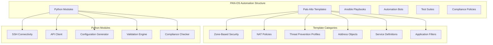
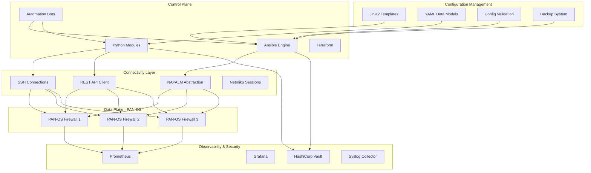
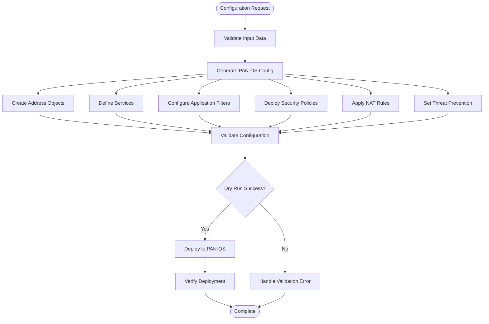
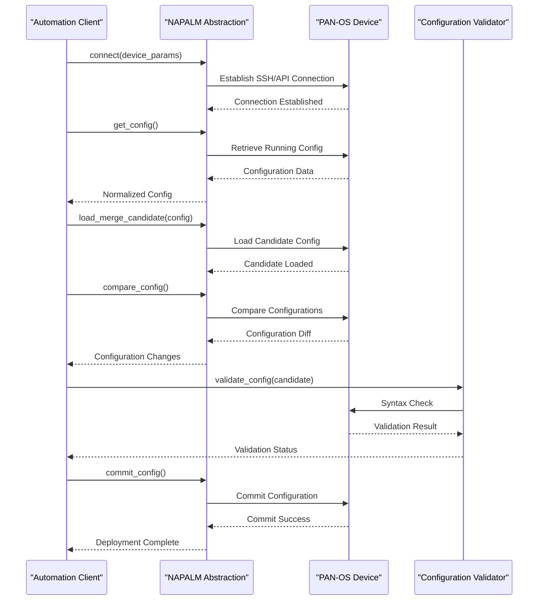
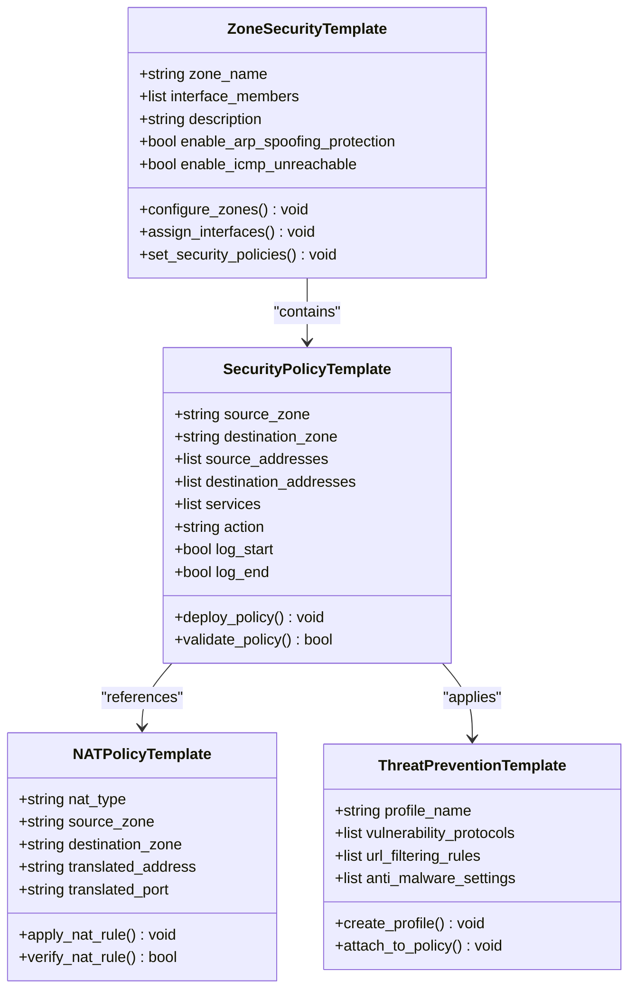
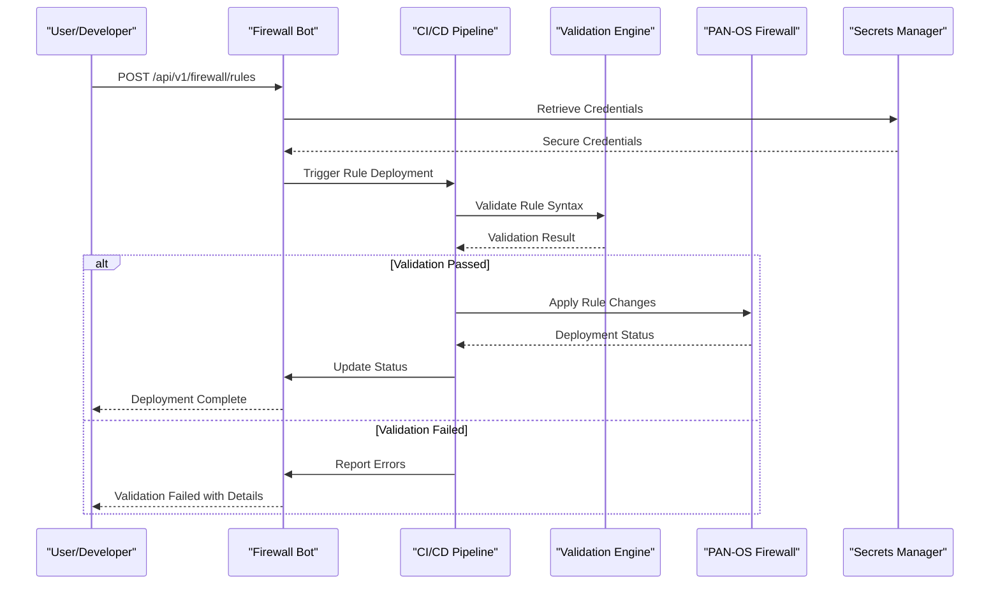
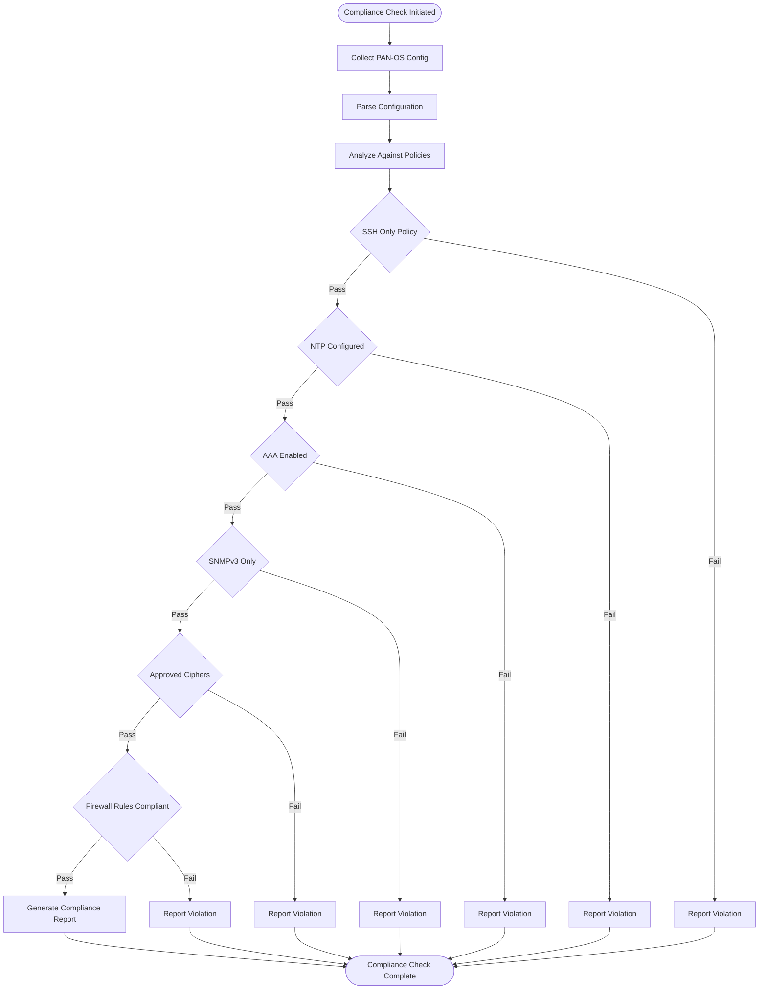
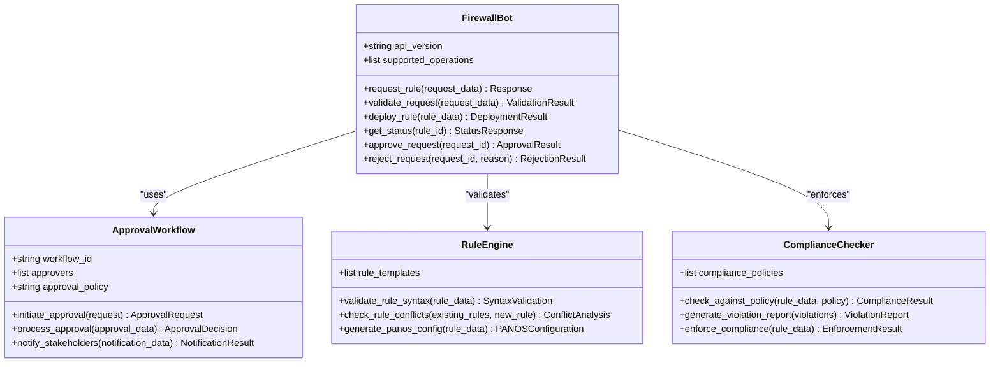
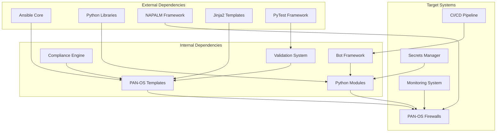

# Palo Alto Networks (PAN-OS)

<cite>
**Referenced Files in This Document**
- [README.md](file://README.md)
</cite>

## Table of Contents
1. [Introduction](#introduction)
2. [Project Structure](#project-structure)
3. [Core Components](#core-components)
4. [Architecture Overview](#architecture-overview)
5. [Detailed Component Analysis](#detailed-component-analysis)
6. [Dependency Analysis](#dependency-analysis)
7. [Performance Considerations](#performance-considerations)
8. [Troubleshooting Guide](#troubleshooting-guide)
9. [Conclusion](#conclusion)
10. [Appendices](#appendices)

## Introduction

This document provides comprehensive coverage of Palo Alto Networks PAN-OS firewall automation support within the Enterprise Network Automation Platform. The platform implements a production-grade, vendor-agnostic approach to network automation, with specific support for PAN-OS firewalls through SSH and API connectivity patterns using NAPALM and custom Python modules.

The automation platform follows Infrastructure as Code principles, where all configurations, policies, templates, tests, pipelines, and bots are stored in Git. It supports the full lifecycle management of PAN-OS firewalls including security policy automation, template-based configuration generation, compliance checking, and self-service rule deployment through bot integration.

## Project Structure

The platform organizes PAN-OS automation across multiple directories following a feature-based structure:



**Diagram sources**
- [README.md:105-180](file://README.md#L105-L180)

**Section sources**
- [README.md:105-180](file://README.md#L105-L180)

## Core Components

### PAN-OS Support Architecture

The platform provides comprehensive PAN-OS support through multiple interconnected components:

#### Technology Stack Integration
- **Automation Engine**: Ansible, Python 3.11+, NAPALM, Netmiko, Nornir
- **Protocols**: SSH, API (REST), NETCONF, RESTCONF
- **Templates**: Jinja2-based configuration generation
- **Testing**: pytest, Molecule, Batfish, pyATS
- **Compliance**: Custom Python checks, OPA, Batfish ACL analysis

#### Supported PAN-OS Operations
- Security policy automation (address objects, services, applications)
- Zone-based security configuration
- NAT policy management
- Threat prevention profiles
- Certificate management
- Compliance checking against organizational standards
- Self-service rule requests and approval workflows

**Section sources**
- [README.md:184-218](file://README.md#L184-L218)
- [README.md:203-218](file://README.md#L203-L218)

## Architecture Overview

The PAN-OS automation architecture follows a multi-layered approach with clear separation of concerns:



**Diagram sources**
- [README.md:54-99](file://README.md#L54-L99)
- [README.md:184-218](file://README.md#L184-L218)

## Detailed Component Analysis

### Security Policy Automation

The platform implements comprehensive security policy automation for PAN-OS firewalls covering address objects, service definitions, application filters, and security policies.

#### Template Structure for PAN-OS

The template system uses Jinja2 to generate PAN-OS specific configurations:



**Diagram sources**
- [README.md:116-128](file://README.md#L116-L128)
- [README.md:388-399](file://README.md#L388-L399)

#### PAN-OS Specific Configuration Elements

The platform manages the following PAN-OS configuration components:

| Component | Description | Implementation |
|-----------|-------------|----------------|
| **Address Objects** | IP addresses, networks, FQDNs | Jinja2 templates with YAML data models |
| **Service Definitions** | TCP/UDP ports, protocols, application services | Structured YAML with protocol validation |
| **Application Filters** | PAN-OS application identification rules | Custom Python validation logic |
| **Security Policies** | Zone-to-zone traffic rules with actions | Template-driven policy generation |
| **NAT Policies** | Source/destination NAT rules | Automated NAT rule creation |
| **Threat Prevention** | Vulnerability protection, URL filtering, anti-malware | Profile-based configuration |

**Section sources**
- [README.md:116-128](file://README.md#L116-L128)
- [README.md:388-399](file://README.md#L388-L399)

### SSH and API Connectivity Patterns

The platform implements robust connectivity patterns for PAN-OS devices using multiple protocols:

#### NAPALM Integration

NAPALM provides a unified abstraction layer for PAN-OS connectivity:



**Diagram sources**
- [README.md:184-191](file://README.md#L184-L191)
- [README.md:438-456](file://README.md#L438-L456)

#### Custom Python Modules

The platform includes specialized Python modules for PAN-OS operations:

| Module | Purpose | Key Functions |
|--------|---------|---------------|
| `python/ssh/` | SSH abstraction over Netmiko/Paramiko with retry logic | Connection pooling, error handling, session management |
| `python/restconf/` | RESTCONF client with YANG model support | API authentication, request/response handling |
| `python/config_gen/` | Jinja2-based configuration generation from structured data | Template rendering, variable substitution |
| `python/validation/` | Pre-deployment config validation (syntax + semantics) | PAN-OS syntax checking, policy validation |
| `python/compliance/` | Compliance engine with pluggable rule sets | Security policy enforcement, audit reporting |

**Section sources**
- [README.md:438-456](file://README.md#L438-L456)

### Template Structure for PAN-OS Specific Configurations

The template system generates PAN-OS specific configurations through organized template categories:

#### Zone-Based Security Templates



**Diagram sources**
- [README.md:116-128](file://README.md#L116-L128)

#### Template Organization Structure

The templates are organized by functional area:

| Template Category | Files | Purpose |
|-------------------|-------|---------|
| **Zone Security** | `templates/paloalto/zone_security.j2` | Zone definitions and interface assignments |
| **Security Policies** | `templates/paloalto/security_policy.j2` | Rule-based traffic control |
| **NAT Policies** | `templates/paloalto/nat_policy.j2` | Source/destination NAT configuration |
| **Threat Prevention** | `templates/paloalto/threat_prevention.j2` | Security profiles and threat mitigation |
| **Address Objects** | `templates/paloalto/address_objects.j2` | IP addresses, networks, FQDNs |
| **Service Definitions** | `templates/paloalto/service_definitions.j2` | Protocol and port definitions |
| **Application Filters** | `templates/paloalto/application_filters.j2` | Application identification rules |

**Section sources**
- [README.md:116-128](file://README.md#L116-L128)

### Practical Examples and Workflows

#### Automated Rule Deployment Workflow

The platform supports automated firewall rule deployment through a comprehensive workflow:



**Diagram sources**
- [README.md:460-476](file://README.md#L460-L476)

#### Certificate Management

Certificate management for PAN-OS devices follows a secure, automated process:

| Operation | Method | Security Features |
|-----------|--------|-------------------|
| **Certificate Generation** | ACME/Let's Encrypt or internal PKI | Automated renewal at 60 days |
| **Certificate Upload** | API-based upload with integrity verification | SHA-256 checksum validation |
| **Certificate Rotation** | Zero-downtime certificate replacement | Graceful reload without service interruption |
| **Certificate Monitoring** | Expiration tracking with alerting | 30-day advance notification |

#### Compliance Checking Against Organizational Standards

The platform enforces organizational security standards through automated compliance checking:



**Diagram sources**
- [README.md:552-579](file://README.md#L552-L579)

### Firewall Bot Integration

The firewall bot provides self-service capabilities for rule requests and approval workflows:

#### Bot Architecture



**Diagram sources**
- [README.md:460-476](file://README.md#L460-L476)

#### Self-Service Rule Request Process

The firewall bot enables self-service rule requests through multiple channels:

| Channel | Endpoint | Features |
|---------|----------|----------|
| **REST API** | `/api/v1/firewall/rules` | Programmatic access, webhook integration |
| **Slack Integration** | Chat commands | Natural language rule requests |
| **Microsoft Teams** | Bot messages | Enterprise chat integration |
| **Web Portal** | HTTP interface | GUI-based rule management |

**Section sources**
- [README.md:460-476](file://README.md#L460-L476)

## Dependency Analysis

The PAN-OS automation system has well-defined dependencies between components:



**Diagram sources**
- [README.md:184-218](file://README.md#L184-L218)
- [README.md:438-456](file://README.md#L438-L456)

**Section sources**
- [README.md:184-218](file://README.md#L184-L218)
- [README.md:438-456](file://README.md#L438-L456)

## Performance Considerations

The PAN-OS automation platform is designed for enterprise-scale deployments with performance optimization in mind:

### Scalability Features
- **Connection Pooling**: Efficient reuse of SSH and API connections
- **Parallel Processing**: Concurrent execution of automation tasks
- **Caching**: Intelligent caching of device information and templates
- **Batch Operations**: Grouped configuration changes to minimize API calls

### Resource Optimization
- **Memory Management**: Optimized memory usage for large configuration files
- **CPU Efficiency**: Parallel processing with controlled concurrency levels
- **Network Bandwidth**: Compression and efficient data transfer protocols
- **Storage Optimization**: Incremental backups and delta updates

### Reliability Features
- **Retry Logic**: Automatic retry with exponential backoff for failed operations
- **Timeout Handling**: Configurable timeouts for different operation types
- **Error Recovery**: Graceful degradation and partial failure handling
- **Health Monitoring**: Continuous health checks and status reporting

## Troubleshooting Guide

Common issues and their resolutions for PAN-OS automation:

### Connectivity Issues
| Issue | Symptoms | Resolution |
|-------|----------|------------|
| **SSH Connection Timeout** | Connection failures after timeout period | Verify SSH reachability: `ansible all -m ping -i inventories/lab/hosts.yml` |
| **API Authentication Failure** | 401/403 responses from PAN-OS API | Check API credentials and permissions in HashiCorp Vault |
| **NAPALM Connection Error** | Unable to establish NAPALM session | Verify NAPALM driver compatibility and device settings |

### Configuration Issues
| Issue | Symptoms | Resolution |
|-------|----------|------------|
| **Template Rendering Error** | Jinja2 syntax errors during config generation | Check Jinja2 syntax: `python -m python.config_gen --debug --device <name>` |
| **Configuration Validation Failure** | PAN-OS rejects configuration changes | Review PAN-OS syntax requirements and template structure |
| **Rule Conflicts** | Duplicate or conflicting firewall rules | Use conflict detection and resolution tools |

### Compliance Issues
| Issue | Symptoms | Resolution |
|-------|----------|------------|
| **Compliance Check Failure** | Policy violations detected | Review `compliance/` policies and device running config diff |
| **Security Policy Violations** | Non-compliant security rules | Update templates to enforce organizational standards |
| **Certificate Expiration** | SSL/TLS certificate warnings | Implement automated certificate rotation and monitoring |

**Section sources**
- [README.md:674-685](file://README.md#L674-L685)

## Conclusion

The Enterprise Network Automation Platform provides comprehensive PAN-OS firewall automation support through a modular, scalable architecture. The platform implements best practices for security policy automation, template-based configuration management, and compliance enforcement while maintaining flexibility for diverse organizational requirements.

Key strengths include:
- **Vendor-Agnostic Design**: Consistent automation patterns across multiple vendors
- **Security-First Approach**: Built-in compliance checking and secrets management
- **Self-Service Capabilities**: Bot-driven automation for common operational tasks
- **Enterprise Scale**: Designed for thousands of devices across multi-region environments
- **GitOps Integration**: Full version control and CI/CD pipeline support

The platform successfully bridges the gap between traditional firewall management and modern DevOps practices, enabling organizations to automate PAN-OS firewall operations while maintaining security, compliance, and operational excellence.

## Appendices

### Quick Reference Commands

#### Basic PAN-OS Operations
```bash
# Dry-run compliance scan against lab devices
ansible-playbook playbooks/compliance_scan.yml \
  -i inventories/lab/hosts.yml \
  --check --diff

# Generate configuration for a PAN-OS device
python -m python.config_gen --device fw-edge-01 --output ./output/

# Run unit tests for PAN-OS modules
pytest tests/unit/ -v

# Run compliance checks locally
python -m python.compliance --inventory inventories/lab/hosts.yml
```

#### Firewall Bot API Usage
```bash
# Request new firewall rule via API
curl -X POST https://bot.example.com/api/v1/firewall/rules \
  -H "Authorization: Bearer $TOKEN" \
  -H "Content-Type: application/json" \
  -d '{"source": "10.0.1.0/24", "destination": "10.0.2.0/24", "service": "HTTPS", "action": "allow"}'

# Check rule deployment status
curl -X GET https://bot.example.com/api/v1/firewall/rules/status/{rule_id} \
  -H "Authorization: Bearer $TOKEN"
```

**Section sources**
- [README.md:264-280](file://README.md#L264-L280)
- [README.md:460-476](file://README.md#L460-L476)